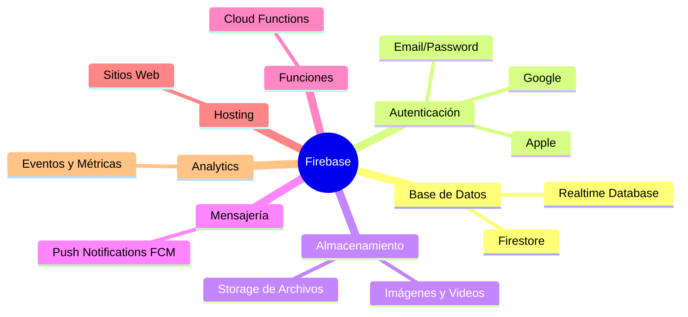
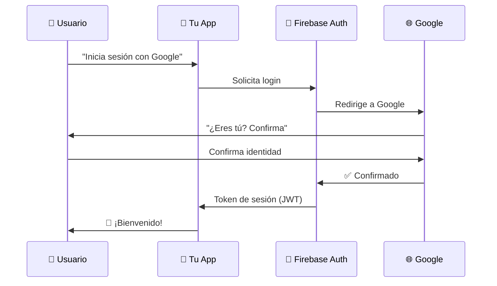
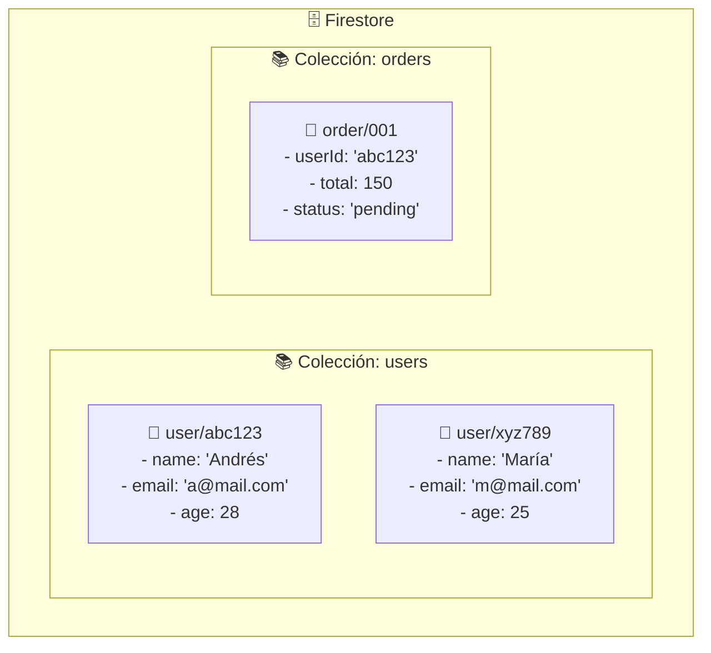
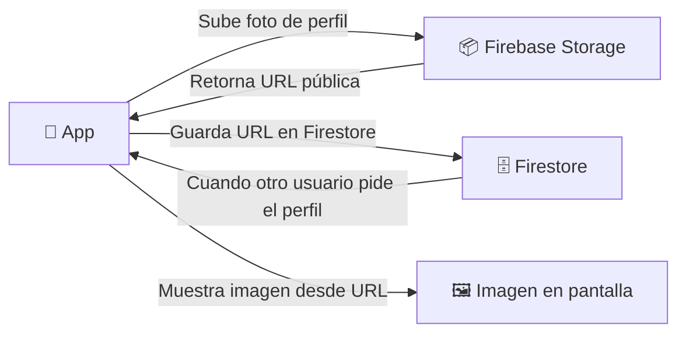
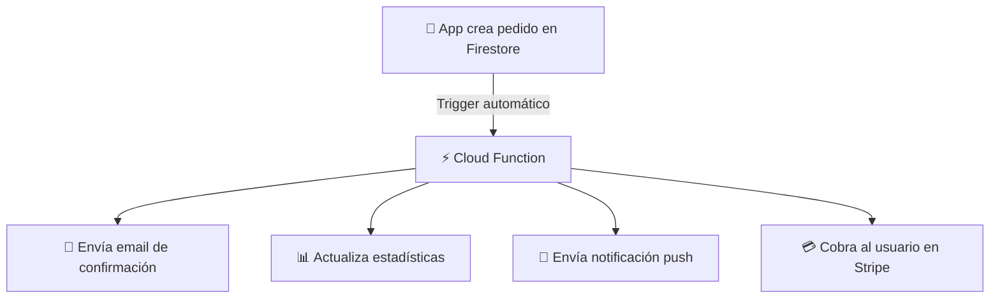
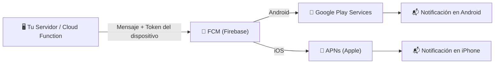
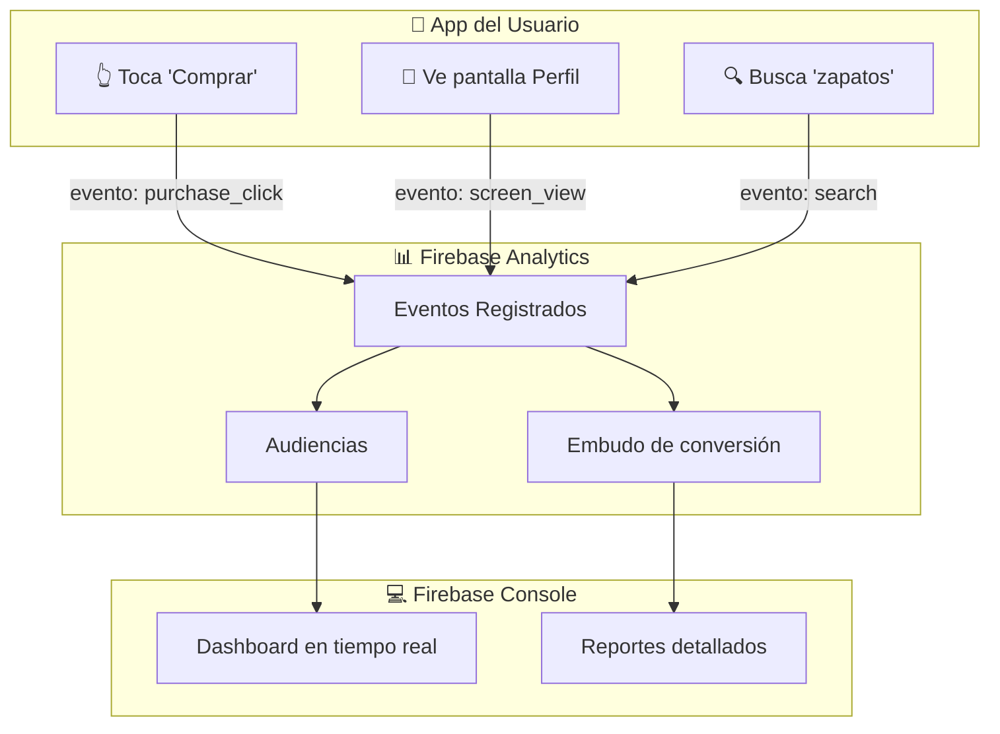
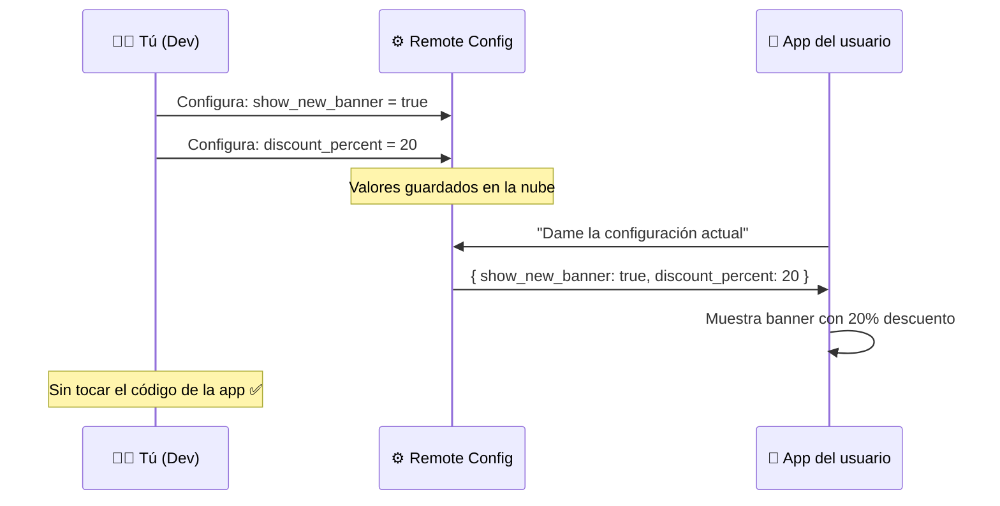
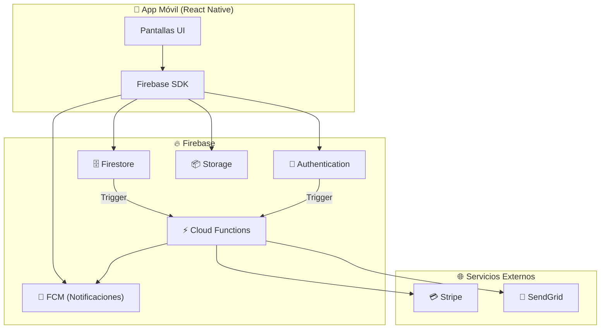

# 🔥 Firebase Para Dummies

> **Objetivo**: Entender Firebase como si nunca hubieras programado antes, usando analogías del mundo real.

---

## 🌍 Analogía del Mundo Real: El "Centro Comercial Todo en Uno"

Imagina que quieres abrir una tienda. Necesitas:

- Un almacén para guardar productos 📦
- Un sistema de vigilancia 🎥
- Un teléfono para llamar a clientes 📞
- Una caja registradora 💰
- Un letrero luminoso con tu nombre 🪧

**Sin Firebase**: Tendrías que construir cada cosa desde cero, en lugares distintos, contratar personal para cada área.

**Con Firebase**: Es como rentar en un centro comercial donde **ya todo está incluido**. Solo te preocupas por tu tienda (tu app). Firebase te da el almacén, vigilancia, teléfono y caja registradora listos para usar.

---

## 🏗️ ¿Qué es Firebase?

Firebase es una **plataforma de Google** que te da un conjunto de servicios listos para construir aplicaciones web y móviles **sin necesidad de administrar servidores**.



---

## 🔑 Servicios Principales (Los que más usarás)

### 1. 🔐 Firebase Authentication - "El Portero del Club"

**Analogía**: Imagina un portero en un club exclusivo. Él verifica quién eres (con tu ID), te da una pulsera de acceso, y recuerda que ya entraste para no pedirte ID cada vez.

**¿Qué hace?**
- Permite que los usuarios se registren e inicien sesión
- Soporta Google, Facebook, Apple, Email/Password
- Genera tokens seguros automáticamente



**Código básico (React Native / Expo):**
```typescript
import auth from '@react-native-firebase/auth';

// Iniciar sesión con Google
async function signInWithGoogle() {
  const { idToken } = await GoogleSignin.signIn();
  const credential = auth.GoogleAuthProvider.credential(idToken);
  const userCredential = await auth().signInWithCredential(credential);
  
  console.log('Usuario:', userCredential.user.displayName);
}

// Cerrar sesión
async function signOut() {
  await auth().signOut();
}

// Escuchar cambios de sesión (el portero que siempre está mirando)
useEffect(() => {
  const unsubscribe = auth().onAuthStateChanged(user => {
    if (user) {
      console.log('Usuario logueado:', user.uid);
    } else {
      console.log('No hay sesión activa');
    }
  });
  
  return unsubscribe; // Limpiar al desmontar
}, []);
```

---

### 2. 🗄️ Cloud Firestore - "La Biblioteca Mágica"

**Analogía**: Imagina una biblioteca donde:
- Los libros son tus **documentos** (datos de un usuario, un producto, etc.)
- Los estantes son tus **colecciones** (usuarios, productos, pedidos)
- Los cajones dentro de un libro son **sub-colecciones**
- Puedes pedir que te avisen cada vez que alguien cambie un libro 📢



**Estructura: Colecciones → Documentos → Campos**

```typescript
import firestore from '@react-native-firebase/firestore';

// 📝 CREAR un documento
async function createUser(userId: string, name: string, email: string) {
  await firestore()
    .collection('users')      // Estante "users"
    .doc(userId)              // Libro con ID del usuario
    .set({                    // Contenido del libro
      name,
      email,
      createdAt: firestore.FieldValue.serverTimestamp(),
    });
}

// 📖 LEER un documento
async function getUser(userId: string) {
  const doc = await firestore()
    .collection('users')
    .doc(userId)
    .get();

  if (doc.exists) {
    return doc.data(); // { name: 'Andrés', email: '...' }
  }
  return null;
}

// 🔄 ESCUCHAR cambios en tiempo real (como suscribirse a noticias)
function listenToUser(userId: string) {
  return firestore()
    .collection('users')
    .doc(userId)
    .onSnapshot(doc => {
      console.log('Datos actualizados:', doc.data());
    });
}

// 🔍 CONSULTAR con filtros
async function getPendingOrders(userId: string) {
  const snapshot = await firestore()
    .collection('orders')
    .where('userId', '==', userId)   // Filtro
    .where('status', '==', 'pending') // Otro filtro
    .orderBy('createdAt', 'desc')     // Ordenar
    .limit(10)                        // Solo 10 resultados
    .get();

  return snapshot.docs.map(doc => ({
    id: doc.id,
    ...doc.data()
  }));
}
```

---

### 3. 📦 Firebase Storage - "El Depósito de Cajas"

**Analogía**: Como un depósito donde guardas cajas (archivos: fotos, videos, PDFs). Cada caja tiene una dirección única para encontrarla después.



```typescript
import storage from '@react-native-firebase/storage';

// Subir una imagen
async function uploadProfilePhoto(userId: string, localImagePath: string) {
  const reference = storage().ref(`profiles/${userId}/photo.jpg`);
  
  // Subir archivo
  const task = reference.putFile(localImagePath);
  
  // Monitorear progreso
  task.on('state_changed', snapshot => {
    const progress = (snapshot.bytesTransferred / snapshot.totalBytes) * 100;
    console.log(`Progreso: ${progress.toFixed(0)}%`);
  });
  
  // Esperar que termine
  await task;
  
  // Obtener URL pública
  const downloadURL = await reference.getDownloadURL();
  return downloadURL; // 'https://firebasestorage.googleapis.com/...'
}
```

---

### 4. ⚡ Cloud Functions - "Los Asistentes que trabajan solos"

**Analogía**: Imagina que contratas asistentes que se activan automáticamente cuando pasa algo. "Cuando llegue un pedido nuevo → manda un email". Tú no tienes que estar presente, ellos lo hacen solos.



```typescript
// En el servidor (Firebase Functions)
import * as functions from 'firebase-functions';
import * as admin from 'firebase-admin';

// Se activa cuando se crea un nuevo documento en "orders"
export const onNewOrder = functions.firestore
  .document('orders/{orderId}')
  .onCreate(async (snapshot, context) => {
    const order = snapshot.data();
    const orderId = context.params.orderId;
    
    console.log(`Nuevo pedido: ${orderId}`, order);
    
    // Enviar notificación push al usuario
    await admin.messaging().send({
      token: order.userFcmToken,
      notification: {
        title: '¡Pedido recibido! 🎉',
        body: `Tu pedido #${orderId} está siendo procesado`,
      }
    });
  });
```

---

### 5. 🔔 Firebase Messaging (FCM) - "El Sistema de Megafonía"

**Analogía**: Imagina el altavoz de un supermercado. Tú (el servidor) le dices al altavoz "avisa al cliente en caja 5 que su pedido llegó". El altavoz sabe exactamente a qué teléfono mandar el mensaje, aunque la app esté cerrada.

**¿Qué hace?**
- Envía notificaciones push a dispositivos Android e iOS
- Funciona aunque la app esté en segundo plano o cerrada
- Puede enviar a un usuario específico (por token) o a grupos (topics)



```typescript
import messaging from '@react-native-firebase/messaging';

// 1️⃣ Pedir permiso al usuario (iOS lo requiere, Android 13+)
async function requestPermission() {
  const authStatus = await messaging().requestPermission();
  const enabled =
    authStatus === messaging.AuthorizationStatus.AUTHORIZED ||
    authStatus === messaging.AuthorizationStatus.PROVISIONAL;

  if (enabled) {
    console.log('Permiso de notificaciones concedido');
  }
}

// 2️⃣ Obtener el token único del dispositivo (la "dirección postal" del teléfono)
async function getDeviceToken() {
  const token = await messaging().getToken();
  console.log('Token del dispositivo:', token);
  // Guardar este token en Firestore para poder enviarle notificaciones
  return token;
}

// 3️⃣ Escuchar notificaciones cuando la app está ABIERTA (foreground)
messaging().onMessage(async remoteMessage => {
  console.log('Notificación recibida (app abierta):', remoteMessage);
  // Mostrar alert, toast, etc.
});

// 4️⃣ Escuchar cuando el usuario TOCA la notificación (app en background)
messaging().onNotificationOpenedApp(remoteMessage => {
  console.log('Usuario tocó la notificación:', remoteMessage);
  // Navegar a la pantalla correcta
});
```

**Tipos de mensajes FCM:**

| Tipo | ¿Cuándo usarlo? | Ejemplo |
|------|----------------|---------|
| **Notification** | Mostrar alerta visible | "Tu pedido llegó" |
| **Data** | Enviar datos silenciosos | Actualizar caché en background |
| **Combinado** | Alerta + datos extra | "Tienes 3 mensajes nuevos" + payload |

---

### 6. 📊 Firebase Analytics - "El Espía Amigable"

**Analogía**: Imagina que tienes una tienda física y contratas a alguien que, sin molestar a los clientes, observa: ¿por qué puerta entran? ¿cuánto tiempo pasan en cada sección? ¿en qué momento se van sin comprar? Con esa información mejoras tu tienda.

**¿Qué hace?**
- Registra eventos de usuario automáticamente (pantallas visitadas, botones presionados)
- Te dice de dónde vienen tus usuarios, cuánto tiempo usan la app
- Se integra con Remote Config y A/B Testing



```typescript
import analytics from '@react-native-firebase/analytics';

// Registrar un evento personalizado
async function trackPurchase(productId: string, price: number) {
  await analytics().logEvent('purchase', {
    item_id: productId,
    value: price,
    currency: 'COP',
  });
}

// Registrar pantalla visitada
async function trackScreen(screenName: string) {
  await analytics().logScreenView({
    screen_name: screenName,
    screen_class: screenName,
  });
}

// Eventos predefinidos por Firebase (los más comunes)
await analytics().logLogin({ method: 'google' });          // Inicio de sesión
await analytics().logSignUp({ method: 'email' });          // Registro
await analytics().logSearch({ search_term: 'zapatos' });   // Búsqueda
await analytics().logAddToCart({ item_id: 'prod_123' });   // Añadir al carrito

// Identificar al usuario para seguimiento cruzado
await analytics().setUserId('user_abc123');
await analytics().setUserProperties({ plan: 'premium', region: 'colombia' });
```

---

### 7. ⚙️ Remote Config - "El Control Remoto de tu App"

**Analogía**: Imagina que tienes un televisor (tu app) y un control remoto (Remote Config). Sin cambiar el televisor, puedes cambiar el canal, el volumen, el brillo. Así, sin publicar una nueva versión de tu app, puedes cambiar textos, colores, activar/desactivar funciones, o hacer experimentos A/B.

**¿Qué hace?**
- Permite cambiar el comportamiento de la app **sin actualización en la tienda**
- Activa o desactiva features para grupos de usuarios (feature flags)
- Permite A/B testing (mostrar versión A a 50% y versión B al otro 50%)



```typescript
import remoteConfig from '@react-native-firebase/remote-config';

// Definir valores por defecto (si no hay conexión)
await remoteConfig().setDefaults({
  show_new_banner: false,
  discount_percent: 0,
  welcome_message: '¡Bienvenido!',
  max_items_cart: 10,
});

// Obtener configuración desde Firebase
async function fetchConfig() {
  await remoteConfig().fetchAndActivate();
  
  // Leer valores
  const showBanner = remoteConfig().getBoolean('show_new_banner');
  const discount = remoteConfig().getNumber('discount_percent');
  const message = remoteConfig().getString('welcome_message');
  
  console.log('Mostrar banner:', showBanner);      // true
  console.log('Descuento:', discount);              // 20
  console.log('Mensaje:', message);                 // '¡Oferta especial!'
  
  return { showBanner, discount, message };
}

// Caso de uso real: Feature Flag
async function isNewCheckoutEnabled() {
  await remoteConfig().fetch(300); // Cache de 5 minutos
  await remoteConfig().activate();
  return remoteConfig().getBoolean('new_checkout_flow');
}
```

**Casos de uso de Remote Config:**

| Caso | Ejemplo |
|------|---------|
| **Feature flag** | Activar nueva pantalla solo para beta testers |
| **A/B Testing** | Botón verde vs. botón azul → ¿cuál tiene más clics? |
| **Configuración dinámica** | Cambiar precio del envío sin actualizar app |
| **Mantenimiento** | Mostrar banner "App en mantenimiento" a todos |
| **Personalización** | Diferente contenido según país del usuario |

---

## 🆚 Firestore vs Realtime Database

| Característica | 🔥 Firestore | ⚡ Realtime Database |
|---|---|---|
| **Estructura** | Documentos/Colecciones | JSON jerárquico |
| **Consultas** | Complejas (múltiples filtros) | Simples |
| **Escala** | Mejor para apps grandes | Mejor para apps pequeñas |
| **Offline** | ✅ Soporte completo | ✅ Soporte básico |
| **Precio** | Por operaciones | Por transferencia de datos |
| **Recomendado para** | La mayoría de casos | Chat en tiempo real simple |

**Regla general**: Usa **Firestore** para nuevos proyectos. Usa Realtime Database solo si necesitas latencia ultra-baja (ej: juegos multijugador en tiempo real).

---

## 🔒 Reglas de Seguridad - "El Reglamento del Centro Comercial"

**Analogía**: Igual que un centro comercial tiene reglas ("no se puede entrar sin camisa", "menores solo con adultos"), Firebase tiene reglas que defines tú.

```javascript
// firestore.rules
rules_version = '2';
service cloud.firestore {
  match /databases/{database}/documents {
    
    // ✅ Solo el propio usuario puede ver/editar su perfil
    match /users/{userId} {
      allow read, write: if request.auth != null 
                         && request.auth.uid == userId;
    }
    
    // ✅ Cualquier usuario autenticado puede leer pedidos
    // ❌ Solo puede CREAR/EDITAR sus propios pedidos
    match /orders/{orderId} {
      allow read: if request.auth != null;
      allow create: if request.auth != null 
                    && request.resource.data.userId == request.auth.uid;
      allow update, delete: if request.auth != null 
                            && resource.data.userId == request.auth.uid;
    }
    
    // ❌ Nadie puede acceder a datos de admin desde el cliente
    match /admin/{document=**} {
      allow read, write: if false;
    }
  }
}
```

---

## 🗺️ Arquitectura Completa de una App con Firebase



---

## ✅ Checklist: ¿Cuándo usar Firebase?

| Situación | ¿Usar Firebase? |
|-----------|----------------|
| App móvil que necesita autenticación rápida | ✅ Sí |
| App en tiempo real (chat, colaboración) | ✅ Sí |
| Prototipo o MVP rápido | ✅ Sí |
| App con millones de usuarios y lógica compleja | ⚠️ Evaluar |
| App que necesita SQL/relaciones complejas | ❌ Usar PostgreSQL/MySQL |
| App donde controlas el servidor completamente | ❌ Usar backend propio |

---

## 📌 Resumen en una frase

> **Firebase** es el "centro comercial todo en uno" para apps: te da autenticación, base de datos en tiempo real, almacenamiento de archivos y notificaciones, **sin que tengas que construir ni administrar servidores**.

---

## 🔗 Siguiente Tema

👉 [02-Micro-frontends-Para-Dummies.md](./02-Micro-frontends-Para-Dummies.md)
