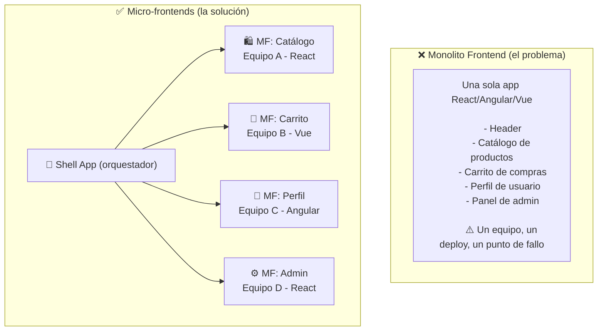
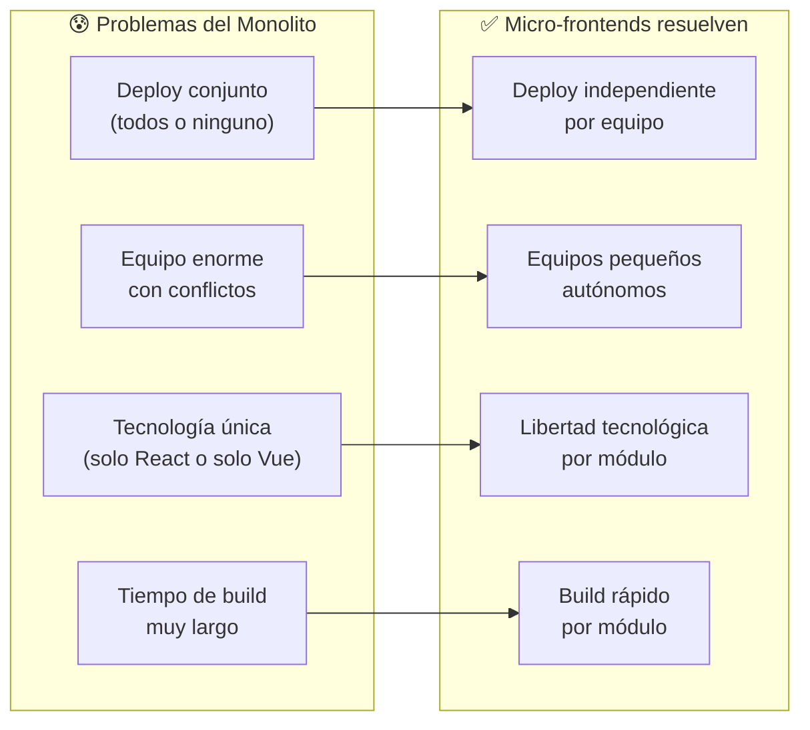
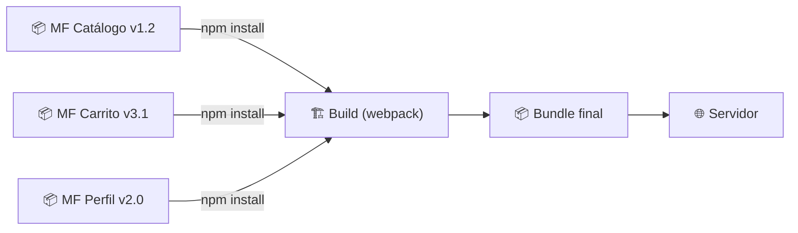
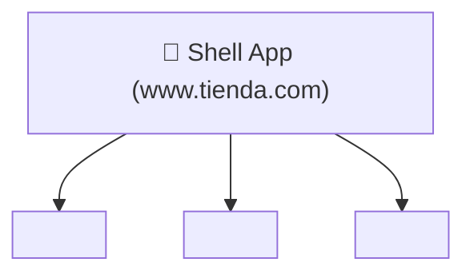
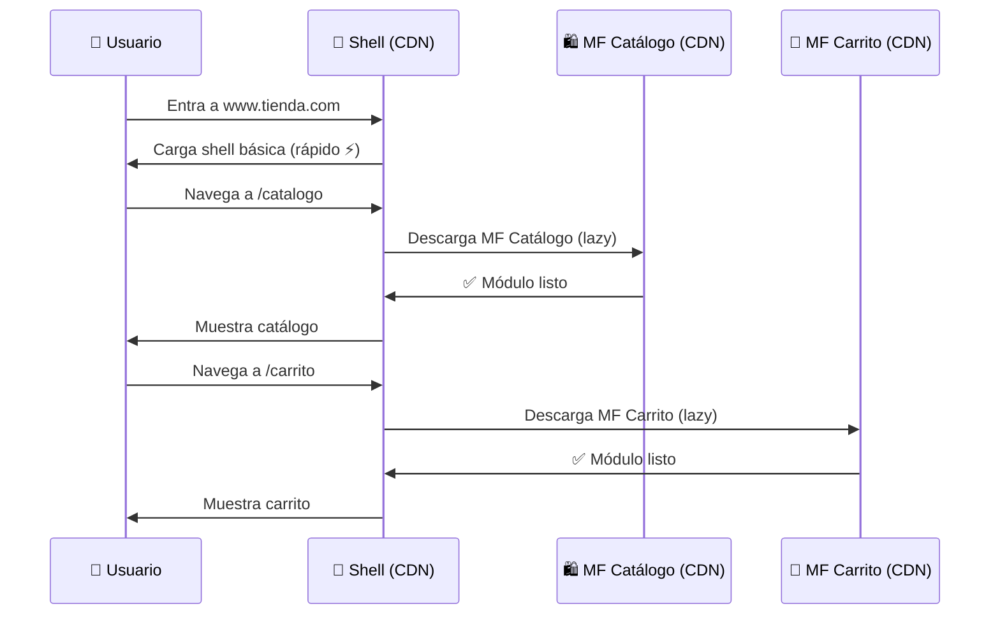
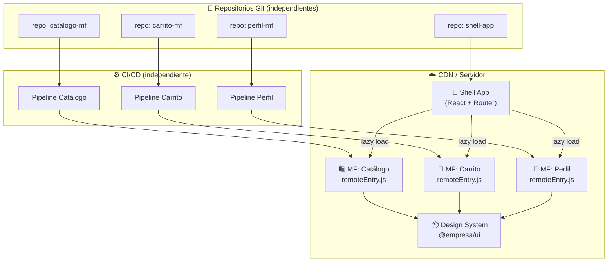

# 🧩 Micro-frontends Para Dummies

> **Objetivo**: Entender qué son los micro-frontends, por qué existen y cómo funcionan, usando analogías del mundo real.

---

## 🌍 Analogía del Mundo Real: El Centro Comercial vs. La Tienda Única

### El problema: La Tienda Única (Monolito Frontend)

Imagina que toda una ciudad tiene **una sola tienda gigante** donde compras TODO: ropa, comida, electrodomésticos, medicamentos...

- Si la sección de ropa necesita reformas → **toda la tienda cierra**
- El equipo de ropa no puede trabajar sin coordinar con el de comida
- Si una caja registradora falla → **todo el sistema de pagos cae**
- Para cambiar el color de las etiquetas de ropa → hay que consultarlo con todos los departamentos

### La solución: El Centro Comercial (Micro-frontends)

Ahora imagina un **centro comercial** con locales independientes:

- Zara, McDonald's, Falabella, Farmatodo...
- Cada local tiene su **propio equipo**, **su propio horario**, **su propia caja**
- Si McDonald's hace remodelación → Zara sigue abierta
- Falabella puede cambiar su diseño sin pedirle permiso a nadie
- Comparten el estacionamiento y los pasillos (infraestructura común)

**Eso son los micro-frontends**: múltiples equipos construyen partes independientes de la misma interfaz.

---

## 🏗️ ¿Qué son los Micro-frontends?

Los micro-frontends aplican el concepto de **microservicios al frontend**. En vez de una app web gigante, tienes **varias apps pequeñas** que se combinan para formar una sola experiencia.



---

## 🤔 ¿Por qué usar Micro-frontends?



---

## 🧱 Las 3 Estrategias de Integración

### Estrategia 1: Build-time Integration — "El LEGO antes de jugar"

Cada micro-frontend se publica como un **paquete npm**. La shell los instala antes de compilar.

**Analogía**: Como armar un LEGO antes de regalarlo. Todo queda junto, pero si quieres cambiar una pieza, tienes que desarmar y volver a armar todo.



```json
// package.json de la Shell App
{
  "dependencies": {
    "@empresa/mf-catalogo": "^1.2.0",
    "@empresa/mf-carrito": "^3.1.0",
    "@empresa/mf-perfil": "^2.0.0"
  }
}
```

**✅ Pros**: Simple, type-safe, fácil de hacer  
**❌ Contras**: Para actualizar un MF, hay que redeployar la shell entera

---

### Estrategia 2: Run-time via iframes — "Las ventanas dentro de la ventana"

Cada micro-frontend vive en su propio iframe (como una ventana dentro de otra ventana).

**Analogía**: Como tener varias apps de televisión corriendo en diferentes recuadros de tu pantalla. Son completamente independientes.



**✅ Pros**: Aislamiento total, seguridad, libertad tecnológica  
**❌ Contras**: Experiencia de usuario pobre, difícil compartir estado, SEO complicado

---

### Estrategia 3: Module Federation — "El WiFi bajo demanda" ⭐ Recomendada

Webpack 5 introdujo **Module Federation**: cada MF se despliega independientemente y la shell los **descarga en tiempo de ejecución** solo cuando los necesita.

**Analogía**: Como Netflix. La plataforma (shell) siempre está disponible, pero las películas (micro-frontends) se cargan solo cuando las pides. Si Netflix agrega una nueva película, no necesitas reinstalar la app.



---

## 🔧 Module Federation en la Práctica

### El archivo clave: `webpack.config.js`

```javascript
// webpack.config.js del MF Catálogo (el que "expone" su código)
const { ModuleFederationPlugin } = require('webpack').container;

module.exports = {
  plugins: [
    new ModuleFederationPlugin({
      name: 'catalogo',           // Nombre de este MF
      filename: 'remoteEntry.js', // Punto de entrada que otros descargarán
      
      // 📤 Lo que este MF comparte hacia afuera
      exposes: {
        './CatalogPage': './src/pages/CatalogPage',
        './ProductCard': './src/components/ProductCard',
      },
      
      // 📦 Dependencias compartidas (React no se descarga dos veces)
      shared: {
        react: { singleton: true, requiredVersion: '^18.0.0' },
        'react-dom': { singleton: true },
      },
    }),
  ],
};
```

```javascript
// webpack.config.js de la Shell App (la que "consume" los MFs)
const { ModuleFederationPlugin } = require('webpack').container;

module.exports = {
  plugins: [
    new ModuleFederationPlugin({
      name: 'shell',
      
      // 📥 Los MFs remotos que consumirá
      remotes: {
        catalogo: 'catalogo@https://cdn.tienda.com/catalogo/remoteEntry.js',
        carrito:  'carrito@https://cdn.tienda.com/carrito/remoteEntry.js',
        perfil:   'perfil@https://cdn.tienda.com/perfil/remoteEntry.js',
      },
      
      shared: {
        react: { singleton: true },
        'react-dom': { singleton: true },
      },
    }),
  ],
};
```

```tsx
// App.tsx de la Shell — importa componentes de otros MFs
import React, { Suspense } from 'react';

// Importación lazy desde el MF remoto
const CatalogPage = React.lazy(() => import('catalogo/CatalogPage'));
const CartPage    = React.lazy(() => import('carrito/CartPage'));
const ProfilePage = React.lazy(() => import('perfil/ProfilePage'));

function App() {
  return (
    <Router>
      <Header />
      <Suspense fallback={<div>Cargando...</div>}>
        <Routes>
          <Route path="/catalogo" element={<CatalogPage />} />
          <Route path="/carrito"  element={<CartPage />} />
          <Route path="/perfil"   element={<ProfilePage />} />
        </Routes>
      </Suspense>
    </Router>
  );
}
```

---

## 📡 Comunicación entre Micro-frontends

El mayor reto: ¿cómo se hablan entre sí si son independientes?

### Método 1: Custom Events — "El Sistema de Altavoces"

**Analogía**: Como el sistema de intercomunicación de un edificio. Cualquier piso puede emitir un mensaje, y los pisos interesados lo escuchan.

```typescript
// MF Carrito publica un evento cuando se agrega un producto
function addToCart(product: Product) {
  const event = new CustomEvent('cart:item-added', {
    detail: { productId: product.id, name: product.name, price: product.price }
  });
  window.dispatchEvent(event); // Broadcast a toda la página
}

// MF Header escucha el evento para actualizar el contador del carrito
window.addEventListener('cart:item-added', (event: CustomEvent) => {
  const { productId } = event.detail;
  updateCartBadge(cartCount + 1);
});
```

### Método 2: Shared State (Redux/Zustand global) — "El Pizarrón Compartido"

```typescript
// store compartido (publicado como paquete npm @empresa/shared-store)
import { create } from 'zustand';

interface SharedStore {
  user: User | null;
  cartItems: CartItem[];
  setUser: (user: User) => void;
  addToCart: (item: CartItem) => void;
}

export const useSharedStore = create<SharedStore>((set) => ({
  user: null,
  cartItems: [],
  setUser: (user) => set({ user }),
  addToCart: (item) => set((state) => ({
    cartItems: [...state.cartItems, item]
  })),
}));

// Cualquier MF importa el mismo store y ve los mismos datos
import { useSharedStore } from '@empresa/shared-store';

function CartIcon() {
  const cartItems = useSharedStore(state => state.cartItems);
  return <span>🛒 {cartItems.length}</span>;
}
```

### Método 3: URL / Query Params — "El Tablero de Avisos Público"

```typescript
// El estado más simple: la URL misma
// MF Catálogo navega con filtros
navigate('/catalogo?categoria=zapatos&precio=max-100');

// MF Filtros lee esos params
const [searchParams] = useSearchParams();
const categoria = searchParams.get('categoria'); // 'zapatos'
const precioMax = searchParams.get('precio');    // 'max-100'
```

---

## 🏗️ Arquitectura Completa



---

## 🆚 Monolito vs Micro-frontends

| Aspecto | 🧱 Monolito Frontend | 🧩 Micro-frontends |
|---------|---------------------|-------------------|
| **Tamaño del equipo** | 1 equipo grande | Múltiples equipos pequeños |
| **Deploy** | Todo junto | Independiente por módulo |
| **Tecnología** | Una sola (React o Vue) | Mixta por módulo |
| **Complejidad inicial** | Baja | Alta |
| **Escala a largo plazo** | Difícil | Fácil |
| **Compartir código** | Trivial | Requiere planificación |
| **Performance inicial** | Puede ser lento (bundle grande) | Mejor (lazy loading) |
| **Cuándo usarlo** | App pequeña/mediana | App grande, múltiples equipos |

---

## ⚠️ Errores Comunes (y cómo evitarlos)

| Error | Problema | Solución |
|-------|----------|----------|
| Cada MF descarga React por separado | Bundle enorme, múltiples versiones | `shared: { react: { singleton: true } }` |
| Comunicación excesiva entre MFs | Acoplamiento, pierdes los beneficios | Rediseña los límites entre módulos |
| Un Design System distinto por MF | Interfaz inconsistente | Paquete npm `@empresa/ui` compartido |
| Demasiados micro-frontends | Complejidad innecesaria | Regla: un MF por equipo/dominio |
| Sin contrato de API entre MFs | Breaking changes silenciosos | Versionar las interfaces compartidas |

---

## ✅ ¿Cuándo usar Micro-frontends?

**✅ SÍ, úsalos cuando:**
- Tu equipo de frontend tiene más de 10-15 personas
- Diferentes equipos trabajan en partes distintas de la app
- Necesitas deployar una parte sin afectar las demás
- Tienes un legado que migrar gradualmente (Angular → React)

**❌ NO los uses cuando:**
- Eres un equipo pequeño (1-5 personas)
- La app es simple o un MVP
- No tienes experiencia con webpack avanzado
- La complejidad añadida no justifica los beneficios

---

## 📌 Resumen en una frase

> Los **micro-frontends** dividen una app frontend grande en piezas independientes, permitiendo que **cada equipo construya, pruebe y despliegue su parte sin afectar a los demás**, igual que los locales de un centro comercial.

---

## 🔗 Navegación

👈 [01-Firebase-Para-Dummies.md](./01-Firebase-Para-Dummies.md)  
👉 [03-Vision-Camera-Para-Dummies.md](./03-Vision-Camera-Para-Dummies.md)
