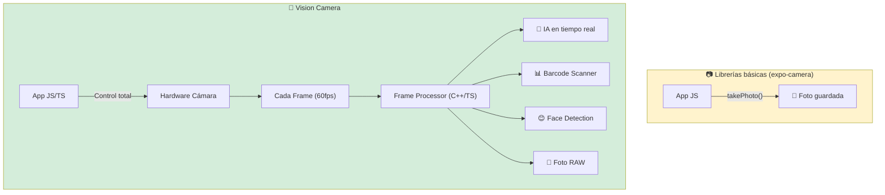
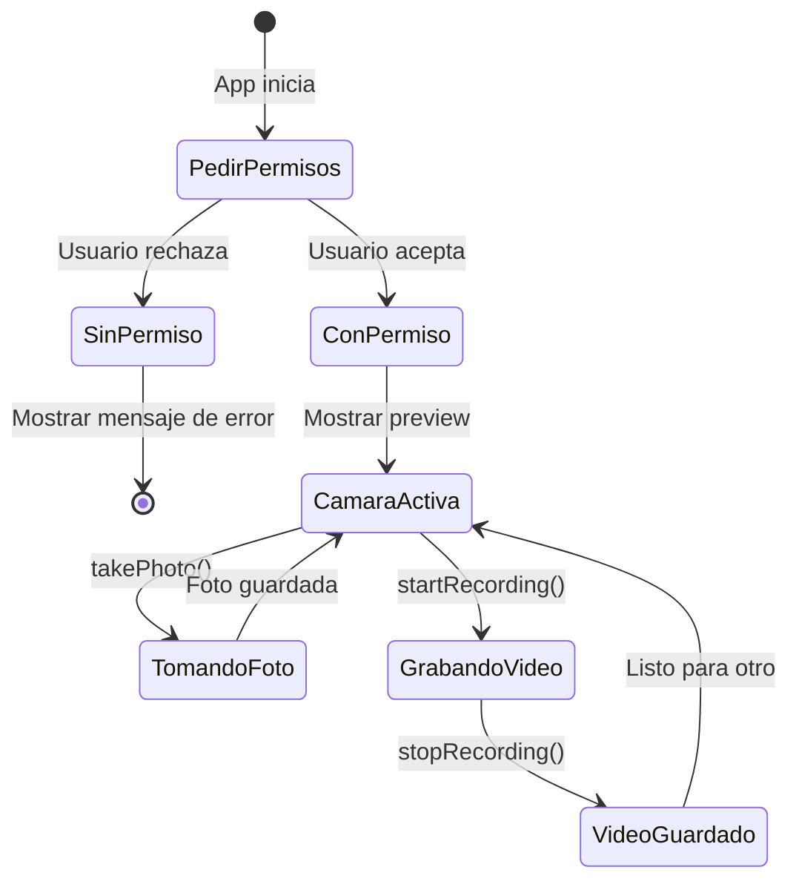
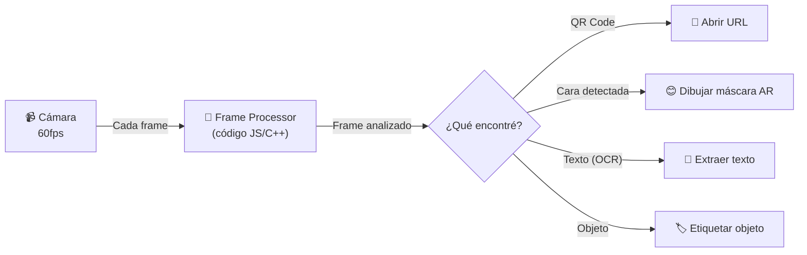
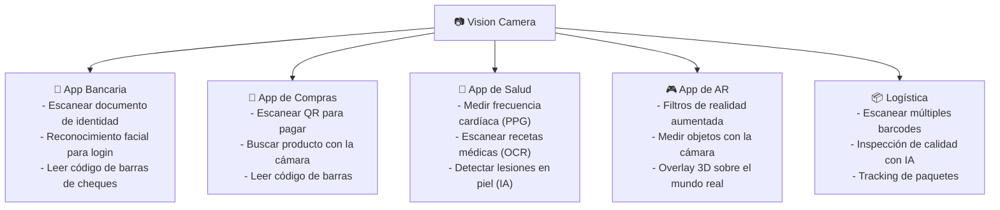
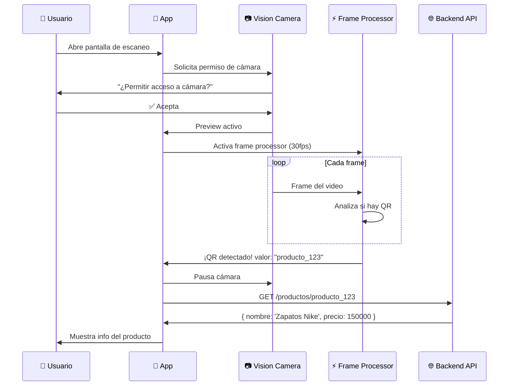

# 📷 Vision Camera Para Dummies

> **Objetivo**: Entender qué es Vision Camera, cómo usarla en React Native y para qué sirve, con analogías del mundo real.

---

## 🌍 Analogía del Mundo Real: La Cámara Profesional vs. La Cámara de Punto y Disparar

**La cámara de punto y disparar** (otras librerías como `expo-camera`):
- Fácil de usar, solo apuntas y disparas
- Configuración limitada (no puedes cambiar el obturador, el ISO, el lente)
- Perfecta para fotos casuales

**La cámara profesional DSLR** (Vision Camera):
- Control total: ISO, obturador, lente, formato RAW, zoom óptico
- Puedes conectarle lentes especiales (plugins: detección de rostros, códigos QR, IA)
- Acceso a cada frame individual del video
- Requiere saber más, pero lo que puedes hacer es ilimitado

**Vision Camera es la cámara DSLR del mundo móvil.**

---

## 🏗️ ¿Qué es Vision Camera?

**Vision Camera** es la librería de cámara más potente para React Native. Permite acceder directamente al hardware de la cámara con:

- **60fps** de procesamiento de frames en tiempo real
- **Plugins de Frame Processors** (código que corre en cada frame del video)
- Control total de exposición, ISO, zoom, flash, HDR
- Soporte para múltiples cámaras (ultra-wide, telephoto, depth)
- Escrito en **C++/Swift/Kotlin** para máximo rendimiento



---

## 📦 Instalación y Setup

```bash
# Instalar la librería
npm install react-native-vision-camera

# iOS: instalar pods
cd ios && pod install

# Permisos necesarios en Info.plist (iOS)
# NSCameraUsageDescription
# NSMicrophoneUsageDescription
```

```xml
<!-- AndroidManifest.xml -->
<uses-permission android:name="android.permission.CAMERA" />
<uses-permission android:name="android.permission.RECORD_AUDIO" />
```

---

## 🔑 Conceptos Clave

### 1. 📋 Dispositivos de Cámara — "Elige tu Lente"

**Analogía**: Como elegir qué lente poner en tu DSLR. ¿Gran angular para paisajes? ¿Telefoto para zoom? ¿Frontal para selfies?

```typescript
import { Camera, useCameraDevices } from 'react-native-vision-camera';

function MyCameraScreen() {
  const devices = useCameraDevices();
  
  // Dispositivos disponibles
  const backCamera  = devices.back;   // Cámara trasera principal
  const frontCamera = devices.front;  // Cámara frontal (selfie)
  
  console.log('Cámaras disponibles:', devices);
  // {
  //   back: { id: '0', position: 'back', name: 'Wide Camera' },
  //   front: { id: '1', position: 'front', name: 'TrueDepth Camera' }
  // }
}
```

### 2. 🎛️ Configuración del Formato — "Los Ajustes de la Cámara"

**Analogía**: Como los ajustes de tu DSLR: resolución, FPS, HDR. Un fotógrafo profesional no usa la misma config para retratos que para deportes.

```typescript
import { Camera, useCameraDevices, useCameraFormat } from 'react-native-vision-camera';

function MyCameraScreen() {
  const devices = useCameraDevices();
  const device = devices.back;

  // Buscar el mejor formato para video 4K a 60fps
  const format = useCameraFormat(device, [
    { videoResolution: { width: 3840, height: 2160 } }, // 4K
    { fps: 60 },                                         // 60 frames por segundo
  ]);

  // O para fotos de alta resolución
  const photoFormat = useCameraFormat(device, [
    { photoResolution: 'max' },  // La máxima resolución disponible
  ]);
}
```

---

## 📷 Uso Básico: Tomar Fotos y Videos



```tsx
import React, { useRef, useState, useEffect } from 'react';
import { View, TouchableOpacity, Text, StyleSheet } from 'react-native';
import {
  Camera,
  useCameraDevices,
  useCameraPermission,
} from 'react-native-vision-camera';

export function CameraScreen() {
  const camera = useRef<Camera>(null);
  const { hasPermission, requestPermission } = useCameraPermission();
  const devices = useCameraDevices();
  const device = devices.back;

  // 1️⃣ Pedir permisos al montar
  useEffect(() => {
    if (!hasPermission) {
      requestPermission();
    }
  }, []);

  // 2️⃣ Tomar foto
  async function takePhoto() {
    const photo = await camera.current?.takePhoto({
      qualityPrioritization: 'quality', // 'quality' | 'speed' | 'balanced'
      flash: 'auto',
      enableShutterSound: true,
    });

    console.log('Foto tomada:', photo?.path);
    // Resultado: { path: '/var/mobile/.../photo.jpg', width: 4032, height: 3024 }
  }

  // 3️⃣ Grabar video
  async function startRecording() {
    camera.current?.startRecording({
      onRecordingFinished: (video) => {
        console.log('Video guardado:', video.path);
        // video.path → ruta local del .mp4
      },
      onRecordingError: (error) => {
        console.error('Error grabando:', error);
      },
    });
  }

  async function stopRecording() {
    await camera.current?.stopRecording();
  }

  if (!hasPermission) return <Text>Sin permisos de cámara</Text>;
  if (!device) return <Text>Cámara no disponible</Text>;

  return (
    <View style={StyleSheet.absoluteFill}>
      {/* 4️⃣ El preview de la cámara */}
      <Camera
        ref={camera}
        style={StyleSheet.absoluteFill}
        device={device}
        isActive={true}
        photo={true}   // Habilitar modo foto
        video={true}   // Habilitar modo video
        audio={true}   // Habilitar micrófono
      />

      {/* Botón de captura */}
      <TouchableOpacity
        style={styles.captureBtn}
        onPress={takePhoto}
      >
        <View style={styles.captureCircle} />
      </TouchableOpacity>
    </View>
  );
}
```

---

## ⚡ Frame Processors — El Superpoder de Vision Camera

Esta es la característica que diferencia a Vision Camera de todas las demás.

**Analogía**: Imagina que en vez de solo guardar una foto, tienes un empleado que mira cada fotograma del video en tiempo real (60 veces por segundo) y puede hacer algo con él: reconocer caras, leer códigos QR, medir la frecuencia cardíaca, detectar objetos.

Ese empleado es el **Frame Processor**.



```typescript
import { useFrameProcessor } from 'react-native-vision-camera';
import { runOnJS } from 'react-native-reanimated';

// Frame Processor básico: detectar brillo
function MyCamera() {
  // Esta función corre en el hilo nativo, 60 veces por segundo
  const frameProcessor = useFrameProcessor((frame) => {
    'worklet'; // Marca que corre fuera del hilo JS principal
    
    // frame contiene el fotograma actual
    console.log(`Frame: ${frame.width}x${frame.height} - ${frame.pixelFormat}`);
    
    // Puedes llamar plugins aquí (QR, faces, objects, etc.)
  }, []);

  return (
    <Camera
      frameProcessor={frameProcessor}
      frameProcessorFps={30}  // Cuántos frames por segundo procesar
      // ...
    />
  );
}
```

---

## 🔌 Plugins Populares de Frame Processors

### Plugin 1: Detección de Códigos QR/Barras

```typescript
import { useScanBarcodes, BarcodeFormat } from 'vision-camera-code-scanner';

function QRScanner() {
  const [barcodes, setBarcodes] = useState([]);

  const frameProcessor = useScanBarcodes(
    [BarcodeFormat.QR_CODE, BarcodeFormat.EAN_13],
    { checkInverted: true }
  );

  // Cuando detecta un QR, barcodes se actualiza automáticamente
  useEffect(() => {
    if (barcodes.length > 0) {
      console.log('QR detectado:', barcodes[0].rawValue);
      // Ej: 'https://tienda.com/producto/123'
    }
  }, [barcodes]);

  return (
    <Camera
      frameProcessor={frameProcessor}
      // ...
    />
  );
}
```

### Plugin 2: Detección de Rostros

```typescript
import { scanFaces, Face } from 'vision-camera-face-detector';

function FaceCamera() {
  const [faces, setFaces] = useState<Face[]>([]);

  const frameProcessor = useFrameProcessor((frame) => {
    'worklet';
    const detectedFaces = scanFaces(frame);
    runOnJS(setFaces)(detectedFaces);
  }, []);

  return (
    <>
      <Camera frameProcessor={frameProcessor} {...} />
      {/* Dibuja un rectángulo alrededor de cada cara */}
      {faces.map((face, index) => (
        <FaceBox key={index} bounds={face.bounds} />
      ))}
    </>
  );
}
```

### Plugin 3: OCR (Reconocimiento de Texto)

```typescript
// Leer texto de documentos, placas de carros, recibos
import { scanText } from 'vision-camera-ocr';

const frameProcessor = useFrameProcessor((frame) => {
  'worklet';
  const result = scanText(frame);
  // result.text → "PLACA ABC-123" / "Total: $45.000"
  runOnJS(setDetectedText)(result.text);
}, []);
```

---

## 🎨 Casos de Uso Reales



---

## 🆚 Vision Camera vs expo-camera vs react-native-camera

| Característica | 📷 expo-camera | 📸 react-native-camera | 🎥 Vision Camera |
|---|---|---|---|
| **Facilidad de uso** | ⭐⭐⭐⭐⭐ | ⭐⭐⭐ | ⭐⭐⭐ |
| **Performance** | ⭐⭐ | ⭐⭐⭐ | ⭐⭐⭐⭐⭐ |
| **Frame Processors** | ❌ | ❌ | ✅ |
| **Control de hardware** | Básico | Medio | Total |
| **Plugins de IA** | ❌ | Limitado | ✅ Muchos |
| **Mantenimiento activo** | ✅ | ⚠️ Lento | ✅ Muy activo |
| **Soporte Expo** | ✅ Nativo | ⚠️ Bare workflow | ⚠️ Bare workflow |
| **Cuándo usarla** | Fotos simples | Proyectos legacy | Procesamiento avanzado |

---

## ⚠️ Errores Comunes

| Error | Causa | Solución |
|-------|-------|----------|
| App crashea al abrir cámara | Permisos no solicitados | Usar `useCameraPermission()` antes de renderizar `<Camera>` |
| Camera is not active | `isActive={false}` | Pasar `isActive={true}` o ligarlo al estado de la pantalla |
| Frame processor lento | Código pesado en worklet | Mover lógica pesada a `runOnJS()`, mantener worklet ligero |
| No se detecta QR | Poca luz o QR muy pequeño | Aumentar resolución, usar torch |
| Build falla en iOS | Pod desactualizado | `cd ios && pod install --repo-update` |

---

## 🗺️ Flujo Completo: App de Escaneo QR



---

## 📌 Resumen en una frase

> **Vision Camera** es la librería de cámara más potente para React Native: te da acceso total al hardware y permite procesar cada fotograma en tiempo real con IA, ideal para escáneres QR, detección de rostros, OCR y realidad aumentada.

---

## 🔗 Navegación

👈 [02-Micro-frontends-Para-Dummies.md](./02-Micro-frontends-Para-Dummies.md)  
👉 [04-Push-Notifications-Para-Dummies.md](./04-Push-Notifications-Para-Dummies.md)
