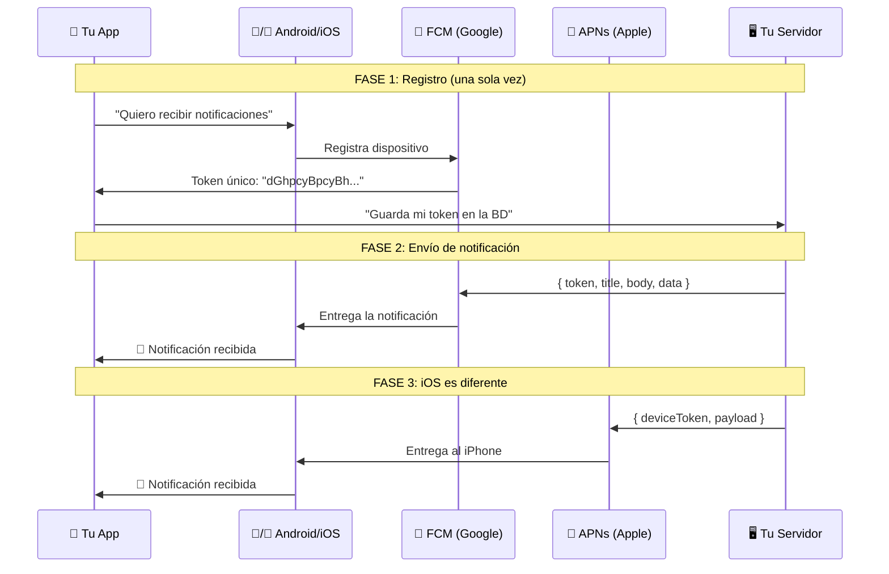
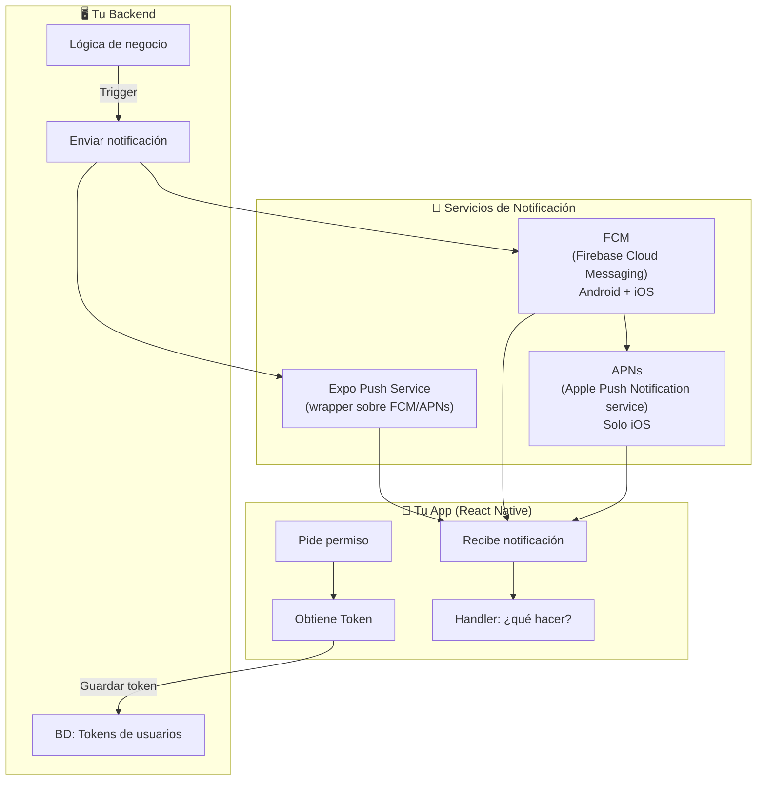
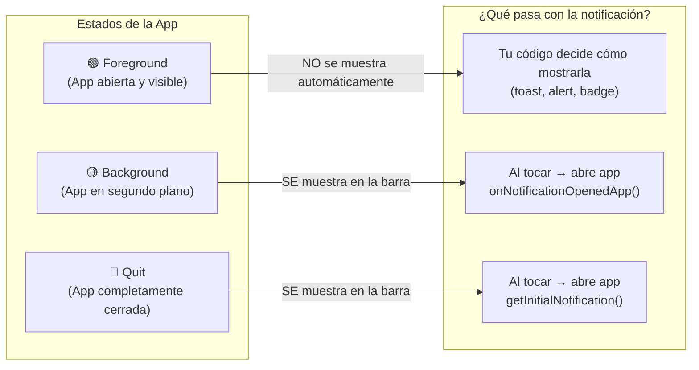
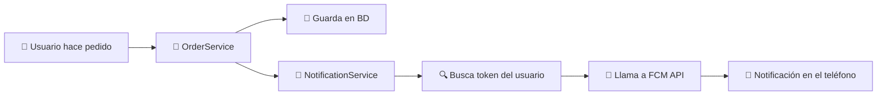
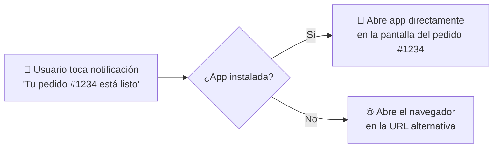

# 🔔 Push Notifications Para Dummies

> **Objetivo**: Entender cómo funcionan las notificaciones push de principio a fin, por qué son complejas y cómo implementarlas correctamente en React Native.

---

## 🌍 Analogía del Mundo Real: El Servicio de Mensajería

Imagina que quieres mandar una carta urgente a alguien que no sabes dónde está exactamente.

El proceso es:
1. **Tú** (tu servidor) → llevas la carta a la **oficina de correos** (FCM/APNs)
2. La **oficina de correos** conoce la dirección exacta del destinatario
3. La **oficina** entrega la carta al **edificio de apartamentos** (el teléfono)
4. El **portero del edificio** (el OS: Android/iOS) la mete por debajo de la puerta
5. El **destinatario** (el usuario) la recibe, aunque no esté en casa (app cerrada)

**El token del dispositivo** es la "dirección de apartamento" única de cada teléfono.

---

## 🏗️ ¿Cómo funcionan las Push Notifications?



---

## 🗺️ El Ecosistema Completo



---

## 🔑 Partes Clave Explicadas

### 1. 🎫 El Token del Dispositivo — "El Código Postal del Teléfono"

Cada instalación de tu app en un dispositivo específico tiene un **token único**. Si el usuario:
- Reinstala la app → nuevo token
- Borra la app → token inválido
- Cambia de teléfono → nuevo token

**Por eso siempre debes actualizar el token en tu BD cuando cambia.**

```typescript
import messaging from '@react-native-firebase/messaging';

async function registerDeviceToken(userId: string) {
  // Obtener token actual
  const token = await messaging().getToken();
  
  // Guardar en tu backend
  await api.post('/users/device-token', {
    userId,
    token,
    platform: Platform.OS, // 'ios' o 'android'
  });

  // Escuchar si el token cambia (puede pasar)
  messaging().onTokenRefresh(async (newToken) => {
    console.log('Token renovado:', newToken);
    await api.post('/users/device-token', { userId, token: newToken });
  });
}
```

---

### 2. 📋 Los 3 Estados de una App

El comportamiento de la notificación cambia según el estado de la app:



```typescript
import messaging from '@react-native-firebase/messaging';
import { useEffect } from 'react';

function useNotifications(navigation) {
  useEffect(() => {
    // ─── FOREGROUND: app abierta ───────────────────────────────
    // La notificación NO aparece sola, TÚ decides qué hacer
    const unsubForeground = messaging().onMessage(async (remoteMessage) => {
      console.log('Notificación en foreground:', remoteMessage);
      
      // Mostrar un toast, alert, o actualizar la UI
      showToast({
        title: remoteMessage.notification?.title ?? '',
        message: remoteMessage.notification?.body ?? '',
      });
    });

    // ─── BACKGROUND: app en segundo plano ──────────────────────
    // El sistema ya mostró la notificación, usuario la tocó
    const unsubBackground = messaging().onNotificationOpenedApp((remoteMessage) => {
      console.log('Usuario tocó notificación (background):', remoteMessage);
      handleNotificationNavigation(remoteMessage, navigation);
    });

    // ─── QUIT: app completamente cerrada ───────────────────────
    // Se llama una sola vez al abrir la app desde la notificación
    messaging()
      .getInitialNotification()
      .then((remoteMessage) => {
        if (remoteMessage) {
          console.log('App abierta desde notificación cerrada:', remoteMessage);
          handleNotificationNavigation(remoteMessage, navigation);
        }
      });

    return () => {
      unsubForeground();
      unsubBackground();
    };
  }, []);
}

// Navegación según el tipo de notificación
function handleNotificationNavigation(remoteMessage, navigation) {
  const { type, orderId, chatId } = remoteMessage.data ?? {};

  switch (type) {
    case 'new_order':
      navigation.navigate('OrderDetail', { orderId });
      break;
    case 'new_message':
      navigation.navigate('Chat', { chatId });
      break;
    default:
      navigation.navigate('Home');
  }
}
```

---

### 3. 📦 Estructura de una Notificación

```typescript
// Cómo se ve un RemoteMessage completo
const remoteMessage = {
  // Identificadores
  messageId: 'abc123',
  from: '123456789',           // Tu Firebase Project ID
  
  // Lo que ve el usuario
  notification: {
    title: '¡Nuevo pedido! 🎉',
    body: 'Tu pedido #1234 está listo para recoger',
    android: {
      imageUrl: 'https://...',  // Imagen grande (solo Android)
      channelId: 'orders',      // Canal de Android
    },
    apple: {
      badge: '3',               // Número en el ícono (iOS)
      sound: 'default',
    },
  },
  
  // Datos silenciosos para tu app (no visibles al usuario)
  data: {
    type: 'new_order',
    orderId: '1234',
    screen: 'OrderDetail',
  },
};
```

---

## 📱 Android: Canales de Notificación

En Android 8+, las notificaciones **deben pertenecer a un canal**. El usuario puede silenciar canales individuales (ej: silenciar "Promociones" pero no "Pedidos").

**Analogía**: Como las categorías de correo en Gmail. Puedes silenciar "Promociones" sin perder los "Importantes".

```typescript
import notifee, { AndroidImportance } from '@notifee/react-native';

async function createNotificationChannels() {
  // Canal para pedidos (alta importancia = suena + vibra)
  await notifee.createChannel({
    id: 'orders',
    name: 'Pedidos',
    importance: AndroidImportance.HIGH,
    vibration: true,
    sound: 'default',
  });

  // Canal para promociones (baja importancia = silencioso)
  await notifee.createChannel({
    id: 'promotions',
    name: 'Promociones y ofertas',
    importance: AndroidImportance.LOW,
    vibration: false,
  });

  // Canal para mensajes
  await notifee.createChannel({
    id: 'messages',
    name: 'Mensajes',
    importance: AndroidImportance.HIGH,
    sound: 'message_sound', // Sonido personalizado
  });
}

// Mostrar notificación local en un canal específico
async function displayNotification(title: string, body: string, channelId: string) {
  await notifee.displayNotification({
    title,
    body,
    android: {
      channelId,                          // Canal al que pertenece
      smallIcon: 'ic_launcher',           // Ícono en la barra de estado
      largeIcon: 'https://...',           // Imagen circular
      pressAction: { id: 'default' },    // Acción al tocar
    },
  });
}
```

---

## 🍎 iOS: Permisos y Badges

iOS requiere que el usuario **explícitamente acepte** las notificaciones.

```typescript
import messaging from '@react-native-firebase/messaging';
import { Alert } from 'react-native';

async function requestiOSPermissions() {
  const authStatus = await messaging().requestPermission({
    alert: true,      // Mostrar alerta
    badge: true,      // Número en el ícono
    sound: true,      // Reproducir sonido
    announcement: false,
    provisional: false, // true = sin preguntar, silencioso
  });

  if (authStatus === messaging.AuthorizationStatus.AUTHORIZED) {
    console.log('✅ Permisos concedidos');
  } else if (authStatus === messaging.AuthorizationStatus.PROVISIONAL) {
    console.log('⚠️ Permisos provisionales (silencioso)');
  } else {
    // El usuario rechazó → llevarlo a Settings
    Alert.alert(
      'Notificaciones desactivadas',
      'Actívalas en Configuración para no perderte nada.',
      [
        { text: 'Ahora no', style: 'cancel' },
        { text: 'Ir a Configuración', onPress: () => Linking.openSettings() },
      ]
    );
  }
}
```

---

## 🖥️ Enviando desde el Backend (NestJS)



```typescript
// notification.service.ts (NestJS)
import { Injectable, Logger } from '@nestjs/common';
import * as admin from 'firebase-admin';

@Injectable()
export class NotificationService {
  private readonly logger = new Logger(NotificationService.name);

  async sendToUser(userId: string, payload: NotificationPayload): Promise<void> {
    // 1. Obtener token del usuario desde BD
    const user = await this.userRepository.findOne({ where: { id: userId } });
    
    if (!user?.fcmToken) {
      this.logger.warn(`Usuario ${userId} no tiene token FCM`);
      return;
    }

    try {
      // 2. Enviar a FCM
      const response = await admin.messaging().send({
        token: user.fcmToken,
        
        notification: {
          title: payload.title,
          body: payload.body,
        },
        
        // Datos extra para la app (no visibles al usuario)
        data: {
          type: payload.type,
          ...payload.data,
        },
        
        // Config específica de Android
        android: {
          notification: {
            channelId: payload.channelId ?? 'default',
            priority: 'high',
            icon: 'ic_stat_notify',
          },
        },
        
        // Config específica de iOS
        apns: {
          payload: {
            aps: {
              badge: payload.badge ?? 1,
              sound: 'default',
            },
          },
        },
      });

      this.logger.log(`Notificación enviada: ${response}`);

    } catch (error) {
      // Token inválido → borrarlo de la BD
      if (error.code === 'messaging/registration-token-not-registered') {
        this.logger.warn(`Token inválido para usuario ${userId}, eliminando...`);
        await this.userRepository.update(userId, { fcmToken: null });
      } else {
        this.logger.error(`Error enviando notificación: ${error.message}`);
        throw error;
      }
    }
  }

  // Enviar a múltiples usuarios a la vez
  async sendToMultiple(userIds: string[], payload: NotificationPayload): Promise<void> {
    const users = await this.userRepository.find({
      where: { id: In(userIds) },
      select: ['id', 'fcmToken'],
    });

    const tokens = users
      .filter(u => u.fcmToken)
      .map(u => u.fcmToken);

    if (tokens.length === 0) return;

    // FCM soporta hasta 500 tokens por batch
    const batches = chunk(tokens, 500);
    
    for (const batch of batches) {
      await admin.messaging().sendEachForMulticast({
        tokens: batch,
        notification: { title: payload.title, body: payload.body },
        data: payload.data,
      });
    }
  }
}
```

---

## 🏷️ Topics — "Las Listas de Correo"

En vez de guardar tokens individuales, puedes suscribir usuarios a **topics** (temas). Ideal para notificaciones masivas.

**Analogía**: Como una lista de correo. Quien quiera recibir "Ofertas de zapatos" se suscribe. Tú mandas un mensaje al topic y llega a todos los suscritos.

```typescript
// En la app móvil
import messaging from '@react-native-firebase/messaging';

// Suscribir al usuario a topics de su interés
async function subscribeToTopics(userPreferences: string[]) {
  for (const topic of userPreferences) {
    await messaging().subscribeToTopic(topic);
    // topics: 'ofertas', 'novedades', 'colombia', 'categoria_zapatos'
  }
}

// Desuscribir
async function unsubscribeFromTopic(topic: string) {
  await messaging().unsubscribeFromTopic(topic);
}

// En el backend: mandar a todo un topic
await admin.messaging().send({
  topic: 'ofertas',  // Llega a TODOS los suscritos
  notification: {
    title: '🔥 Oferta del día',
    body: '50% de descuento en zapatos. ¡Solo hoy!',
  },
});
```

---

## 🆚 FCM vs Expo Notifications vs OneSignal

| | 📡 FCM (directo) | 📦 Expo Notifications | 🔔 OneSignal |
|---|---|---|---|
| **Complejidad** | Alta | Baja | Media |
| **Control** | Total | Limitado | Medio |
| **Costo** | Gratis | Gratis (con límites) | Freemium |
| **Analytics** | Manual | Básico | ✅ Avanzado |
| **A/B Testing** | ❌ | ❌ | ✅ |
| **Cuándo usar** | App custom con NestJS | Proyectos Expo rápidos | Equipos de marketing |

---

## 🔗 Deep Linking — "El Enlace que Abre la Página Exacta"

### ¿Qué es?

**Analogía**: Cuando alguien te manda un link de WhatsApp como `https://tienda.com/productos/zapatos-123`, ese link no solo abre el sitio web, te lleva **directamente a los zapatos** sin que tenyas que buscarlos. Eso es deep linking.

En apps móviles, el deep link es una URL que **abre la app directamente en una pantalla específica**, en vez de solo abrir la app en el inicio.



### Tipos de Deep Links

| Tipo | Ejemplo | ¿Cuándo usar? |
|------|---------|---------------|
| **Custom Scheme** | `miapp://pedidos/1234` | Apps simples, no funciona en web |
| **Universal Links (iOS)** | `https://tienda.com/pedidos/1234` | Producción, si app no está se abre web |
| **App Links (Android)** | `https://tienda.com/pedidos/1234` | Producción, igual que Universal Links |

### Implementación con React Navigation

```typescript
// 1. Definir el esquema de URLs de tu app
// app.json (Expo) o AndroidManifest.xml / Info.plist
// Scheme: "miapp" → miapp://

// 2. Configurar el linking en React Navigation
import { NavigationContainer } from '@react-navigation/native';

const linking = {
  prefixes: [
    'miapp://',                    // Custom scheme
    'https://tienda.com',          // Universal/App Links
  ],
  config: {
    screens: {
      Home: '',                          // miapp://  o  tienda.com/
      OrderDetail: 'pedidos/:orderId',   // miapp://pedidos/1234
      Chat: 'chat/:chatId',             // miapp://chat/abc
      Profile: 'perfil',                // miapp://perfil
      ProductDetail: {
        path: 'productos/:productId',   // miapp://productos/zapatos-123
        parse: {
          productId: (id: string) => id.toUpperCase(), // transformar params
        },
      },
    },
  },
};

function App() {
  return (
    <NavigationContainer linking={linking}>
      {/* tus navegadores */}
    </NavigationContainer>
  );
}
```

### Conectar Deep Links con Push Notifications

La conexión clave: el campo `data` de la notificación contiene la URL o los parámetros para navegar.

```typescript
// En el backend: enviar notificación con deep link info
await admin.messaging().send({
  token: user.fcmToken,
  notification: {
    title: '¡Tu pedido está listo! 📦',
    body: 'Pedido #1234 listo para recoger',
  },
  data: {
    // Opción A: URL directa
    deepLink: 'miapp://pedidos/1234',

    // Opción B: tipo + parámetros (más flexible)
    type: 'order_ready',
    orderId: '1234',
  },
});

// En la app: interpretar los datos y navegar
function handleNotificationNavigation(remoteMessage, navigation) {
  const { deepLink, type, orderId, chatId, productId } = remoteMessage.data ?? {};

  // Opción A: si viene URL directa, usarla
  if (deepLink) {
    Linking.openURL(deepLink);
    return;
  }

  // Opción B: navegar según tipo
  switch (type) {
    case 'order_ready':
    case 'new_order':
      navigation.navigate('OrderDetail', { orderId });
      break;
    case 'new_message':
      navigation.navigate('Chat', { chatId });
      break;
    case 'product_offer':
      navigation.navigate('ProductDetail', { productId });
      break;
    default:
      navigation.navigate('Home');
  }
}
```

### Probar Deep Links desde la terminal

```bash
# Android (abrir deep link en el emulador)
adb shell am start -W -a android.intent.action.VIEW \
  -d "miapp://pedidos/1234" com.tuapp

# iOS (abrir deep link en el simulador)
xcrun simctl openurl booted "miapp://pedidos/1234"
```

---

## ✅ Checklist de Implementación

```
□ Configurar Firebase proyecto (iOS + Android)
□ Instalar @react-native-firebase/messaging
□ Pedir permisos al usuario (iOS obligatorio)
□ Obtener y guardar token en el backend
□ Escuchar onTokenRefresh para tokens renovados
□ Manejar los 3 estados (foreground/background/quit)
□ Crear canales Android (Android 8+)
□ Manejar deep linking desde notificación
□ Limpiar tokens inválidos en el backend
□ Probar con Firebase Console antes de integrar backend
```

---

## 📌 Resumen en una frase

> Las **Push Notifications** son mensajes que tu servidor envía a través de FCM/APNs hasta el teléfono del usuario, incluso con la app cerrada; el secreto está en manejar correctamente el **token del dispositivo** y los **3 estados** en que puede estar la app.

---

## 🔗 Navegación

👈 [03-Vision-Camera-Para-Dummies.md](./03-Vision-Camera-Para-Dummies.md)  
👉 [05-Conceptos-Arquitectura-Para-Dummies.md](./05-Conceptos-Arquitectura-Para-Dummies.md)
