# 🏛️ Conceptos de Arquitectura Para Dummies

> **Objetivo**: Entender los patrones y conceptos de arquitectura de software más importantes, usando analogías del mundo real. Sin jerga innecesaria.

---

## Índice

1. [Monolito vs Microservicios](#1-monolito-vs-microservicios)
2. [REST vs GraphQL vs gRPC](#2-rest-vs-graphql-vs-grpc)
3. [Event-Driven Architecture](#3-event-driven-architecture-arquitectura-orientada-a-eventos)
4. [CQRS](#4-cqrs-command-query-responsibility-segregation)
5. [Clean Architecture](#5-clean-architecture--arquitectura-hexagonal)
6. [CAP Theorem](#6-cap-theorem)
7. [Patrones de Resiliencia](#7-patrones-de-resiliencia)
8. [Patrones de Datos](#8-patrones-de-datos)

---

## 1. Monolito vs Microservicios

### La Analogía del Restaurante

**Monolito = Restaurante pequeño de barrio**
- Un cocinero hace todo: cocina, sirve, cobra, limpia
- Si el cocinero se enferma → el restaurante cierra
- Fácil de manejar cuando es pequeño
- Escalar significa contratar más cocineros que hacen lo mismo

**Microservicios = Restaurante de cadena (McDonald's)**
- Hay personas especializadas: cajero, cocinero de hamburguesas, cocinero de papas, persona de bebidas
- Si falla la máquina de bebidas → las hamburguesas siguen saliendo
- Cada estación puede trabajar a su propio ritmo
- Puedes poner más personas solo en la estación que está saturada

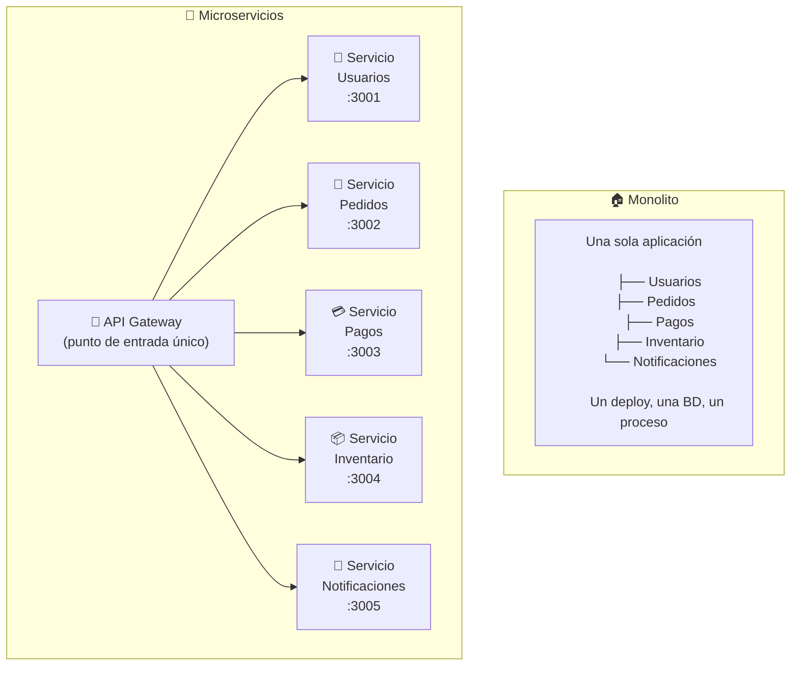

### ¿Cuándo usar cada uno?

| Situación | Monolito | Microservicios |
|-----------|----------|----------------|
| Startup / MVP | ✅ Ideal | ❌ Over-engineering |
| Equipo pequeño (< 8 devs) | ✅ | ❌ |
| Necesitas escalar partes específicas | ❌ | ✅ |
| Múltiples equipos independientes | ❌ | ✅ |
| Alta disponibilidad por módulo | ❌ | ✅ |
| Complejidad de red aceptable | N/A | Debes manejarla |

> **Regla de oro**: Empieza con un monolito bien estructurado. Extrae microservicios cuando el dolor sea real, no anticipado.

---

## 2. REST vs GraphQL vs gRPC

### La Analogía del Restaurante (de nuevo, pero diferente)

**REST = Menú fijo**
Llegas al restaurante y el menú dice:
- `GET /platos` → lista todos los platos
- `GET /platos/5` → el plato #5
- `POST /pedidos` → hacer un pedido

El problema: si solo quieres saber el nombre del plato #5, igual recibes toda la información (ingredientes, precio, calorías, alérgenos...). **Overfetching**.

**GraphQL = "Pide exactamente lo que quieres"**
Como hablar con el mesero directamente:
- "Quiero solo el nombre y precio del plato #5"
- "Y también dime cuántos pedidos tiene ese plato hoy"
- Todo en una sola petición, exactamente lo que pediste. Ni más, ni menos.

**gRPC = Intercom entre cocinas**
No es para el cliente final. Es la comunicación interna entre el servicio de pedidos y el de inventario: ultrarrápido, binario, eficiente. Como el sistema de intercomunicación interno del restaurante.

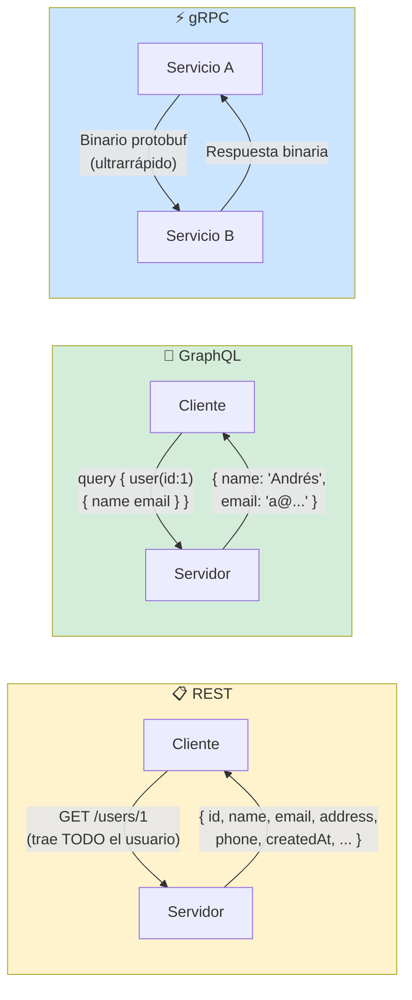

### Comparativa detallada

| Aspecto | REST | GraphQL | gRPC |
|---------|------|---------|------|
| **Formato** | JSON | JSON | Binario (Protobuf) |
| **Protocolo** | HTTP/1.1 | HTTP/1.1 | HTTP/2 |
| **Tipado** | ❌ (OpenAPI opcional) | ✅ Schema fuerte | ✅ Protobuf |
| **Overfetching** | ⚠️ Común | ✅ Ninguno | N/A |
| **Underfetching** | ⚠️ Múltiples requests | ✅ Todo en uno | N/A |
| **Curva aprendizaje** | Baja | Media | Alta |
| **Caching** | ✅ Nativo (HTTP) | ⚠️ Complejo | ❌ Manual |
| **Ideal para** | APIs públicas simples | Apps complejas, mobile | Comunicación interna |

### Ejemplo visual: El problema de underfetching en REST

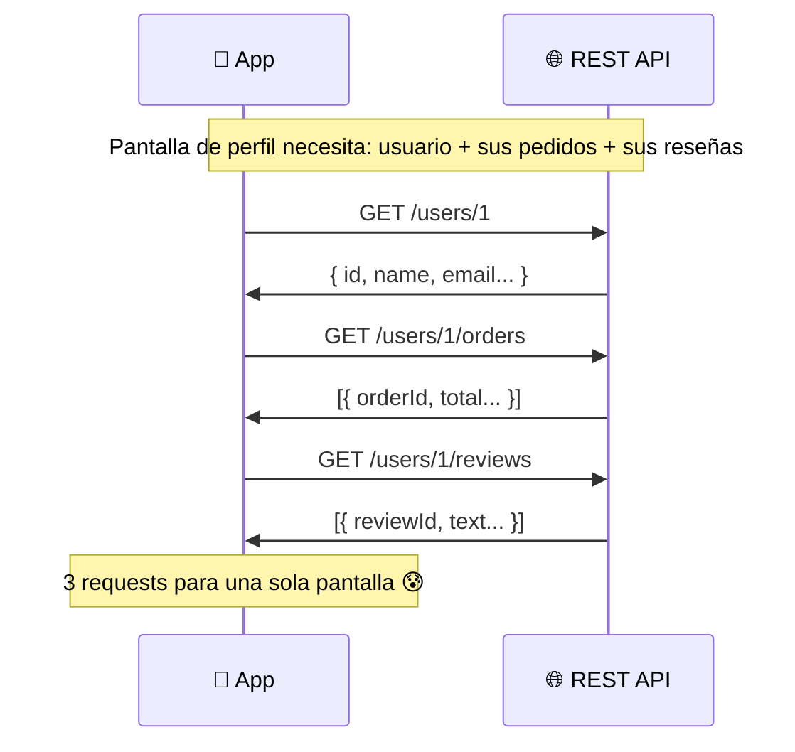

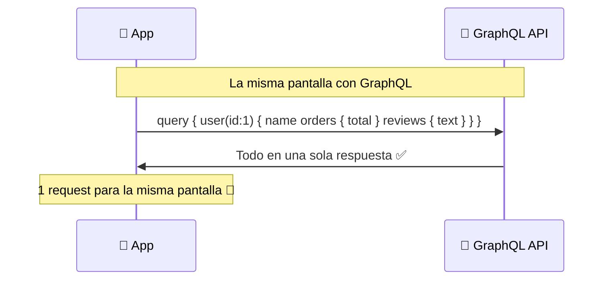

---

## 3. Event-Driven Architecture (Arquitectura Orientada a Eventos)

### La Analogía del Periódico

**Arquitectura tradicional (llamadas directas)**:
Como llamar por teléfono a cada persona para contarles una noticia. Tú llamas a Juan, luego a María, luego a Pedro... Si María no contesta → problema.

**Event-Driven**:
Como publicar una noticia en el periódico. Tú la publicas (evento), y quien quiera enterarse (suscriptores) la lee cuando pueda. Tú no necesitas saber quién la leerá.

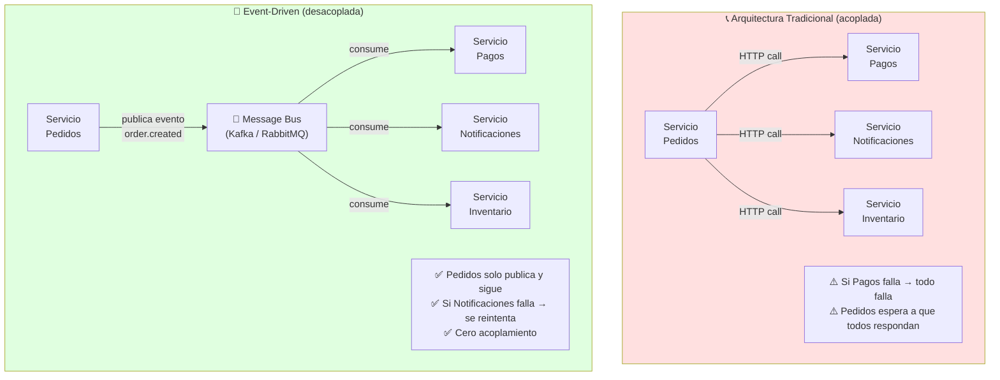

### Kafka vs RabbitMQ — ¿Cuál elegir?

**Kafka = Cinta transportadora de fábrica**
- Los mensajes quedan grabados (log inmutable)
- Puedes "rebobinar" y releer mensajes viejos
- Diseñado para millones de eventos por segundo
- Los consumidores llevan su propio "marcador" de dónde van

**RabbitMQ = Bandeja de entrada de correo**
- El mensaje llega, alguien lo procesa, y desaparece
- Si nadie lo procesa → se puede reencolar o ir a Dead Letter Queue
- Más simple, ideal para tareas de trabajo (job queue)

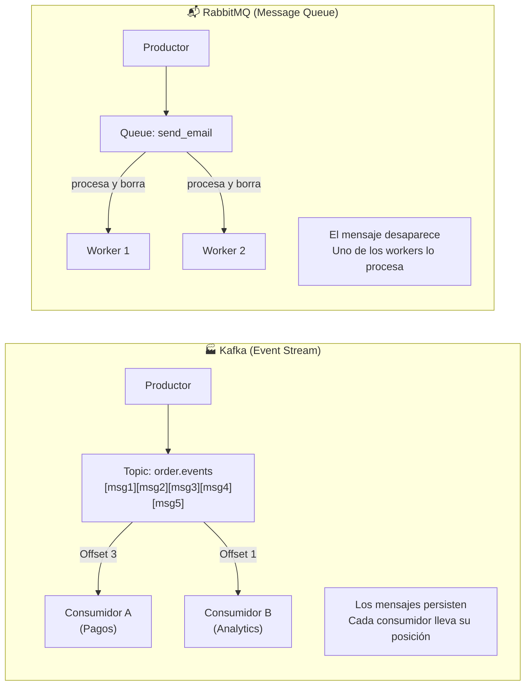

| | Kafka | RabbitMQ |
|---|---|---|
| **Persistencia** | ✅ Días/meses | ⚠️ Hasta que se procesa |
| **Replay** | ✅ Puedes releer | ❌ No |
| **Throughput** | Millones/seg | Miles/seg |
| **Complejidad** | Alta | Media |
| **Ideal para** | Event sourcing, analytics | Tasks, emails, notificaciones |

---

## 4. CQRS (Command Query Responsibility Segregation)

### La Analogía de la Biblioteca

Imagina una biblioteca con dos mostradores:
- **Mostrador de CONSULTAS** 📖: Solo para buscar y leer libros. Muy rápido, hay muchos empleados, la cola es corta.
- **Mostrador de COMANDOS** ✏️: Para devolver, reservar, agregar libros nuevos. Puede ser más lento, pero no afecta a los que solo leen.

**CQRS = separar las operaciones de lectura (Query) de las de escritura (Command)**.

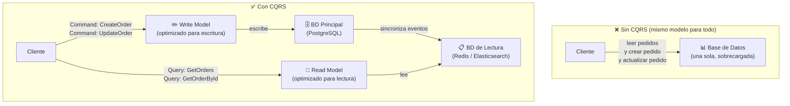

```typescript
// ❌ Sin CQRS: el servicio hace todo
class OrderService {
  async createOrder(dto: CreateOrderDto) { /* escribe */ }
  async getOrders(userId: string) { /* lee */ }
  async getOrderById(id: string) { /* lee */ }
  async updateOrder(id: string, dto: UpdateOrderDto) { /* escribe */ }
}

// ✅ Con CQRS: separado por responsabilidad
// Commands (cambian estado)
class CreateOrderCommand {
  constructor(public readonly userId: string, public readonly items: Item[]) {}
}

class CreateOrderHandler {
  async execute(command: CreateOrderCommand) {
    const order = await this.orderRepo.save(new Order(command));
    await this.eventBus.publish(new OrderCreatedEvent(order.id)); // Emite evento
    return order.id;
  }
}

// Queries (solo leen, sin efectos secundarios)
class GetOrdersQuery {
  constructor(public readonly userId: string) {}
}

class GetOrdersHandler {
  async execute(query: GetOrdersQuery) {
    // Lee desde la BD optimizada para lectura (Redis/Elasticsearch)
    return this.readRepo.findByUserId(query.userId);
  }
}
```

**¿Cuándo tiene sentido?**
- Apps con **muchas más lecturas que escrituras** (redes sociales, catálogos)
- Necesitas **modelos de lectura especializados** (vistas desnormalizadas)
- Sistema con **Event Sourcing** (todo es un evento)

---

## 5. Clean Architecture / Arquitectura Hexagonal

### La Analogía de la Cebolla

Imagina una cebolla: tiene capas, y el núcleo (el centro) no sabe nada de las capas exteriores. Puedes cambiar la capa exterior sin afectar el centro.

**El centro = tu lógica de negocio** (reglas, validaciones, cálculos)
**Las capas exteriores = detalles técnicos** (base de datos, HTTP, Firebase, etc.)

La regla de oro: **las dependencias solo apuntan hacia adentro**, nunca hacia afuera.

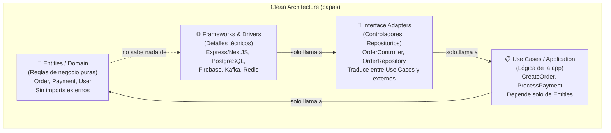

```typescript
// ✅ Clean Architecture en NestJS

// 1. ENTITY (núcleo puro, sin dependencias)
export class Order {
  constructor(
    public readonly id: string,
    public readonly userId: string,
    public readonly items: OrderItem[],
    public status: OrderStatus,
  ) {}

  // Lógica de negocio aquí, no en el servicio
  calculateTotal(): number {
    return this.items.reduce((sum, item) => sum + item.price * item.quantity, 0);
  }

  canBeCancelled(): boolean {
    return this.status === OrderStatus.PENDING;
  }
}

// 2. REPOSITORY INTERFACE (contrato, no implementación)
export abstract class OrderRepository {
  abstract save(order: Order): Promise<Order>;
  abstract findById(id: string): Promise<Order | null>;
  abstract findByUserId(userId: string): Promise<Order[]>;
}

// 3. USE CASE (lógica de la aplicación)
@Injectable()
export class CreateOrderUseCase {
  constructor(
    private readonly orderRepo: OrderRepository, // Interfaz, no implementación
    private readonly eventBus: EventBus,
  ) {}

  async execute(userId: string, items: Item[]): Promise<string> {
    const order = new Order(uuid(), userId, items, OrderStatus.PENDING);
    await this.orderRepo.save(order);
    await this.eventBus.publish(new OrderCreatedEvent(order.id));
    return order.id;
  }
}

// 4. IMPLEMENTACIÓN (capa de infraestructura)
@Injectable()
export class TypeOrmOrderRepository extends OrderRepository {
  // Aquí usas TypeORM, la interfaz no sabe nada de esto
  async save(order: Order): Promise<Order> {
    return this.ormRepo.save(order);
  }
}
```

**El beneficio**: puedes cambiar PostgreSQL por MongoDB, o NestJS por Express, sin tocar nada de tu lógica de negocio.

---

## 6. CAP Theorem

### La Analogía del Banco con Sucursales

Imagina un banco con 3 sucursales (nodos). El teorema CAP dice que **en caso de falla de red, solo puedes garantizar 2 de estas 3 cosas**:

- **C - Consistency (Consistencia)**: Todas las sucursales muestran el mismo saldo
- **A - Availability (Disponibilidad)**: Siempre puedes hacer una transacción
- **P - Partition Tolerance (Tolerancia a Particiones)**: El sistema sigue funcionando aunque una sucursal pierda comunicación

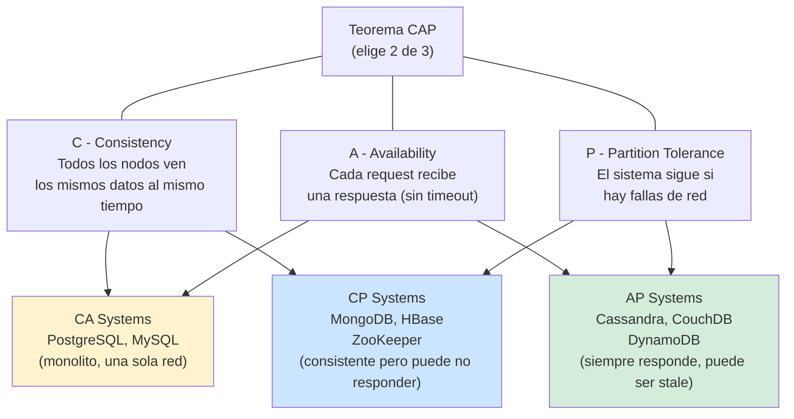

**En la práctica**:
- La **P (tolerancia a particiones)** es casi obligatoria en sistemas distribuidos (la red siempre puede fallar)
- Por eso el dilema real es: **¿Consistencia o Disponibilidad?**
- **CP**: "Prefiero no responder antes que dar datos incorrectos" (ej: transacciones bancarias)
- **AP**: "Prefiero responder aunque los datos no sean los más recientes" (ej: timeline de redes sociales)

---

## 7. Patrones de Resiliencia

### Circuit Breaker — "El Interruptor de Luz"

**Analogía**: El breaker eléctrico de tu casa. Si hay un cortocircuito, el breaker se dispara (abre el circuito) para proteger el resto de la instalación. Después de un tiempo, puedes intentar volver a cerrarlo.

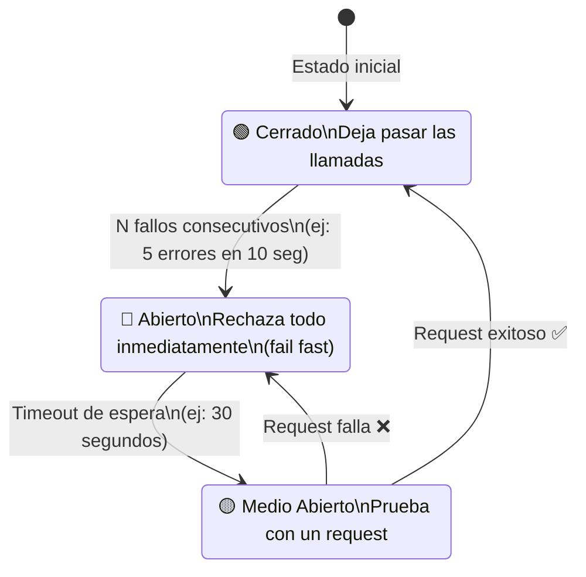

```typescript
// Implementación simple de Circuit Breaker
class CircuitBreaker {
  private failureCount = 0;
  private lastFailureTime: number | null = null;
  private state: 'CLOSED' | 'OPEN' | 'HALF_OPEN' = 'CLOSED';

  constructor(
    private readonly threshold = 5,       // Fallos antes de abrir
    private readonly timeout = 30_000,    // ms antes de probar de nuevo
  ) {}

  async execute<T>(fn: () => Promise<T>): Promise<T> {
    if (this.state === 'OPEN') {
      if (Date.now() - this.lastFailureTime! > this.timeout) {
        this.state = 'HALF_OPEN';
      } else {
        throw new Error('Circuit breaker OPEN: servicio no disponible');
      }
    }

    try {
      const result = await fn();
      this.onSuccess();
      return result;
    } catch (error) {
      this.onFailure();
      throw error;
    }
  }

  private onSuccess() {
    this.failureCount = 0;
    this.state = 'CLOSED';
  }

  private onFailure() {
    this.failureCount++;
    this.lastFailureTime = Date.now();
    if (this.failureCount >= this.threshold) {
      this.state = 'OPEN';
    }
  }
}
```

### Retry con Exponential Backoff — "El Vendedor Persistente"

**Analogía**: Llamas a un cliente, no contesta. Vuelves a llamar en 1 min, luego en 2 min, luego en 4 min... No llamas cada segundo (eso sería molesto y colapsaría el sistema).

```typescript
async function retryWithBackoff<T>(
  fn: () => Promise<T>,
  maxRetries = 3,
  baseDelay = 1000,
): Promise<T> {
  for (let attempt = 0; attempt < maxRetries; attempt++) {
    try {
      return await fn();
    } catch (error) {
      if (attempt === maxRetries - 1) throw error;
      
      // Espera exponencial: 1s, 2s, 4s... + jitter aleatorio
      const delay = baseDelay * Math.pow(2, attempt) + Math.random() * 1000;
      await new Promise(resolve => setTimeout(resolve, delay));
    }
  }
  throw new Error('Max retries exceeded');
}
```

### Bulkhead — "Los Compartimentos del Barco"

**Analogía**: Los barcos tienen compartimentos estancos. Si uno se inunda, los demás no se ven afectados. El barco no se hunde todo.

En software: aislar los recursos (threads, conexiones) entre servicios para que si uno se satura, no afecte a los demás.

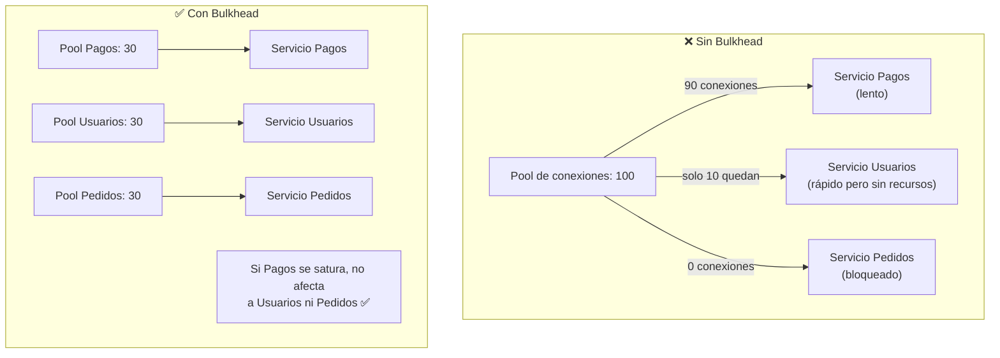

---

## 8. Patrones de Datos

### Saga Pattern — "El Coordinador de la Boda"

**Problema**: En microservicios, una operación que toca varios servicios no puede usar una sola transacción de BD. ¿Cómo garantizas que todo queda consistente?

**Analogía**: Organizar una boda. Reservas el salón, el catering, el fotógrafo, el DJ. Si el fotógrafo cancela → tienes que cancelar todo lo demás en orden. La Saga es el coordinador que sabe qué cancelar y en qué orden.

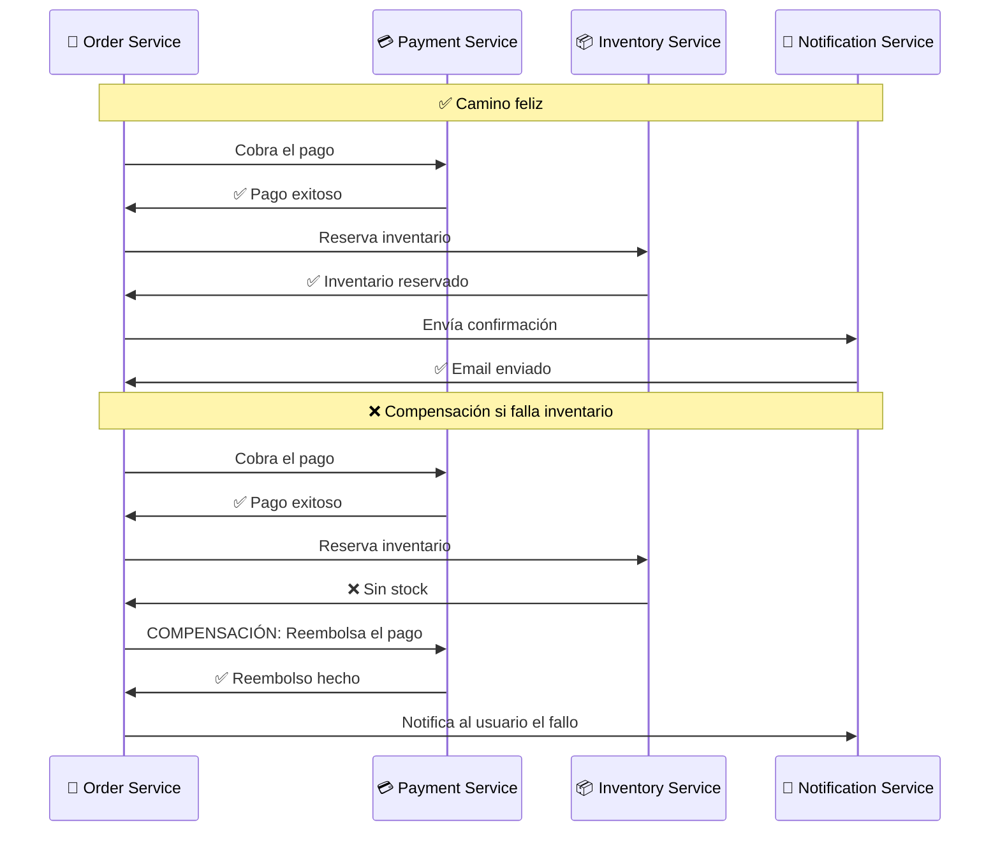

### Event Sourcing — "La Historia Completa"

**Analogía**: En vez de guardar solo el saldo actual de tu cuenta bancaria, guardas **todo el historial de transacciones**: depósito +500, retiro -100, depósito +200... El saldo actual (500+200-100 = 600) se calcula a partir del historial.

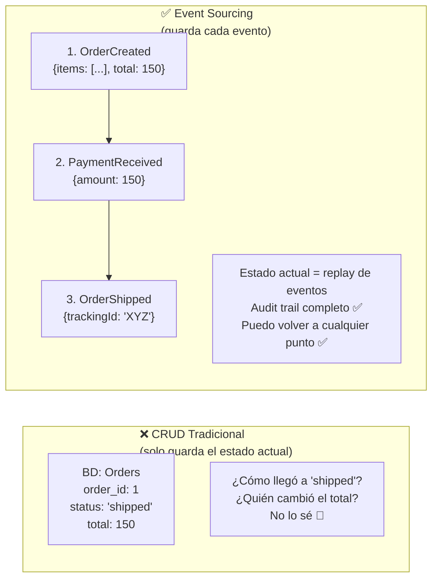

---

## 🗺️ Mapa Mental de Todos los Conceptos

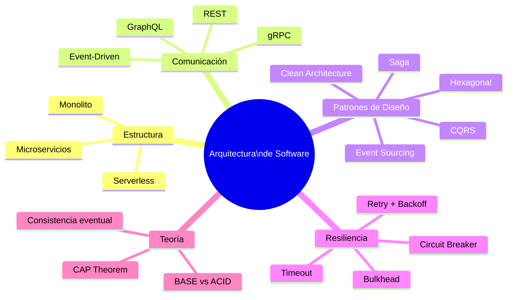

---

## 🧭 ¿Qué patrón usar en cada situación?

| Situación | Patrón recomendado |
|-----------|-------------------|
| App pequeña que crece | Monolito bien estructurado → extraer microservicios cuando duela |
| App con muchas lecturas | CQRS + Read models optimizados |
| Operación distribuida que debe ser atómica | Saga Pattern |
| Necesitas auditoría total de cambios | Event Sourcing |
| Lógica de negocio compleja | Clean Architecture |
| Servicio externo poco confiable | Circuit Breaker + Retry |
| Comunicación entre servicios internos | gRPC o eventos (Kafka) |
| API para clientes móviles complejos | GraphQL |
| API pública simple | REST |

---

## 📌 Resumen de Todo

| Concepto | En una frase |
|----------|-------------|
| **Monolito** | Todo en uno, simple de empezar, difícil de escalar |
| **Microservicios** | Piezas independientes, complejas de operar, fáciles de escalar |
| **REST** | Menú fijo de endpoints, estándar y simple |
| **GraphQL** | Pide exactamente lo que necesitas, ideal para mobile |
| **gRPC** | Comunicación ultrarrápida entre servicios internos |
| **Event-Driven** | Servicios se comunican por eventos, no por llamadas directas |
| **CQRS** | Separa leer de escribir para optimizar cada uno |
| **Clean Architecture** | El negocio en el centro, los detalles técnicos afuera |
| **CAP Theorem** | Distribuido = elige entre consistencia o disponibilidad |
| **Circuit Breaker** | Corta el circuito si un servicio falla, para no cascadear fallos |
| **Saga** | Coordina transacciones distribuidas con compensaciones |
| **Event Sourcing** | Guarda eventos, no estados; el estado se reconstruye |

---

## 🔗 Navegación

👈 [04-Push-Notifications-Para-Dummies.md](./04-Push-Notifications-Para-Dummies.md)  
👈 [01-Firebase-Para-Dummies.md](./01-Firebase-Para-Dummies.md) ← volver al inicio
