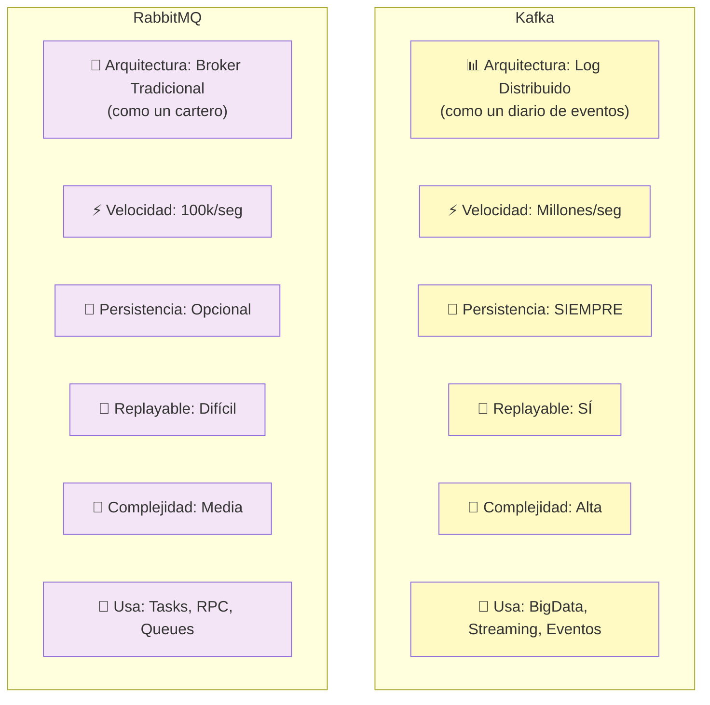
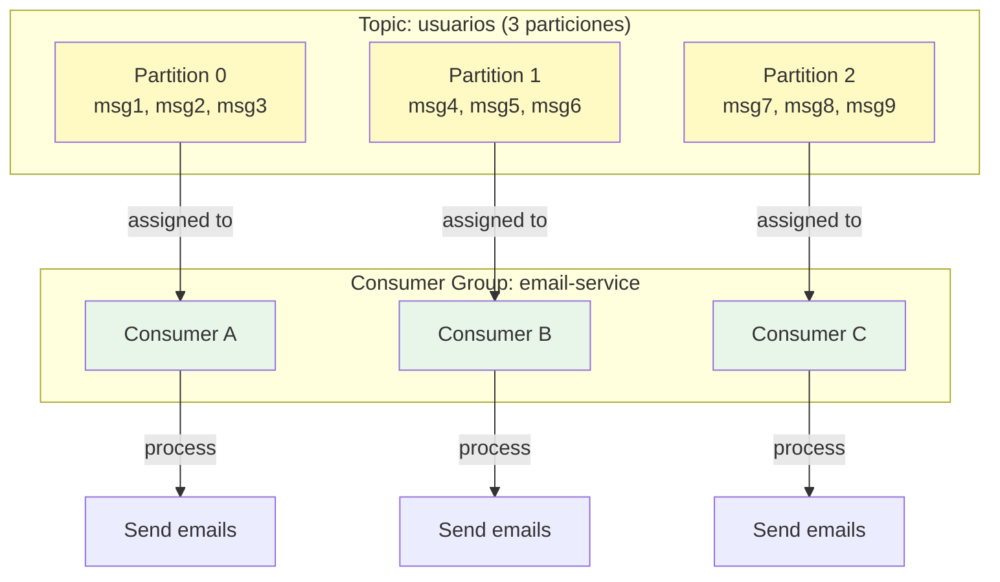
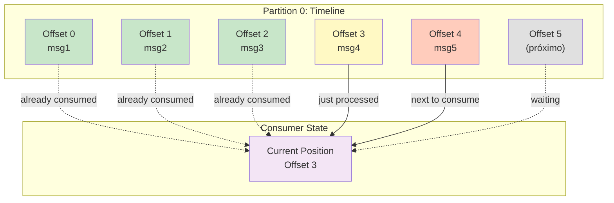
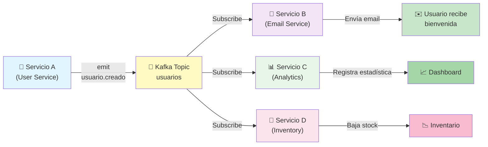
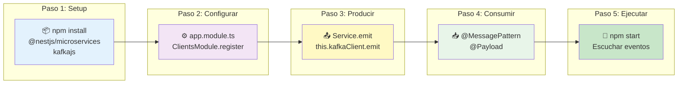
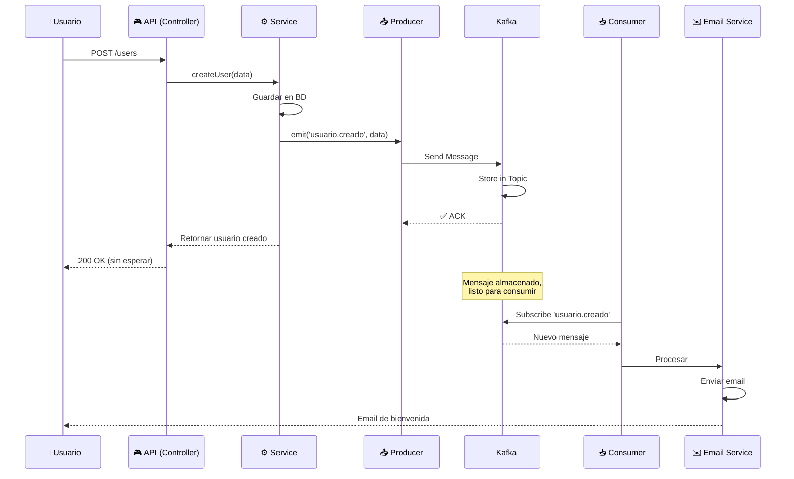
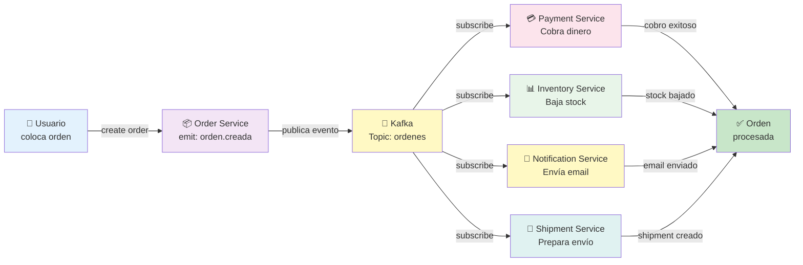
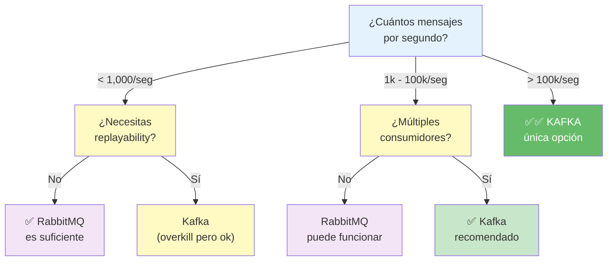
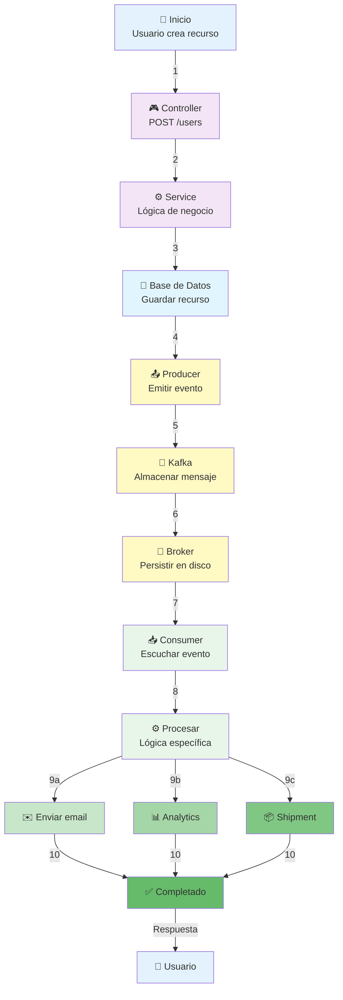

# 📨 Kafka: Message Broker de Alto Rendimiento

## Índice
1. [¿Qué es Kafka? (Explicación Sencilla)](#qué-es-kafka-explicación-sencilla)
2. [Kafka vs RabbitMQ (Comparación Rápida)](#kafka-vs-rabbitmq-comparación-rápida)
3. [Conceptos Clave de Kafka](#conceptos-clave-de-kafka)
4. [Cómo Funciona Kafka](#cómo-funciona-kafka)
5. [Kafka en NestJS](#kafka-en-nestjs)
6. [Ejemplos Prácticos](#ejemplos-prácticos)
7. [Casos de Uso Reales](#casos-de-uso-reales)
8. [Pros y Contras](#pros-y-contras)
9. [Cuándo Usar Kafka](#cuándo-usar-kafka)
10. [Instalación y Setup](#instalación-y-setup)

---

## ¿Qué es Kafka? (Explicación Sencilla)

### 🎯 En Una Frase

**Kafka es un "correo postal electrónico" donde tu aplicación puede enviar mensajes que otros pueden leer después.**

### 📚 Analogía: El Buzón del Correo

Imagina un **buzón de correos gigante** en una estación de tren:

```
┌─────────────────────────────────────────────────────────┐
│                    KAFKA (Buzón)                        │
│                                                         │
│ ┌──────────────┐  ┌──────────────┐  ┌──────────────┐  │
│ │ Mensaje 1    │  │ Mensaje 2    │  │ Mensaje 3    │  │
│ │ De: Servicio │  │ De: Servicio │  │ De: Servicio │  │
│ │ Envío: 10:00 │  │ Envío: 10:05 │  │ Envío: 10:10 │  │
│ └──────────────┘  └──────────────┘  └──────────────┘  │
│                                                         │
└─────────────────────────────────────────────────────────┘
       ↑                                       ↓
   Servicio A                            Servicio B
   Deja mensaje                          Lee mensaje después
```

### 🔄 Diferencia: Síncrono vs Asíncrono

**SIN Kafka (Síncrono - como llamada telefónica):**
```
Servicio A: "Hola, necesito que hagas algo"
Servicio B: "Ok, déjame hacerlo"  (espera...)
Servicio B: "Listo, aquí está"
Servicio A: "Gracias, adiós"

❌ Si Servicio B está ocupado/caído, Servicio A espera o falla
```

**CON Kafka (Asíncrono - como email):**
```
Servicio A: "Aquí dejo un mensaje" (listo, se va)
Servicio B: Lee el mensaje cuando puede
Servicio B: Procesa el mensaje
Servicio B: "Hecho"

✅ Servicio A no espera
✅ Si Servicio B está ocupado, lee después
✅ Si se cae, el mensaje sigue ahí
```

### 🎯 Características Principales

| Característica | Qué es | Beneficio |
|---|---|---|
| **Asíncrono** | Envías mensajes sin esperar respuesta | Aplicación rápida, no se bloquea |
| **Persistente** | Los mensajes se guardan en disco | No pierdes datos si algo falla |
| **Distribuido** | Funciona en múltiples servidores | Escalable, sin punto único de fallo |
| **Alto rendimiento** | Millones de mensajes por segundo | Puede con cualquier volumen |
| **Replayable** | Puedes releer mensajes antiguos | Debugging, auditoría, recuperación |

### 🔌 Instalación Rápida

```bash
# Con Docker (recomendado)
docker-compose up -d zookeeper kafka

# Con Kafka descargado localmente
bin/kafka-server-start.sh config/server.properties
```

---

## Kafka vs RabbitMQ (Comparación Rápida)

### 📊 Comparación Visual



### 📊 Tabla Comparativa

| Aspecto | Kafka | RabbitMQ |
|--------|-------|----------|
| **Arquitectura** | Log distribuido | Broker de mensajes tradicional |
| **Rendimiento** | Millones/seg | Cientos de miles/seg |
| **Persistencia** | Siempre persiste | Opcional |
| **Replayable** | Sí, releer antiguo | No fácilmente |
| **Latencia** | Media (ms) | Muy baja (μs) |
| **Complejidad** | Más complejo | Más simple |
| **Caso ideal** | Big data, streaming | Tasks, RPC |
| **Curva aprendizaje** | Empinada | Suave |

### 🎯 ¿Cuál elegir?

```
ELIGE KAFKA si necesitas:
✅ Procesar millones de mensajes
✅ Guardar histórico de eventos
✅ Múltiples consumidores para mismo mensaje
✅ Recuperarte de fallos
✅ Stream en tiempo real

ELIGE RabbitMQ si necesitas:
✅ Algo simple y rápido de configurar
✅ Baja latencia en tasks
✅ Routing complejo de mensajes
✅ Confirmación de entrega garantizada
✅ Algo más "tradicional"
```

---

## Conceptos Clave de Kafka

### 1️⃣ Topic (Tema)

Un **topic** es como un canal de TV. Cada canal tiene su propio contenido.

```
┌─────────────────────────────────┐
│ Topic: "usuarios"               │
│ (Eventos de usuarios)           │
│ • usuario.creado                │
│ • usuario.actualizado           │
│ • usuario.eliminado             │
└─────────────────────────────────┘

┌─────────────────────────────────┐
│ Topic: "ordenes"                │
│ (Eventos de ordenes)            │
│ • orden.creada                  │
│ • orden.pagada                  │
│ • orden.completada              │
└─────────────────────────────────┘
```

**En código:**
```typescript
// Publicar a un topic
await kafka.send({
  topic: 'usuarios',
  messages: [
    { value: JSON.stringify({ id: 1, name: 'Juan' }) }
  ]
});
```

### 2️⃣ Producer (Productor)

El que **envía mensajes** a Kafka.

```
Servicio A → Producer → Kafka Topic
              ↓
           "Aquí va un mensaje"
```

**Ejemplo:**
```typescript
const producer = kafka.producer();
await producer.send({
  topic: 'usuarios',
  messages: [{ value: 'nuevo usuario' }]
});
```

### 3️⃣ Consumer (Consumidor)

El que **lee mensajes** de Kafka.

```
Kafka Topic → Consumer → Servicio B
               ↓
           "Procesando mensaje"
```

**Ejemplo:**
```typescript
const consumer = kafka.consumer({ groupId: 'grupo-1' });
await consumer.subscribe({ topic: 'usuarios' });
await consumer.run({
  eachMessage: async ({ message }) => {
    console.log('Mensaje recibido:', message.value);
  }
});
```

### 4️⃣ Consumer Group (Grupo de Consumidores)

Un **grupo de consumidores** trabaja juntos para procesar mensajes.



**Características:**
```
✅ Distribuye trabajo automáticamente
✅ Si Consumer A falla, Consumer B toma su partición
✅ Escala horizontalmente (más consumidores = más paralelismo)
```

### 5️⃣ Partition (Partición)

Una **partición** es una subdivisión de un topic para paralelismo.

```
Topic: "usuarios" (3 particiones)

Partition 0: [msg1] → [msg5] → [msg9]    ←  Consumer A
Partition 1: [msg2] → [msg6] → [msg10]   ←  Consumer B
Partition 2: [msg3] → [msg7] → [msg11]   ←  Consumer C

✅ Cada consumidor procesa su partición en paralelo
✅ Más particiones = más paralelismo
```

### 6️⃣ Offset (Posición)

El **número de posición** del mensaje en una partición.



**Importante:**
```typescript
// Kafka recuerda dónde estabas
// Si el consumer falla y se reinicia,
// continúa desde donde se quedó (offset)

✅ No pierdes mensajes
✅ Puedes releer eventos antiguos
✅ Debugging y auditoría fácil
```

---

## Cómo Funciona Kafka

### 📊 Flujo Completo



### 📋 Paso a Paso:

```
┌─────────────────────────────────────────────────┐
│ PASO 1: Producción de Mensajes                  │
│                                                 │
│ Servicio A: "Nuevo usuario creado"             │
│              └─→ Producer → Kafka Topic         │
└─────────────────────────────────────────────────┘
                      ↓
┌─────────────────────────────────────────────────┐
│ PASO 2: Almacenamiento Persistente              │
│                                                 │
│ Kafka guarda el mensaje en disco                │
│ Topic: usuarios                                 │
│ Partition 0:                                    │
│ └─→ Offset 0: { id: 1, name: "Juan" }         │
└─────────────────────────────────────────────────┘
                      ↓
┌─────────────────────────────────────────────────┐
│ PASO 3: Consumo de Mensajes                     │
│                                                 │
│ Servicio B subscribe a "usuarios"              │
│ Consumer Group: "email-service"                 │
│ Lee y procesa: Envía email de bienvenida       │
│                                                 │
│ Servicio C subscribe a "usuarios"              │
│ Consumer Group: "analytics-service"             │
│ Lee y procesa: Registra estadísticas           │
└─────────────────────────────────────────────────┘
```

### 🔄 Garantías de Entrega

```
┌─────────────────────────────────────┐
│ 1. At Most Once (como mucho una vez)│
│                                     │
│ Mensaje se pierde si falla         │
│ Pero NO se procesa 2 veces         │
│ Velocidad: ⚡⚡⚡⚡⚡                │
│ Confiabilidad: ⚠️ Baja             │
└─────────────────────────────────────┘

┌─────────────────────────────────────┐
│ 2. At Least Once (al menos una vez) │
│                                     │
│ Mensaje SIEMPRE se procesa          │
│ Pero podría procesarse 2 veces      │
│ Velocidad: ⚡⚡⚡                    │
│ Confiabilidad: ✅ Buena             │
└─────────────────────────────────────┘

┌─────────────────────────────────────┐
│ 3. Exactly Once (exactamente una vez)│
│                                     │
│ Mensaje SIEMPRE se procesa UNA vez  │
│ Perfecto, pero lento                │
│ Velocidad: ⚡                       │
│ Confiabilidad: ✅✅ Excelente       │
└─────────────────────────────────────┘
```

---

## Kafka en NestJS

### 📊 Arquitectura: Kafka + NestJS

```mermaid
graph TB
    subgraph "Cliente HTTP"
        USER["👤 Usuario"]
    end
    
    subgraph "NestJS Service A (Producer)"
        CTRL["🎮 Controller"]
        SRV["⚙️ Service"]
        PROD["📤 Producer"]
    end
    
    subgraph "Kafka Cluster"
        BROKER["🏢 Broker"]
        TOPIC["📨 Topic: usuarios"]
        PART0["📌 Partition 0"]
        PART1["📌 Partition 1"]
    end
    
    subgraph "NestJS Service B (Consumer)"
        CONS["📥 Consumer"]
        EMAIL["✉️ Email Service"]
    end
    
    subgraph "NestJS Service C (Consumer)"
        CONS2["📥 Consumer"]
        ANALYTICS["📊 Analytics"]
    end
    
    USER -->|POST /users| CTRL
    CTRL -->|createUser()| SRV
    SRV -->|emit()| PROD
    PROD -->|send messages| BROKER
    BROKER -->|stores| TOPIC
    TOPIC --> PART0
    TOPIC --> PART1
    
    PART0 -->|subscribe| CONS
    PART1 -->|subscribe| CONS2
    
    CONS -->|process| EMAIL
    CONS2 -->|process| ANALYTICS
    
    EMAIL -->|send| USER
    
    style USER fill:#e3f2fd
    style CTRL fill:#f3e5f5
    style SRV fill:#f3e5f5
    style PROD fill:#fff9c4
    style BROKER fill:#fff9c4
    style TOPIC fill:#fff9c4
    style CONS fill:#e8f5e9
    style CONS2 fill:#e8f5e9
    style EMAIL fill:#c8e6c9
    style ANALYTICS fill:#a5d6a7
```

### 📦 Instalación

```bash
npm install @nestjs/microservices kafkajs

# O con el transportador de Kafka
npm install kafkajs
```

### 🔄 5 Pasos para Integrar Kafka en NestJS



### 🔧 Configuración Básica

```typescript
// app.module.ts
import { Module } from '@nestjs/common';
import { ClientsModule, Transport } from '@nestjs/microservices';

@Module({
  imports: [
    ClientsModule.register([
      {
        name: 'KAFKA_SERVICE',
        transport: Transport.KAFKA,
        options: {
          client: {
            clientId: 'mi-app',
            brokers: ['localhost:9092'],
          },
          consumer: {
            groupId: 'mi-app-consumer-group',
          },
        },
      },
    ]),
  ],
})
export class AppModule {}
```

### 📤 Enviar Mensajes (Producer)

```typescript
// user.service.ts
import { Injectable, Inject } from '@nestjs/common';
import { ClientKafka } from '@nestjs/microservices';

@Injectable()
export class UserService {

  constructor(
    @Inject('KAFKA_SERVICE')
    private kafkaClient: ClientKafka
  ) {}

  async createUser(name: string, email: string) {
    // Crear usuario en BD
    const user = { id: 1, name, email };

    // Enviar evento a Kafka
    await this.kafkaClient.emit(
      'usuario.creado',  // topic
      {
        id: user.id,
        name: user.name,
        email: user.email,
        timestamp: new Date()
      }
    );

    return user;
  }

  async updateUser(id: number, data: any) {
    // Actualizar en BD
    const updatedUser = { id, ...data };

    // Publicar evento
    this.kafkaClient.emit('usuario.actualizado', updatedUser);

    return updatedUser;
  }
}
```

### 📥 Recibir Mensajes (Consumer)

```typescript
// notification.controller.ts
import { Controller } from '@nestjs/common';
import { MessagePattern, Payload } from '@nestjs/microservices';

@Controller()
export class NotificationController {

  // Escucha el evento 'usuario.creado'
  @MessagePattern('usuario.creado')
  async onUserCreated(@Payload() user: any) {
    console.log('Nuevo usuario creado:', user);
    
    // Enviar email de bienvenida
    await this.sendWelcomeEmail(user.email);
  }

  // Escucha múltiples eventos
  @MessagePattern('usuario.actualizado')
  async onUserUpdated(@Payload() user: any) {
    console.log('Usuario actualizado:', user);
    
    // Actualizar caché, notificaciones, etc.
    await this.updateUserCache(user.id);
  }

  private async sendWelcomeEmail(email: string) {
    console.log(`Enviando email de bienvenida a ${email}`);
    // Lógica de envío
  }

  private async updateUserCache(userId: number) {
    console.log(`Actualizando caché del usuario ${userId}`);
    // Lógica de caché
  }
}
```

### 🔄 Flujo Completo: De Código a Ejecución



### 🎯 Microservicio Completo con Kafka

```typescript
// user.module.ts
import { Module } from '@nestjs/common';
import { ClientsModule, Transport } from '@nestjs/microservices';
import { UserController } from './user.controller';
import { UserService } from './user.service';

@Module({
  imports: [
    ClientsModule.register([
      {
        name: 'KAFKA_SERVICE',
        transport: Transport.KAFKA,
        options: {
          client: {
            clientId: 'usuarios-service',
            brokers: ['localhost:9092'],
          },
          consumer: {
            groupId: 'usuarios-group',
          },
        },
      },
    ]),
  ],
  controllers: [UserController],
  providers: [UserService],
})
export class UserModule {}

// app.module.ts
import { Module } from '@nestjs/common';
import { UserModule } from './user/user.module';

@Module({
  imports: [UserModule],
})
export class AppModule {}
```

---

## Ejemplos Prácticos

### 1️⃣ Ejemplo: Sistema de Notificaciones

```typescript
// events/user-created.event.ts
export interface UserCreatedEvent {
  id: number;
  email: string;
  name: string;
  createdAt: Date;
}

// user.service.ts
@Injectable()
export class UserService {
  constructor(
    @Inject('KAFKA_SERVICE')
    private kafkaClient: ClientKafka,
    private userRepository: Repository<User>
  ) {}

  async createUser(createUserDto: CreateUserDto): Promise<User> {
    // 1. Guardar en BD
    const user = await this.userRepository.save(createUserDto);

    // 2. Publicar evento
    const event: UserCreatedEvent = {
      id: user.id,
      email: user.email,
      name: user.name,
      createdAt: user.createdAt,
    };

    await this.kafkaClient.emit('usuario.creado', event);

    return user;
  }
}

// notification.controller.ts
@Controller()
export class NotificationController {

  constructor(
    private emailService: EmailService
  ) {}

  @MessagePattern('usuario.creado')
  async handleUserCreated(@Payload() data: UserCreatedEvent) {
    // Enviar email de bienvenida
    await this.emailService.sendWelcomeEmail(
      data.email,
      data.name
    );

    console.log(`Email enviado a ${data.email}`);
  }
}
```

### 2️⃣ Ejemplo: Sistema de Auditoría

```typescript
// audit.controller.ts
@Controller()
export class AuditController {

  constructor(
    private auditService: AuditService
  ) {}

  @MessagePattern('*.creado')  // Escucha cualquier evento "*.creado"
  async auditCreate(@Payload() data: any) {
    await this.auditService.log({
      action: 'CREATE',
      entity: data,
      timestamp: new Date(),
    });
  }

  @MessagePattern('*.actualizado')
  async auditUpdate(@Payload() data: any) {
    await this.auditService.log({
      action: 'UPDATE',
      entity: data,
      timestamp: new Date(),
    });
  }

  @MessagePattern('*.eliminado')
  async auditDelete(@Payload() data: any) {
    await this.auditService.log({
      action: 'DELETE',
      entity: data,
      timestamp: new Date(),
    });
  }
}
```

### 3️⃣ Ejemplo: Procesamiento de Ordenes

```typescript
// order.service.ts
@Injectable()
export class OrderService {

  constructor(
    @Inject('KAFKA_SERVICE')
    private kafkaClient: ClientKafka,
    private orderRepository: Repository<Order>
  ) {}

  async createOrder(createOrderDto: CreateOrderDto): Promise<Order> {
    // 1. Crear orden
    const order = await this.orderRepository.save(createOrderDto);

    // 2. Publicar evento
    await this.kafkaClient.emit('orden.creada', {
      id: order.id,
      userId: order.userId,
      items: order.items,
      total: order.total,
    });

    return order;
  }

  async completeOrder(orderId: number): Promise<Order> {
    const order = await this.orderRepository.findOne(orderId);
    order.status = 'completed';
    await this.orderRepository.save(order);

    // Notificar a otros servicios
    await this.kafkaClient.emit('orden.completada', {
      id: order.id,
      userId: order.userId,
    });

    return order;
  }
}

// payment.controller.ts
@Controller()
export class PaymentController {

  constructor(
    private paymentService: PaymentService
  ) {}

  @MessagePattern('orden.creada')
  async processPayment(@Payload() order: any) {
    console.log('Procesando pago para orden:', order.id);
    
    // Procesar pago
    const result = await this.paymentService.charge(order.total);
    
    if (result.success) {
      console.log('Pago exitoso');
    }
  }
}

// shipment.controller.ts
@Controller()
export class ShipmentController {

  constructor(
    private shipmentService: ShipmentService
  ) {}

  @MessagePattern('orden.completada')
  async shipOrder(@Payload() order: any) {
    console.log('Enviando orden:', order.id);
    
    // Crear shipment
    await this.shipmentService.createShipment(order.id);
  }
}
```

---

## Casos de Uso Reales

### 🏪 E-Commerce



**Ventajas:**
- ✅ Cada servicio es independiente
- ✅ Si Payment falla, Inventory sigue procesando
- ✅ Fácil agregar nuevos servicios (ej: Analytics)
- ✅ Escalable horizontalmente

### 🏨 Sistema de Reservas

```
Cliente reserva hotel
       ↓
reservation-service: "reserva.creada"
       ↓
    ┌──────┬─────────┬────────┐
    ↓      ↓         ↓        ↓
payment  email    inventory  analytics
service  service  service    service
```

### 📊 Big Data / Analytics

```
Millones de eventos de usuarios
       ↓
Enviados a Kafka
       ↓
Consumidos por:
- Base de datos: Análisis histórico
- Real-time dashboard: Métricas en vivo
- Machine Learning: Entrenar modelos
```

### 💬 Chat en Tiempo Real

```
Usuario A envía mensaje
       ↓
message-service publica: "mensaje.enviado"
       ↓
Kafka distribuye a:
- Usuario B (leer en tiempo real)
- Database (guardar)
- Search index (indexar)
- Analytics (contar mensajes)
```

---

## Pros y Contras

### ✅ Ventajas de Kafka

| Ventaja | Explicación |
|---------|-------------|
| **Escalabilidad** | Millones de mensajes/seg sin problema |
| **Persistencia** | Los mensajes no se pierden |
| **Replayable** | Puedes releer eventos antiguos |
| **Múltiples consumidores** | Muchos servicios consumen el mismo mensaje |
| **Tolerancia a fallos** | Si algo falla, el mensaje sigue ahí |
| **Bajo acoplamiento** | Los servicios no se conocen entre sí |
| **Auditoría** | Historial completo de eventos |
| **Paralelismo** | Procesa múltiples particiones en paralelo |

### ❌ Desventajas de Kafka

| Desventaja | Explicación |
|------------|-------------|
| **Complejidad** | Más difícil de entender y configurar |
| **Overhead operacional** | Necesitas mantener cluster Kafka |
| **Infraestructura** | Requiere más recursos que RabbitMQ |
| **Curva aprendizaje** | Lleva tiempo dominar los conceptos |
| **Debugging** | Mensajes distribuidos, difícil debuggear |
| **Correctitud de datos** | Posibles duplicados (dependiendo de garantías) |
| **Costo** | Más caro en infraestructura |

### 📊 Resumen: Pros vs Contras

```
┌─────────────────────────────────────┐
│ KAFKA = Complejo pero Poderoso      │
│                                     │
│ Pros: ✅✅✅✅✅                    │
│ Contras: ⚠️⚠️⚠️                    │
│                                     │
│ Mejor para: Escala masiva           │
└─────────────────────────────────────┘

┌─────────────────────────────────────┐
│ RabbitMQ = Simple pero Limitado     │
│                                     │
│ Pros: ✅✅✅                        │
│ Contras: ⚠️⚠️⚠️⚠️⚠️                │
│                                     │
│ Mejor para: Proyectos pequeños      │
└─────────────────────────────────────┘
```

---

## Cuándo Usar Kafka

### ✅ Usa Kafka cuando:

```
1️⃣ ALTO VOLUMEN DE MENSAJES
   Millones de eventos por segundo
   Ejemplo: Red social con millones de usuarios

2️⃣ MÚLTIPLES CONSUMIDORES
   Muchos servicios necesitan el mismo mensaje
   Ejemplo: Orden → Pago, Inventario, Email, Shipping

3️⃣ PROCESAMIENTO EN TIEMPO REAL
   Necesitas stream de datos vivo
   Ejemplo: Dashboard en vivo, alertas en tiempo real

4️⃣ HISTÓRICO Y REPLAYABILITY
   Necesitas releer eventos antiguos
   Ejemplo: Auditoría, debugging, machine learning

5️⃣ DESACOPLAMIENTO
   Servicios no deben conocerse entre sí
   Ejemplo: Arquitectura de microservicios

6️⃣ TOLERANCIA A FALLOS
   Los mensajes no pueden perderse
   Ejemplo: Sistema de pagos, pedidos

7️⃣ ESCALABILIDAD FUTURA
   Tu aplicación va a crecer mucho
   Ejemplo: Startup que espera explotar
```

### ❌ NO uses Kafka para:

```
1️⃣ RPC (Llamadas remotas)
   Necesitas respuesta inmediata
   ❌ Kafka es asíncrono (usa REST/gRPC)

2️⃣ Búsquedas complejas
   Necesitas query de datos
   ❌ Kafka no es base de datos

3️⃣ Confirmación inmediata
   El usuario necesita saber "ya está listo"
   ❌ Kafka introduce latencia

4️⃣ Proyecto pequeño
   ❌ Demasiada complejidad para poco uso

5️⃣ Tasks simples
   Ejecutar una acción simple
   ✅ (Usa RabbitMQ, es más fácil)
```

### 🎯 Decision Tree (Árbol de Decisión)



---

## Instalación y Setup

### 🐳 Con Docker (Recomendado)

```yaml
# docker-compose.yml
version: '3.8'

services:
  zookeeper:
    image: confluentinc/cp-zookeeper:7.3.0
    environment:
      ZOOKEEPER_CLIENT_PORT: 2181

  kafka:
    image: confluentinc/cp-kafka:7.3.0
    depends_on:
      - zookeeper
    ports:
      - "9092:9092"
    environment:
      KAFKA_BROKER_ID: 1
      KAFKA_ZOOKEEPER_CONNECT: zookeeper:2181
      KAFKA_ADVERTISED_LISTENERS: PLAINTEXT://kafka:29092,PLAINTEXT_HOST://localhost:9092
      KAFKA_LISTENER_SECURITY_PROTOCOL_MAP: PLAINTEXT:PLAINTEXT,PLAINTEXT_HOST:PLAINTEXT
      KAFKA_INTER_BROKER_LISTENER_NAME: PLAINTEXT
      KAFKA_OFFSETS_TOPIC_REPLICATION_FACTOR: 1

  kafka-ui:
    image: provectuslabs/kafka-ui:latest
    ports:
      - "8080:8080"
    environment:
      KAFKA_CLUSTERS_0_NAME: local
      KAFKA_CLUSTERS_0_BOOTSTRAPSERVERS: kafka:29092
      KAFKA_CLUSTERS_0_ZOOKEEPER: zookeeper:2181
    depends_on:
      - kafka
```

**Ejecutar:**
```bash
docker-compose up -d

# Kafka estará en: localhost:9092
# Kafka UI estará en: http://localhost:8080
```

### 📝 Crear Topic

```bash
# Con Docker
docker exec kafka kafka-topics --create \
  --bootstrap-server kafka:9092 \
  --topic usuarios \
  --partitions 3 \
  --replication-factor 1

# Listar topics
docker exec kafka kafka-topics --list \
  --bootstrap-server kafka:9092
```

### 🔧 Configuración NestJS Completa

```typescript
// app.module.ts
import { Module } from '@nestjs/common';
import { ClientsModule, Transport } from '@nestjs/microservices';
import { TypeOrmModule } from '@nestjs/typeorm';
import { UserModule } from './user/user.module';
import { NotificationModule } from './notification/notification.module';

@Module({
  imports: [
    // Database
    TypeOrmModule.forRoot({
      type: 'postgres',
      host: 'localhost',
      port: 5432,
      database: 'miapp',
      username: 'postgres',
      password: 'password',
      entities: ['src/**/*.entity.ts'],
      synchronize: true,
    }),

    // Kafka
    ClientsModule.register([
      {
        name: 'KAFKA_SERVICE',
        transport: Transport.KAFKA,
        options: {
          client: {
            clientId: 'mi-app',
            brokers: ['localhost:9092'],
          },
          consumer: {
            groupId: 'mi-app-group',
            allowAutoTopicCreation: true,
          },
        },
      },
    ]),

    UserModule,
    NotificationModule,
  ],
})
export class AppModule {}
```

---

## 📊 Diagrama de Ciclo Completo

### El Viaje de un Mensaje en Kafka + NestJS



### 🔑 Puntos Clave en el Diagrama:

```
1-4: ESCRITURA EN BD (Síncrono - espera respuesta)
     └─→ El usuario ve "Creado" en ~100ms

5-7: PUBLICACIÓN EN KAFKA (Asíncrono - no espera)
     └─→ El usuario ya tiene su respuesta

8-10: CONSUMO (Asíncrono - procesa después)
      └─→ Otros servicios procesan cuando pueden
      └─→ Si uno falla, otro sigue trabajando
```

---

## 🎓 Resumen Rápido

### ¿Qué es Kafka?
Un **mensaje broker** que permite comunicación **asíncrona** entre servicios.

### Conceptos clave:
- **Topic**: Canal de mensajes
- **Producer**: Envía mensajes
- **Consumer**: Lee mensajes
- **Partition**: Paralelismo
- **Offset**: Posición del mensaje

### Cómo usar en NestJS:
```typescript
// Enviar (emit)
this.kafkaClient.emit('usuario.creado', data);

// Recibir (listen)
@MessagePattern('usuario.creado')
async handle(@Payload() data) { }
```

### Cuándo usar:
✅ Alto volumen
✅ Múltiples consumidores
✅ Tiempo real
✅ Histórico
✅ Desacoplamiento

### Cuándo NO usar:
❌ RPC/Llamadas inmediatas
❌ Proyecto pequeño
❌ Datos no críticos

---

#### ¿Cuál es la diferencia principal entre Kafka y RabbitMQ?

Kafka es un log distribuido de eventos: los mensajes se persisten en disco y cualquier consumer puede releerlos desde cualquier punto del tiempo (por offset). Es ideal para event sourcing, audit logs y streaming de alto volumen.

RabbitMQ es un broker de mensajes clásico: entrega el mensaje al consumer y lo elimina. Soporta routing complejo mediante exchanges (direct, fanout, topic, headers). Es ideal para colas de trabajo, patrones RPC y comunicación entre microservicios.

Regla rápida: si necesitas replay de eventos o altísimo throughput → Kafka. Si necesitas routing flexible o tasks distribuidas → RabbitMQ.

## 📚 Recursos Útiles

- [Documentación Kafka Oficial](https://kafka.apache.org/)
- [NestJS Kafka Docs](https://docs.nestjs.com/microservices/kafka)
- [Kafka en Español](https://platzi.com/cursos/kafka/)
- [KafkaJS (cliente JS)](https://kafka.js.org/)

---

**Recuerda:** Kafka es como un "correo postal electrónico". Los servicios no esperan respuesta, solo dejan mensajes en el buzón.
