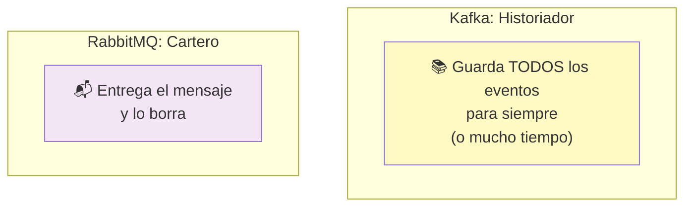
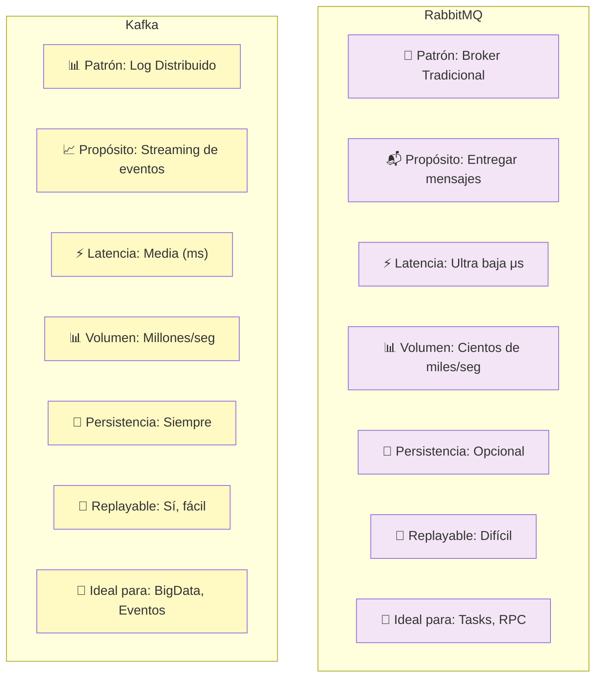
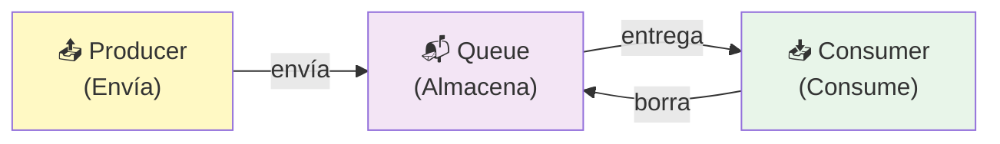
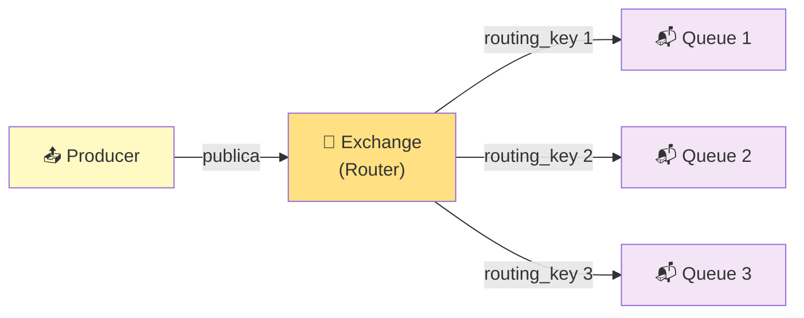
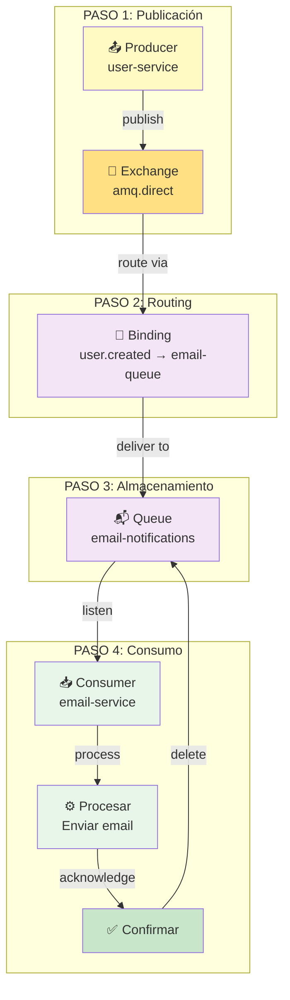
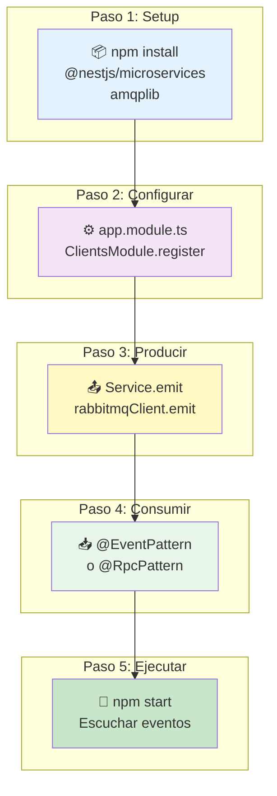
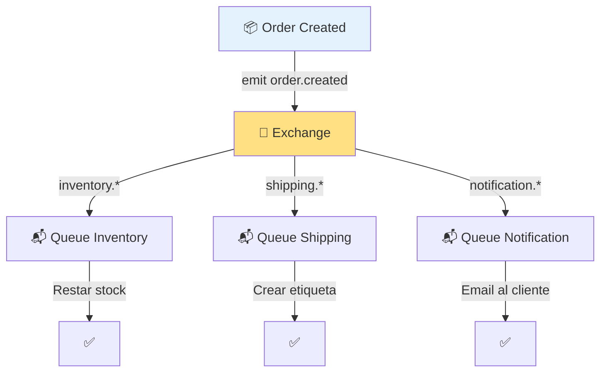
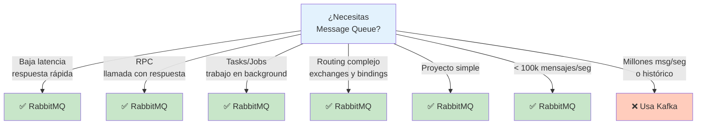

# 🐰 RabbitMQ: Message Broker Simple y Potente

## Índice
1. [¿Qué es RabbitMQ? (Explicación Sencilla)](#qué-es-rabbitmq-explicación-sencilla)
2. [RabbitMQ vs Kafka (Comparación Rápida)](#rabbitmq-vs-kafka-comparación-rápida)
3. [Conceptos Clave de RabbitMQ](#conceptos-clave-de-rabbitmq)
4. [Cómo Funciona RabbitMQ](#cómo-funciona-rabbitmq)
5. [RabbitMQ en NestJS](#rabbitmq-en-nestjs)
6. [Ejemplos Prácticos](#ejemplos-prácticos)
7. [Casos de Uso Reales](#casos-de-uso-reales)
8. [Pros y Contras](#pros-y-contras)
9. [Cuándo Usar RabbitMQ](#cuándo-usar-rabbitmq)
10. [Instalación y Setup](#instalación-y-setup)

---

## ¿Qué es RabbitMQ? (Explicación Sencilla)

### 🎯 En Una Frase

**RabbitMQ es un "cartero inteligente" que entrega mensajes entre aplicaciones de forma rápida y confiable.**

### 📚 Analogía: El Cartero

Imagina un **cartero que trabaja en tu empresa**:

```
┌─────────────────────────────────────────────────────────┐
│                  RabbitMQ (Cartero)                     │
│                                                         │
│  Department A: "Aquí va una carta para Dep B"          │
│        ↓                                                │
│  Cartero: "Ok, la llevo ahora mismo"                   │
│        ↓                                                │
│  Department B: "Gracias, la recibí"                    │
│        ↓                                                │
│  Cartero se va al siguiente trabajo                    │
│                                                         │
└─────────────────────────────────────────────────────────┘
```

**Características:**
- ✅ El cartero es **rápido** (baja latencia)
- ✅ **Confirma** que entregó el mensaje
- ✅ Si alguien no está, espera o reintenta
- ✅ Puede hacer **routing inteligente**
- ✅ Los mensajes se **procesan y descartan** (no se guardan para siempre)

### 🔄 Diferencia: Kafka vs RabbitMQ



### 🎯 Características Principales

| Característica | Qué es | Beneficio |
|---|---|---|
| **Simple** | Fácil de entender y usar | Rápido de aprender |
| **Confiable** | Confirmación de entrega | No pierdes mensajes |
| **Rápido** | Baja latencia (microsegundos) | Respuestas inmediatas |
| **Flexible** | Múltiples routing patterns | RPC, pub/sub, queues |
| **No persistente (por defecto)** | Mensajes se descartan | Usa menos RAM |
| **AMQP** | Protocolo estándar | Compatible con otros lenguajes |

---

## RabbitMQ vs Kafka (Comparación Rápida)

### 📊 Tabla Comparativa



### 🎯 ¿Cuál elegir?

```
ELIGE RABBITMQ si necesitas:
✅ Algo simple y fácil de usar
✅ Baja latencia (respuestas rápidas)
✅ RPC (llamadas con respuesta)
✅ Tasks que necesitan confirmación
✅ Routing complejo de mensajes
✅ Proyecto pequeño/mediano

ELIGE KAFKA si necesitas:
✅ Procesar millones de mensajes
✅ Guardar histórico de eventos
✅ Stream en tiempo real
✅ Múltiples consumidores para mismo mensaje
✅ Recuperarte de fallos
✅ Proyecto empresarial gigante
```

---

## Conceptos Clave de RabbitMQ

### 1️⃣ Queue (Cola)

Una **cola** es donde se almacenan los mensajes **temporalmente**.



**Ejemplo:**
```
Queue "email-task":
├── Mensaje 1: "Enviar email a juan@..."
├── Mensaje 2: "Enviar email a maria@..."
├── Mensaje 3: "Enviar email a carlos@..."
└── (Se borran cuando se procesan)
```

### 2️⃣ Exchange (Intercambiador)

Un **exchange** es un "distribuidor de mensajes". Recibe mensajes y decide a dónde enviarlos.



**Tipos de Exchange:**
```
┌─────────────────────────────────────┐
│ 1. Direct Exchange                  │
│ Envía a colas con routing_key       │
│ Ejemplo: "user.created" → Queue A  │
└─────────────────────────────────────┘

┌─────────────────────────────────────┐
│ 2. Fanout Exchange                  │
│ Envía a TODAS las colas conectadas  │
│ Ejemplo: Broadcast de eventos       │
└─────────────────────────────────────┘

┌─────────────────────────────────────┐
│ 3. Topic Exchange                   │
│ Envía con patrón de wildcard        │
│ Ejemplo: "user.*" → Colas de user  │
└─────────────────────────────────────┘
```

### 3️⃣ Binding (Enlace)

Un **binding** conecta un Exchange con una Queue usando un patrón.

```
Exchange "amq.topic"
         ↓
    ┌─────────────────────┐
    │ Binding Rules:      │
    │ user.created   → Q1 │
    │ user.deleted   → Q2 │
    │ order.created  → Q3 │
    └─────────────────────┘
         ↓
    Mensajes redirigidos
```

### 4️⃣ Routing Key (Clave de Enrutamiento)

Etiqueta que determina a qué cola enviar el mensaje.

```
Producer envía:
  topic: "amq.topic"
  routing_key: "user.created"
  
Exchange busca bindings con "user.created"
  └─→ Encuentra Queue "user-notifications"
      └─→ Entrega el mensaje
```

### 5️⃣ Consumer (Consumidor)

La aplicación que **recibe y procesa** los mensajes de una cola.

```
Consumer conectado a Queue
    ↓
Espera mensajes
    ↓
Recibe: "Nuevo usuario Juan"
    ↓
Procesa (ej: envía email)
    ↓
Confirma (ACK)
    ↓
Cola borra el mensaje
```

---

## Cómo Funciona RabbitMQ

### 📊 Flujo Completo



### 🔄 Garantías de Entrega

```
┌──────────────────────────────────┐
│ Auto-ACK                         │
│ Consumer: No confirmo nada       │
│ RabbitMQ: Borra al enviar       │
│ Riesgo: Perdida si falla        │
│ Velocidad: ⚡⚡⚡⚡⚡             │
└──────────────────────────────────┘

┌──────────────────────────────────┐
│ Manual ACK                       │
│ Consumer: Confirmo después      │
│ RabbitMQ: Borra solo si confirmo│
│ Riesgo: Ninguno (confiable)     │
│ Velocidad: ⚡⚡⚡                 │
└──────────────────────────────────┘

┌──────────────────────────────────┐
│ Persistencia + Manual ACK        │
│ Queue: Guardada en disco        │
│ Consumer: Confirma              │
│ RabbitMQ: Máxima confiabilidad  │
│ Velocidad: ⚡                   │
└──────────────────────────────────┘
```

---

## RabbitMQ en NestJS

### 🔄 Integración Completa



### 📦 Instalación

```bash
npm install @nestjs/microservices amqplib
```

### 🔧 Configuración Básica

```typescript
// app.module.ts
import { Module } from '@nestjs/common';
import { ClientsModule, Transport } from '@nestjs/microservices';

@Module({
  imports: [
    ClientsModule.register([
      {
        name: 'RABBITMQ_SERVICE',
        transport: Transport.RMQ,
        options: {
          urls: ['amqp://localhost:5672'],  // Conexión a RabbitMQ
          queue: 'main_queue',               // Cola por defecto
          queueOptions: {
            durable: true,                   // Persiste en disco
          },
        },
      },
    ]),
  ],
})
export class AppModule {}
```

### 📤 Enviar Mensajes (Producer)

```typescript
// user.service.ts
import { Injectable, Inject } from '@nestjs/common';
import { ClientProxy } from '@nestjs/microservices';

@Injectable()
export class UserService {

  constructor(
    @Inject('RABBITMQ_SERVICE')
    private rabbitmqClient: ClientProxy
  ) {}

  async createUser(name: string, email: string) {
    const user = { id: 1, name, email };

    // Enviar evento asíncrono (emit)
    this.rabbitmqClient.emit(
      'user.created',  // routing_key
      user
    );

    return user;
  }

  async updateUser(id: number, data: any) {
    const updatedUser = { id, ...data };

    // Enviar evento
    this.rabbitmqClient.emit('user.updated', updatedUser);

    return updatedUser;
  }
}
```

### 📥 Recibir Mensajes (Consumer)

```typescript
// notification.controller.ts
import { Controller } from '@nestjs/common';
import { EventPattern, Payload } from '@nestjs/microservices';

@Controller()
export class NotificationController {

  // Escucha eventos (asíncrono)
  @EventPattern('user.created')
  async handleUserCreated(@Payload() user: any) {
    console.log('Nuevo usuario:', user);
    
    // Enviar email de bienvenida
    await this.sendWelcomeEmail(user.email);
  }

  @EventPattern('user.updated')
  async handleUserUpdated(@Payload() user: any) {
    console.log('Usuario actualizado:', user);
    
    // Notificar cambios
    await this.notifyUser(user.id);
  }

  private async sendWelcomeEmail(email: string) {
    console.log(`Enviando email a ${email}`);
  }

  private async notifyUser(userId: number) {
    console.log(`Notificando usuario ${userId}`);
  }
}
```

### 🎯 RPC: Llamada con Respuesta

```typescript
// Enviar con respuesta esperada
async getUser(id: number) {
  return this.rabbitmqClient.send('get.user', id);
}

// Escuchar RPC
@MessagePattern('get.user')
async handleGetUser(id: number) {
  return await this.userRepository.findOne(id);
}
```

---

## Ejemplos Prácticos

### 1️⃣ Ejemplo: Sistema de Emails

```typescript
// user.service.ts (Producer)
@Injectable()
export class UserService {

  constructor(
    @Inject('RABBITMQ_SERVICE')
    private rabbitmqClient: ClientProxy
  ) {}

  async registerUser(email: string, name: string) {
    // Guardar usuario en BD
    const user = await this.userRepository.save({ email, name });

    // Enviar evento para que email-service envíe bienvenida
    this.rabbitmqClient.emit('user.registered', {
      email: user.email,
      name: user.name
    });

    return user;
  }
}

// email.controller.ts (Consumer)
@Controller()
export class EmailController {

  constructor(private emailService: EmailService) {}

  @EventPattern('user.registered')
  async handleUserRegistered(@Payload() data: any) {
    // Enviar email de bienvenida
    await this.emailService.sendWelcomeEmail(data.email, data.name);
  }

  @EventPattern('password.reset.requested')
  async handlePasswordReset(@Payload() data: any) {
    // Enviar email de reset
    await this.emailService.sendPasswordReset(data.email);
  }
}
```

### 2️⃣ Ejemplo: Procesamiento de Imagenes

```typescript
// upload.service.ts (Producer)
@Injectable()
export class UploadService {

  constructor(
    @Inject('RABBITMQ_SERVICE')
    private rabbitmqClient: ClientProxy
  ) {}

  async uploadImage(file: Express.Multer.File) {
    // Guardar archivo
    const image = await this.imageRepository.save({
      filename: file.filename,
      size: file.size
    });

    // Enviar para procesamiento (resize, compress, etc)
    this.rabbitmqClient.emit('image.uploaded', {
      id: image.id,
      filename: image.filename
    });

    return image;
  }
}

// image-processor.controller.ts (Consumer)
@Controller()
export class ImageProcessorController {

  @EventPattern('image.uploaded')
  async processImage(@Payload() data: any) {
    // Redimensionar
    await this.resizeImage(data.filename);
    
    // Comprimir
    await this.compressImage(data.filename);
    
    // Crear thumbnails
    await this.createThumbnails(data.filename);
  }
}
```

### 3️⃣ Ejemplo: Pagos con RPC

```typescript
// order.service.ts (Producer)
@Injectable()
export class OrderService {

  constructor(
    @Inject('RABBITMQ_SERVICE')
    private rabbitmqClient: ClientProxy
  ) {}

  async createOrder(orderData: any) {
    // Guardar orden
    const order = await this.orderRepository.save(orderData);

    // ESPERAR respuesta del servicio de pagos
    try {
      const payment = await this.rabbitmqClient
        .send('process.payment', {
          orderId: order.id,
          amount: order.total
        })
        .toPromise();

      order.status = 'paid';
      await this.orderRepository.save(order);

      return { order, payment };
    } catch (error) {
      order.status = 'payment_failed';
      await this.orderRepository.save(order);
      throw error;
    }
  }
}

// payment.controller.ts (Consumer)
@Controller()
export class PaymentController {

  @MessagePattern('process.payment')
  async processPayment(@Payload() data: any) {
    console.log(`Cobrando $${data.amount} por orden ${data.orderId}`);
    
    // Procesar cobro
    const result = await this.paymentGateway.charge(data.amount);
    
    // RETORNAR respuesta
    return {
      success: result.success,
      transactionId: result.id,
      timestamp: new Date()
    };
  }
}
```

---

## Casos de Uso Reales

### 💌 Sistema de Notificaciones

```mermaid
graph TB
    AP["🎮 API"]
    US["⚙️ User Service"]
    E["🔀 Exchange"]
    
    Q1["📬 Queue Email"]
    Q2["📬 Queue SMS"]
    Q3["📬 Queue Push"]
    
    EC["📧 Email Consumer"]
    SC["📱 SMS Consumer"]
    PC["📲 Push Consumer"]
    
    AP -->|crear usuario| US
    US -->|emit notification.user.created| E
    
    E -->|route| Q1
    E -->|route| Q2
    E -->|route| Q3
    
    Q1 -->|consume| EC
    Q2 -->|consume| SC
    Q3 -->|consume| PC
    
    EC -->|envía email|✉️
    SC -->|envía SMS|📲
    PC -->|envía push|📲
    
    style AP fill:#e3f2fd
    style US fill:#f3e5f5
    style E fill:#ffe082
```

### 📦 Sistema de Logística



### 🏪 Sistema de Análisis

```
Evento: purchase.completed
    ↓
┌────────────────────────────────┐
│ Múltiples consumidores:        │
├────────────────────────────────┤
│ Analytics: Registra venta      │
│ Recommendation: Sugiere items  │
│ Revenue: Calcula ingresos      │
│ Fraud: Revisa transacción      │
│ Warehouse: Actualiza stock     │
└────────────────────────────────┘

Todos procesan EN PARALELO
```

---

## Pros y Contras

### ✅ Ventajas de RabbitMQ

| Ventaja | Explicación |
|---------|-------------|
| **Simple** | Fácil de entender y usar |
| **Rápido** | Baja latencia (microsegundos) |
| **Confiable** | Confirmación de entrega (ACK) |
| **Flexible** | Múltiples patrones de routing |
| **RPC** | Llamadas con respuesta esperada |
| **Estándar** | AMQP, compatible con muchos lenguajes |
| **Web Management** | Panel admin integrado |
| **Lightweight** | Menos recursos que Kafka |

### ❌ Desventajas de RabbitMQ

| Desventaja | Explicación |
|------------|-------------|
| **No persistente por defecto** | Pierdes mensajes si falla |
| **Sin histórico** | No puedes releer eventos antiguos |
| **Un consumidor por cola** | No es ideal para múltiples suscriptores |
| **Escalabilidad limitada** | No llega a millones de mensajes/seg |
| **Debugging difícil** | No hay registro histórico completo |
| **Clustering complejo** | Requiere configuración especial para HA |

---

## Cuándo Usar RabbitMQ

### ✅ Usa RabbitMQ cuando:



### 📝 Checklist: ¿RabbitMQ o Kafka?

```
RabbitMQ es mejor para:
✅ Email notifications (simple, confiable)
✅ Background jobs (process async)
✅ RPC calls (esperar respuesta)
✅ Internal communication (entre servicios)
✅ Pequeños equipos (fácil de usar)

Kafka es mejor para:
✅ Event sourcing (guardar eventos)
✅ Stream processing (analizar datos)
✅ Big data (millones/sec)
✅ Multi-region sync (replicación)
✅ Empresas grandes (escala masiva)
```

---

## Instalación y Setup

### 🐳 Con Docker (Recomendado)

```bash
# Ejecutar RabbitMQ con Management UI
docker run -d \
  --name rabbitmq \
  -p 5672:5672 \
  -p 15672:15672 \
  rabbitmq:3.12-management

# Acceder a la UI
# http://localhost:15672
# Usuario: guest
# Contraseña: guest
```

### 📋 O con Docker Compose

```yaml
# docker-compose.yml
version: '3.8'

services:
  rabbitmq:
    image: rabbitmq:3.12-management
    ports:
      - "5672:5672"      # AMQP protocol
      - "15672:15672"    # Management UI
    environment:
      RABBITMQ_DEFAULT_USER: guest
      RABBITMQ_DEFAULT_PASS: guest
    healthcheck:
      test: ["CMD", "rabbitmq-diagnostics", "-q", "ping"]
      interval: 30s
      timeout: 10s
      retries: 5
```

**Ejecutar:**
```bash
docker-compose up -d

# RabbitMQ estará en: localhost:5672
# Management UI en: http://localhost:15672
```

### 🔧 Configuración NestJS Completa

```typescript
// app.module.ts
import { Module } from '@nestjs/common';
import { ClientsModule, Transport } from '@nestjs/microservices';
import { TypeOrmModule } from '@nestjs/typeorm';
import { UserModule } from './user/user.module';
import { NotificationModule } from './notification/notification.module';

@Module({
  imports: [
    // Database
    TypeOrmModule.forRoot({
      type: 'postgres',
      host: 'localhost',
      port: 5432,
      database: 'miapp',
      username: 'postgres',
      password: 'password',
      entities: ['src/**/*.entity.ts'],
      synchronize: true,
    }),

    // RabbitMQ
    ClientsModule.register([
      {
        name: 'RABBITMQ_SERVICE',
        transport: Transport.RMQ,
        options: {
          urls: [process.env.RABBITMQ_URL || 'amqp://localhost:5672'],
          queue: 'main_queue',
          queueOptions: {
            durable: true,
          },
          prefetchCount: 1,  // Procesa un mensaje a la vez
          isGlobal: true,
        },
      },
    ]),

    UserModule,
    NotificationModule,
  ],
})
export class AppModule {}
```

---

## 🎓 Resumen Rápido

### ¿Qué es RabbitMQ?
Un **message broker** que entrega mensajes entre servicios de forma **rápida y confiable**.

### Conceptos clave:
- **Queue**: Almacena mensajes (temporal)
- **Exchange**: Distribuye mensajes
- **Binding**: Conecta exchange con queue
- **Routing Key**: Determina dónde va el mensaje
- **Consumer**: Procesa el mensaje

### Cómo usar en NestJS:
```typescript
// Enviar (emit)
this.rabbitmqClient.emit('user.created', data);

// Recibir (listen)
@EventPattern('user.created')
async handle(@Payload() data) { }

// RPC (esperar respuesta)
const result = await this.rabbitmqClient
  .send('get.user', id)
  .toPromise();
```

### Cuándo usar:
✅ Baja latencia requerida
✅ RPC calls
✅ Background jobs
✅ Proyecto pequeño/mediano
✅ < 100k mensajes/seg

### Cuándo NO usar:
❌ Necesitas histórico de eventos
❌ Millones de mensajes/seg
❌ Event sourcing
❌ Big data

---

## 📚 Recursos Útiles

- [Documentación RabbitMQ Oficial](https://www.rabbitmq.com/documentation.html)
- [NestJS RabbitMQ Integration](https://docs.nestjs.com/microservices/rabbitmq)
- [AMQP Protocol](https://www.rabbitmq.com/protocol.html)
- [RabbitMQ Tutorials](https://www.rabbitmq.com/getstarted.html)

---

**Recuerda:** RabbitMQ es como un cartero rápido que entrega cartas y confirma que las recibieron. Perfecto para comunicación entre servicios.
