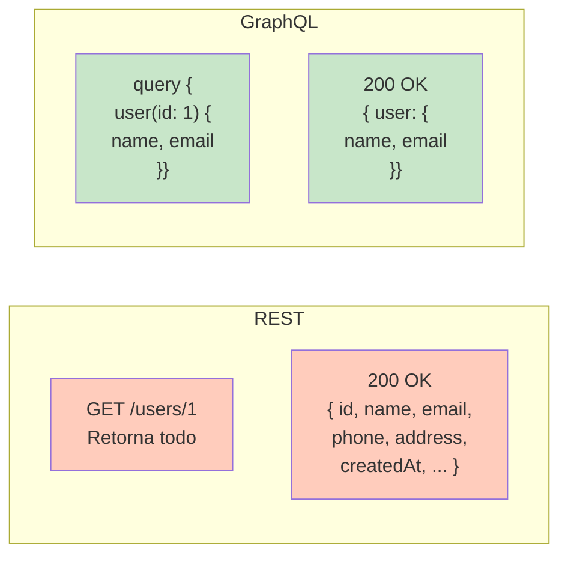
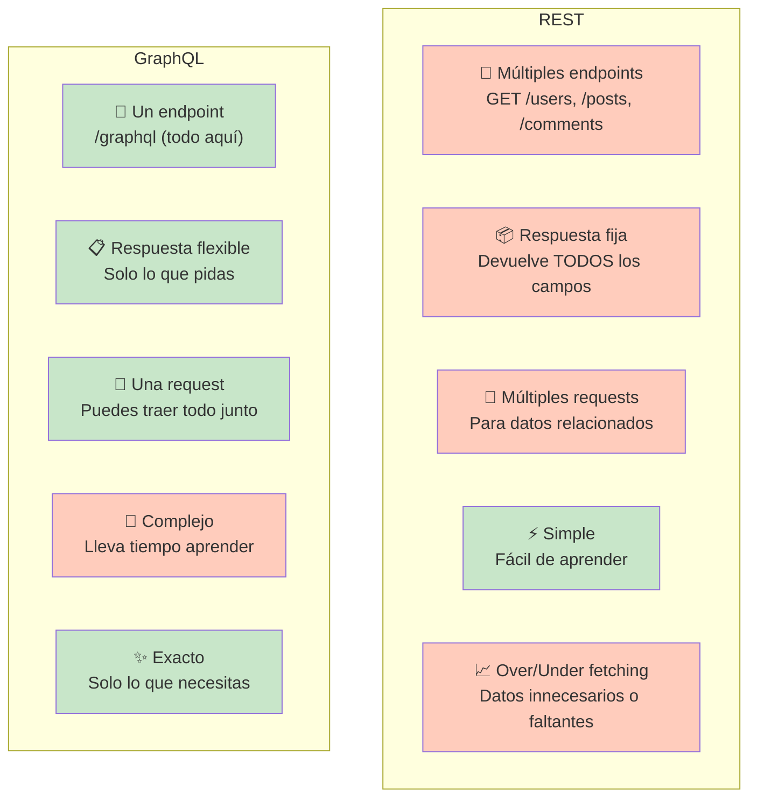
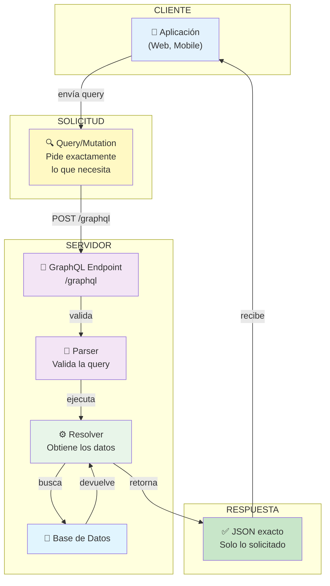
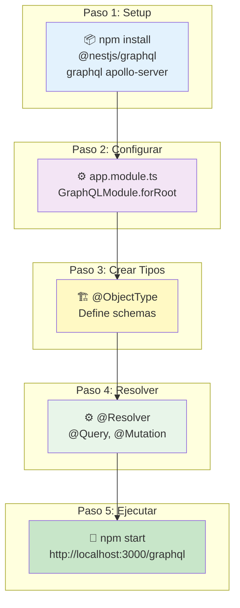
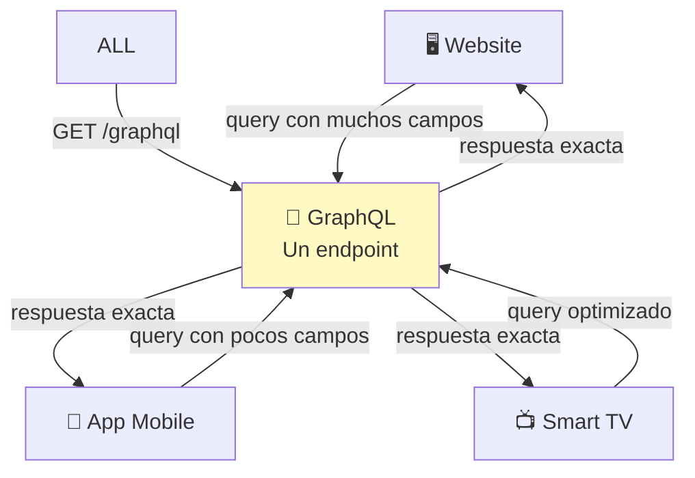
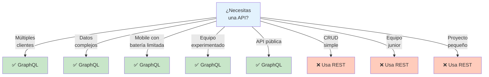

# 🔍 GraphQL: API Flexible y Eficiente

## Índice
1. [¿Qué es GraphQL? (Explicación Sencilla)](#qué-es-graphql-explicación-sencilla)
2. [GraphQL vs REST (Comparación Rápida)](#graphql-vs-rest-comparación-rápida)
3. [Conceptos Clave de GraphQL](#conceptos-clave-de-graphql)
4. [Cómo Funciona GraphQL](#cómo-funciona-graphql)
5. [GraphQL en NestJS](#graphql-en-nestjs)
6. [Ejemplos Prácticos](#ejemplos-prácticos)
7. [Casos de Uso Reales](#casos-de-uso-reales)
8. [Pros y Contras](#pros-y-contras)
9. [Cuándo Usar GraphQL](#cuándo-usar-graphql)
10. [Instalación y Setup](#instalación-y-setup)

---

## ¿Qué es GraphQL? (Explicación Sencilla)

### 🎯 En Una Frase

**GraphQL es un "menú personalizado" donde el cliente pide exactamente lo que necesita, en lugar de recibir todo fijo.**

### 📚 Analogía: El Restaurante

```
┌─────────────────────────────────────────────────────────┐
│                    REST (Menú fijo)                     │
│                                                         │
│  "Quiero un plato"                                     │
│  Mesero trae: Pasta, ensalada, pan, postre, bebida    │
│  ✅ Pero solo quería la pasta                          │
│  ❌ Desperdicio de tiempo y comida                     │
└─────────────────────────────────────────────────────────┘

┌─────────────────────────────────────────────────────────┐
│               GraphQL (Menú personalizado)             │
│                                                         │
│  "Quiero pasta con tomate, sin queso"                  │
│  Mesero trae: Exactamente eso                          │
│  ✅ Obtienes solo lo que pediste                       │
│  ✅ Sin desperdicio                                    │
└─────────────────────────────────────────────────────────┘
```

### 🔄 Diferencia Real: REST vs GraphQL



### 🎯 Características Principales

| Característica | Qué es | Beneficio |
|---|---|---|
| **Tipado** | Esquema fuerte | Errores detectados temprano |
| **Flexible** | El cliente elige qué datos | Menos data transferida |
| **Explorable** | Schema auto-documentado | No necesitas docs externas |
| **Una sola petición** | Puedes obtener datos relacionados | Menos requests que REST |
| **Type Safe** | Validación automática | Seguridad de tipos |

---

## GraphQL vs REST (Comparación Rápida)

### 📊 Tabla Comparativa



### 🎯 ¿Cuál elegir?

```
ELIGE REST si necesitas:
✅ Algo simple y rápido
✅ CRUD básico
✅ APIs públicas simples
✅ Equipos pequeños sin experiencia
✅ Proyecto pequeño

ELIGE GraphQL si necesitas:
✅ Múltiples clientes (web, mobile, TV)
✅ Datos complejos y relacionados
✅ Optimización de ancho de banda
✅ Aplicación real-time
✅ API compleja y flexible
```

---

## Conceptos Clave de GraphQL

### 1️⃣ Query (Consulta)

Una **query** es para **LEER datos** (como GET en REST).

```graphql
# Pedir usuario y sus posts
query {
  user(id: 1) {
    id
    name
    email
    posts {
      id
      title
      content
    }
  }
}
```

**Respuesta:**
```json
{
  "data": {
    "user": {
      "id": "1",
      "name": "Juan",
      "email": "juan@mail.com",
      "posts": [
        {
          "id": "10",
          "title": "Mi primer post",
          "content": "Contenido..."
        }
      ]
    }
  }
}
```

### 2️⃣ Mutation (Mutación)

Una **mutation** es para **CREAR/ACTUALIZAR/ELIMINAR** datos (POST, PUT, DELETE en REST).

```graphql
# Crear nuevo usuario
mutation {
  createUser(input: {
    name: "María"
    email: "maria@mail.com"
  }) {
    id
    name
    email
    createdAt
  }
}
```

**Respuesta:**
```json
{
  "data": {
    "createUser": {
      "id": "2",
      "name": "María",
      "email": "maria@mail.com",
      "createdAt": "2024-04-30T10:30:00Z"
    }
  }
}
```

### 3️⃣ Schema (Esquema)

El **schema** define la estructura de datos y operaciones disponibles.

```graphql
type User {
  id: ID!              # ! significa requerido
  name: String!
  email: String!
  age: Int
  posts: [Post!]!      # Array de Posts (requerido)
  createdAt: DateTime!
}

type Post {
  id: ID!
  title: String!
  content: String!
  author: User!
}

type Query {
  user(id: ID!): User
  users(limit: Int): [User!]!
  post(id: ID!): Post
}

type Mutation {
  createUser(input: CreateUserInput!): User!
  updateUser(id: ID!, input: UpdateUserInput!): User!
  deleteUser(id: ID!): Boolean!
}

input CreateUserInput {
  name: String!
  email: String!
}
```

### 4️⃣ Type (Tipo)

Un **type** es como una clase o interfaz que define qué datos tiene algo.

```
User: {
  id: ID (identificador único)
  name: String (texto)
  email: String (texto)
  age: Int (número entero)
  isActive: Boolean (verdadero/falso)
}
```

### 5️⃣ Resolver (Resolvedor)

Un **resolver** es la función que **obtiene los datos** cuando alguien hace una query.

```typescript
@Resolver(() => User)
export class UserResolver {

  constructor(private userService: UserService) {}

  // Query: obtener un usuario
  @Query(() => User)
  async user(@Args('id') id: string) {
    return await this.userService.findOne(id);
  }

  // Mutation: crear usuario
  @Mutation(() => User)
  async createUser(@Args('input') input: CreateUserInput) {
    return await this.userService.create(input);
  }

  // Field resolver: obtener posts del usuario
  @ResolveField(() => [Post])
  async posts(@Parent() user: User) {
    return await this.userService.getPosts(user.id);
  }
}
```

---

## Cómo Funciona GraphQL

### 📊 Flujo Completo



### 🔍 Validación Automática

GraphQL valida que los datos pedidos existan:

```graphql
# ✅ VÁLIDO (el schema define estos campos)
query {
  user(id: 1) {
    name
    email
  }
}

# ❌ INVÁLIDO (fieldNoExiste no existe en User)
query {
  user(id: 1) {
    name
    fieldNoExiste
  }
}
# Error: Cannot query field "fieldNoExiste" on type "User"
```

---

## GraphQL en NestJS

### 🔄 Integración Completa



### 📦 Instalación

```bash
npm install @nestjs/graphql @nestjs/apollo graphql apollo-server
```

### 🔧 Configuración Básica

```typescript
// app.module.ts
import { Module } from '@nestjs/common';
import { GraphQLModule } from '@nestjs/graphql';
import { ApolloDriver, ApolloDriverConfig } from '@nestjs/apollo';
import { TypeOrmModule } from '@nestjs/typeorm';

@Module({
  imports: [
    // GraphQL
    GraphQLModule.forRoot<ApolloDriverConfig>({
      driver: ApolloDriver,
      autoSchemaFile: 'schema.gql',  // Genera schema automáticamente
      sortSchema: true,
      playground: true,              // GraphQL Playground en /graphql
      introspection: true,           // Permite explorar el schema
    }),

    // Database
    TypeOrmModule.forRoot({
      type: 'postgres',
      host: 'localhost',
      port: 5432,
      database: 'miapp',
      username: 'postgres',
      password: 'password',
      entities: ['src/**/*.entity.ts'],
      synchronize: true,
    }),
  ],
})
export class AppModule {}
```

### 📝 Crear Tipos (ObjectType)

```typescript
// user.entity.ts
import { Entity, PrimaryGeneratedColumn, Column } from 'typeorm';
import { ObjectType, Field, ID } from '@nestjs/graphql';

@Entity('users')
@ObjectType()  // Exposer en GraphQL
export class User {

  @PrimaryGeneratedColumn('uuid')
  @Field(() => ID)  // ID en GraphQL
  id: string;

  @Column()
  @Field()  // String por defecto
  name: string;

  @Column()
  @Field()
  email: string;

  @Column({ nullable: true })
  @Field(() => Int, { nullable: true })  // Opcional
  age?: number;

  @Column({ type: 'timestamp', default: () => 'CURRENT_TIMESTAMP' })
  @Field()
  createdAt: Date;
}

// post.entity.ts
@Entity('posts')
@ObjectType()
export class Post {

  @PrimaryGeneratedColumn('uuid')
  @Field(() => ID)
  id: string;

  @Column()
  @Field()
  title: string;

  @Column()
  @Field()
  content: string;

  @Column()
  @Field()
  authorId: string;

  @Field(() => User)  // Relación con User
  author: User;
}
```

### ⚙️ Crear Resolver (Query)

```typescript
// user.resolver.ts
import { Resolver, Query, Args, Mutation, ResolveField, Parent } from '@nestjs/graphql';
import { User } from './user.entity';
import { Post } from '../post/post.entity';
import { UserService } from './user.service';

@Resolver(() => User)
export class UserResolver {

  constructor(private userService: UserService) {}

  // Query: obtener un usuario
  @Query(() => User, { description: 'Get user by ID' })
  async user(@Args('id') id: string): Promise<User> {
    return await this.userService.findOne(id);
  }

  // Query: obtener todos los usuarios
  @Query(() => [User])
  async users(
    @Args('limit', { type: () => Int, nullable: true }) limit?: number
  ): Promise<User[]> {
    return await this.userService.findAll(limit);
  }

  // Mutation: crear usuario
  @Mutation(() => User)
  async createUser(
    @Args('name') name: string,
    @Args('email') email: string
  ): Promise<User> {
    return await this.userService.create({ name, email });
  }

  // Mutation: actualizar usuario
  @Mutation(() => User)
  async updateUser(
    @Args('id') id: string,
    @Args('name', { nullable: true }) name?: string,
    @Args('email', { nullable: true }) email?: string
  ): Promise<User> {
    return await this.userService.update(id, { name, email });
  }

  // Mutation: eliminar usuario
  @Mutation(() => Boolean)
  async deleteUser(@Args('id') id: string): Promise<boolean> {
    return await this.userService.delete(id);
  }

  // Field Resolver: obtener posts del usuario
  @ResolveField(() => [Post])
  async posts(@Parent() user: User): Promise<Post[]> {
    return await this.userService.getPosts(user.id);
  }
}
```

### 📋 Input Types (Para Mutations)

```typescript
// user.input.ts
import { InputType, Field } from '@nestjs/graphql';

@InputType()
export class CreateUserInput {

  @Field()
  name: string;

  @Field()
  email: string;

  @Field(() => Int, { nullable: true })
  age?: number;
}

@InputType()
export class UpdateUserInput {

  @Field({ nullable: true })
  name?: string;

  @Field({ nullable: true })
  email?: string;

  @Field(() => Int, { nullable: true })
  age?: number;
}

// Usar en resolver
@Mutation(() => User)
async createUser(@Args('input') input: CreateUserInput): Promise<User> {
  return await this.userService.create(input);
}
```

---

## Ejemplos Prácticos

### 1️⃣ Ejemplo: Blog Completo

```typescript
// blog.resolver.ts
@Resolver(() => Post)
export class BlogResolver {

  constructor(
    private postService: PostService,
    private userService: UserService
  ) {}

  // Query: obtener todos los posts
  @Query(() => [Post])
  async posts(
    @Args('skip', { type: () => Int, nullable: true }) skip = 0,
    @Args('take', { type: () => Int, nullable: true }) take = 10
  ) {
    return await this.postService.findAll({ skip, take });
  }

  // Query: obtener post específico con autor y comentarios
  @Query(() => Post)
  async post(@Args('id') id: string) {
    return await this.postService.findOne(id);
  }

  // Mutation: crear post
  @Mutation(() => Post)
  async createPost(
    @Args('input') input: CreatePostInput,
    @Args('authorId') authorId: string
  ) {
    return await this.postService.create({
      ...input,
      authorId
    });
  }

  // Field resolver: obtener autor del post
  @ResolveField(() => User)
  async author(@Parent() post: Post) {
    return await this.userService.findOne(post.authorId);
  }
}
```

**GraphQL Query:**
```graphql
query {
  posts(take: 5) {
    id
    title
    content
    author {
      id
      name
      email
    }
  }
}
```

### 2️⃣ Ejemplo: Carrito de Compras

```typescript
// cart.resolver.ts
@Resolver(() => ShoppingCart)
export class CartResolver {

  constructor(private cartService: CartService) {}

  @Query(() => ShoppingCart)
  async myCart(@CurrentUser() userId: string) {
    return await this.cartService.getCart(userId);
  }

  @Mutation(() => ShoppingCart)
  async addToCart(
    @CurrentUser() userId: string,
    @Args('productId') productId: string,
    @Args('quantity', { type: () => Int }) quantity: number
  ) {
    return await this.cartService.addItem(userId, productId, quantity);
  }

  @Mutation(() => ShoppingCart)
  async removeFromCart(
    @CurrentUser() userId: string,
    @Args('productId') productId: string
  ) {
    return await this.cartService.removeItem(userId, productId);
  }

  @Mutation(() => Order)
  async checkout(@CurrentUser() userId: string) {
    return await this.cartService.checkout(userId);
  }

  // Field resolver: calcular total
  @ResolveField(() => Float)
  async total(@Parent() cart: ShoppingCart) {
    return await this.cartService.calculateTotal(cart.id);
  }
}
```

**GraphQL Mutation:**
```graphql
mutation {
  addToCart(productId: "prod-123", quantity: 2) {
    id
    items {
      product {
        id
        name
        price
      }
      quantity
    }
    total
  }
}
```

---

## Casos de Uso Reales

### 📱 App Móvil + Web (Diferentes necesidades)

```graphql
// WEB: Necesita más datos
query {
  user(id: 1) {
    id
    name
    email
    phone
    address
    birthDate
    preferences {
      theme
      notifications
    }
  }
}

// MOBILE: Necesita menos datos (ahorrar ancho de banda)
query {
  user(id: 1) {
    id
    name
    email
  }
}

# MISMO ENDPOINT, DIFERENTES RESPUESTAS
```

### 🏪 E-Commerce



### 💬 Chat en Tiempo Real

```graphql
# Query: obtener mensajes
query {
  conversation(id: "conv-1") {
    id
    messages(limit: 20) {
      id
      content
      author {
        name
        avatar
      }
      createdAt
    }
  }
}

# Mutation: enviar mensaje
mutation {
  sendMessage(input: {
    conversationId: "conv-1"
    content: "¡Hola!"
  }) {
    id
    content
    createdAt
  }
}

# Subscription: escuchar nuevos mensajes
subscription {
  messageAdded(conversationId: "conv-1") {
    id
    content
    author {
      name
    }
  }
}
```

---

## Pros y Contras

### ✅ Ventajas de GraphQL

| Ventaja | Explicación |
|---------|-------------|
| **Flexible** | El cliente pide exactamente qué datos necesita |
| **Eficiente** | Menos data transferida = más rápido |
| **Type Safe** | Schema tipado evita errores |
| **Auto-documentado** | GraphQL Playground explora el schema |
| **Una sola petición** | Trae datos relacionados en una request |
| **Versionamiento** | No necesitas /v1, /v2, etc |
| **Explorable** | Introspection permite autodescubrimiento |

### ❌ Desventajas de GraphQL

| Desventaja | Explicación |
|------------|-------------|
| **Complejidad** | Más difícil que REST para equipos juniors |
| **Caching** | HTTP caching no funciona bien (todo es POST) |
| **Debugging** | Errores más complejos de rastrear |
| **Query grandes** | Cliente puede pedir demasiados datos |
| **Curva aprendizaje** | Lleva tiempo dominar conceptos |
| **Overhead** | Parsing y validación de queries más lento |

---

## Cuándo Usar GraphQL

### ✅ Usa GraphQL cuando:



### 📝 Checklist: ¿GraphQL o REST?

```
GraphQL es mejor para:
✅ Múltiples clientes (web, mobile, TV, API pública)
✅ Datos muy relacionados (usuario → posts → comentarios)
✅ Queries dinámicas (cliente elige campos)
✅ Aplicaciones grandes y complejas
✅ Equipos con experiencia

REST es mejor para:
✅ CRUD simple (crear, leer, actualizar, borrar)
✅ Recursos claros y separados
✅ Caching HTTP importante
✅ Proyecto pequeño
✅ Equipo sin experiencia en GraphQL
```

---

## Instalación y Setup

### 🐳 Con Docker (Opcional, si quieres PostgreSQL)

```bash
# Solo necesitas NestJS con GraphQL
npm install @nestjs/graphql @nestjs/apollo graphql apollo-server
```

### 🔧 Configuración Completa en NestJS

```typescript
// app.module.ts
import { Module } from '@nestjs/common';
import { GraphQLModule } from '@nestjs/graphql';
import { ApolloDriver, ApolloDriverConfig } from '@nestjs/apollo';
import { TypeOrmModule } from '@nestjs/typeorm';
import { join } from 'path';
import { UserModule } from './user/user.module';
import { PostModule } from './post/post.module';

@Module({
  imports: [
    // GraphQL
    GraphQLModule.forRoot<ApolloDriverConfig>({
      driver: ApolloDriver,
      autoSchemaFile: join(process.cwd(), 'src/schema.gql'),
      sortSchema: true,
      playground: true,
      introspection: true,
      context: ({ req }) => ({ req }),  // Para autenticación
      formatError: (error) => {
        // Custom error formatting
        return {
          message: error.message,
          code: error.extensions?.code,
        };
      },
    }),

    // Database
    TypeOrmModule.forRoot({
      type: 'postgres',
      host: process.env.DB_HOST || 'localhost',
      port: parseInt(process.env.DB_PORT) || 5432,
      username: process.env.DB_USER || 'postgres',
      password: process.env.DB_PASSWORD || 'password',
      database: process.env.DB_NAME || 'miapp',
      entities: ['src/**/*.entity.ts'],
      synchronize: true,
    }),

    UserModule,
    PostModule,
  ],
})
export class AppModule {}
```

### 📋 Structure del Proyecto

```
src/
├── user/
│   ├── user.entity.ts       # Base de datos
│   ├── user.resolver.ts     # GraphQL resolver
│   ├── user.service.ts      # Lógica de negocio
│   └── user.module.ts       # Módulo
├── post/
│   ├── post.entity.ts
│   ├── post.resolver.ts
│   ├── post.service.ts
│   └── post.module.ts
├── app.module.ts            # Módulo principal
└── main.ts                  # Entry point
```

### ▶️ Ejecutar

```bash
npm start

# GraphQL Playground en:
# http://localhost:3000/graphql
```

### 🧪 Testar en GraphQL Playground

```graphql
query {
  users {
    id
    name
    email
  }
}

mutation {
  createUser(name: "Juan", email: "juan@mail.com") {
    id
    name
    email
    createdAt
  }
}
```

---

## 🎓 Resumen Rápido

### ¿Qué es GraphQL?
Un **lenguaje de query** que permite que los clientes pidan **exactamente los datos que necesitan**, en lugar de recibir respuestas fijas.

### Conceptos clave:
- **Query**: Leer datos
- **Mutation**: Crear/actualizar/eliminar
- **Schema**: Define estructura de datos
- **Type**: Define campos de un objeto
- **Resolver**: Función que obtiene los datos

### Cómo usar en NestJS:
```typescript
// 1. Definir tipo
@ObjectType()
class User { @Field() name: string; }

// 2. Crear resolver
@Resolver(() => User)
@Query(() => User)
async user(@Args('id') id: string) { }

// 3. Cliente pide
query { user(id: 1) { name } }
```

### Cuándo usar:
✅ Múltiples clientes
✅ Datos complejos
✅ Equipo experimentado
✅ Aplicación grande

### Cuándo NO usar:
❌ CRUD simple
❌ Proyecto pequeño
❌ Equipo junior

---

## 📚 Recursos Útiles

- [Documentación GraphQL Oficial](https://graphql.org/)
- [NestJS GraphQL Docs](https://docs.nestjs.com/graphql/quick-start)
- [Apollo Server](https://www.apollographql.com/docs/)
- [GraphQL Best Practices](https://graphql.org/learn/best-practices/)
- [How to GraphQL Tutorial](https://www.howtographql.com/)

---

**Recuerda:** GraphQL es como un menú personalizado donde el cliente pide exactamente lo que necesita, en lugar de un menú fijo como REST.
