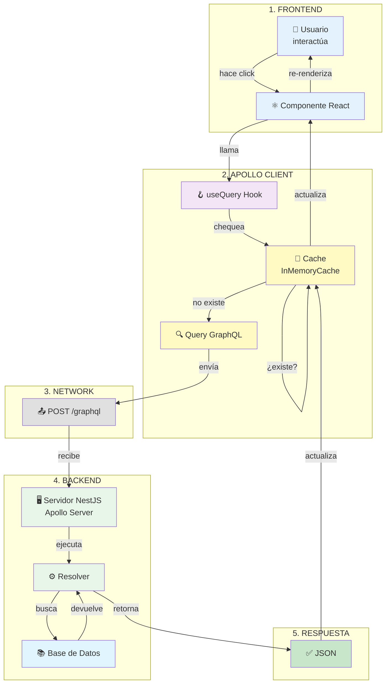
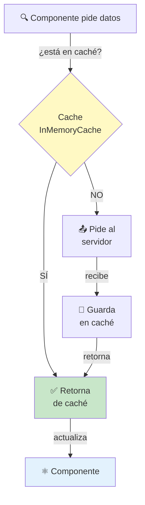
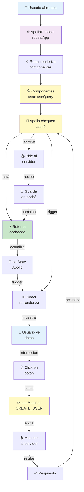

# 🚀 Apollo Client: Cliente GraphQL Para Frontend

## Índice
1. [¿Qué es Apollo Client? (Explicación Sencilla)](#qué-es-apollo-client-explicación-sencilla)
2. [Apollo Client vs Fetch (Comparación)](#apollo-client-vs-fetch-comparación)
3. [Conceptos Clave](#conceptos-clave)
4. [Cómo Funciona Apollo Client](#cómo-funciona-apollo-client)
5. [Instalación y Setup](#instalación-y-setup)
6. [Ejemplos Prácticos](#ejemplos-prácticos)
7. [Manejo de Estado](#manejo-de-estado)
8. [Caché de Apollo](#caché-de-apollo)
9. [Errores y Loading](#errores-y-loading)
10. [Casos de Uso Reales](#casos-de-uso-reales)

---

## ¿Qué es Apollo Client? (Explicación Sencilla)

### 🎯 En Una Frase

**Apollo Client es una librería que facilita conectar tu app frontend con un servidor GraphQL, como si fuera un "gerente" que maneja todas las peticiones.**

### 📚 Analogía: El Teléfono

```
┌──────────────────────────────────────┐
│    Normalmente (sin Apollo)          │
│                                      │
│  Tú haces: fetch('/graphql', {...}) │
│  ↓                                   │
│  Esperas: respuesta                  │
│  ↓                                   │
│  Parseas: JSON                       │
│  ↓                                   │
│  Guardas: estado local               │
│  ↓                                   │
│  Actualizas: componentes             │
│  ✅ Funciona pero: MUCHO TRABAJO    │
└──────────────────────────────────────┘

┌──────────────────────────────────────┐
│    Con Apollo Client                 │
│                                      │
│  Tú dices: useQuery(GET_USER)        │
│  ↓                                   │
│  Apollo hace TODO:                   │
│  ✅ Envía request                    │
│  ✅ Recibe respuesta                 │
│  ✅ Cachea datos                     │
│  ✅ Maneja errores                   │
│  ✅ Actualiza componentes            │
│  ✓ Mucho más simple                  │
└──────────────────────────────────────┘
```

### 🎯 Características Principales

| Característica | Qué es | Beneficio |
|---|---|---|
| **Caching automático** | Guarda datos ya pedidos | No repite requests innecesarias |
| **State Management** | Maneja estado sin Redux | Código más simple |
| **Reactive Updates** | Actualiza componentes automáticamente | Sincronización perfecta |
| **Error Handling** | Gestiona errores automáticamente | Menos boilerplate |
| **DevTools** | Inspector visual | Debug más fácil |

---

## Apollo Client vs Fetch (Comparación)

### 📊 Ejemplo lado a lado

**❌ Usando fetch (sin Apollo):**
```typescript
// Componente React
import { useState, useEffect } from 'react';

export function UserProfile({ userId }) {
  const [user, setUser] = useState(null);
  const [loading, setLoading] = useState(false);
  const [error, setError] = useState(null);

  useEffect(() => {
    setLoading(true);
    // ❌ Escribir query como string
    const query = `
      query {
        user(id: "${userId}") {
          id
          name
          email
        }
      }
    `;

    // ❌ Enviar manualmente
    fetch('/graphql', {
      method: 'POST',
      headers: { 'Content-Type': 'application/json' },
      body: JSON.stringify({ query }),
    })
      .then(res => res.json())
      .then(data => {
        setUser(data.data.user);
        setLoading(false);
      })
      .catch(err => {
        setError(err);
        setLoading(false);
      });
  }, [userId]);

  if (loading) return <div>Cargando...</div>;
  if (error) return <div>Error: {error.message}</div>;
  if (!user) return <div>Sin datos</div>;

  return (
    <div>
      <h1>{user.name}</h1>
      <p>{user.email}</p>
    </div>
  );
}
```

**✅ Usando Apollo Client:**
```typescript
import { useQuery, gql } from '@apollo/client';

// 1. Define query (una sola vez)
const GET_USER = gql`
  query GetUser($id: ID!) {
    user(id: $id) {
      id
      name
      email
    }
  }
`;

export function UserProfile({ userId }) {
  // 2. Apollo hace TODO automáticamente
  const { data, loading, error } = useQuery(GET_USER, {
    variables: { id: userId },
  });

  if (loading) return <div>Cargando...</div>;
  if (error) return <div>Error: {error.message}</div>;
  if (!data) return <div>Sin datos</div>;

  return (
    <div>
      <h1>{data.user.name}</h1>
      <p>{data.user.email}</p>
    </div>
  );
}
```

### 🔄 Flujo Comparativo

```mermaid
graph TB
    subgraph "Fetch (Manual)"
        F1["1️⃣ Escribir query<br/>como string"]
        F2["2️⃣ Configurar<br/>fetch"]
        F3["3️⃣ Parsear<br/>respuesta"]
        F4["4️⃣ Manejar<br/>errores"]
        F5["5️⃣ Guardar<br/>estado"]
        F6["6️⃣ Actualizar<br/>componente"]
    end
    
    subgraph "Apollo Client (Automático)"
        A1["1️⃣ Definir query<br/>con gql"]
        A2["2️⃣ useQuery()"]
        A3["Apollo cachea<br/>automáticamente"]
        A4["Apollo maneja<br/>errores"]
        A5["Apollo actualiza<br/>estado"]
        A6["Componente<br/>re-renderiza"]
    end
    
    F1 --> F2 --> F3 --> F4 --> F5 --> F6
    A1 --> A2 --> A3 --> A4 --> A5 --> A6
    
    style F1 fill:#ffccbc
    style F2 fill:#ffccbc
    style F3 fill:#ffccbc
    style F4 fill:#ffccbc
    style F5 fill:#ffccbc
    style F6 fill:#ffccbc
    
    style A1 fill:#c8e6c9
    style A2 fill:#c8e6c9
    style A3 fill:#fff9c4
    style A4 fill:#fff9c4
    style A5 fill:#fff9c4
    style A6 fill:#c8e6c9
```



---

## Conceptos Clave

### 1️⃣ ApolloClient

El **cliente** que conecta tu app con el servidor GraphQL.

```typescript
import { ApolloClient, InMemoryCache, HttpLink } from '@apollo/client';

const client = new ApolloClient({
  link: new HttpLink({
    uri: 'http://localhost:3000/graphql',  // Tu servidor GraphQL
    credentials: 'include',                  // Enviar cookies
  }),
  cache: new InMemoryCache(),               // Guardar datos
});
```

### 2️⃣ Query (gql)

Define QUÉ datos quieres pedirle al servidor.

```typescript
import { gql } from '@apollo/client';

const GET_USER = gql`
  query GetUser($id: ID!) {
    user(id: $id) {
      id
      name
      email
      createdAt
    }
  }
`;
```

### 3️⃣ useQuery Hook

Hook para **LEER** datos del servidor GraphQL.

```typescript
const { data, loading, error, refetch } = useQuery(GET_USER, {
  variables: { id: '123' },
  skip: !userId,              // Saltar si no hay userId
  cache: 'no-cache',          // No usar caché
});
```

**Devuelve:**
- `data`: Los datos obtenidos
- `loading`: `true` mientras está cargando
- `error`: Si hay error
- `refetch`: Función para re-pedir datos

### 4️⃣ useMutation Hook

Hook para **ESCRIBIR** datos (crear, actualizar, eliminar).

```typescript
import { useMutation } from '@apollo/client';

const CREATE_USER = gql`
  mutation CreateUser($input: CreateUserInput!) {
    createUser(input: $input) {
      id
      name
      email
    }
  }
`;

export function SignUp() {
  const [createUser, { loading, error }] = useMutation(CREATE_USER);

  const handleSubmit = async (formData) => {
    const result = await createUser({
      variables: { input: formData },
    });
    console.log('Usuario creado:', result.data.createUser);
  };

  return (
    <form onSubmit={(e) => {
      e.preventDefault();
      handleSubmit({ name: 'Juan', email: 'juan@mail.com' });
    }}>
      {loading ? 'Creando...' : 'Crear usuario'}
    </form>
  );
}
```

### 5️⃣ InMemoryCache

La "memoria" de Apollo donde guarda datos para no repetir requests.

```typescript
const cache = new InMemoryCache();

// Apollo automáticamente cachea:
// - Resultados de queries
// - Resultados de mutations
// - Datos en la BD local
```

---

## Cómo Funciona Apollo Client

### 📊 Flujo Completo



### 🔄 Ejemplo paso a paso

```
1. Usuario hace click en "Ver perfil"
   ↓
2. Componente llama useQuery(GET_USER)
   ↓
3. Apollo chequea: ¿tengo este usuario en caché?
   ├─ SI ✅ → Retorna datos cacheados (RÁPIDO)
   └─ NO ❌ → Continúa...
   ↓
4. Apollo envía query al servidor
   POST /graphql
   { query: "query GetUser { user { name } }" }
   ↓
5. Servidor resuelve query
   Resolver GetUser → busca en BD → retorna datos
   ↓
6. Apollo recibe respuesta
   ↓
7. Apollo CACHEA los datos
   ↓
8. Apollo actualiza componente
   ↓
9. React re-renderiza con nuevos datos
   ↓
10. Usuario ve los datos
```

---

## Instalación y Setup

### 📦 Instalación

```bash
# Instalar Apollo Client
npm install @apollo/client graphql

# Si usas React
npm install react@latest
```

### 🔧 Configuración Básica (React)

```typescript
// main.tsx o index.tsx
import React from 'react';
import ReactDOM from 'react-dom/client';
import { ApolloClient, InMemoryCache, ApolloProvider, HttpLink } from '@apollo/client';
import App from './App';

// 1. Crear cliente Apollo
const client = new ApolloClient({
  // Conecta a tu servidor GraphQL
  link: new HttpLink({
    uri: 'http://localhost:3000/graphql',
    credentials: 'include',  // Enviar cookies (para autenticación)
  }),
  
  // Caché local
  cache: new InMemoryCache(),
});

// 2. Envolver app con ApolloProvider
ReactDOM.createRoot(document.getElementById('root')!).render(
  <React.StrictMode>
    <ApolloProvider client={client}>
      <App />
    </ApolloProvider>
  </React.StrictMode>,
);
```

### 📁 Estructura del Proyecto

```
src/
├── graphql/
│   ├── queries/
│   │   ├── user.query.ts       # Queries para usuarios
│   │   ├── post.query.ts       # Queries para posts
│   │   └── index.ts
│   ├── mutations/
│   │   ├── user.mutation.ts    # Mutations para usuarios
│   │   └── post.mutation.ts
│   └── subscriptions/
│       └── message.subscription.ts
├── components/
│   ├── UserProfile.tsx
│   ├── CreatePost.tsx
│   └── PostList.tsx
├── pages/
│   ├── HomePage.tsx
│   └── UserPage.tsx
├── App.tsx
├── main.tsx
└── index.css
```

---

## Ejemplos Prácticos

### 1️⃣ Ejemplo: Leer Usuarios (useQuery)

```typescript
// graphql/queries/user.query.ts
import { gql } from '@apollo/client';

export const GET_USERS = gql`
  query GetUsers($limit: Int) {
    users(limit: $limit) {
      id
      name
      email
      createdAt
    }
  }
`;

// components/UserList.tsx
import { useQuery } from '@apollo/client';
import { GET_USERS } from '../graphql/queries/user.query';

export function UserList() {
  // Apollo ejecuta query automáticamente
  const { data, loading, error } = useQuery(GET_USERS, {
    variables: { limit: 10 },
  });

  if (loading) return <div className="loader">Cargando usuarios...</div>;
  if (error) return <div className="error">Error: {error.message}</div>;
  if (!data?.users) return <div>Sin usuarios</div>;

  return (
    <div className="user-list">
      {data.users.map(user => (
        <div key={user.id} className="user-card">
          <h3>{user.name}</h3>
          <p>{user.email}</p>
          <small>{new Date(user.createdAt).toLocaleDateString()}</small>
        </div>
      ))}
    </div>
  );
}
```

### 2️⃣ Ejemplo: Crear Usuario (useMutation)

```typescript
// graphql/mutations/user.mutation.ts
import { gql } from '@apollo/client';

export const CREATE_USER = gql`
  mutation CreateUser($input: CreateUserInput!) {
    createUser(input: $input) {
      id
      name
      email
      createdAt
    }
  }
`;

// components/SignUp.tsx
import { useMutation } from '@apollo/client';
import { CREATE_USER } from '../graphql/mutations/user.mutation';
import { GET_USERS } from '../graphql/queries/user.query';

export function SignUp() {
  const [createUser, { loading, error }] = useMutation(CREATE_USER, {
    // Actualizar cache después de crear
    refetchQueries: [{ query: GET_USERS }],
    // O actualizar cache manualmente:
    // update(cache, { data }) {
    //   const existing = cache.readQuery({ query: GET_USERS });
    //   cache.writeQuery({
    //     query: GET_USERS,
    //     data: {
    //       users: [...existing.users, data.createUser],
    //     },
    //   });
    // }
  });

  const handleSubmit = async (e: React.FormEvent<HTMLFormElement>) => {
    e.preventDefault();
    const formData = new FormData(e.currentTarget);

    try {
      const result = await createUser({
        variables: {
          input: {
            name: formData.get('name'),
            email: formData.get('email'),
          },
        },
      });
      alert(`Usuario ${result.data.createUser.name} creado!`);
    } catch (err) {
      console.error('Error al crear usuario:', err);
    }
  };

  return (
    <form onSubmit={handleSubmit} className="signup-form">
      <input name="name" type="text" placeholder="Nombre" required />
      <input name="email" type="email" placeholder="Email" required />
      <button type="submit" disabled={loading}>
        {loading ? 'Creando...' : 'Registrarse'}
      </button>
      {error && <div className="error">{error.message}</div>}
    </form>
  );
}
```

### 3️⃣ Ejemplo: Actualizar Usuario

```typescript
// graphql/mutations/user.mutation.ts
export const UPDATE_USER = gql`
  mutation UpdateUser($id: ID!, $input: UpdateUserInput!) {
    updateUser(id: $id, input: $input) {
      id
      name
      email
      age
    }
  }
`;

// components/EditUserProfile.tsx
export function EditUserProfile({ userId }) {
  const [updateUser, { loading }] = useMutation(UPDATE_USER);

  const handleUpdate = async (newData) => {
    await updateUser({
      variables: {
        id: userId,
        input: newData,
      },
    });
  };

  return (
    <form onSubmit={(e) => {
      e.preventDefault();
      handleUpdate({
        name: 'Nuevo Nombre',
        age: 30,
      });
    }}>
      {loading ? 'Actualizando...' : 'Actualizar'}
    </form>
  );
}
```

### 4️⃣ Ejemplo: Eliminar Usuario

```typescript
// graphql/mutations/user.mutation.ts
export const DELETE_USER = gql`
  mutation DeleteUser($id: ID!) {
    deleteUser(id: $id)
  }
`;

// components/UserActions.tsx
export function DeleteUserButton({ userId, onDelete }) {
  const [deleteUser, { loading }] = useMutation(DELETE_USER, {
    refetchQueries: [{ query: GET_USERS }],
    onCompleted: () => {
      onDelete();
      alert('Usuario eliminado');
    },
  });

  return (
    <button
      onClick={() => {
        if (confirm('¿Eliminar usuario?')) {
          deleteUser({ variables: { id: userId } });
        }
      }}
      disabled={loading}
    >
      {loading ? 'Eliminando...' : 'Eliminar'}
    </button>
  );
}
```

---

## Manejo de Estado

### 🎯 Apollo maneja estado automáticamente

```typescript
// ❌ SIN Apollo (manejo manual)
const [user, setUser] = useState(null);
const [loading, setLoading] = useState(false);
const [error, setError] = useState(null);
// + lógica fetch + efectos + etc...

// ✅ CON Apollo (todo automático)
const { data, loading, error } = useQuery(GET_USER);
```

### 🔄 Actualizar Estado después de Mutation

**Opción 1: Refetch (volver a pedir)**
```typescript
const [createUser] = useMutation(CREATE_USER, {
  refetchQueries: [{ query: GET_USERS }],
});
```

**Opción 2: Update manual (más eficiente)**
```typescript
const [createUser] = useMutation(CREATE_USER, {
  update(cache, { data }) {
    const existing = cache.readQuery({ query: GET_USERS });
    cache.writeQuery({
      query: GET_USERS,
      data: {
        users: [...existing.users, data.createUser],
      },
    });
  },
});
```

### 🔗 Variables Reactivas

```typescript
import { makeVar } from '@apollo/client';

// Variable reactiva (fuera del componente)
export const isLoggedInVar = makeVar(false);
export const currentUserVar = makeVar(null);

// Usar en componentes
export function Profile() {
  const isLoggedIn = useReactiveVar(isLoggedInVar);
  const currentUser = useReactiveVar(currentUserVar);

  if (!isLoggedIn) return <div>No logueado</div>;

  return <div>Bienvenido {currentUser?.name}</div>;
}

// Actualizar desde cualquier lado
export function LoginButton() {
  const handleLogin = async (user) => {
    isLoggedInVar(true);
    currentUserVar(user);
  };
}
```

---

## Caché de Apollo

### 💾 Cómo funciona el caché



### 🚫 Formas de cachear

```typescript
// 1. Cache por defecto (recomendado)
useQuery(GET_USER) // Usa caché

// 2. No usar caché
useQuery(GET_USER, { cache: 'no-cache' })

// 3. Solo caché (no pedir si no existe)
useQuery(GET_USER, { cache: 'cache-only' })

// 4. Network first (pedir, pero guardar en caché)
useQuery(GET_USER, { cache: 'network-first' })

// 5. Cache first (si existe en caché, usarlo, sino pedir)
useQuery(GET_USER, { cache: 'cache-first' })
```

### 🧹 Limpiar caché

```typescript
const client = useApolloClient();

// Limpiar todo el caché
client.cache.reset();

// Limpiar query específica
client.cache.removeQuery(GET_USER);

// Limpiar y re-pedir
client.refetchQueries({ include: [GET_USER] });
```

---

## Errores y Loading

### 🔴 Manejo de Errores

```typescript
const { data, error } = useQuery(GET_USER);

if (error) {
  console.error('Código de error:', error.graphQLErrors[0]?.extensions?.code);
  console.error('Mensaje:', error.message);
  
  return (
    <div className="error">
      <h2>Error al cargar datos</h2>
      <p>{error.message}</p>
      <button onClick={() => window.location.reload()}>
        Reintentar
      </button>
    </div>
  );
}
```

### ⏳ Estados de Loading

```typescript
const { loading, data, fetchMore } = useQuery(GET_USERS);

if (loading && !data) return <div>Cargando...</div>;
if (loading && data) return <div>Actualizando...</div>;

// Cargar más (pagination)
const handleLoadMore = () => {
  fetchMore({
    variables: { skip: data.users.length },
    updateQuery: (prev, { fetchMoreResult }) => ({
      users: [...prev.users, ...fetchMoreResult.users],
    }),
  });
};
```

### 🔄 Reintentos Automáticos

```typescript
import { onError } from '@apollo/client/link/error';
import { ApolloClient, HttpLink, from } from '@apollo/client';

const errorLink = onError(({ graphQLErrors, networkError }) => {
  if (graphQLErrors) {
    graphQLErrors.forEach(({ message, extensions }) => {
      console.error(`[GraphQL error]: ${message}`);
    });
  }
  if (networkError) {
    console.error(`[Network error]: ${networkError}`);
    // Implementar reintento
  }
});

const client = new ApolloClient({
  link: from([errorLink, new HttpLink({ uri: 'http://localhost:3000/graphql' })]),
  cache: new InMemoryCache(),
});
```

---

## Casos de Uso Reales

### 📱 App: Blog (Lectura)

```typescript
// graphql/queries/blog.query.ts
export const GET_POSTS = gql`
  query GetPosts($skip: Int, $take: Int) {
    posts(skip: $skip, take: $take) {
      id
      title
      content
      author {
        id
        name
        avatar
      }
      createdAt
    }
  }
`;

// components/Blog.tsx
export function Blog() {
  const { data, loading, fetchMore } = useQuery(GET_POSTS, {
    variables: { skip: 0, take: 10 },
  });

  const handleLoadMore = () => {
    fetchMore({
      variables: { skip: data.posts.length, take: 10 },
      updateQuery: (prev, { fetchMoreResult }) => ({
        posts: [...prev.posts, ...fetchMoreResult.posts],
      }),
    });
  };

  return (
    <div>
      {data?.posts.map(post => (
        <article key={post.id}>
          <h2>{post.title}</h2>
          <p>{post.content}</p>
          <by>{post.author.name}</by>
        </article>
      ))}
      <button onClick={handleLoadMore}>Cargar más</button>
    </div>
  );
}
```

### 💬 Chat en Tiempo Real

```typescript
// graphql/subscriptions/message.subscription.ts
export const ON_MESSAGE = gql`
  subscription OnMessage($conversationId: ID!) {
    messageAdded(conversationId: $conversationId) {
      id
      content
      author { name }
      createdAt
    }
  }
`;

// components/Chat.tsx
export function Chat({ conversationId }) {
  const { data: messages } = useQuery(GET_MESSAGES, {
    variables: { conversationId },
  });

  const { data: newMessage } = useSubscription(ON_MESSAGE, {
    variables: { conversationId },
  });

  useEffect(() => {
    // Cuando llega nuevo mensaje
    if (newMessage) {
      console.log('Nuevo mensaje:', newMessage.messageAdded);
    }
  }, [newMessage]);

  return (
    <div className="chat">
      {messages?.map(msg => (
        <div key={msg.id} className="message">
          <strong>{msg.author.name}:</strong> {msg.content}
        </div>
      ))}
    </div>
  );
}
```

### 🛒 E-Commerce (Lectura + Escritura)

```typescript
// graphql/queries/products.query.ts
export const GET_PRODUCTS = gql`
  query GetProducts($category: String, $limit: Int) {
    products(category: $category, limit: $limit) {
      id
      name
      price
      image
      stock
    }
  }
`;

// graphql/mutations/cart.mutation.ts
export const ADD_TO_CART = gql`
  mutation AddToCart($productId: ID!, $quantity: Int!) {
    addToCart(productId: $productId, quantity: $quantity) {
      id
      items { product { id name } quantity }
      total
    }
  }
`;

// components/ProductStore.tsx
export function ProductStore() {
  const { data: products } = useQuery(GET_PRODUCTS, {
    variables: { category: 'electronics', limit: 20 },
  });

  const [addToCart] = useMutation(ADD_TO_CART, {
    update(cache, { data }) {
      // Actualizar carrito en caché
    },
  });

  return (
    <div className="store">
      {products?.map(product => (
        <div key={product.id} className="product-card">
          
          <h3>{product.name}</h3>
          <price>${product.price}</price>
          <button
            onClick={() => addToCart({
              variables: { productId: product.id, quantity: 1 },
            })}
          >
            Agregar al carrito
          </button>
        </div>
      ))}
    </div>
  );
}
```

---

## 🎯 Flujo Típico Completo



---

## 🎓 Checklist: Proyecto con Apollo Client

Antes de publicar tu app:

- [ ] Apollo Client configurado con URI correcta
- [ ] Queries y Mutations definidas en archivos separados
- [ ] useQuery usado con variables correctas
- [ ] Manejo de loading, error y data en componentes
- [ ] Mutation con refetchQueries o update manual
- [ ] Caché funcionando (sin requests innecesarias)
- [ ] Errores capturados y mostrados al usuario
- [ ] DevTools de Apollo instalados para debugging
- [ ] Autenticación configurada (si aplica)
- [ ] Tests unitarios de componentes que usan Apollo

---

## 📚 Recursos Útiles

- [Documentación Apollo Client Oficial](https://www.apollographql.com/docs/react/)
- [Apollo Client DevTools](https://www.apollographql.com/docs/react/development-testing/developer-tools/)
- [GraphQL Query Language](https://graphql.org/learn/)
- [Apollo Client API Reference](https://www.apollographql.com/docs/react/api/core/)
- [Tutorial: Full Stack GraphQL](https://www.apollographql.com/tutorials/fullstack-apollo-express/)

---

## 🎓 Resumen Rápido

### ¿Qué es Apollo Client?
Una librería que simplifica conectar tu app frontend con un servidor GraphQL, manejando automáticamente caching, estado y requests.

### Conceptos clave:
- **ApolloClient**: El cliente
- **Query**: LEER datos (con useQuery)
- **Mutation**: ESCRIBIR datos (con useMutation)
- **InMemoryCache**: Caché automático
- **Hook**: useQuery y useMutation

### Flujo básico:
```typescript
1. Define query con gql
2. useQuery(QUERY) en componente
3. Apollo cachea automáticamente
4. Componente re-renderiza
```

### Para escribir datos:
```typescript
1. Define mutation con gql
2. useMutation(MUTATION)
3. Llama al hacer submit
4. Apollo actualiza caché
```

### Ventajas vs fetch:
✅ Menos código
✅ Caché automático
✅ Estado centralizado
✅ DevTools para debugging
✅ Manejo automático de errores

---

**Última actualización**: 2026-05-11
**Versión**: 1.0
**Estado**: Listo para usar
