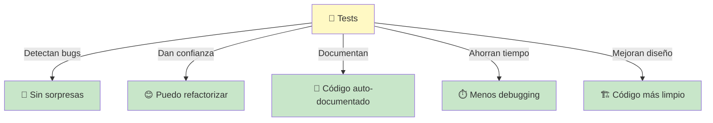
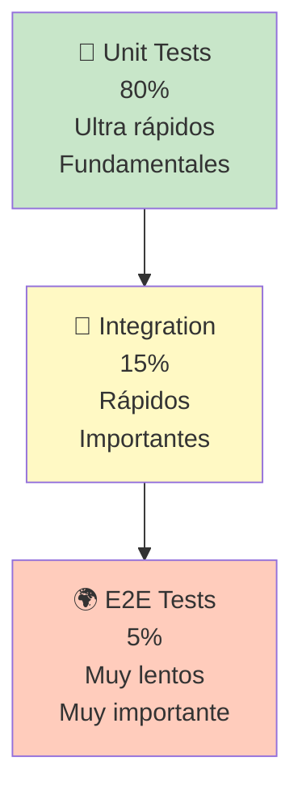
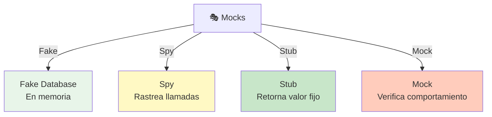

# 🧪 Testing con Jest y Mocks en NestJS

## Índice
1. [¿Qué es Testing? (Explicación Sencilla)](#qué-es-testing-explicación-sencilla)
2. [Tipos de Tests](#tipos-de-tests)
3. [Jest en NestJS](#jest-en-nestjs)
4. [Mocks: ¿Qué Son y Para Qué Sirven?](#mocks-qué-son-y-para-qué-sirven)
5. [Testing de Services](#testing-de-services)
6. [Testing de Controllers](#testing-de-controllers)
7. [Testing de Resolvers (GraphQL)](#testing-de-resolvers-graphql)
8. [Testing de Repositories](#testing-de-repositories)
9. [Casos Prácticos Completos](#casos-prácticos-completos)
10. [Buenas Prácticas](#buenas-prácticas)

---

## ¿Qué es Testing? (Explicación Sencilla)

### 🎯 En Una Frase

**Testing es verificar que tu código funcione correctamente ANTES de mandarlo a producción.**

### 📚 Analogía: La Fábrica de Autos

```
SIN TESTING (Fábrica sin control):
  1. Fabricas 10,000 autos
  2. Los envías a clientes
  3. ¡Sorpresa! 1,000 tienen defectos
  4. Clientes furiosos ❌

CON TESTING (Fábrica con control):
  1. Fabricas un auto
  2. Lo pruebas (test): ¿Frenos funcionan? ¿Motor? ¿Puertas?
  3. Si pasa todos los tests → Fabricas 10,000
  4. Todos funcionan perfectamente ✅
```

### 🎯 Beneficios del Testing



---

## Tipos de Tests

### 1️⃣ Unit Tests (Tests Unitarios)

Prueban **una función aislada** sin dependencias externas.

```
┌─────────────────┐
│   calculateAge  │
│   función pura  │
└────────┬────────┘
         │
         ├─ Input: birthYear = 2000
         ├─ Expected: age = 24
         └─ Test: ✅ PASS
```

**Características:**
- ✅ Rápidos (milisegundos)
- ✅ Aislados (sin BD, sin API)
- ✅ Muchos tests (decenas/centenas)
- ✅ Prueban lógica pura

### 2️⃣ Integration Tests (Tests de Integración)

Prueban **múltiples componentes juntos** (Service + Repository + BD).

```
┌──────────────────────────────────┐
│  UserService + UserRepository    │
│  + PostgreSQL (test database)    │
│                                  │
│  ¿Funciona todo junto?           │
└──────────────────────────────────┘
```

**Características:**
- ⚠️ Más lentos (segundos)
- ⚠️ Necesitan dependencias (BD, Cache)
- ✅ Prueban la realidad
- ⚠️ Menos tests (docenas)

### 3️⃣ E2E Tests (End-to-End)

Prueban **el flujo completo** desde el cliente hasta la BD.

```
┌─────────────────────────────────────┐
│  Cliente → Controller → Service     │
│                         → Repository│
│                         → BD        │
│  Flujo completo                     │
└─────────────────────────────────────┘
```

**Características:**
- 🐢 Muy lentos (minutos)
- 🌍 Requieren servidor corriendo
- ✅ Prueban lo real
- ⚠️ Pocos tests (docenas)

### 📊 Pirámide de Testing



---

## Jest en NestJS

### 📦 Jest ya viene con NestJS

```bash
# NestJS viene con Jest preconfigurado
npm test                    # Ejecuta tests
npm test -- --watch        # Watch mode
npm test -- --coverage     # Ver cobertura
```

### 🔧 Estructura de un Test

```typescript
// user.service.spec.ts
describe('UserService', () => {
  //    ↑ Describe agrupa tests relacionados

  let userService: UserService;

  beforeEach(() => {
    // SETUP: Preparar datos antes de cada test
    userService = new UserService();
  });

  it('should return user by id', () => {
    // TEST: Verificar que funcione correctamente
    
    // ARRANGE: Preparar datos
    const userId = 1;
    const expectedUser = { id: 1, name: 'Juan' };
    
    // ACT: Ejecutar la función
    const result = userService.getUser(userId);
    
    // ASSERT: Verificar resultado
    expect(result).toEqual(expectedUser);
  });
});
```

### 📊 Estructura AAA (Arrange, Act, Assert)

```
ARRANGE (Preparar):
  Crear datos de prueba
  Configurar mocks
  
ACT (Actuar):
  Ejecutar la función
  
ASSERT (Afirmar):
  Verificar que el resultado es correcto
```

---

## Mocks: ¿Qué Son y Para Qué Sirven?

### 🎭 ¿Qué es un Mock?

Un **mock** es un "doble" fake de una dependencia real.

```
REALIDAD:
  Service A usa BD Real
  
TESTING (Sin mocks):
  ❌ Necesitamos BD real en test (lento)
  ❌ Riesgo de modificar datos reales

TESTING (Con mocks):
  ✅ Service A usa BD FAKE
  ✅ Rápido
  ✅ No afecta datos reales
```

### 📚 Analogía: Simulacro de Emergencia

```
SIMULACRO SIN MOCKS:
  Bomberos lanzan fuego REAL
  Ruinas REALES
  Demasiado peligroso ❌

SIMULACRO CON MOCKS:
  Fuego SIMULADO (fachada)
  Ruinas FALSAS (cartón)
  Seguro y barato ✅
  Practica igual
```

### 🎯 Tipos de Mocks



**Ejemplos:**
```typescript
// STUB: Retorna un valor fijo
const mockRepository = {
  findOne: jest.fn().mockReturnValue({ id: 1, name: 'Juan' })
};

// SPY: Rastrea que se llamó
expect(mockRepository.findOne).toHaveBeenCalledWith(1);

// MOCK: Verifica cómo se llamó
mockRepository.findOne.mockImplementation((id) => {
  if (id === 1) return { id: 1, name: 'Juan' };
  return null;
});
```

---

## Testing de Services

### 🔧 Paso 1: Estructura Básica

```typescript
// user.service.ts
import { Injectable } from '@nestjs/common';

@Injectable()
export class UserService {
  constructor(private userRepository: UserRepository) {}

  async getUser(id: number) {
    return await this.userRepository.findOne(id);
  }

  async createUser(name: string, email: string) {
    return await this.userRepository.save({ name, email });
  }

  async deleteUser(id: number) {
    return await this.userRepository.delete(id);
  }
}
```

### 📝 Test: Caso Exitoso

```typescript
// user.service.spec.ts
import { Test, TestingModule } from '@nestjs/testing';
import { UserService } from './user.service';
import { UserRepository } from './user.repository';

describe('UserService', () => {
  let userService: UserService;
  let mockUserRepository: Partial<UserRepository>;

  beforeEach(async () => {
    // CREAR MOCK del Repository
    mockUserRepository = {
      findOne: jest.fn().mockResolvedValue({
        id: 1,
        name: 'Juan',
        email: 'juan@mail.com'
      }),
      save: jest.fn().mockResolvedValue({
        id: 1,
        name: 'Juan',
        email: 'juan@mail.com'
      }),
      delete: jest.fn().mockResolvedValue({ affected: 1 })
    };

    // CREAR MÓDULO DE TEST
    const module: TestingModule = await Test.createTestingModule({
      providers: [
        UserService,
        {
          provide: UserRepository,
          useValue: mockUserRepository  // Usar mock en lugar del real
        }
      ]
    }).compile();

    userService = module.get<UserService>(UserService);
  });

  describe('getUser', () => {
    it('should return a user when it exists', async () => {
      // ARRANGE
      const userId = 1;

      // ACT
      const result = await userService.getUser(userId);

      // ASSERT
      expect(result).toEqual({
        id: 1,
        name: 'Juan',
        email: 'juan@mail.com'
      });
      expect(mockUserRepository.findOne).toHaveBeenCalledWith(userId);
    });

    it('should return null when user does not exist', async () => {
      // ARRANGE
      (mockUserRepository.findOne as jest.Mock).mockResolvedValueOnce(null);
      const userId = 999;

      // ACT
      const result = await userService.getUser(userId);

      // ASSERT
      expect(result).toBeNull();
    });
  });

  describe('createUser', () => {
    it('should create and return a new user', async () => {
      // ARRANGE
      const userData = { name: 'María', email: 'maria@mail.com' };

      // ACT
      const result = await userService.createUser(
        userData.name,
        userData.email
      );

      // ASSERT
      expect(result).toEqual({
        id: 1,
        name: 'Juan',
        email: 'juan@mail.com'
      });
      expect(mockUserRepository.save).toHaveBeenCalledWith({
        name: 'María',
        email: 'maria@mail.com'
      });
    });
  });

  describe('deleteUser', () => {
    it('should delete a user', async () => {
      // ARRANGE
      const userId = 1;

      // ACT
      const result = await userService.deleteUser(userId);

      // ASSERT
      expect(mockUserRepository.delete).toHaveBeenCalledWith(userId);
    });
  });
});
```

---

## Testing de Controllers

### 🎮 Estructura de un Controller Test

```typescript
// user.controller.spec.ts
import { Test, TestingModule } from '@nestjs/testing';
import { UserController } from './user.controller';
import { UserService } from './user.service';

describe('UserController', () => {
  let userController: UserController;
  let mockUserService: Partial<UserService>;

  beforeEach(async () => {
    // MOCK del Service
    mockUserService = {
      getUser: jest.fn().mockResolvedValue({
        id: 1,
        name: 'Juan',
        email: 'juan@mail.com'
      }),
      createUser: jest.fn().mockResolvedValue({
        id: 1,
        name: 'Juan',
        email: 'juan@mail.com'
      })
    };

    // CREAR MÓDULO
    const module: TestingModule = await Test.createTestingModule({
      controllers: [UserController],
      providers: [
        {
          provide: UserService,
          useValue: mockUserService
        }
      ]
    }).compile();

    userController = module.get<UserController>(UserController);
  });

  describe('GET /users/:id', () => {
    it('should return a user', async () => {
      const result = await userController.getUser(1);

      expect(result).toEqual({
        id: 1,
        name: 'Juan',
        email: 'juan@mail.com'
      });
      expect(mockUserService.getUser).toHaveBeenCalledWith(1);
    });
  });

  describe('POST /users', () => {
    it('should create a user', async () => {
      const createUserDto = {
        name: 'María',
        email: 'maria@mail.com'
      };

      const result = await userController.createUser(createUserDto);

      expect(result).toEqual({
        id: 1,
        name: 'Juan',
        email: 'juan@mail.com'
      });
      expect(mockUserService.createUser).toHaveBeenCalledWith(
        createUserDto.name,
        createUserDto.email
      );
    });
  });
});
```

---

## Testing de Resolvers (GraphQL)

### 🔍 GraphQL Resolver Test

```typescript
// user.resolver.spec.ts
import { Test, TestingModule } from '@nestjs/testing';
import { UserResolver } from './user.resolver';
import { UserService } from './user.service';

describe('UserResolver', () => {
  let userResolver: UserResolver;
  let mockUserService: Partial<UserService>;

  beforeEach(async () => {
    mockUserService = {
      findOne: jest.fn().mockResolvedValue({
        id: '1',
        name: 'Juan',
        email: 'juan@mail.com'
      }),
      create: jest.fn().mockResolvedValue({
        id: '1',
        name: 'Juan',
        email: 'juan@mail.com'
      })
    };

    const module: TestingModule = await Test.createTestingModule({
      providers: [
        UserResolver,
        {
          provide: UserService,
          useValue: mockUserService
        }
      ]
    }).compile();

    userResolver = module.get<UserResolver>(UserResolver);
  });

  describe('user query', () => {
    it('should return a user by id', async () => {
      const result = await userResolver.user('1');

      expect(result).toEqual({
        id: '1',
        name: 'Juan',
        email: 'juan@mail.com'
      });
      expect(mockUserService.findOne).toHaveBeenCalledWith('1');
    });
  });

  describe('createUser mutation', () => {
    it('should create and return a new user', async () => {
      const input = {
        name: 'María',
        email: 'maria@mail.com'
      };

      const result = await userResolver.createUser(input);

      expect(result).toEqual({
        id: '1',
        name: 'Juan',
        email: 'juan@mail.com'
      });
      expect(mockUserService.create).toHaveBeenCalledWith(input);
    });
  });
});
```

---

## Testing de Repositories

### 📊 Integration Test de Repository

```typescript
// user.repository.spec.ts
import { Test, TestingModule } from '@nestjs/testing';
import { getRepositoryToken } from '@nestjs/typeorm';
import { UserRepository } from './user.repository';
import { User } from './user.entity';

describe('UserRepository (Integration)', () => {
  let userRepository: UserRepository;
  let mockRepository: any;

  beforeEach(async () => {
    // MOCK de TypeORM Repository
    mockRepository = {
      findOne: jest.fn(),
      find: jest.fn(),
      save: jest.fn(),
      delete: jest.fn()
    };

    const module: TestingModule = await Test.createTestingModule({
      providers: [
        UserRepository,
        {
          provide: getRepositoryToken(User),
          useValue: mockRepository
        }
      ]
    }).compile();

    userRepository = module.get<UserRepository>(UserRepository);
  });

  describe('findOne', () => {
    it('should find a user by id', async () => {
      const mockUser = { id: 1, name: 'Juan', email: 'juan@mail.com' };
      mockRepository.findOne.mockResolvedValueOnce(mockUser);

      const result = await userRepository.findOne(1);

      expect(result).toEqual(mockUser);
      expect(mockRepository.findOne).toHaveBeenCalledWith({
        where: { id: 1 }
      });
    });
  });

  describe('save', () => {
    it('should save a new user', async () => {
      const newUser = { name: 'María', email: 'maria@mail.com' };
      const savedUser = { id: 2, ...newUser };
      mockRepository.save.mockResolvedValueOnce(savedUser);

      const result = await userRepository.save(newUser);

      expect(result).toEqual(savedUser);
      expect(mockRepository.save).toHaveBeenCalledWith(newUser);
    });
  });
});
```

---

## Casos Prácticos Completos

### 1️⃣ Testing Completo: Sistema de Usuarios

```typescript
// user.complete.spec.ts
describe('User Feature (Complete)', () => {
  let userService: UserService;
  let userRepository: UserRepository;
  let mockDb: any;

  beforeEach(async () => {
    // SIMULAR BD en memoria
    mockDb = {
      users: [
        { id: 1, name: 'Juan', email: 'juan@mail.com', active: true },
        { id: 2, name: 'María', email: 'maria@mail.com', active: false }
      ]
    };

    mockDb.findOne = (id: number) => {
      return mockDb.users.find(u => u.id === id);
    };

    mockDb.findAll = () => mockDb.users;

    mockDb.create = (user: any) => {
      const newUser = { id: mockDb.users.length + 1, ...user };
      mockDb.users.push(newUser);
      return newUser;
    };

    mockDb.delete = (id: number) => {
      mockDb.users = mockDb.users.filter(u => u.id !== id);
    };

    // CREAR SERVICES CON MOCK
    const module: TestingModule = await Test.createTestingModule({
      providers: [
        UserService,
        {
          provide: 'UserRepository',
          useValue: {
            findOne: jest.fn(id => mockDb.findOne(id)),
            find: jest.fn(() => mockDb.findAll()),
            save: jest.fn(user => mockDb.create(user)),
            delete: jest.fn(id => mockDb.delete(id))
          }
        }
      ]
    }).compile();

    userService = module.get<UserService>(UserService);
  });

  it('should get all users', async () => {
    const users = await userService.getUsers();
    expect(users).toHaveLength(2);
  });

  it('should get user by id', async () => {
    const user = await userService.getUser(1);
    expect(user.name).toBe('Juan');
  });

  it('should create a new user', async () => {
    const newUser = await userService.createUser('Carlos', 'carlos@mail.com');
    expect(newUser.id).toBe(3);
    expect(newUser.name).toBe('Carlos');
  });

  it('should delete a user', async () => {
    await userService.deleteUser(1);
    const user = await userService.getUser(1);
    expect(user).toBeUndefined();
  });
});
```

### 2️⃣ Testing de Error Handling

```typescript
describe('Error Handling', () => {
  let userService: UserService;
  let mockUserRepository: any;

  beforeEach(async () => {
    mockUserRepository = {
      findOne: jest.fn(),
      save: jest.fn()
    };

    const module = await Test.createTestingModule({
      providers: [
        UserService,
        { provide: 'UserRepository', useValue: mockUserRepository }
      ]
    }).compile();

    userService = module.get(UserService);
  });

  it('should throw NotFoundException when user does not exist', async () => {
    mockUserRepository.findOne.mockResolvedValueOnce(null);

    await expect(userService.getUser(999)).rejects.toThrow(
      NotFoundException
    );
  });

  it('should throw BadRequestException for invalid email', async () => {
    const invalidData = {
      name: 'Juan',
      email: 'invalid-email'  // Email inválido
    };

    mockUserRepository.save.mockRejectedValueOnce(
      new BadRequestException('Email inválido')
    );

    await expect(userService.createUser(invalidData)).rejects.toThrow(
      BadRequestException
    );
  });
});
```

### 3️⃣ Testing Asíncrono

```typescript
describe('Async Operations', () => {
  let userService: UserService;

  beforeEach(async () => {
    const module = await Test.createTestingModule({
      providers: [
        UserService,
        {
          provide: 'UserRepository',
          useValue: {
            findOne: jest.fn(id =>
              new Promise(resolve =>
                setTimeout(() => resolve({ id, name: 'Juan' }), 100)
              )
            )
          }
        }
      ]
    }).compile();

    userService = module.get(UserService);
  });

  it('should handle async operations', async () => {
    const result = await userService.getUser(1);
    expect(result.name).toBe('Juan');
  });

  it('should timeout if operation takes too long', async () => {
    jest.setTimeout(50);  // Timeout de 50ms

    await expect(userService.getUser(1)).rejects.toThrow();
  });
});
```

---

## Buenas Prácticas

### ✅ DO's (Lo que SÍ hacer)

```typescript
// ✅ BIEN: Nombres descriptivos
it('should create a user and save to database', async () => {
  // ...
});

// ✅ BIEN: Probar un caso por test
it('should return user when exists', async () => {
  // ...
});

// ✅ BIEN: Setup claro
beforeEach(() => {
  // Preparar datos
});

// ✅ BIEN: Assert específicos
expect(result).toEqual(expectedValue);
expect(mockFn).toHaveBeenCalledWith(arg);

// ✅ BIEN: Mock las dependencias externas
const mockDb = { save: jest.fn() };

// ✅ BIEN: Test los happy path Y error cases
it('should create user', () => { });
it('should throw error when email exists', () => { });
```

### ❌ DON'Ts (Lo que NO hacer)

```typescript
// ❌ MAL: Nombres genéricos
it('should work', () => {
  // ¿Qué debería funcionar?
});

// ❌ MAL: Múltiples casos en un test
it('should create user and send email and update cache', () => {
  // Si falla, ¿cuál de los 3 es?
});

// ❌ MAL: No hacer setup
it('should create user', () => {
  const mockDb = { save: jest.fn() };  // Setup dentro del test
  // ...
});

// ❌ MAL: Assert vago
expect(result).toBeTruthy();  // ¿Qué se espera?

// ❌ MAL: No mockear dependencias
// Usar BD REAL en tests unitarios

// ❌ MAL: Solo probar happy path
// ¿Y si falla? ¿Si hay error?
```

### 📋 Cobertura de Tests

```bash
# Ver cobertura
npm test -- --coverage

# Generar reporte HTML
npm test -- --coverage --coverageReporters=html

# Esperar cobertura mínima (80%)
npm test -- --coverage --collectCoverageFrom='src/**/*.ts' --coverageThreshold='{"global":{"branches":80,"functions":80,"lines":80,"statements":80}}'
```

**Interpretación:**
```
Lines:       ¿Qué porcentaje de líneas se ejecutó?
Functions:   ¿Qué porcentaje de funciones se probó?
Branches:    ¿Qué porcentaje de condicionales se probó?
Statements:  ¿Qué porcentaje de instrucciones se ejecutó?

Objetivo: > 80%
```

### 🎯 Test-Driven Development (TDD)

Escribir tests ANTES del código:

```
1. RED: Escribir test que falla
   ❌ Test falla (función no existe)

2. GREEN: Escribir código mínimo para pasar
   ✅ Test pasa (código básico)

3. REFACTOR: Mejorar sin romper tests
   ✅ Código limpio, test sigue pasando

Repetir para cada feature
```

---

## 🎓 Resumen Rápido

### ¿Qué es Testing?
Verificar que tu código funcione correctamente ANTES de enviarlo a producción.

### Tipos de Tests:
- **Unit**: Función aislada (80%)
- **Integration**: Múltiples componentes (15%)
- **E2E**: Flujo completo (5%)

### Conceptos:
- **Mock**: Doble fake de una dependencia
- **Spy**: Rastrea cómo se llamó una función
- **Stub**: Retorna un valor fijo
- **Jest**: Framework de testing (ya viene en NestJS)

### Estructura AAA:
```typescript
// ARRANGE: Preparar datos
const userId = 1;

// ACT: Ejecutar función
const result = service.getUser(userId);

// ASSERT: Verificar resultado
expect(result).toEqual(expectedValue);
```

### Mocks en NestJS:
```typescript
// Mockear Repository
const mockRepository = {
  findOne: jest.fn().mockResolvedValue(user)
};

// Usar en Test Module
Test.createTestingModule({
  providers: [
    Service,
    { provide: 'Repository', useValue: mockRepository }
  ]
})
```

---

## 📚 Recursos Útiles

- [Jest Documentation](https://jestjs.io/)
- [NestJS Testing Docs](https://docs.nestjs.com/fundamentals/testing)
- [Jest Matchers](https://jestjs.io/docs/expect)
- [Mock Functions](https://jestjs.io/docs/mock-functions)
- [Testing Best Practices](https://github.com/goldbergyoni/javascript-testing-best-practices)

---

**Recuerda:** Un test bien escrito es como un cinturón de seguridad. No lo ves la mayoría del tiempo, pero cuando lo necesitas, ¡te salva la vida!
