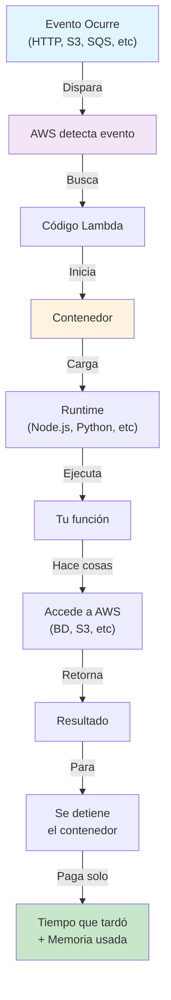
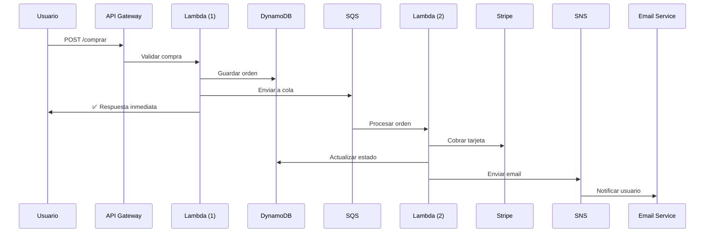
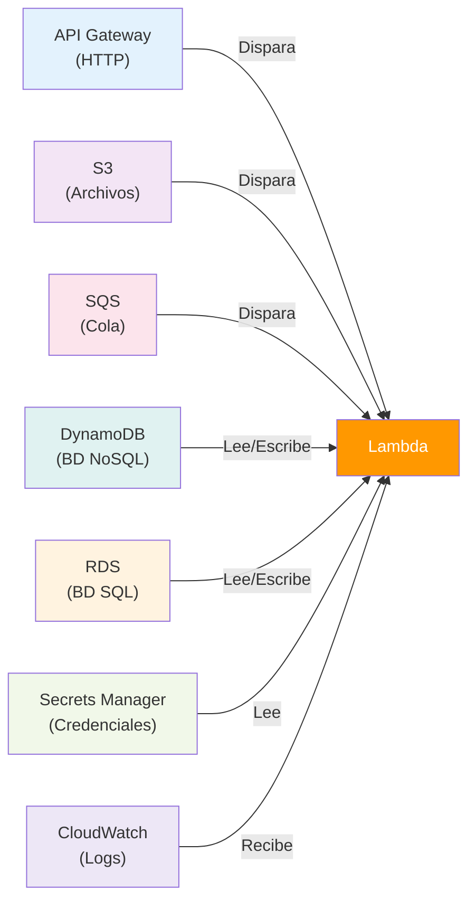

# 🚀 AWS Lambda - Para Dummies

**Última actualización**: 10 mayo 2026  
**Nivel**: Principiante  
**Duración lectura**: 10 minutos

---

## ¿Qué es AWS Lambda?

### La Explicación Simple

**Lambda es un servicio que ejecuta código sin que tengas que gestionar servidores.**

Imagina que tienes una tarea que necesitas hacer:
- Procesar una foto cuando alguien la sube
- Enviar un email cuando llega una compra
- Convertir un video a diferentes formatos
- Responder a una petición HTTP

Normalmente tendrías que:
1. Comprar un servidor
2. Instalar software
3. Configurar el entorno
4. Mantenerlo funcionando 24/7
5. Pagar aunque sea de madrugada cuando nadie lo usa

**Con Lambda, solo**:
1. Subes tu código
2. Dices cuándo ejecutarse
3. **Pagas solo por lo que usas**

---

## 🎯 Concepto Central: "Función sin Servidor"

```
┌─────────────────────────────────┐
│      AWS Lambda                 │
│                                 │
│  Tu código aquí  ↓              │
│  ┌──────────────────────┐      │
│  │ function handler() { │      │
│  │   // Hacer algo      │      │
│  │   return resultado   │      │
│  │ }                    │      │
│  └──────────────────────┘      │
│                                 │
│  Sin preocuparte por:           │
│  ❌ Servidores                  │
│  ❌ OS (Linux/Windows)          │
│  ❌ Dependencias                │
│  ❌ Escalabilidad               │
│  ❌ Seguridad                   │
└─────────────────────────────────┘
```

---

## 📚 Ejemplos Simples

### Ejemplo 1: Función Básica

```javascript
// index.js
exports.handler = async (event) => {
  console.log("¡Hola! Se ejecutó mi función");
  
  return {
    statusCode: 200,
    body: JSON.stringify({
      message: "¡Funciona!",
      timestamp: new Date().toISOString()
    })
  };
};
```

**¿Qué pasa?**
- Subes este código a Lambda
- Lambda lo ejecuta cuando algo lo dispara
- Retorna un resultado
- Listo ✅

### Ejemplo 2: Procesar Eventos

```javascript
// Cuando alguien sube una foto a S3
exports.handler = async (event) => {
  const bucket = event.Records[0].s3.bucket.name;
  const key = event.Records[0].s3.object.key;
  
  console.log(`Nueva foto subida: ${bucket}/${key}`);
  
  // Aquí puedes:
  // 1. Procesar la imagen
  // 2. Crear miniaturas
  // 3. Guardar en base de datos
  // 4. Enviar notificación
  
  return { processed: true };
};
```

### Ejemplo 3: Responder a HTTP

```javascript
// API REST con Lambda + API Gateway
exports.handler = async (event) => {
  const method = event.httpMethod;
  const body = JSON.parse(event.body || '{}');
  
  if (method === 'POST') {
    // Procesar datos
    const result = await procesarPedido(body);
    
    return {
      statusCode: 201,
      body: JSON.stringify(result)
    };
  }
  
  return {
    statusCode: 405,
    body: JSON.stringify({ error: 'Método no permitido' })
  };
};
```

---

## ✅ Beneficios de Lambda

| Beneficio | Descripción |
|-----------|------------|
| **Sin servidores** | Olvida de mantener infraestructura |
| **Paga por uso** | Solo cuando ejecutas código |
| **Escalado automático** | 1 petición o 1 millón, igual funciona |
| **Rápido de desplegar** | Sube código y listo |
| **Integración AWS** | Conecta con 200+ servicios AWS |
| **Múltiples idiomas** | Node.js, Python, Java, Go, C#, Ruby |
| **Sin costos fijos** | Cero pago si no se usa |

### Ejemplo: Costo

```
Servidor tradicional:
┌──────────────────────────────┐
│ Instance EC2: $50/mes        │
│ (aunque no lo uses)          │
│ Total: $50/mes               │
└──────────────────────────────┘

Lambda:
┌──────────────────────────────┐
│ 1M invocaciones: $0.20       │
│ Tiempo ejecución: $0.0000166 │
│ por GB-segundo               │
│ No usado: $0/mes ✅          │
└──────────────────────────────┘
```

---

## 🎪 Casos de Uso: CUÁNDO Usar Lambda

### ✅ IDEAL para Lambda

#### 1. **Procesamiento de Eventos**
```
S3 (foto sube) → Lambda (procesa) → DynamoDB (guarda)
                    ↓
                Base de datos
```
- Alguien sube una foto
- Lambda la redimensiona y crea miniaturas
- La guarda en base de datos

#### 2. **APIs Rápidas**
```
Usuario HTTP POST → API Gateway → Lambda → Respuesta
                                  ↓
                             Procesa datos
```
- Endpoint de compra
- Endpoint de login
- Endpoint de búsqueda

#### 3. **Tareas Programadas**
```
CloudWatch EventBridge (cada noche)
        ↓
     Lambda
        ↓
Limpiar datos antiguos, enviar reportes
```

#### 4. **Procesamiento Asincrónico**
```
SQS (Cola)
   ↓
Lambda (procesa en background)
   ↓
Email enviado o datos procesados
```

#### 5. **Webhooks**
```
GitHub push → Webhook → Lambda → Ejecuta tests/deploy
```

### ❌ NO es IDEAL para Lambda

| Caso | Razón |
|------|-------|
| **Proceso muy largo (> 15 min)** | Lambda timeout = 15 minutos máximo |
| **Mucho almacenamiento** | Lambda tmp = 10GB máximo |
| **Servidor siempre activo** | Lambda "duerme" cuando no se usa |
| **GPU intensivo** | Lambda no tiene GPU dedicada |
| **Conexión BD siempre abierta** | Causa cold starts y agota conexiones |
| **Stream de datos real-time** | Usa Kinesis o Kafka |

---

## 🔄 Cómo Funciona (Diagrama)



---

## 🌀 Flujo Típico: E-commerce



**¿Qué pasó?**
1. Usuario compra → **Lambda (1) responde RÁPIDO** ⚡
2. Orden entra en cola SQS
3. **Lambda (2) procesa en background** 🔄
4. Se cobra y envía email

---

## 💾 Arquitectura: Lambda + Otros Servicios



---

## 📊 Comparación: Lambda vs Otras Opciones

| Aspecto | Lambda | EC2 | App Engine | Container |
|--------|--------|-----|-----------|-----------|
| **Gestionar servidor** | ❌ No | ✅ Sí | ❌ No | ⚠️ Parcial |
| **Paga por uso** | ✅ Sí | ❌ No | ✅ Sí | ⚠️ Depende |
| **Rápido desplegar** | ✅ Segundos | ❌ Minutos | ✅ Segundos | ⚠️ Minutos |
| **Tiempo máximo** | ⚠️ 15 min | ✅ Ilimitado | ⚠️ 24 horas | ✅ Ilimitado |
| **Mejor para** | Eventos | Siempre activo | Web apps | Microsservicios |

---

## 🚀 Lambda + NestJS (En tu Proyecto)

Si quisieras usar Lambda con NestJS:

```typescript
// src/lambda.handler.ts
import { APIGatewayProxyEvent, APIGatewayProxyResult } from 'aws-lambda';
import { NestFactory } from '@nestjs/core';
import { AppModule } from './app.module';

let cachedApp;

export async function handler(
  event: APIGatewayProxyEvent
): Promise<APIGatewayProxyResult> {
  if (!cachedApp) {
    cachedApp = await NestFactory.create(AppModule);
    await cachedApp.init();
  }

  // Procesar petición
  const resultado = await cachedApp.get(AppController).procesar();

  return {
    statusCode: 200,
    body: JSON.stringify(resultado)
  };
}
```

---

## 🎓 Conceptos Clave

### Cold Start
```
Primera ejecución: AWS descarga código + inicia runtime
  ↓
Tarda 1-5 segundos

Ejecuciones siguientes: Contenedor ya está "caliente"
  ↓
Tarda 100ms
```

### Warm Up
Para evitar cold starts:
```
CloudWatch cada 5 min → Lambda dummy call
            ↓
Mantiene contenedor caliente
```

### Memory & Timeout

```
// Configuración Lambda
{
  memory: 512,      // MB (128-10240)
  timeout: 60       // Segundos (máx 900 = 15 min)
}
```

- **Más memoria** = CPU más rápida (pero más caro)
- **Timeout** = Cuánto esperar antes de fallar

---

## 📋 Checklist: ¿Debo Usar Lambda?

```
[ ] ¿El proceso dura < 15 minutos?
[ ] ¿Se ejecuta ocasionalmente (no 24/7)?
[ ] ¿Necesito escalar automáticamente?
[ ] ¿Quiero pagar solo por lo que uso?
[ ] ¿Es un evento o webhook?
[ ] ¿Guarda datos pequeños (< 10GB temp)?

Si respondiste SÍ a la mayoría → ✅ Lambda es para ti
Si respondiste NO a la mayoría → ❌ Usa EC2 o App Engine
```

---

## 🔗 Próximos Pasos

1. **Leer**: `02-API-Gateway-Para-Dummies.md` (cómo exponer Lambda como API)
2. **Leer**: `03-DynamoDB-Para-Dummies.md` (cómo guardar datos)
3. **Experimentar**: Crear tu primera Lambda en consola AWS
4. **Integrar**: Usar Lambda en tu proyecto NestJS

---

## 📚 Resumen Rápido

| Concepto | Qué es |
|----------|--------|
| **Lambda** | Código ejecutado sin servidores |
| **Evento** | Algo que dispara tu Lambda (HTTP, S3, SQS) |
| **Handler** | Función que recibe el evento |
| **Runtime** | Entorno (Node.js, Python, Java, etc) |
| **Cold Start** | Primer inicio es lento |
| **Timeout** | Máximo 15 minutos de ejecución |
| **Memoria** | Más memoria = CPU más rápida |
| **Pago** | Por invocación + tiempo de ejecución |

---

## ✨ Conclusión

**AWS Lambda es perfecto para**:
- ✅ Procesar eventos ocasionales
- ✅ APIs rápidas y escalables
- ✅ Tareas en background
- ✅ Sin gestionar infraestructura
- ✅ Pagar solo lo que usas

**No es ideal para**:
- ❌ Procesos largos (> 15 min)
- ❌ Servidores siempre activos
- ❌ Operaciones con GPU
- ❌ Mucho almacenamiento persistente

---

**¿Preguntas?** Revisa la documentación oficial de AWS Lambda o los otros archivos en esta carpeta.
