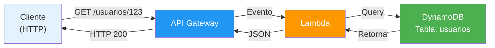
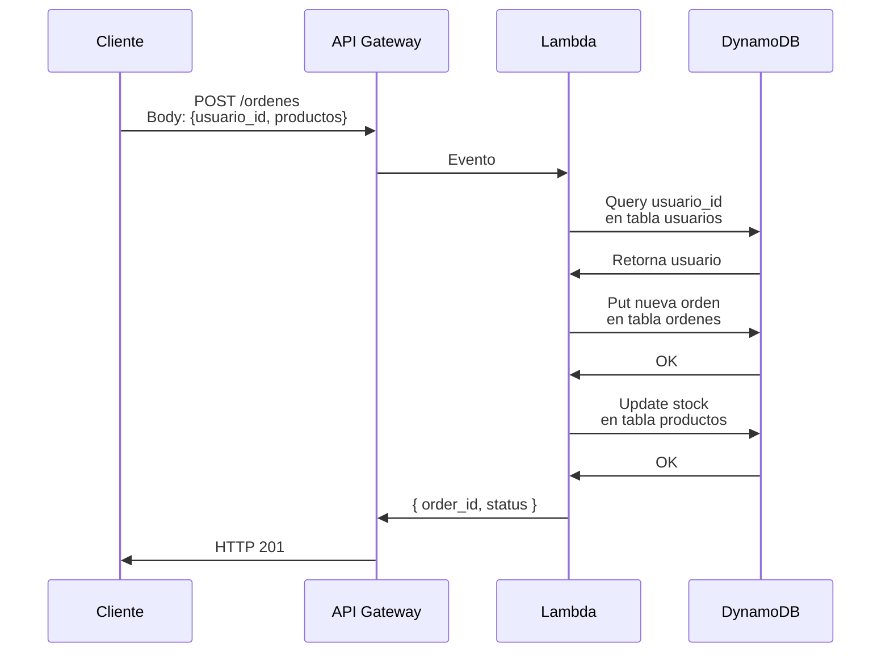

# 💾 AWS DynamoDB - Para Dummies

**Última actualización**: 10 mayo 2026  
**Nivel**: Principiante  
**Duración lectura**: 12 minutos  
**Prerequisito**: Haber leído [01-Lambda-Para-Dummies.md](./01-Lambda-Para-Dummies.md) y [02-API-Gateway-Para-Dummies.md](./02-API-Gateway-Para-Dummies.md)

---

## ¿Qué es AWS DynamoDB?

### La Explicación Simple

**DynamoDB es una base de datos que escala automáticamente sin que tengas que gestionar servidores.**

Imagina que tienes una tienda online:
- Algunos días 10 clientes
- Otros días 10,000 clientes (Black Friday)

**Base de datos tradicional**:
```
Compras servidor más grande → Muy caro
Servidor no aguanta picos → Se cuelga
Mantienes servidor 24/7 → Pago fijo
```

**Con DynamoDB**:
```
1 cliente → 1 servidor pequeño
10,000 clientes → Escala automáticamente
Pagas solo por lo que usas → Sin costo fijo
```

---

## 🎯 Concepto Central: "Base de Datos Sin Servidor"

```
┌──────────────────────────────┐
│      AWS DynamoDB            │
│                              │
│  Guardar datos               │
│  Recuperar datos             │
│  Actualizar datos            │
│  Eliminar datos              │
│                              │
│  Sin preocuparte por:        │
│  ❌ Instalación              │
│  ❌ Mantenimiento            │
│  ❌ Backups                  │
│  ❌ Escalabilidad            │
│  ❌ Particiones              │
│  ❌ Índices                  │
└──────────────────────────────┘
```

---

## 📊 DynamoDB vs SQL: Diferencias Clave

### SQL (Relacional)
```sql
-- Datos organizados en tablas
CREATE TABLE usuarios (
  id INT PRIMARY KEY,
  nombre VARCHAR(100),
  email VARCHAR(100),
  edad INT
);

-- Búsquedas complejas con JOINs
SELECT u.*, o.* FROM usuarios u
JOIN ordenes o ON u.id = o.usuario_id;
```

**Ventajas**: Búsquedas flexibles, JOINs
**Desventajas**: Escala difícil, gestión manual

### DynamoDB (NoSQL)
```javascript
// Datos como documentos JSON
{
  id: "user-123",
  nombre: "Juan",
  email: "juan@email.com",
  edad: 30,
  direcciones: [
    { calle: "Calle 1", ciudad: "Madrid" },
    { calle: "Calle 2", ciudad: "Barcelona" }
  ]
}

// Búsquedas simples y rápidas
const user = await db.get({
  TableName: 'usuarios',
  Key: { id: 'user-123' }
});
```

**Ventajas**: Escala automática, rápido, flexible
**Desventajas**: Búsquedas limitadas, sin JOINs

---

## 📚 Ejemplos Simples

### Ejemplo 1: Guardar Datos

```javascript
// Usar DynamoDB desde Lambda
const AWS = require('aws-sdk');
const dynamodb = new AWS.DynamoDB.DocumentClient();

exports.handler = async (event) => {
  const usuario = {
    id: "user-123",           // Clave primaria
    nombre: "Juan Pérez",
    email: "juan@email.com",
    createdAt: new Date().toISOString(),
    activo: true,
    balance: 100.50
  };

  await dynamodb.put({
    TableName: 'usuarios',
    Item: usuario
  }).promise();

  return { statusCode: 201, body: 'Usuario creado' };
};
```

### Ejemplo 2: Leer Datos

```javascript
// Obtener un usuario por ID
exports.handler = async (event) => {
  const result = await dynamodb.get({
    TableName: 'usuarios',
    Key: {
      id: event.pathParameters.id  // user-123
    }
  }).promise();

  if (!result.Item) {
    return { statusCode: 404, body: 'No encontrado' };
  }

  return {
    statusCode: 200,
    body: JSON.stringify(result.Item)
  };
};
```

### Ejemplo 3: Buscar (Query)

```javascript
// Buscar todas las órdenes de un usuario
exports.handler = async (event) => {
  const userId = event.pathParameters.userId;

  const result = await dynamodb.query({
    TableName: 'ordenes',
    KeyConditionExpression: 'usuario_id = :uid',
    ExpressionAttributeValues: {
      ':uid': userId
    }
  }).promise();

  return {
    statusCode: 200,
    body: JSON.stringify(result.Items)
  };
};
```

### Ejemplo 4: Actualizar

```javascript
// Actualizar balance de usuario
exports.handler = async (event) => {
  const { userId, nuevoBalance } = JSON.parse(event.body);

  await dynamodb.update({
    TableName: 'usuarios',
    Key: { id: userId },
    UpdateExpression: 'SET balance = :bal',
    ExpressionAttributeValues: {
      ':bal': nuevoBalance
    }
  }).promise();

  return { statusCode: 200, body: 'Actualizado' };
};
```

### Ejemplo 5: Eliminar

```javascript
// Eliminar usuario
exports.handler = async (event) => {
  const userId = event.pathParameters.id;

  await dynamodb.delete({
    TableName: 'usuarios',
    Key: { id: userId }
  }).promise();

  return { statusCode: 204 };
};
```

---

## ✅ Beneficios de DynamoDB

| Beneficio | Descripción |
|-----------|------------|
| **Sin servidores** | Olvida gestionar BD |
| **Escala automática** | 1 petición o 1 millón, igual funciona |
| **Rápido** | Milisegundos de latencia |
| **Sin mantenimiento** | AWS gestiona todo |
| **Paga por uso** | Cero si no lo usas |
| **Altamente disponible** | Replicado en 3 datacenters |
| **Encriptado** | Datos seguros automáticamente |
| **Global** | Replicated en múltiples regiones |
| **Integrado AWS** | Lambda, API Gateway, etc |

---

## 🏗️ Estructura de DynamoDB

### Tabla
```
┌─────────────────────────────────┐
│ Tabla: usuarios                 │
├─────────────────────────────────┤
│ Clave Primaria: id              │
├─────────────────────────────────┤
│ id    │ nombre  │ email         │
├───────┼─────────┼───────────────┤
│ 1     │ Juan    │ juan@mail.com │
│ 2     │ María   │ maria@mail.com│
│ 3     │ Carlos  │ carlos@mail.com
└─────────────────────────────────┘
```

### Tipos de Claves

```
1. CLAVE PRIMARIA SIMPLE
   ┌──────────────┐
   │ id (único)   │
   └──────────────┘
   Ejemplo: GET usuario con id = "123"

2. CLAVE PRIMARIA COMPUESTA
   ┌──────────────────────┐
   │ Partition Key │ Sort Key
   ├───────────────┼─────────┤
   │ usuario_id    │ fecha   │
   └───────────────┴─────────┘
   Ejemplo: GET todas las órdenes del usuario 123 entre fechas
```

---

## 🔍 Operaciones: Scan vs Query

### Query (Recomendado - Rápido)
```javascript
// Buscar órdenes de usuario 123 (usa Clave Primaria)
const result = await dynamodb.query({
  TableName: 'ordenes',
  KeyConditionExpression: 'usuario_id = :uid',
  ExpressionAttributeValues: {
    ':uid': '123'
  }
}).promise();

// Costo: Baja
// Velocidad: Rápida
// Ideal para: Búsquedas por clave primaria
```

### Scan (No recomendado - Lento)
```javascript
// Buscar todas las órdenes de valor > 100 (lee toda la tabla)
const result = await dynamodb.scan({
  TableName: 'ordenes',
  FilterExpression: 'monto > :val',
  ExpressionAttributeValues: {
    ':val': 100
  }
}).promise();

// Costo: Alto
// Velocidad: Lenta
// Ideal para: Búsquedas únicas o analytics
```

---

## 📊 Arquitectura: DynamoDB + Lambda + API Gateway



---

## 🔄 Flujo: Crear Orden (E-commerce)



---

## 💰 Costos de DynamoDB

### On-Demand (Recomendado para comenzar)
```
Lectura: $0.25 por millón de unidades
Escritura: $1.25 por millón de unidades

Ejemplo:
100,000 lecturas al mes: $0.025
100,000 escrituras al mes: $0.125
Total: $0.15/mes
```

### Provisioned Capacity (Para producción predecible)
```
Lees X unidades por segundo (RCU)
Escribes Y unidades por segundo (WCU)

Ejemplo:
100 RCU: $47.48/mes
100 WCU: $237.40/mes
Total: $284.88/mes (aunque lo uses poco)
```

---

## 🔐 Índices en DynamoDB

### Primary Index (Clave Primaria)
```
Tabla: ordenes
Primary Key: usuario_id (Partition) + fecha (Sort)

Query: "Todas las órdenes del usuario 123"
✅ Rápido (usa índice primario)
```

### Global Secondary Index (GSI)
```
Tabla: ordenes
Primary Key: usuario_id + fecha

GSI: email + estado
(Permite búsquedas por email sin usuario_id)

Query: "Todas las órdenes pagas de juan@mail.com"
✅ Rápido (usa GSI)
```

---

## 📋 Tipos de Datos en DynamoDB

```javascript
{
  // String
  nombre: "Juan",
  
  // Number
  edad: 30,
  balance: 99.99,
  
  // Boolean
  activo: true,
  
  // Null
  referencia: null,
  
  // List (Array)
  direcciones: [
    "Calle 1, Madrid",
    "Calle 2, Barcelona"
  ],
  
  // Map (Objeto)
  contacto: {
    email: "juan@mail.com",
    telefono: "+34123456"
  },
  
  // Binary (datos binarios)
  imagen: Buffer.from("..."),
  
  // String Set (conjunto único de strings)
  tags: new Set(["premium", "vip"]),
  
  // Number Set (conjunto único de números)
  numeros: new Set([1, 2, 3])
}
```

---

## 📊 Comparación: DynamoDB vs Alternativas

| Aspecto | DynamoDB | RDS (SQL) | MongoDB | Firestore |
|--------|----------|-----------|---------|-----------|
| **Tipo** | NoSQL | SQL | NoSQL | NoSQL |
| **Escala automática** | ✅ Sí | ❌ No | ⚠️ Parcial | ✅ Sí |
| **Sin servidores** | ✅ Sí | ❌ No | ❌ No | ✅ Sí |
| **Paga por uso** | ✅ Sí | ❌ No | ❌ No | ✅ Sí |
| **JOINs** | ❌ No | ✅ Sí | ⚠️ Agregación | ❌ No |
| **Transacciones** | ✅ Sí | ✅ Sí | ✅ Sí | ✅ Sí |
| **Mejor para** | APIs/Lambda | Apps complejas | Flexible | Móviles |
| **Latencia** | <10ms | 10-100ms | 5-50ms | 10-100ms |

---

## 🎯 Casos de Uso: CUÁNDO Usar DynamoDB

### ✅ IDEAL para DynamoDB

#### 1. **APIs REST con Lambda**
```
GET /usuarios/{id} → Lectura rápida en DynamoDB
POST /usuarios → Inserción rápida
PUT /usuarios/{id} → Actualización rápida
```

#### 2. **E-commerce**
```
Usuarios → DynamoDB
Órdenes → DynamoDB
Productos → DynamoDB
Inventario → DynamoDB
```

#### 3. **Real-time Analytics**
```
Eventos llegando constantemente
        ↓
DynamoDB escala automáticamente
        ↓
Análisis en tiempo real
```

#### 4. **Aplicaciones Mobile**
```
App ↔ API Gateway ↔ Lambda ↔ DynamoDB
Escalabilidad automática
```

#### 5. **Chat o Mensajería**
```
Mensajes guardados en DynamoDB
Múltiples usuarios simultáneamente
Escala automáticamente
```

### ❌ NO es IDEAL para DynamoDB

| Caso | Razón | Alternativa |
|------|-------|------------|
| **Búsquedas complejas con JOINs** | DynamoDB no tiene JOINs | RDS (PostgreSQL) |
| **Reportes complejos** | No es bueno para OLAP | Redshift o BigQuery |
| **Datos altamente relacionados** | Sin relaciones normales | RDS (SQL) |
| **Búsquedas full-text** | No tiene búsqueda de texto | Elasticsearch |
| **Transacciones ACID complejas** | Soporte limitado | RDS (SQL) |

---

## 🚀 DynamoDB + NestJS

### Instalación
```bash
npm install aws-sdk
# o
npm install @aws-sdk/client-dynamodb
```

### Crear Servicio DynamoDB

```typescript
import { Injectable } from '@nestjs/common';
import { DynamoDBClient } from '@aws-sdk/client-dynamodb';
import { DynamoDBDocumentClient, get, put, query } from '@aws-sdk/lib-dynamodb';

@Injectable()
export class DynamoDBService {
  private client: DynamoDBDocumentClient;

  constructor() {
    const dynamoClient = new DynamoDBClient({ region: 'us-east-1' });
    this.client = DynamoDBDocumentClient.from(dynamoClient);
  }

  async getUser(id: string) {
    const result = await this.client.send(
      new get({
        TableName: 'usuarios',
        Key: { id }
      })
    );
    return result.Item;
  }

  async createUser(usuario) {
    await this.client.send(
      new put({
        TableName: 'usuarios',
        Item: {
          id: usuario.id,
          nombre: usuario.nombre,
          email: usuario.email,
          createdAt: new Date().toISOString()
        }
      })
    );
    return usuario;
  }

  async getUserOrders(usuarioId: string) {
    const result = await this.client.send(
      new query({
        TableName: 'ordenes',
        KeyConditionExpression: 'usuario_id = :uid',
        ExpressionAttributeValues: {
          ':uid': usuarioId
        }
      })
    );
    return result.Items;
  }
}
```

### Usar en Controller

```typescript
import { Controller, Get, Post, Param, Body } from '@nestjs/common';
import { DynamoDBService } from './dynamodb.service';

@Controller('usuarios')
export class UsuariosController {
  constructor(private dynamoDBService: DynamoDBService) {}

  @Get(':id')
  async getUser(@Param('id') id: string) {
    return await this.dynamoDBService.getUser(id);
  }

  @Post()
  async createUser(@Body() usuario) {
    return await this.dynamoDBService.createUser(usuario);
  }

  @Get(':id/ordenes')
  async getUserOrders(@Param('id') usuarioId: string) {
    return await this.dynamoDBService.getUserOrders(usuarioId);
  }
}
```

---

## 🎓 Conceptos Clave

### Partition Key (Clave de Partición)
```
DynamoDB distribuye datos según Partition Key
usuario_id = "123" → Partición A
usuario_id = "456" → Partición B

Query rápida si especificas Partition Key
Scan lento si no la especificas
```

### Sort Key (Clave de Ordenamiento)
```
Tabla: ordenes
Partition Key: usuario_id
Sort Key: fecha

Query: usuario_id = "123" AND fecha > "2026-01-01"
Retorna: Órdenes ordenadas por fecha
```

### TTL (Time To Live)
```javascript
// Campo TTL: expira automáticamente
{
  id: "session-123",
  token: "abc123xyz",
  expiresAt: Math.floor(Date.now() / 1000) + 3600  // 1 hora
}

// DynamoDB automáticamente borra cuando expiresAt < ahora
```

### Consistency Model

```
Strong Consistency:
GET usuario → Espera último UPDATE
✅ Siempre correcto
❌ Más lento

Eventually Consistent:
GET usuario → Puede ser versión anterior
✅ Más rápido
❌ Puede no ser actual
```

---

## ⚠️ Limitaciones de DynamoDB

```
Máximo tamaño item: 400 KB
Máximo tamaño batch: 16 MB
Máximo RCU/WCU: 40,000
Máximo GSI: 20
Máximo LSI: 10
Máximo particiones: 10,000
```

---

## 📋 Checklist: DynamoDB Básico

```
[ ] ¿Necesito guardar datos sin gestionar servidor?
    → SÍ: DynamoDB
    
[ ] ¿Los datos son JSON-like o documentos?
    → SÍ: DynamoDB es ideal
    
[ ] ¿Tengo búsquedas complejas con JOINs?
    → SÍ: Usa RDS en su lugar
    
[ ] ¿Necesito escalar automáticamente?
    → SÍ: DynamoDB
    
[ ] ¿Quiero pagar solo por lo que uso?
    → SÍ: DynamoDB On-Demand
    
[ ] ¿Accedo desde Lambda?
    → SÍ: DynamoDB está optimizado para esto
```

---

## 🔗 Próximos Pasos

1. **Leer**: `04-SQS-Para-Dummies.md` (colas asincrónicas)
2. **Leer**: `05-RDS-Para-Dummies.md` (base de datos SQL)
3. **Experimentar**: Crear tabla en consola AWS
4. **Integrar**: Usar DynamoDB en tu proyecto NestJS

---

## 📚 Resumen Rápido

| Concepto | Qué es |
|----------|--------|
| **DynamoDB** | Base de datos NoSQL sin servidor |
| **Tabla** | Colección de items (como tabla SQL) |
| **Item** | Un documento JSON |
| **Clave primaria** | Identifica único item |
| **Partition Key** | Divide datos entre particiones |
| **Sort Key** | Ordena items dentro partición |
| **Query** | Búsqueda rápida (usa clave) |
| **Scan** | Búsqueda lenta (lee todo) |
| **GSI** | Índice secundario (otra clave) |
| **TTL** | Vencimiento automático |

---

## ✨ Conclusión

**DynamoDB es perfecto para**:
- ✅ APIs sin servidor (Lambda + API Gateway)
- ✅ Datos que escalan automáticamente
- ✅ Aplicaciones mobile/web
- ✅ Pagar solo lo que usas
- ✅ Baja latencia (< 10ms)

**No es ideal para**:
- ❌ Búsquedas complejas con JOINs
- ❌ Datos altamente relacionados
- ❌ Reportes complejos (OLAP)
- ❌ Búsqueda full-text

---

**¿Preguntas?** Consulta la documentación oficial de AWS o continúa con los otros archivos en esta carpeta.
