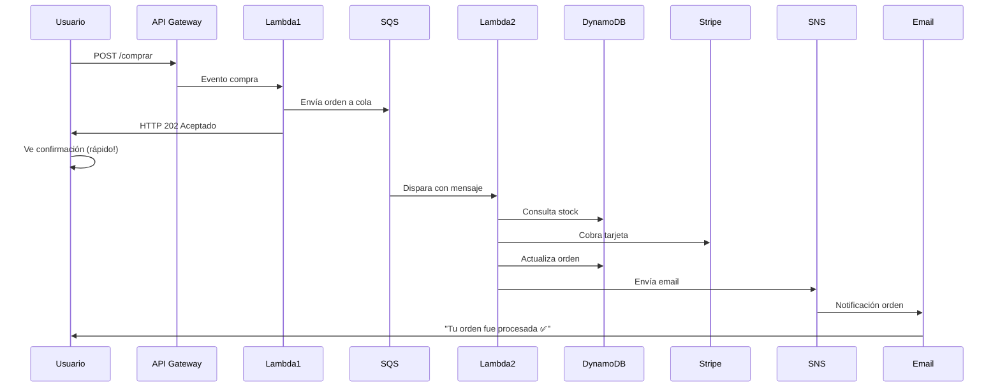
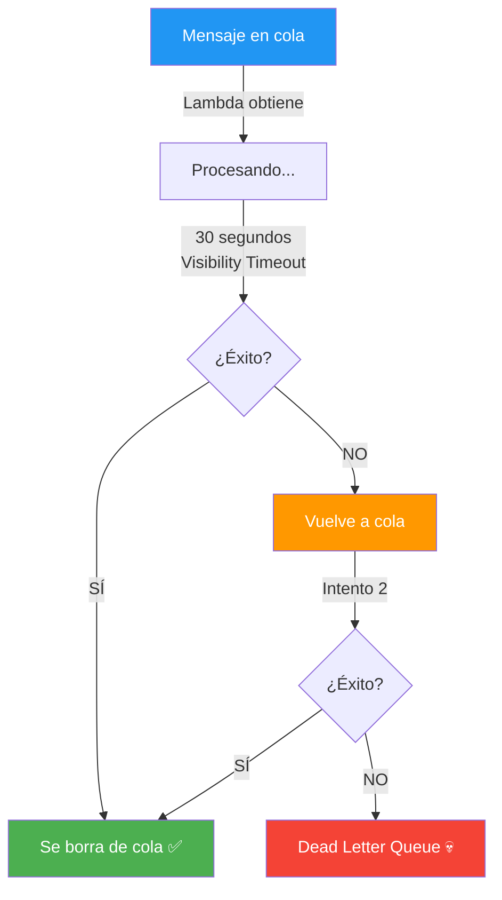
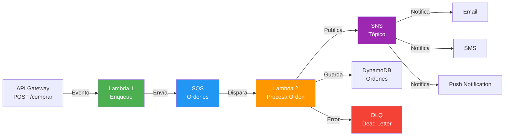

# 📬 AWS SQS (Simple Queue Service) - Para Dummies

**Última actualización**: 10 mayo 2026  
**Nivel**: Principiante  
**Duración lectura**: 12 minutos  
**Prerequisito**: Haber leído [01-Lambda-Para-Dummies.md](./01-Lambda-Para-Dummies.md)

---

## ¿Qué es AWS SQS?

### La Explicación Simple

**SQS es una cola de mensajes que permite que aplicaciones se comuniquen sin acoplarse.**

Imagina una pizzería:

**Sin SQS (Acoplado)**:
```
Cliente llama → Pizzero responde INMEDIATAMENTE
               ↓
            ¿Si el pizzero está ocupado?
            ↓
         El cliente espera (bloqueado)
            ↓
         Si hay muchos clientes: Sistema colapsa
```

**Con SQS (Desacoplado)**:
```
Cliente llama → Dejar mensaje en cola
               ↓
         Cliente se va (no espera)
               ↓
         Pizzero procesa cuando puede
               ↓
         Múltiples clientes sin problema
```

**En desarrollo**:
```
Sin SQS:
POST /comprar → Lambda (procesa AHORA) → Respuesta inmediata
             Si tarda 10 segundos: Usuario espera bloqueado ❌

Con SQS:
POST /comprar → Lambda (envía a cola) → Respuesta inmediata ✅
             ↓
        Otra Lambda procesa asincronía
             ↓
        Email, stock, etc
```

---

## 🎯 Concepto Central: "Cola de Mensajes"

```
┌─────────────────────────────────┐
│  SQS (Cola)                     │
│                                 │
│  Mensaje 1 →                    │
│  Mensaje 2 →                    │
│  Mensaje 3 →                    │
│  Mensaje 4 →                    │
│  Mensaje 5 →                    │
│                                 │
│  FIFO: Primero entra, primero sale
│  (First In, First Out)          │
└─────────────────────────────────┘
```

---

## 📚 Ejemplos Simples

### Ejemplo 1: Enviar Mensaje a Cola

```javascript
// Lambda 1: Recibe compra, envía a cola
const AWS = require('aws-sdk');
const sqs = new AWS.SQS();

exports.handler = async (event) => {
  const compra = JSON.parse(event.body);

  // Enviar mensaje a cola
  await sqs.sendMessage({
    QueueUrl: 'https://sqs.us-east-1.amazonaws.com/123456/ordenes',
    MessageBody: JSON.stringify({
      usuario_id: compra.usuario_id,
      productos: compra.productos,
      total: compra.total,
      timestamp: new Date().toISOString()
    })
  }).promise();

  // Responder INMEDIATAMENTE (sin esperar procesamiento)
  return {
    statusCode: 202,  // Accepted (procesándose)
    body: JSON.stringify({ 
      message: 'Compra recibida, procesándose...',
      order_id: 'order-123'
    })
  };
};
```

**¿Qué pasó?**
- ✅ Usuario recibe respuesta inmediata
- ✅ Mensaje guardado en cola
- ✅ Otro Lambda lo procesa después

### Ejemplo 2: Recibir Mensajes de Cola

```javascript
// Lambda 2: Procesa mensajes de la cola
const AWS = require('aws-sdk');
const sqs = new AWS.SQS();
const dynamodb = new AWS.DynamoDB.DocumentClient();

exports.handler = async (event) => {
  console.log('Procesando mensaje de SQS');

  // event.Records contiene mensajes de la cola
  for (const record of event.Records) {
    const compra = JSON.parse(record.body);

    console.log('Procesando compra:', compra.order_id);

    // 1. Validar stock
    await validarStock(compra);

    // 2. Cobrar con Stripe
    await cobrarTarjeta(compra);

    // 3. Guardar orden en DynamoDB
    await dynamodb.put({
      TableName: 'ordenes',
      Item: {
        order_id: compra.order_id,
        usuario_id: compra.usuario_id,
        status: 'pagada',
        productos: compra.productos,
        total: compra.total
      }
    }).promise();

    // 4. Enviar email
    await enviarEmail(compra.usuario_id, compra);

    console.log('✅ Compra procesada:', compra.order_id);
  }

  return { statusCode: 200, body: 'OK' };
};
```

**¿Qué pasó?**
- Lambda recibe mensajes de la cola
- Procesa cada uno
- Si falla: SQS lo reintenta automáticamente

### Ejemplo 3: Batch Messages

```javascript
// Enviar múltiples mensajes a la vez
const params = {
  QueueUrl: 'https://sqs.us-east-1.amazonaws.com/123456/ordenes',
  Entries: [
    {
      Id: '1',
      MessageBody: JSON.stringify({ orden_id: 1 })
    },
    {
      Id: '2',
      MessageBody: JSON.stringify({ orden_id: 2 })
    },
    {
      Id: '3',
      MessageBody: JSON.stringify({ orden_id: 3 })
    }
  ]
};

await sqs.sendMessageBatch(params).promise();
```

### Ejemplo 4: Visibility Timeout

```javascript
// Procesar mensaje con reintento automático
exports.handler = async (event) => {
  for (const record of event.Records) {
    try {
      const orden = JSON.parse(record.body);
      
      // Procesar orden
      await procesarOrden(orden);
      
      console.log('✅ Orden procesada, se borra de la cola');
      // SQS automáticamente lo borra si no hay error
      
    } catch (error) {
      console.error('❌ Error procesando:', error);
      // NO lanzamos error para que SQS NO lo borre
      // Después de Visibility Timeout (30s), vuelve a la cola
      // Se reintenta hasta 3 veces (configurable)
    }
  }
};
```

---

## ✅ Beneficios de SQS

| Beneficio | Descripción |
|-----------|------------|
| **Desacoplamiento** | Productor y consumidor independientes |
| **Asincrónico** | Respuestas inmediatas al cliente |
| **Escalabilidad** | Maneja millones de mensajes |
| **Durabilidad** | Mensajes persistidos (3 datacenters) |
| **Reintentos automáticos** | Fallos se reintenta automáticamente |
| **Visibility Timeout** | Evita duplicados |
| **Dead Letter Queue** | Mensajes que fallan van a DLQ |
| **Bajo costo** | $0.40 por millón de solicitudes |
| **Sin servidor** | AWS gestiona todo |
| **Integración AWS** | Lambda, SNS, EventBridge, etc |

---

## 🔄 Arquitectura: Sin SQS vs Con SQS

### ❌ SIN SQS (Síncrono - Bloqueante)

```mermaid
graph LR
    A["Cliente<br/>HTTP POST"] -->|Espera| B["Lambda<br/>Compra"]
    B -->|Llama| C["Validar<br/>Stock"]
    C -->|Llama| D["Cobrar<br/>Stripe"]
    D -->|Llama| E["Guardar<br/>BD"]
    E -->|Llama| F["Enviar<br/>Email"]
    F -->|Respuesta| B
    B -->|HTTP 200| A
    
    style B fill:#ff9800,color:#fff
    style A fill:#e3f2fd
    
    Note: Tiempo total = 10 segundos ⏱️<br/>Usuario espera bloqueado 😞
```

### ✅ CON SQS (Asincrónico - No bloqueante)

```mermaid
graph LR
    A["Cliente<br/>HTTP POST"] -->|Respuesta rápida| B["Lambda 1<br/>Enqueue"]
    B -->|Envía a| C["SQS Cola"]
    C -->|Dispara| D["Lambda 2<br/>Procesa"]
    D -->|Valida| E["Stock"]
    E -->|Cobra| F["Stripe"]
    F -->|Guarda| G["BD"]
    G -->|Envía| H["Email"]
    
    style B fill:#4caf50,color:#fff
    style D fill:#ff9800,color:#fff
    style C fill:#2196f3,color:#fff
    style A fill:#e3f2fd
    
    Note: Tiempo respuesta = 100ms ⚡<br/>Procesamiento = 10 segundos (en background) 🎉
```

---

## 🌀 Flujo E-commerce Completo



---

## 📊 Tipos de SQS

### Standard Queue (Estándar)
```
Características:
✅ Mensajes casi siempre en orden (not guaranteed)
✅ Entrega al menos una vez (puede duplicar)
✅ Throughput ilimitado
✅ Más barato

Ideal para:
- Tareas no críticas
- Órdenes no importante si llegan duplicadas
```

### FIFO Queue (First In First Out)
```
Características:
✅ Mensajes exactamente en orden
✅ Exactamente una vez (sin duplicados)
✅ Throughput máximo: 300 msg/seg
✅ Más caro que Standard

Ideal para:
- Transacciones bancarias
- Órdenes críticas
- Datos que NO pueden duplicarse
```

---

## 🎯 Comparación: Standard vs FIFO

```
Escenario: 3 mensajes (A, B, C)

Standard Queue:
┌─────────────────────────┐
│ A        B        C     │
│ ↓        ↓        ↓     │
│ Orden: A, C, B (aleatorio)
│ Duplicados: posible     │
└─────────────────────────┘

FIFO Queue:
┌─────────────────────────┐
│ A        B        C     │
│ ↓        ↓        ↓     │
│ Orden: A, B, C (siempre)
│ Duplicados: NO          │
└─────────────────────────┘
```

---

## 🔄 Visibility Timeout y Reintentos



---

## 💀 Dead Letter Queue (DLQ)

```
Mensajes que fallan después de N reintentos
        ↓
Van a Dead Letter Queue
        ↓
Puedes investigar por qué fallaron
        ↓
Procesarlos manualmente o modificar lógica

Ejemplo:
Reintento 1: Falla (Stripe offline)
Reintento 2: Falla (Stripe offline)
Reintento 3: Falla (Stripe offline)
        ↓
DLQ: Mensaje para investigar
```

---

## 🏗️ Arquitectura Completa: Lambda + SQS + SNS



---

## 💰 Costos de SQS

### Standard Queue
```
$0.40 por millón de solicitudes

Ejemplo:
100 millones/mes: $40

Incluye:
- 15 segundos visibilidad (gratis)
- 3 datacenters (replicado, gratis)
```

### FIFO Queue
```
$0.50 por millón de solicitudes

Ejemplo:
100 millones/mes: $50

Incluye:
- Entrega exactamente una vez
- Orden garantizado
```

---

## 📊 Comparación: SQS vs Alternativas

| Aspecto | SQS | SNS | Kafka | RabbitMQ |
|--------|-----|-----|-------|----------|
| **Tipo** | Cola | Pub/Sub | Stream | Broker |
| **Orden** | No garantizado | No | Sí | Configurable |
| **Reintento** | Automático | Manual | Manual | Configurable |
| **Escalabilidad** | Ilimitada | Ilimitada | Alto | Buena |
| **Durabilidad** | Alto | Alto | Alto | Alto |
| **Sin servidor** | ✅ Sí | ✅ Sí | ❌ No | ❌ No |
| **Mejor para** | Colas simples | Notificaciones | Eventos stream | Microservicios |

---

## 🎯 Casos de Uso: CUÁNDO Usar SQS

### ✅ IDEAL para SQS

#### 1. **Procesamiento Asincrónico**
```
Usuario compra → Respuesta inmediata
             ↓
        SQS procesa en background
             ↓
        Cobro, email, stock
```

#### 2. **Rate Limiting / Throttling**
```
10,000 clientes mandan requests
         ↓
    SQS los almacena
         ↓
Lambda procesa a su velocidad
```

#### 3. **Decoupling**
```
Servidor A → SQS → Servidor B
(no se conocen entre sí)
```

#### 4. **Reintentos Automáticos**
```
API externa offline
         ↓
SQS lo reintenta automáticamente
         ↓
Cuando vuelve online: Funciona
```

#### 5. **Batch Processing**
```
Procesar 1 millón de registros
         ↓
Enviar a SQS
         ↓
Múltiples Lambda procesan en paralelo
```

### ❌ NO es IDEAL para SQS

| Caso | Razón | Alternativa |
|------|-------|------------|
| **Requiere orden garantizado** | Standard no garantiza | FIFO SQS o Kafka |
| **Múltiples consumidores** | SQS es 1 a 1 | SNS (pub/sub) |
| **Streaming de eventos** | SQS no retiene | Kafka o Kinesis |
| **Request/Response síncrono** | SQS es asincrónico | HTTP directo |

---

## 🚀 SQS + NestJS

### Instalación
```bash
npm install aws-sdk
```

### Servicio SQS

```typescript
import { Injectable } from '@nestjs/common';
import { SQS } from 'aws-sdk';

@Injectable()
export class SQSService {
  private sqs = new SQS({ region: 'us-east-1' });

  async sendMessage(mensaje: any) {
    const params = {
      QueueUrl: process.env.SQS_QUEUE_URL,
      MessageBody: JSON.stringify(mensaje)
    };

    const result = await this.sqs.sendMessage(params).promise();
    return result;
  }

  async sendBatch(mensajes: any[]) {
    const params = {
      QueueUrl: process.env.SQS_QUEUE_URL,
      Entries: mensajes.map((msg, idx) => ({
        Id: String(idx),
        MessageBody: JSON.stringify(msg)
      }))
    };

    const result = await this.sqs.sendMessageBatch(params).promise();
    return result;
  }

  async receiveMessages() {
    const params = {
      QueueUrl: process.env.SQS_QUEUE_URL,
      MaxNumberOfMessages: 10,
      WaitTimeSeconds: 20  // Long polling
    };

    const result = await this.sqs.receiveMessage(params).promise();
    return result.Messages || [];
  }

  async deleteMessage(receiptHandle: string) {
    const params = {
      QueueUrl: process.env.SQS_QUEUE_URL,
      ReceiptHandle: receiptHandle
    };

    await this.sqs.deleteMessage(params).promise();
  }
}
```

### Controller con SQS

```typescript
import { Controller, Post, Body } from '@nestjs/common';
import { SQSService } from './sqs.service';

@Controller('ordenes')
export class OrdenesController {
  constructor(private sqsService: SQSService) {}

  @Post()
  async crearOrden(@Body() orden) {
    // Enviar a cola (asincrónico)
    await this.sqsService.sendMessage({
      usuario_id: orden.usuario_id,
      productos: orden.productos,
      total: orden.total,
      timestamp: new Date().toISOString()
    });

    // Responder inmediatamente
    return {
      statusCode: 202,
      message: 'Orden recibida, procesándose...'
    };
  }
}
```

### Lambda Handler para Procesar

```typescript
import { SQSEvent } from 'aws-lambda';
import { SQSService } from './sqs.service';

export async function procesarOrdenes(event: SQSEvent) {
  const sqsService = new SQSService();

  for (const record of event.Records) {
    try {
      const orden = JSON.parse(record.body);
      
      console.log('Procesando orden:', orden);
      
      // Tu lógica aquí
      await procesarPago(orden);
      await guardarOrden(orden);
      await enviarEmail(orden);
      
      console.log('✅ Orden procesada');
      
    } catch (error) {
      console.error('❌ Error:', error);
      // No lancar error, SQS lo reintentar
    }
  }
}
```

---

## 🎓 Conceptos Clave

### Long Polling (Recomendado)
```
Sin Long Polling:
Lambda pregunta constantemente: ¿hay mensajes?
         ↓
Desperdicia dinero (muchos requests sin resultado)

Con Long Polling:
Lambda espera hasta 20 segundos
         ↓
Si hay mensajes: responde inmediatamente
Si no: espera y después responde
         ↓
Menos requests = Menos costo ✅
```

### Message Deduplication (FIFO)
```
Si envías mismo mensaje 2 veces:

Standard: Ambos se procesan (puede duplicar)

FIFO: Usa Deduplication ID
      Si mismo ID: Se ignora el duplicado
      ✅ Exactamente una vez
```

### Message Group (FIFO)
```
FIFO + Message Group:

Grupo A: Mensajes de usuario 1 (orden)
Grupo B: Mensajes de usuario 2 (orden)

Cada grupo procesa en orden
Grupos en paralelo

Garantiza: Órdenes de mismo usuario en orden
```

---

## ⚠️ Limitaciones de SQS

```
Tamaño mensaje: máximo 256 KB
Retention período: 4 días default (máximo 14)
Mensajes en fila: ilimitados
Throughput: ilimitado (standard)
              3,000 msg/seg (FIFO)
Visibility timeout: máximo 12 horas
```

---

## 📋 Checklist: SQS Básico

```
[ ] ¿Necesito respuesta inmediata al usuario?
    → SÍ: Usa SQS
    
[ ] ¿La tarea es pesada (10+ segundos)?
    → SÍ: Procesa asincronía con SQS
    
[ ] ¿Pueden fallar algunos mensajes?
    → SÍ: SQS reintenta automáticamente
    
[ ] ¿Necesito exactamente una vez?
    → SÍ: FIFO SQS
    
[ ] ¿Múltiples consumidores?
    → SÍ: Usa SNS en su lugar
    
[ ] ¿Requiero orden garantizado?
    → SÍ: FIFO SQS
```

---

## 🔗 Próximos Pasos

1. **Leer**: `05-SNS-Para-Dummies.md` (notificaciones)
2. **Leer**: `06-Secrets-Manager-Para-Dummies.md` (credenciales)
3. **Experimentar**: Crear cola en consola AWS
4. **Integrar**: Usar SQS en tu proyecto NestJS

---

## 📚 Resumen Rápido

| Concepto | Qué es |
|----------|--------|
| **SQS** | Cola de mensajes asincrónica |
| **Queue** | Lista de mensajes en orden |
| **Message** | Contenido (JSON) a procesar |
| **Producer** | Envía mensajes (Lambda 1) |
| **Consumer** | Procesa mensajes (Lambda 2) |
| **Visibility Timeout** | Tiempo antes de reintentar |
| **Dead Letter Queue** | Mensajes que fallan |
| **FIFO** | Order garantizado, sin duplicados |
| **Standard** | Orden NO garantizado, más barato |
| **Long Polling** | Espera eficiente sin wasting requests |

---

## ✨ Conclusión

**SQS es perfecto para**:
- ✅ Desacoplar aplicaciones
- ✅ Procesar asincronía
- ✅ Respuestas inmediatas
- ✅ Reintentos automáticos
- ✅ Escalar sin problemas
- ✅ Bajo costo

**No es ideal para**:
- ❌ Múltiples consumidores (usa SNS)
- ❌ Streaming de eventos (usa Kafka)
- ❌ Datos que requieren orden exacto (usa FIFO)
- ❌ Request/response síncrono

---

**¿Preguntas?** Lee los otros archivos en esta carpeta o la documentación oficial de AWS.
