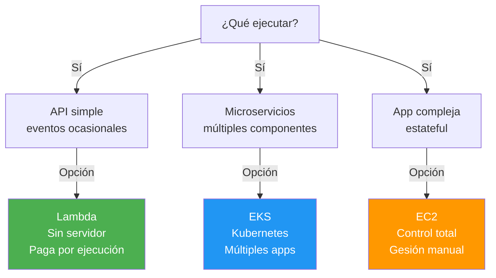
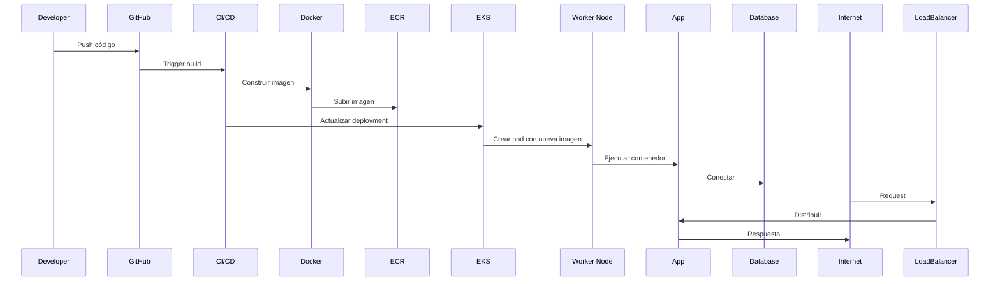
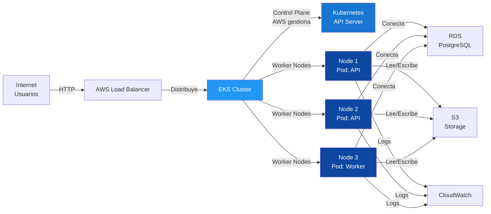

# 🐳 AWS EKS (Elastic Kubernetes Service) - Para Dummies

**Última actualización**: 10 mayo 2026  
**Nivel**: Principiante  
**Duración lectura**: 15 minutos  
**Prerequisito**: Haber leído los anteriores archivos de AWS

---

## ¿Qué es AWS EKS?

### La Explicación Simple

**EKS es un servicio que ejecuta contenedores (Docker) en Kubernetes sin que tengas que gestionar el cluster.**

Imagina que tienes muchas aplicaciones:

**Sin EKS (Caos)**:
```
Tienes 10 servidores EC2
        ↓
¿Cuál ejecuta cuál aplicación?
        ↓
¿Qué pasa si uno se cae?
        ↓
¿Cómo escalo?
        ↓
Pesadilla ❌
```

**Con EKS (Orden)**:
```
Dices: "Ejecuta esta aplicación en 5 copias"
        ↓
EKS lo hace automáticamente
        ↓
Si uno se cae: automáticamente lo recupera
        ↓
Si necesito más: EKS escala
        ↓
Tranquilidad ✅
```

---

## 🎯 Conceptos Clave: Docker, Contenedores, Kubernetes

### Docker (Contenedor)

```
Imagina: Tu aplicación en una caja hermética

Sin Docker:
┌────────────────────────────┐
│ Servidor A                 │
│ ├─ Node.js 16             │
│ ├─ Python 3.9             │
│ ├─ MongoDB                │
│ └─ Tu app (conflictos)    │
└────────────────────────────┘

Con Docker:
┌──────────────┐  ┌──────────────┐
│ Contenedor 1 │  │ Contenedor 2 │
│ ├─ Node 16   │  │ ├─ Node 18   │
│ ├─ MongoDB   │  │ ├─ PostgreSQL│
│ └─ App A     │  │ └─ App B     │
└──────────────┘  └──────────────┘
```

**Ventaja**: Portabilidad (mismo contenedor en cualquier máquina)

### Kubernetes (Orquestador)

```
Kubernetes = Superintendente de contenedores

Tu configuración:
"Ejecuta 5 copias de mi app en Node.js
 Si una se cae, crea otra automáticamente"
        ↓
Kubernetes lo gestiona todo
        ↓
Balanceo de carga
Actualizaciones sin downtime
Autoescalado
```

### EKS (Kubernetes en AWS)

```
Kubernetes (complejo de administrar)
        ↓
EKS (Kubernetes listo para usar en AWS)
        ↓
AWS gestiona el control plane
        ↓
Tú solo: Despliega contenedores
```

---

## 🏗️ Arquitectura de EKS

```
┌─────────────────────────────────────────────┐
│         AWS EKS (Kubernetes Cluster)        │
├─────────────────────────────────────────────┤
│                                             │
│  Control Plane (AWS gestiona)              │
│  ├─ API Server                             │
│  ├─ Scheduler                              │
│  ├─ Controller Manager                     │
│  └─ etcd (base de datos)                   │
│                                             │
├─────────────────────────────────────────────┤
│                                             │
│  Worker Nodes (EC2 instances)              │
│  ┌──────────┐  ┌──────────┐  ┌──────────┐│
│  │ Node 1   │  │ Node 2   │  │ Node 3   ││
│  │┌────────┐│  │┌────────┐│  │┌────────┐││
│  ││ Pod 1  ││  ││ Pod 2  ││  ││ Pod 3  │││
│  ││ (App)  ││  ││ (App)  ││  ││ (App)  │││
│  │└────────┘│  │└────────┘│  │└────────┘││
│  └──────────┘  └──────────┘  └──────────┘│
│                                             │
└─────────────────────────────────────────────┘
```

---

## 📚 Ejemplos Simples

### Ejemplo 1: Desplegar Aplicación en EKS

```yaml
# deployment.yaml - Configuración
apiVersion: apps/v1
kind: Deployment
metadata:
  name: mi-app
spec:
  replicas: 3  # Ejecuta 3 copias
  selector:
    matchLabels:
      app: mi-app
  template:
    metadata:
      labels:
        app: mi-app
    spec:
      containers:
      - name: app-container
        image: mi-app:latest  # Mi imagen Docker
        ports:
        - containerPort: 3000
        env:
        - name: NODE_ENV
          value: "production"
```

**¿Qué pasa?**
```
Aplicas configuración:
kubectl apply -f deployment.yaml
        ↓
EKS crea 3 pods con tu app
        ↓
Automáticamente distribuye en nodos
        ↓
Si uno falla: crea otro
        ↓
Escalabilidad automática ✅
```

### Ejemplo 2: Exponer Servicio

```yaml
# service.yaml
apiVersion: v1
kind: Service
metadata:
  name: mi-app-service
spec:
  type: LoadBalancer  # Expone al público
  ports:
  - port: 80
    targetPort: 3000
  selector:
    app: mi-app
```

**¿Qué pasa?**
```
AWS crea Load Balancer automáticamente
        ↓
Distribuye tráfico entre 3 pods
        ↓
Si un pod falla: ya no recibe tráfico
        ↓
URL pública: http://miapp.example.com
```

### Ejemplo 3: Autoescalado

```yaml
# hpa.yaml (Horizontal Pod Autoscaler)
apiVersion: autoscaling/v2
kind: HorizontalPodAutoscaler
metadata:
  name: mi-app-hpa
spec:
  scaleTargetRef:
    apiVersion: apps/v1
    kind: Deployment
    name: mi-app
  minReplicas: 3      # Mínimo 3 copias
  maxReplicas: 20     # Máximo 20 copias
  metrics:
  - type: Resource
    resource:
      name: cpu
      target:
        type: Utilization
        averageUtilization: 70
```

**¿Qué pasa?**
```
Si CPU > 70%:
        ↓
EKS crea más pods automáticamente
        ↓
Hasta 20 copias máximo
        ↓
Cuando baja CPU: reduce los pods
```

### Ejemplo 4: Actualización sin Downtime

```yaml
# Cambias la versión en deployment.yaml
image: mi-app:v2.0  # Nueva versión

# Aplicas cambio
kubectl apply -f deployment.yaml
        ↓
EKS:
1. Crea pod con v2.0
2. Si funciona bien: reemplaza uno con v1.0
3. Repite hasta reemplazar todos
4. Cero downtime ✅
```

---

## ✅ Beneficios de EKS

| Beneficio | Descripción |
|-----------|------------|
| **Sin gestión de control plane** | AWS lo gestiona |
| **Altamente disponible** | Control plane en 3 AZs |
| **Autoescalado** | Pods y nodos automáticamente |
| **Actualizaciones sin downtime** | Rolling updates |
| **Integración AWS** | RDS, ALB, CloudWatch, etc |
| **Seguridad** | IAM, VPC, encryption |
| **Multi-región** | Distribuye en varias regiones |
| **Económico** | Pagas solo por lo que usas |
| **Flexible** | Contenedores, lenguajes, BD |
| **Comunidad** | Kubernetes es open source |

---

## 🔄 Arquitectura: EKS vs Lambda vs EC2



---

## 📊 Comparación: EKS vs Lambda vs EC2

| Aspecto | Lambda | EKS | EC2 |
|--------|--------|-----|-----|
| **Gestión servidor** | ✅ AWS gestiona | ⚠️ AWS gestiona control plane | ❌ Tú gestionas |
| **Sin servidor** | ✅ Sí | ⚠️ Parcial | ❌ No |
| **Tiempo ejecución** | ⚠️ 15 min máx | ✅ Ilimitado | ✅ Ilimitado |
| **Escalabilidad** | ✅ Automática | ✅ Automática | ⚠️ Manual/ASG |
| **Costo fijo** | ✅ No | ⚠️ Bajo | ❌ Sí |
| **Complejidad** | ✅ Baja | ⚠️ Media | ❌ Alta |
| **Mejor para** | Eventos | Microservicios | Apps complejas |

---

## 🌀 Flujo: Desplegar App en EKS



---

## 🏗️ Arquitectura Completa: Aplicación en EKS



---

## 📋 Conceptos Clave de Kubernetes

### Pod (La unidad más pequeña)
```
Pod ≈ Contenedor + Configuración

Un Pod = 1 o más contenedores
(Normalmente 1 contenedor por Pod)

Pods son efímeros: pueden crearse y destruirse
```

### Deployment
```
Deployment = Configura cuántos Pods quieres

"Quiero 3 copias de mi app ejecutándose"
        ↓
Deployment crea 3 Pods
        ↓
Si uno falla: Deployment crea otro
```

### Service
```
Service = Expone Pods al mundo

Pods tienen IPs que cambian
Service: IP estable + Load Balancer
        ↓
Clientes se conectan a Service
        ↓
Service distribuye a Pods
```

### ConfigMap y Secrets
```
ConfigMap = Variables de configuración
{
  ENVIRONMENT: "production",
  LOG_LEVEL: "debug"
}

Secrets = Datos sensibles encriptados
{
  DATABASE_PASSWORD: "***"
  API_KEY: "***"
}
```

---

## 💾 Networking en EKS

### Service Types

```
1. ClusterIP (default)
   - Solo accesible dentro del cluster
   - Comunicación entre Pods

2. NodePort
   - Accesible desde fuera (puerto en nodo)
   - Baja seguridad

3. LoadBalancer
   - Crea AWS Load Balancer
   - IP pública
   - Recomendado para aplicaciones
   
4. ExternalName
   - Redirecciona a servicio externo
```

---

## 🚀 EKS + NestJS

### Crear Docker Image

```dockerfile
# Dockerfile
FROM node:18-alpine

WORKDIR /app

COPY package*.json ./
RUN npm install

COPY . .
RUN npm run build

EXPOSE 3000

CMD ["node", "dist/main.js"]
```

### Pushear a ECR (Elastic Container Registry)

```bash
# Construir imagen
docker build -t mi-app:v1.0 .

# Taggear para ECR
docker tag mi-app:v1.0 123456789.dkr.ecr.us-east-1.amazonaws.com/mi-app:v1.0

# Login a ECR
aws ecr get-login-password --region us-east-1 | docker login --username AWS --password-stdin 123456789.dkr.ecr.us-east-1.amazonaws.com

# Pushear
docker push 123456789.dkr.ecr.us-east-1.amazonaws.com/mi-app:v1.0
```

### Desplegar en EKS

```yaml
# eks-deployment.yaml
apiVersion: apps/v1
kind: Deployment
metadata:
  name: nestjs-app
spec:
  replicas: 3
  selector:
    matchLabels:
      app: nestjs
  template:
    metadata:
      labels:
        app: nestjs
    spec:
      containers:
      - name: nestjs-container
        image: 123456789.dkr.ecr.us-east-1.amazonaws.com/mi-app:v1.0
        ports:
        - containerPort: 3000
        env:
        - name: DATABASE_URL
          valueFrom:
            secretKeyRef:
              name: db-secret
              key: url
        - name: NODE_ENV
          value: "production"
        resources:
          requests:
            memory: "256Mi"
            cpu: "250m"
          limits:
            memory: "512Mi"
            cpu: "500m"
---
apiVersion: v1
kind: Service
metadata:
  name: nestjs-service
spec:
  type: LoadBalancer
  ports:
  - port: 80
    targetPort: 3000
  selector:
    app: nestjs
```

### Aplicar Configuración

```bash
# Crear cluster EKS
aws eks create-cluster \
  --name mi-cluster \
  --version 1.27 \
  --role-arn arn:aws:iam::123456789:role/eks-role \
  --resources-vpc-config subnetIds=subnet-1,subnet-2

# Agregar nodos
aws eks update-kubeconfig --name mi-cluster

# Desplegar
kubectl apply -f eks-deployment.yaml

# Ver estado
kubectl get pods
kubectl get services
```

---

## 📊 Costos de EKS

### Componentes

```
1. Control Plane (Kubernetes): $0.10/hora ($73/mes)
   (AWS lo gestiona)

2. Worker Nodes (EC2): Según tipo
   - t3.medium: $0.0416/hora ($30/mes)
   - 3 nodos: $90/mes

3. Load Balancer: $16-32/mes

Total: ~$180-200/mes para cluster básico
```

### Comparación de Costos

```
Lambda:
- 1M invocaciones: $0.20
- Gratuito si no se usa ✅

EKS:
- Control plane: $73/mes (siempre)
- 3 nodos: $90/mes (mínimo)
- Total: ~$163/mes ❌

EC2 (manual):
- 1 servidor: $10-100/mes
- Pero SÍ tienes que gestionar ✅
```

---

## 🎯 Casos de Uso: CUÁNDO Usar EKS

### ✅ IDEAL para EKS

#### 1. **Microservicios**
```
API Gateway → Service A
           → Service B
           → Service C
           
Cada uno escala independientemente
```

#### 2. **Múltiples aplicaciones**
```
Pod 1: API NestJS
Pod 2: Worker async
Pod 3: Cache Redis
Pod 4: Background jobs

Todo en un cluster
```

#### 3. **Aplicación stateful compleja**
```
Aplicación que necesita:
- Persistencia
- Múltiples componentes
- Comunicación interna

EKS lo maneja automáticamente
```

#### 4. **Actualización constante**
```
Deploy varios veces al día
Zero downtime
Blue-green deployments
```

#### 5. **Replicación multi-región**
```
EKS cluster en us-east-1
EKS cluster en eu-west-1

Sincronización automática
```

### ❌ NO es IDEAL para EKS

| Caso | Razón | Alternativa |
|------|-------|------------|
| **API simple, eventos ocasionales** | Overcomplicated | Lambda |
| **Presupuesto muy ajustado** | Costo mínimo alto | Lambda |
| **Aplicación simple monolítica** | Overkill | EC2 |
| **Control total, hardware específico** | EKS abstrae | EC2 |
| **Streaming real-time GPU intensivo** | No hay GPU en pod | Instancia GPU |

---

## 🔐 Seguridad en EKS

### RBAC (Role-Based Access Control)

```yaml
# role.yaml
apiVersion: rbac.authorization.k8s.io/v1
kind: Role
metadata:
  name: app-reader
rules:
- apiGroups: [""]
  resources: ["configmaps"]
  verbs: ["get", "list"]
---
apiVersion: rbac.authorization.k8s.io/v1
kind: RoleBinding
metadata:
  name: read-configmaps
roleRef:
  apiGroup: rbac.authorization.k8s.io
  kind: Role
  name: app-reader
subjects:
- kind: ServiceAccount
  name: default
```

### Network Policies

```yaml
apiVersion: networking.k8s.io/v1
kind: NetworkPolicy
metadata:
  name: deny-all
spec:
  podSelector: {}
  policyTypes:
  - Ingress
---
apiVersion: networking.k8s.io/v1
kind: NetworkPolicy
metadata:
  name: allow-frontend
spec:
  podSelector:
    matchLabels:
      tier: backend
  policyTypes:
  - Ingress
  ingress:
  - from:
    - podSelector:
        matchLabels:
          tier: frontend
```

---

## 📋 Checklist: EKS Básico

```
[ ] ¿Tengo múltiples aplicaciones?
    → SÍ: Considera EKS
    
[ ] ¿Necesito actualizaciones sin downtime?
    → SÍ: EKS lo hace automáticamente
    
[ ] ¿Mi aplicación es stateful?
    → SÍ: EKS puede manejarlo
    
[ ] ¿Necesito escalabilidad horizontal?
    → SÍ: EKS escala pods automáticamente
    
[ ] ¿Tengo presupuesto?
    → SÍ: EKS cuesta ~$150/mes mínimo
    
[ ] ¿Estoy familiarizado con Kubernetes?
    → NO: Curva de aprendizaje media
    
[ ] ¿Mi equipo sabe DevOps/Kubernetes?
    → SÍ: EKS es más manejable
```

---

## 🔗 Próximos Pasos

1. **Leer**: `06-Secrets-Manager-Para-Dummies.md` (gestión de secretos)
2. **Experimentar**: Crear cluster EKS en consola AWS
3. **Aprender**: Conceptos básicos de Kubernetes
4. **Integrar**: Desplegar tu NestJS en EKS

---

## 📚 Resumen Rápido

| Concepto | Qué es |
|----------|--------|
| **EKS** | Kubernetes administrado por AWS |
| **Kubernetes** | Orquestador de contenedores |
| **Contenedor** | Imagen Docker ejecutándose |
| **Pod** | Unidad mínima (1+ contenedores) |
| **Deployment** | Configura réplicas deseadas |
| **Service** | Expone Pods públicamente |
| **Node** | Servidor EC2 ejecutando Pods |
| **Cluster** | Conjunto de Nodes + Control Plane |
| **Control Plane** | Cerebro de Kubernetes |
| **HPA** | Auto-escalado horizontal |
| **ConfigMap** | Configuración no sensible |
| **Secrets** | Datos sensibles encriptados |

---

## ✨ Conclusión

**EKS es perfecto para**:
- ✅ Múltiples aplicaciones
- ✅ Microservicios complejos
- ✅ Escalabilidad automática
- ✅ Actualizaciones sin downtime
- ✅ Equipos que dominan Kubernetes
- ✅ Presupuesto disponible

**No es ideal para**:
- ❌ APIs simples (usa Lambda)
- ❌ Presupuesto muy ajustado
- ❌ Equipos sin experiencia DevOps
- ❌ Aplicaciones sin escalabilidad
- ❌ Control total de hardware

---

**¿Preguntas?** Lee la documentación oficial de AWS EKS o Kubernetes.
