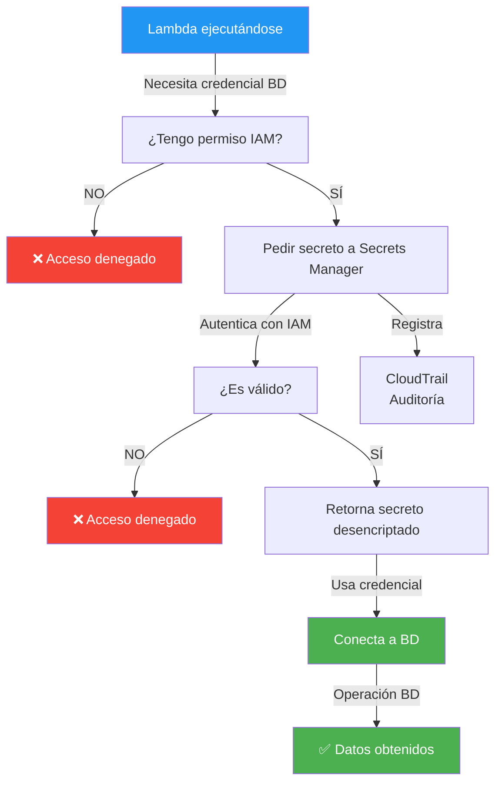
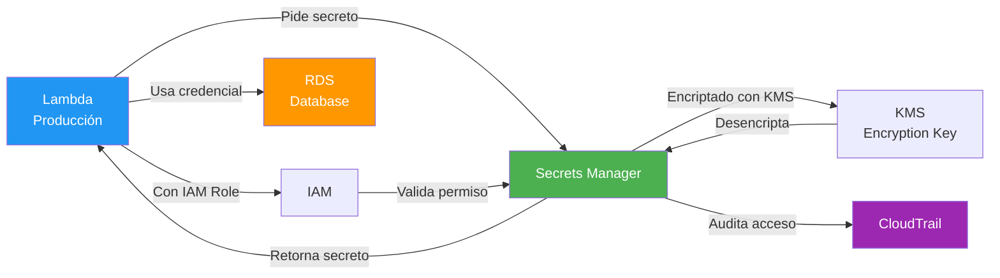
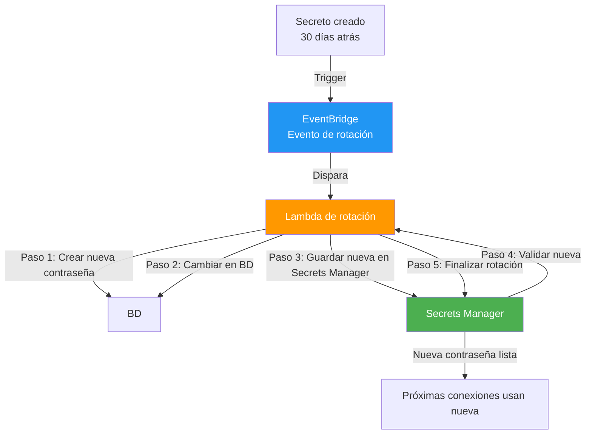

# 🔐 AWS Secrets Manager - Para Dummies

**Última actualización**: 10 mayo 2026  
**Nivel**: Principiante  
**Duración lectura**: 12 minutos  
**Prerequisito**: Haber leído los anteriores archivos de AWS

---

## ¿Qué es AWS Secrets Manager?

### La Explicación Simple

**Secrets Manager es una bóveda segura donde guardas contraseñas, API keys y credenciales sin tenerlas en tu código.**

Imagina que tienes secretos (contraseñas, tokens):

**❌ SIN Secrets Manager (PELIGROSO)**:
```javascript
// ❌ NUNCA hagas esto
const DB_PASSWORD = "abc123xyz";
const STRIPE_KEY = "sk_live_123456789";
const GITHUB_TOKEN = "ghp_xxxxxxxxxxxx";

// Si alguien ve tu código: ¡Todos tus secretos expuestos! 🔓
```

**✅ CON Secrets Manager (SEGURO)**:
```javascript
// ✅ Guardas en Secrets Manager
// Tu código SOLO accede si tiene permiso

const secret = await secretsManager.getSecret({
  SecretId: 'prod/database/password'
});

// AWS encripta todo
// Logs de acceso
// Rotación automática
```

---

## 🎯 Concepto Central: "Bóveda de Secretos"

```
┌─────────────────────────────────────┐
│  AWS Secrets Manager                │
│                                     │
│  🔐 prod/database/password          │
│  🔐 prod/stripe/api-key             │
│  🔐 prod/github/token               │
│  🔐 prod/smtp/credentials           │
│  🔐 prod/jwt/secret                 │
│                                     │
│  ✅ Encriptado                      │
│  ✅ Acceso controlado               │
│  ✅ Auditoría                       │
│  ✅ Rotación automática             │
│  ✅ Sin exponerlos en código        │
└─────────────────────────────────────┘
```

---

## 📚 Ejemplos Simples

### Ejemplo 1: Guardar un Secreto

```javascript
// AWS CLI
aws secretsmanager create-secret \
  --name prod/database/password \
  --secret-string '{"username":"admin","password":"mypassword123"}' \
  --region us-east-1

// O en Console AWS:
// Secrets Manager → Store a new secret
```

### Ejemplo 2: Acceder a Secreto desde Lambda

```javascript
const AWS = require('aws-sdk');
const secretsManager = new AWS.SecretsManager({ region: 'us-east-1' });

exports.handler = async (event) => {
  try {
    // Obtener secreto
    const secret = await secretsManager.getSecretValue({
      SecretId: 'prod/database/password'
    }).promise();

    // Parse del secreto (puede ser string o JSON)
    const credentials = JSON.parse(secret.SecretString);

    console.log('Username:', credentials.username);
    // console.log(credentials.password);  // NUNCA en logs!

    // Conectar a BD con credenciales
    const dbConnection = await connectToDatabase(
      credentials.username,
      credentials.password
    );

    return {
      statusCode: 200,
      body: 'Conectado a BD con seguridad ✅'
    };

  } catch (error) {
    console.error('Error obteniendo secreto:', error);
    return {
      statusCode: 500,
      body: 'Error de seguridad'
    };
  }
};
```

### Ejemplo 3: Múltiples Secretos

```javascript
// Guardar varios secretos
aws secretsmanager create-secret \
  --name prod/stripe/keys \
  --secret-string '{
    "public_key": "pk_live_xxxx",
    "secret_key": "sk_live_yyyy",
    "webhook_secret": "whsec_zzzz"
  }'

// Acceder en tu código
const stripeSecrets = await secretsManager.getSecretValue({
  SecretId: 'prod/stripe/keys'
}).promise();

const stripe = require('stripe')(
  JSON.parse(stripeSecrets.SecretString).secret_key
);
```

### Ejemplo 4: Rotación Automática

```javascript
// Crear secreto con rotación automática
aws secretsmanager create-secret \
  --name prod/database/password \
  --secret-string '{"username":"admin","password":"oldpassword123"}' \
  --add-replica-regions RegionName=eu-west-1

// Configurar Lambda de rotación
aws secretsmanager rotate-secret \
  --secret-id prod/database/password \
  --rotation-lambda-arn arn:aws:lambda:us-east-1:123456789:function:rotate-db-secret \
  --rotation-rules AutomaticallyAfterDays=30
```

### Ejemplo 5: Acceso con Permisos IAM

```json
{
  "Version": "2012-10-17",
  "Statement": [
    {
      "Effect": "Allow",
      "Action": [
        "secretsmanager:GetSecretValue"
      ],
      "Resource": "arn:aws:secretsmanager:us-east-1:123456789:secret:prod/database/*"
    }
  ]
}
```

**¿Qué pasa?**
- ✅ Solo Lambda con este permiso puede acceder
- ✅ No puede crear/borrar secretos
- ✅ Acceso limitado a `prod/database/*`
- ✅ Todo se audita en CloudTrail

---

## ✅ Beneficios de Secrets Manager

| Beneficio | Descripción |
|-----------|------------|
| **Encriptación** | AES-256 de datos en reposo |
| **Sin código abierto** | Secretos nunca en repositorio |
| **Acceso controlado** | IAM permissions |
| **Auditoría completa** | CloudTrail registra accesos |
| **Rotación automática** | Cambia contraseñas automáticamente |
| **Replicación** | Secretos en múltiples regiones |
| **Versionamiento** | Historial de cambios |
| **Integración AWS** | RDS, DocumentDB, Redshift, etc |
| **API segura** | Acceso programático |
| **Bajo costo** | $0.40 por secreto/mes |

---

## 🔄 Cómo Funciona: Acceso Seguro



---

## 📊 Tipos de Secretos

### 1. Contraseñas de Bases de Datos

```json
{
  "username": "admin",
  "password": "SecurePassword123!",
  "host": "mydb.c9akciq32.us-east-1.rds.amazonaws.com",
  "port": 5432,
  "dbname": "mydb"
}
```

### 2. API Keys

```json
{
  "api_key": "sk_live_51234567890abcdef",
  "api_url": "https://api.example.com",
  "timeout": 30
}
```

### 3. JWT Secrets

```json
{
  "jwt_secret": "your-super-secret-jwt-key-here",
  "jwt_expiration": "24h",
  "jwt_algorithm": "HS256"
}
```

### 4. Credenciales OAuth

```json
{
  "client_id": "12345678901234567890.apps.googleusercontent.com",
  "client_secret": "GOCSPX-xxxxxxxxxxxxxxxx",
  "redirect_uri": "https://myapp.com/callback"
}
```

### 5. SMTP Credentials

```json
{
  "smtp_host": "smtp.gmail.com",
  "smtp_port": 587,
  "smtp_user": "noreply@company.com",
  "smtp_password": "app_password_xyz"
}
```

---

## 🏗️ Arquitectura: Acceso Seguro a Secretos



---

## 🔄 Rotación Automática de Secretos



**¿Qué pasa?**
```
Mes 1: Contraseña = "abc123"
Día 30: AWS genera nueva = "xyz789"
        Lambda cambia en BD automáticamente
        Secreto Manager actualiza
Mes 2: Contraseña = "xyz789"
       La antigua ya no funciona

✅ Sin intervención manual
✅ Cero downtime
✅ Seguridad mejorada
```

---

## 📊 Comparación: Secretos Manager vs Alternativas

| Aspecto | Secrets Manager | Parameter Store | Environment Variables | .env file |
|--------|-----------------|-----------------|----------------------|-----------|
| **Encriptación** | ✅ AES-256 | ⚠️ KMS optional | ❌ No | ❌ No |
| **Rotación automática** | ✅ Sí | ❌ No | ❌ No | ❌ No |
| **Auditoría** | ✅ CloudTrail | ⚠️ Limitada | ❌ No | ❌ No |
| **Acceso controlado** | ✅ IAM | ✅ IAM | ⚠️ Limitado | ❌ No |
| **Costo** | $0.40/secreto/mes | $0 (gratis) | Gratis | Gratis |
| **Seguridad** | ✅ Muy alta | ⚠️ Media | ❌ Baja | ❌ Muy baja |
| **Mejor para** | Secretos críticos | Config | Dev/Test | Desarrollo local |

---

## 🎯 Casos de Uso: CUÁNDO Usar Secrets Manager

### ✅ IDEAL para Secrets Manager

#### 1. **Credenciales de Base de Datos**
```
RDS, Aurora, DynamoDB
Cambios automáticos
Auditoría de acceso
```

#### 2. **API Keys Sensibles**
```
Stripe, Twilio, SendGrid
Rotación regular
Control de acceso por equipo
```

#### 3. **OAuth Credentials**
```
Google, GitHub, Facebook
Secretos de aplicación
Tokens refrescados automáticamente
```

#### 4. **JWT Secrets**
```
Tokens firmados
Rotación segura
Sincronización multi-región
```

#### 5. **Producción con Auditoría**
```
Requisitos de seguridad altos
Cumplimiento normativo (HIPAA, PCI)
Trazabilidad completa
```

### ❌ NO es IDEAL para Secrets Manager

| Caso | Razón | Alternativa |
|------|-------|------------|
| **Configuración no sensible** | Secrets Manager es para secretos | Parameter Store |
| **Desarrollo local** | Innecesario, costo extra | .env file + .gitignore |
| **Datos que cambien frecuentemente** | No es versioning completo | Base de datos |
| **Presupuesto muy ajustado** | Costo aunque sea bajo | Variables de entorno |
| **Valores públicos de configuración** | No necesita encriptación | Parameter Store gratis |

---

## 🚀 Secrets Manager + NestJS

### Instalación

```bash
npm install aws-sdk
# o
npm install @aws-sdk/client-secrets-manager
```

### Crear Servicio de Secretos

```typescript
import { Injectable } from '@nestjs/common';
import { SecretsManager } from 'aws-sdk';

@Injectable()
export class SecretsService {
  private secretsManager = new SecretsManager({ region: 'us-east-1' });
  private cache = new Map<string, { value: any; timestamp: number }>();

  async getSecret(secretId: string, cacheTTL: number = 3600000) {
    // Verificar caché (1 hora default)
    const cached = this.cache.get(secretId);
    if (cached && Date.now() - cached.timestamp < cacheTTL) {
      console.log(`Secreto obtenido del caché: ${secretId}`);
      return cached.value;
    }

    try {
      const result = await this.secretsManager
        .getSecretValue({ SecretId: secretId })
        .promise();

      let secretValue;
      if ('SecretString' in result) {
        secretValue = JSON.parse(result.SecretString);
      } else {
        secretValue = Buffer.from(result.SecretBinary as string, 'base64');
      }

      // Guardar en caché
      this.cache.set(secretId, {
        value: secretValue,
        timestamp: Date.now()
      });

      console.log(`Secreto obtenido y cacheado: ${secretId}`);
      return secretValue;

    } catch (error) {
      console.error(`Error obteniendo secreto ${secretId}:`, error);
      throw new Error(`No se pudo obtener el secreto: ${secretId}`);
    }
  }

  async getDatabaseCredentials() {
    return await this.getSecret('prod/database/credentials');
  }

  async getStripeKey() {
    const stripe = await this.getSecret('prod/stripe/keys');
    return stripe.secret_key;
  }

  async getJwtSecret() {
    const jwt = await this.getSecret('prod/jwt/secret');
    return jwt.secret;
  }
}
```

### Usar en Módulo de Configuración

```typescript
import { Module } from '@nestjs/common';
import { ConfigModule } from '@nestjs/config';
import { SecretsService } from './secrets.service';

@Module({
  imports: [ConfigModule],
  providers: [SecretsService],
  exports: [SecretsService]
})
export class SecretsModule {}
```

### Usar en TypeORM

```typescript
import { Module } from '@nestjs/common';
import { TypeOrmModule } from '@nestjs/typeorm';
import { SecretsService } from '../secrets/secrets.service';

@Module({
  imports: [
    TypeOrmModule.forRootAsync({
      inject: [SecretsService],
      useFactory: async (secretsService: SecretsService) => {
        const dbCredentials = await secretsService.getDatabaseCredentials();

        return {
          type: 'postgres',
          host: dbCredentials.host,
          port: dbCredentials.port,
          username: dbCredentials.username,
          password: dbCredentials.password,
          database: dbCredentials.database,
          entities: [__dirname + '/../**/*.entity{.ts,.js}'],
          synchronize: false
        };
      }
    })
  ]
})
export class DatabaseModule {}
```

### Usar en JWT Strategy

```typescript
import { Injectable } from '@nestjs/common';
import { PassportStrategy } from '@nestjs/passport';
import { ExtractJwt, Strategy } from 'passport-jwt';
import { SecretsService } from '../secrets/secrets.service';

@Injectable()
export class JwtStrategy extends PassportStrategy(Strategy) {
  constructor(private secretsService: SecretsService) {
    super({
      jwtFromRequest: ExtractJwt.fromAuthHeaderAsBearerToken(),
      ignoreExpiration: false,
      secretOrKey: null  // Se obtiene dinámicamente
    });
  }

  async validate(payload: any) {
    // Obtener el secreto JWT de Secrets Manager
    const jwtSecret = await this.secretsService.getJwtSecret();
    
    return {
      userId: payload.sub,
      email: payload.email
    };
  }
}
```

### Usar en Stripe Service

```typescript
import { Injectable } from '@nestjs/common';
import * as Stripe from 'stripe';
import { SecretsService } from '../secrets/secrets.service';

@Injectable()
export class StripeService {
  private stripe: Stripe.Stripe;

  constructor(private secretsService: SecretsService) {
    this.initializeStripe();
  }

  private async initializeStripe() {
    const stripeKey = await this.secretsService.getStripeKey();
    this.stripe = new Stripe(stripeKey);
  }

  async processPayment(amount: number, token: string) {
    try {
      const charge = await this.stripe.charges.create({
        amount: amount * 100,  // Convertir a centavos
        currency: 'usd',
        source: token
      });
      return charge;
    } catch (error) {
      console.error('Error procesando pago:', error);
      throw error;
    }
  }
}
```

---

## 🔐 Best Practices de Seguridad

### 1. NUNCA hagas esto ❌

```typescript
// ❌ PELIGROSO
const password = "myPassword123";
const apiKey = "sk_live_xxxxx";
const jwtSecret = "my-jwt-secret";

// ❌ PELIGROSO
require('dotenv').config();
const password = process.env.DB_PASSWORD;  // En GitHub ❌
```

### 2. SIEMPRE usa Secrets Manager ✅

```typescript
// ✅ SEGURO
const secretsService = new SecretsService();
const password = await secretsService.getSecret('prod/database/password');

// ✅ SEGURO con caché
const password = await secretsService.getDatabaseCredentials();
```

### 3. Controla Acceso con IAM ✅

```json
{
  "Version": "2012-10-17",
  "Statement": [
    {
      "Effect": "Allow",
      "Action": "secretsmanager:GetSecretValue",
      "Resource": "arn:aws:secretsmanager:us-east-1:123456789:secret:prod/*",
      "Condition": {
        "StringEquals": {
          "aws:RequestedRegion": "us-east-1"
        }
      }
    }
  ]
}
```

### 4. Audita Accesos ✅

```bash
# Ver logs de acceso a secretos
aws cloudtrail lookup-events \
  --lookup-attributes AttributeKey=EventName,AttributeValue=GetSecretValue \
  --region us-east-1
```

---

## 💰 Costos de Secrets Manager

```
Por secreto/mes: $0.40
Por rotación de secreto: $0.05

Ejemplo:
10 secretos: $4.00/mes
Con rotación de 5: $4.25/mes

Muy barato comparado con riesgos de seguridad
```

---

## 📋 Checklist: Secrets Manager Básico

```
[ ] ¿Tengo secretos en mi código?
    → SÍ: Migralos a Secrets Manager ASAP

[ ] ¿Necesito acceso controlado?
    → SÍ: Usa IAM + Secrets Manager

[ ] ¿Requiero auditoría de acceso?
    → SÍ: Secrets Manager con CloudTrail

[ ] ¿Preciso rotación automática?
    → SÍ: Configura rotación en Secrets Manager

[ ] ¿Es ambiente de producción?
    → SÍ: Obligatorio usar Secrets Manager

[ ] ¿Necesito desarrollo local?
    → SÍ: Usa .env + .gitignore (temporal)
    
[ ] ¿Tengo múltiples regiones?
    → SÍ: Configura replicación de secretos
```

---

## 🔗 Próximos Pasos

1. **Migrar secretos**: De .env a Secrets Manager
2. **Configurar IAM**: Permisos por rol/servicio
3. **Habilitar rotación**: Para contraseñas de BD
4. **Auditar accesos**: CloudTrail + Secrets Manager
5. **Documentar**: Quién accede a qué

---

## 📚 Resumen Rápido

| Concepto | Qué es |
|----------|--------|
| **Secret** | Valor sensible guardado de forma segura |
| **SecretId** | Nombre del secreto (ej: prod/database/password) |
| **Versioning** | Historial de cambios del secreto |
| **Rotation** | Cambio automático de secretos |
| **Encryption** | AES-256 en reposo, TLS en tránsito |
| **KMS** | Servicio de encriptación de AWS |
| **IAM** | Control de acceso granular |
| **CloudTrail** | Auditoría de quién accede a secretos |
| **Replica** | Copiar secretos a otras regiones |
| **TTL** | Time To Live (validez del secreto) |

---

## ✨ Conclusión

**Secrets Manager es perfecto para**:
- ✅ Guardar contraseñas de BD
- ✅ API keys sensibles
- ✅ Tokens OAuth/JWT
- ✅ Ambiente de producción
- ✅ Cumplimiento normativo
- ✅ Auditoría de acceso

**No es ideal para**:
- ❌ Desarrollo local inicial
- ❌ Configuración pública
- ❌ Datos no sensibles
- ❌ Presupuesto muy muy ajustado
- ❌ Valores que cambian cada minuto

---

## ⚠️ Recuerda

```
🚨 NUNCA guardes secretos en:
  ❌ Código fuente
  ❌ .env en GitHub
  ❌ Configuración del servidor
  ❌ Logs
  ❌ Comentarios

✅ SIEMPRE usa Secrets Manager en producción
```

---

**¿Preguntas?** Consulta la documentación oficial de AWS Secrets Manager.
