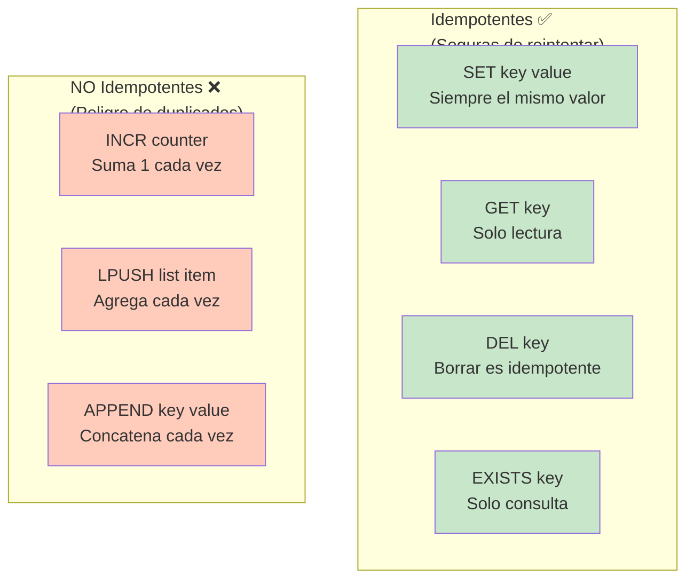

# ⚡ Redis: Caché de Alto Rendimiento

## Índice
1. [¿Qué es Redis?](#qué-es-redis)
2. [Redis vs Base de Datos](#redis-vs-base-de-datos)
3. [Cómo funciona Redis](#cómo-funciona-redis)
4. [Integración en NestJS](#integración-en-nestjs)
5. [Ejemplos Prácticos](#ejemplos-prácticos)
6. [Estrategias de Caching](#estrategias-de-caching)
7. [Beneficios y Cuándo Usarlo](#beneficios-y-cuándo-usarlo)

---

## ¿Qué es Redis?

### 🔤 Definición Simple

**Redis** es una **base de datos en memoria ultra-rápida** que almacena datos como pares clave-valor.

Es como un **cuaderno mágico** donde anotas cosas que necesitas recordar rápidamente, sin tener que buscarlas en un archivo enorme.

```
┌─────────────────────────────────────┐
│        TU APLICACIÓN                │
│                                     │
│  "¿Cuál es la edad de Juan?"        │
└──────┬──────────────────────────────┘
       │
       ├─→ ¿Está en Redis? → SÍ → Devuelvo 28 (1ms) ✅ RÁPIDO
       │
       └─→ ¿No está? → Voy a BD → 100ms lentísimo ❌
           Guardo en Redis para próxima vez
```

### 📚 Analogía: El Mostrador vs El Almacén

**Sin Redis (solo BD):**
```
"Quiero la edad de Juan"
         ↓
Voy al almacén (10 segundos)
Busco en 1 millón de registros
Encuentro a Juan
Regreso (10 segundos más)
Total: 20 segundos 😴
```

**Con Redis (caché):**
```
"Quiero la edad de Juan"
         ↓
Miro el mostrador (1 milisegundo)
¡Está aquí! Juan = 28
Total: 1 milisegundo ⚡
```

### 🎯 Características Clave

| Característica | Qué es |
|---|---|
| **En memoria** | Guarda datos en RAM (muy rápido) |
| **Clave-valor** | `nombre → "Juan"`, `edad → 28` |
| **Volátil** | Si se apaga, se pierden los datos (por eso es caché) |
| **Multi-tipo** | Strings, Lists, Sets, Hashes, Sorted Sets |
| **Expiration** | Los datos pueden tener "fecha de vencimiento" |
| **Atómico** | Operaciones seguras sin problemas de concurrencia |

### 🔌 Instalación Rápida

```bash
# En tu máquina (Windows/Mac/Linux)
# Con Docker (recomendado):
docker run -d -p 6379:6379 redis:latest

# O instalar directamente:
# Windows: https://github.com/microsoftarchive/redis/releases
# Mac: brew install redis
# Linux: sudo apt-get install redis-server

# Para NestJS:
npm install @nestjs/cache-manager cache-manager redis
```

---

## Redis vs Base de Datos

### 🏃 Velocidad

```
Redis:      1ms  ████████████████████ ULTRA RÁPIDO
Memoria:    5ms  ███████████████████████
SSD BD:    50ms  ██████████████████████████████
HDD BD:   200ms  ██████████████████████████████████████████
```

### 📊 Comparación Completa

| Aspecto | Redis | Base de Datos |
|--------|-------|---------------|
| **Velocidad** | 1ms | 50-200ms |
| **Persistencia** | No (caché temporal) | Sí (datos permanentes) |
| **Capacidad** | GB (limitado a RAM) | TB (ilimitado en disco) |
| **Caso de uso** | Datos accedidos frecuentemente | Datos permanentes |
| **Costo** | Más RAM | Más disco |
| **Complejidad** | Simples (clave-valor) | Complejas (relaciones) |

### 💡 Uso conjunto

```
Usuario pide datos
    ↓
¿Está en Redis (caché)?
    ├─ SÍ → Devuelvo rápido (1ms)
    └─ NO → Voy a BD, guardo en Redis, devuelvo (100ms)

Próxima vez que alguien pida lo mismo:
    ↓
¡Está en Redis! (1ms)
```

---

## Cómo funciona Redis

### 🔑 Estructura Clave-Valor

```
Redis es como un diccionario gigante:

"usuario:1:nombre" → "Juan"
"usuario:1:email"  → "juan@mail.com"
"usuario:2:nombre" → "María"
"contador:visitas" → 1500
```

### ⏰ Con Expiración

```
Guardas: "user:1:data" → "Juan, 28 años" (válido por 5 minutos)

Minuto 0:00 → Existe, puedo leerlo ✅
Minuto 2:30 → Existe, puedo leerlo ✅
Minuto 5:01 → SE BORRA AUTOMÁTICAMENTE ❌

Próxima lectura → Voy a BD
```

### 📝 Operaciones Básicas

```typescript
// SET - Guardar
redis.set("nombre", "Juan")
redis.set("nombre", "Juan", "EX", 3600)  // Expira en 1 hora

// GET - Obtener
const valor = redis.get("nombre")  // "Juan"

// DEL - Eliminar
redis.del("nombre")

// EXISTS - Existe?
redis.exists("nombre")  // 1 o 0

// TTL - Tiempo de vida restante
redis.ttl("nombre")  // segundos restantes

// EXPIRE - Establecer expiración
redis.expire("nombre", 3600)  // Expira en 1 hora
```

### 🎨 Tipos de Datos

```typescript
// STRING (texto)
redis.set("nombre", "Juan")

// LIST (array)
redis.lpush("tareas", "Tarea 1")
redis.lpush("tareas", "Tarea 2")

// SET (conjunto sin orden)
redis.sadd("tags", "typescript")
redis.sadd("tags", "nodejs")

// HASH (objeto)
redis.hset("usuario:1", "nombre", "Juan")
redis.hset("usuario:1", "email", "juan@mail.com")

// SORTED SET (ordenado por score)
redis.zadd("ranking", 100, "Juan")
redis.zadd("ranking", 85, "María")
```

---

## Integración en NestJS

### 📦 Módulo de Caching

```typescript
// app.module.ts
import { Module } from '@nestjs/common';
import { CacheModule } from '@nestjs/cache-manager';
import * as redisStore from 'cache-manager-redis-store';

@Module({
  imports: [
    CacheModule.register({
      store: redisStore,
      host: 'localhost',
      port: 6379,
      ttl: 600,  // 10 minutos de expiration por defecto
      isGlobal: true,  // Disponible en toda la app
    }),
  ],
})
export class AppModule {}
```

### 🔧 Configuración Avanzada

```typescript
// config/cache.config.ts
import { CacheModuleOptions } from '@nestjs/cache-manager';
import * as redisStore from 'cache-manager-redis-store';

export const cacheConfig: CacheModuleOptions = {
  store: redisStore,
  host: process.env.REDIS_HOST || 'localhost',
  port: parseInt(process.env.REDIS_PORT) || 6379,
  password: process.env.REDIS_PASSWORD,
  ttl: 600,  // 10 minutos
  max: 100,  // Máximo 100 entradas
};

// app.module.ts
import { CacheModule } from '@nestjs/cache-manager';
import { cacheConfig } from './config/cache.config';

@Module({
  imports: [CacheModule.register(cacheConfig)],
})
export class AppModule {}
```

### 💉 Inyectar CACHE_MANAGER

```typescript
import { Injectable, Inject } from '@nestjs/common';
import { CACHE_MANAGER } from '@nestjs/cache-manager';
import { Cache } from 'cache-manager';

@Injectable()
export class UserService {
  
  constructor(
    @Inject(CACHE_MANAGER)
    private cacheManager: Cache,
    private userRepository: Repository<User>
  ) {}

  // Aquí puedes usar el cache
}
```

---

## Ejemplos Prácticos

### 1️⃣ Guardando y obteniendo datos

```typescript
import { Injectable, Inject } from '@nestjs/common';
import { CACHE_MANAGER } from '@nestjs/cache-manager';
import { Cache } from 'cache-manager';

@Injectable()
export class UserService {

  constructor(
    @Inject(CACHE_MANAGER)
    private cacheManager: Cache,
    private userRepository: Repository<User>
  ) {}

  async getUser(id: number): Promise<User> {
    // 1. Buscar en caché
    const cacheKey = `user:${id}`;
    const cachedUser = await this.cacheManager.get(cacheKey);
    
    if (cachedUser) {
      console.log('Encontrado en caché ⚡');
      return cachedUser;
    }

    // 2. No está en caché, buscar en BD
    const usuario = await this.userRepository.findOne({ where: { id } });
    
    if (!usuario) {
      return null;
    }

    // 3. Guardar en caché (10 minutos)
    await this.cacheManager.set(cacheKey, usuario, 600000);

    console.log('Obtenido de BD y guardado en caché');
    return usuario;
  }
}
```

### 2️⃣ Usar @Cacheable (decorator)

```typescript
import { Cacheable } from '@nestjs/cache-manager';

@Injectable()
export class ProductService {

  constructor(private productRepository: Repository<Product>) {}

  // El resultado se cachea automáticamente
  @Cacheable()
  async getAllProducts(): Promise<Product[]> {
    console.log('Buscando en BD...');
    return await this.productRepository.find();
  }

  // Con clave de caché personalizada
  @Cacheable('product:', 30)  // 30 segundos
  async getProductById(id: number): Promise<Product> {
    return await this.productRepository.findOne({ where: { id } });
  }
}
```

### 3️⃣ Invalidar caché manualmente

```typescript
async updateUser(id: number, datos: UpdateUserDto): Promise<User> {
  // 1. Actualizar en BD
  await this.userRepository.update(id, datos);

  // 2. Invalidar caché (eliminar)
  const cacheKey = `user:${id}`;
  await this.cacheManager.del(cacheKey);

  // 3. Devolver usuario actualizado
  return this.getUser(id);  // Se recarga del caché/BD
}

async deleteUser(id: number): Promise<void> {
  // 1. Eliminar de BD
  await this.userRepository.delete(id);

  // 2. Limpiar caché
  const cacheKey = `user:${id}`;
  await this.cacheManager.del(cacheKey);
}
```

### 4️⃣ Caché con datos complejos

```typescript
async getUserWithPosts(id: number): Promise<UserWithPosts> {
  const cacheKey = `user:${id}:posts`;
  
  // Obtener del caché
  let userData = await this.cacheManager.get<UserWithPosts>(cacheKey);
  
  if (userData) {
    return userData;
  }

  // Obtener de BD (con relaciones)
  userData = await this.userRepository.findOne({
    where: { id },
    relations: ['posts', 'posts.comments']
  });

  if (userData) {
    // Guardar en caché por 1 hora
    await this.cacheManager.set(cacheKey, userData, 3600000);
  }

  return userData;
}
```

### 5️⃣ Caché en Controller

```typescript
import { Controller, Get, Param, Inject } from '@nestjs/common';
import { CACHE_MANAGER } from '@nestjs/cache-manager';
import { Cache } from 'cache-manager';

@Controller('users')
export class UserController {

  constructor(
    private userService: UserService,
    @Inject(CACHE_MANAGER)
    private cacheManager: Cache
  ) {}

  @Get(':id')
  async getUser(@Param('id') id: number) {
    return await this.userService.getUser(id);
  }

  @Get('cache/stats')
  async getCacheStats() {
    // Información del caché (implementación depende del cliente Redis)
    return {
      message: 'Caché activo'
    };
  }
}
```

### 6️⃣ Patrón de Caché-a-Parte

```typescript
@Injectable()
export class ArticleService {

  constructor(
    @Inject(CACHE_MANAGER)
    private cacheManager: Cache,
    private articleRepository: Repository<Article>
  ) {}

  // Servicio reutilizable para cachear
  private async getOrCache<T>(
    key: string,
    fn: () => Promise<T>,
    ttl: number = 600000
  ): Promise<T> {
    // 1. Intentar obtener del caché
    const cached = await this.cacheManager.get<T>(key);
    if (cached) return cached;

    // 2. Obtener de la función
    const data = await fn();

    // 3. Guardar en caché
    if (data) {
      await this.cacheManager.set(key, data, ttl);
    }

    return data;
  }

  // Uso
  async getArticle(id: number): Promise<Article> {
    return this.getOrCache(
      `article:${id}`,
      () => this.articleRepository.findOne({ where: { id } }),
      3600000  // 1 hora
    );
  }

  async getPopularArticles(): Promise<Article[]> {
    return this.getOrCache(
      'articles:popular',
      () => this.articleRepository.find({ take: 10 }),
      1800000  // 30 minutos
    );
  }
}
```

### 7️⃣ Limpiar todo el caché

```typescript
async clearAllCache(): Promise<void> {
  // ⚠️ Cuidado: borra TODO el caché
  await this.cacheManager.reset();
}

// O limpiar por patrón
async clearUserCaches(userId: number): Promise<void> {
  const keys = [
    `user:${userId}`,
    `user:${userId}:posts`,
    `user:${userId}:profile`
  ];

  for (const key of keys) {
    await this.cacheManager.del(key);
  }
}
```

---

## Estrategias de Caching

### 1️⃣ Cache-Aside (Lazy Loading)

```
Petición llega
    ↓
¿Está en caché?
    ├─ SÍ → Devuelvo caché
    └─ NO → Voy a BD → Guardo en caché → Devuelvo

👍 Ventaja: Simple, datos siempre frescos
👎 Desventaja: Primera lectura es lenta
```

```typescript
async getUserCacheAside(id: number): Promise<User> {
  // Estrategia Cache-Aside
  const cached = await this.cacheManager.get(`user:${id}`);
  if (cached) return cached;

  const user = await this.userRepository.findOne({ where: { id } });
  await this.cacheManager.set(`user:${id}`, user, 600000);
  return user;
}
```

#### ¿Qué es el patrón cache-aside y cómo se implementa con Redis en NestJS?

Cache-aside (también llamado lazy loading) es el patrón más común: la app decide cuándo poner y quitar datos en caché. El flujo es: (1) buscar en Redis, (2) si hay hit devolver directo, (3) si hay miss ir a la BD, (4) guardar en Redis con TTL y devolver.

La ventaja es que solo se cachea lo que se usa. La desventaja es la primera petición siempre va a la BD (cold cache). El TTL es clave: muy corto = muchos misses, muy largo = datos desactualizados.

La invalidación es el problema clásico: cuando actualizas un registro, tienes que borrar su clave en Redis (cacheManager.del) para forzar que la próxima petición traiga datos frescos.

### 2️⃣ Write-Through (Guardar siempre en caché)

```
Actualización llega
    ↓
Guardar en caché
    ↓
Guardar en BD
    ↓
Devolver

👍 Ventaja: Caché siempre está sincronizado
👎 Desventaja: Más lento (escribe en 2 lugares)
```

```typescript
async updateUserWriteThrough(id: number, data: UpdateUserDto): Promise<User> {
  // Write-Through: actualiza caché y BD
  const user = await this.userRepository.findOne({ where: { id } });
  Object.assign(user, data);

  // Guardar en caché PRIMERO
  await this.cacheManager.set(`user:${id}`, user, 600000);

  // Guardar en BD
  await this.userRepository.save(user);

  return user;
}
```

### 3️⃣ Write-Behind (Caché primero, BD después)

```
Actualización llega
    ↓
Guardar en caché
    ↓
Devolver (sin esperar BD)
    ↓
(Algún proceso escribe en BD cuando puede)

👍 Ventaja: Ultra rápido
👎 Desventaja: Riesgo de pérdida de datos
```

```typescript
async updateUserWriteBehind(id: number, data: UpdateUserDto): Promise<User> {
  const user = await this.userRepository.findOne({ where: { id } });
  Object.assign(user, data);

  // Guardar en caché
  await this.cacheManager.set(`user:${id}`, user, 600000);

  // Guardar en BD en background (sin esperar)
  this.userRepository.save(user).catch(err => {
    console.error('Error guardando en BD:', err);
  });

  return user;
}
```

---

## Beneficios y Cuándo Usarlo

### ⚡ Beneficios principales

| Beneficio | Impacto |
|-----------|--------|
| **Velocidad** | 100x más rápido que BD (1ms vs 100ms) |
| **Reduce carga BD** | Menos queries, BD respira |
| **Mejor experiencia** | Usuarios ven respuestas instantáneas |
| **Escalabilidad** | Soporta más usuarios simultáneos |
| **Ahorro dinero** | Menos servidores de BD necesarios |

### 💰 Ejemplo de impacto

```
SIN Redis:
- 1000 usuarios simultáneos
- Cada uno hace 10 requests por minuto
- BD recibe 10,000 queries por minuto
- Servidor se ralentiza, necesitas upgrade ($)

CON Redis:
- 1000 usuarios simultáneos
- 80% de requests están en caché (8000)
- BD recibe solo 2,000 queries por minuto
- Todo rápido, servidor descansa
```

### ✅ Usa Redis cuando:

| Caso | Razón |
|------|-------|
| **Datos leídos frecuentemente** | Posts, usuarios, productos |
| **Datos que no cambian mucho** | Catálogos, configuración |
| **Necesitas baja latencia** | APIs que deben responder <100ms |
| **Tienes muchos usuarios** | Reducir carga de BD |
| **Datos temporales** | Sesiones, tokens, códigos OTP |
| **Ranking/contador** | Vistas, likes, comentarios |
| **Session storage** | Guardar datos de usuario |

### ❌ NO uses Redis para:

| Caso | Razón |
|------|-------|
| **Datos que cambian cada segundo** | Muy frecuente para cachear |
| **Datos muy importantes** | Si se pierden es catastrofe |
| **Proyecto pequeño** | Complejidad innecesaria |
| **Datos que nunca se repiten** | No tiene sentido cachear |

---

## Patrones Reales

### 📊 Ejemplo: Blog con muchas visitas

```typescript
@Injectable()
export class PostService {

  constructor(
    @Inject(CACHE_MANAGER)
    private cacheManager: Cache,
    private postRepository: Repository<Post>
  ) {}

  // LECTURA: Cachea posts (cambien poco)
  async getPost(id: number): Promise<Post> {
    const cached = await this.cacheManager.get(`post:${id}`);
    if (cached) return cached;

    const post = await this.postRepository.findOne({
      where: { id },
      relations: ['author', 'comments']
    });

    // Cachea por 1 hora
    await this.cacheManager.set(`post:${id}`, post, 3600000);
    return post;
  }

  // ESCRITURA: Invalida caché
  async updatePost(id: number, data: UpdatePostDto): Promise<Post> {
    const post = await this.postRepository.findOne({ where: { id } });
    Object.assign(post, data);
    await this.postRepository.save(post);

    // Borra caché viejo
    await this.cacheManager.del(`post:${id}`);

    return post;
  }

  // Contador: usa Redis directamente
  async incrementViews(postId: number): Promise<number> {
    const key = `post:${postId}:views`;
    const views = await this.cacheManager.get<number>(key) || 0;
    const newViews = views + 1;

    await this.cacheManager.set(key, newViews, 86400000); // 24 horas
    return newViews;
  }
}
```

### 👤 Ejemplo: Sistema de usuarios

```typescript
@Injectable()
export class UserService {

  constructor(
    @Inject(CACHE_MANAGER)
    private cacheManager: Cache,
    private userRepository: Repository<User>
  ) {}

  async authenticate(email: string, password: string): Promise<User | null> {
    // Buscar en caché primero (sesiones activas)
    const cached = await this.cacheManager.get(`auth:${email}`);
    if (cached) return cached;

    // Buscar en BD
    const user = await this.userRepository.findOne({ where: { email } });
    if (user && await this.verifyPassword(password, user.password)) {
      // Cachea por 1 hora (sesión activa)
      await this.cacheManager.set(`auth:${email}`, user, 3600000);
      return user;
    }

    return null;
  }

  async logout(email: string): Promise<void> {
    await this.cacheManager.del(`auth:${email}`);
  }

  async getUserProfile(id: number): Promise<User> {
    const key = `user:profile:${id}`;
    let user = await this.cacheManager.get<User>(key);

    if (!user) {
      user = await this.userRepository.findOne({
        where: { id },
        relations: ['posts', 'followers']
      });

      await this.cacheManager.set(key, user, 1800000); // 30 minutos
    }

    return user;
  }
}
```

---

## 🔐 Consideraciones Importantes

### ⚠️ Problemas comunes

```typescript
// ❌ PROBLEMA: Caché nunca se actualiza
async getUser(id: number) {
  const cached = await this.cacheManager.get(`user:${id}`);
  if (cached) return cached;
  return await this.userRepository.findOne({ where: { id } });
  // Nunca lo guardas en caché!
}

// ✅ SOLUCIÓN
async getUser(id: number) {
  const cached = await this.cacheManager.get(`user:${id}`);
  if (cached) return cached;
  
  const user = await this.userRepository.findOne({ where: { id } });
  await this.cacheManager.set(`user:${id}`, user, 600000);
  return user;
}
```

### 🛡️ Seguridad

```typescript
// ❌ NO cachees datos sensibles directamente
async getUser(id: number) {
  const user = await this.userRepository.findOne({ where: { id } });
  // No cachees la contraseña!!!
  await this.cacheManager.set(`user:${id}`, user, 600000);
}

// ✅ SÍ: Cachea solo lo necesario
async getUser(id: number) {
  const user = await this.userRepository.findOne({ where: { id } });
  
  const safeUser = {
    id: user.id,
    nombre: user.nombre,
    email: user.email
    // Sin password
  };

  await this.cacheManager.set(`user:${id}`, safeUser, 600000);
  return safeUser;
}
```

---

## 🔄 Idempotencia en Redis

### 🎯 ¿Qué es Idempotencia?

**Idempotencia** significa que una operación produce el **mismo resultado** sin importar cuántas veces se ejecute.

```
IDEMPOTENTE (✅):
SET nombre "Juan"
SET nombre "Juan"
SET nombre "Juan"
→ nombre SIEMPRE es "Juan"

NO IDEMPOTENTE (❌):
contador = contador + 1
contador = contador + 1
contador = contador + 1
→ primer intento: 1, segundo: 2, tercero: 3 ❌
```

### 📊 Operaciones Idempotentes vs No Idempotentes



### 💡 Por qué es Importante

En sistemas con **retry/reintentos** (Kafka, RabbitMQ), un mensaje puede procesarse 2+ veces:

```
PROBLEMA SIN IDEMPOTENCIA:

Consumer recibe: "Usuario compró producto"
  ├─ Intento 1: suma 1 venta → contador = 1 ✅
  ├─ Falla y reintenta
  ├─ Intento 2: suma 1 venta → contador = 2 ❌ (DUPLICADO!)
  
RESULTADO: Se contó 2 veces una sola compra

CON IDEMPOTENCIA:

Consumer recibe: "Usuario compró producto (ID: 123)"
  ├─ Intento 1: ¿Existe compra 123? NO → procesar → contador = 1 ✅
  ├─ Falla y reintenta
  ├─ Intento 2: ¿Existe compra 123? SÍ → no hacer nada
  
RESULTADO: Se contó 1 sola vez (correcto!)
```

### ✅ Patrón 1: Idempotency Keys (RECOMENDADO)

Usar una **clave única del evento** para evitar duplicados:

```typescript
// payment.service.ts
async processPayment(paymentData: PaymentDto, idempotencyKey: string) {
  // Clave única: combina operación + ID del evento
  const cacheKey = `payment:processed:${idempotencyKey}`;
  
  // PASO 1: Verificar si ya procesamos esto
  const cachedResult = await this.cacheManager.get(cacheKey);
  if (cachedResult) {
    console.log('⚡ Resultado cacheado (reintento detectado)');
    return cachedResult;  // Retornar resultado anterior
  }
  
  // PASO 2: Procesar por primera vez
  console.log('💳 Procesando pago...');
  const result = await this.paymentGateway.charge({
    amount: paymentData.amount,
    cardToken: paymentData.token
  });
  
  // PASO 3: Guardar en caché (1 hora)
  // Si se reintenta dentro de 1 hora, usa este resultado
  await this.cacheManager.set(
    cacheKey,
    result,
    3600000  // 1 hora en milisegundos
  );
  
  return result;
}

// En el Controller
@Post('pay')
async pay(
  @Body() paymentData: PaymentDto,
  @Headers('Idempotency-Key') idempotencyKey: string  // Cliente envía esta clave
) {
  if (!idempotencyKey) {
    throw new BadRequestException('Idempotency-Key header required');
  }
  
  return await this.paymentService.processPayment(
    paymentData,
    idempotencyKey
  );
}
```

**Cliente HTTP:**
```bash
curl -X POST http://localhost:3000/pay \
  -H "Idempotency-Key: order-12345-payment" \
  -H "Content-Type: application/json" \
  -d '{"amount": 100, "token": "tok_xxx"}'

# Primera llamada: Procesa el pago
# Segunda llamada (mismo Idempotency-Key): Retorna el resultado anterior
```

### ✅ Patrón 2: SET con NX (If Not eXists)

Usar Redis para evitar que se ejecute dos veces:

```typescript
// order.service.ts
async addItemToCart(userId: number, productId: number, quantity: number) {
  const lockKey = `cart:${userId}:adding:${productId}`;
  
  // SET NX: solo si NO existe (transacción atómica)
  // Si ya existe, no ejecuta (alguien más lo está haciendo)
  const acquired = await this.cacheManager.set(
    lockKey,
    '1',
    {
      mode: 'NX',           // Only if not exists
      ttl: 5000             // Lock por 5 segundos
    }
  );
  
  if (!acquired) {
    throw new ConflictException('Another request is adding this item');
  }
  
  try {
    // Procesar (safe, nadie más lo está haciendo)
    const cart = await this.getCart(userId);
    cart.items.push({ productId, quantity });
    await this.saveCart(userId, cart);
    
    return cart;
  } finally {
    // Liberar lock
    await this.cacheManager.del(lockKey);
  }
}
```

### ✅ Patrón 3: Voting/Liking (Una vez por usuario)

Ideal para likes, votos, upvotes:

```typescript
// post.service.ts
async likePost(postId: number, userId: number) {
  // Clave: usuario + post (único por usuario)
  const likeKey = `post:${postId}:liked:${userId}`;
  
  // SET NX: solo si no existía (primera vez)
  const isFirstLike = await this.cacheManager.set(
    likeKey,
    new Date().toISOString(),
    {
      mode: 'NX',
      ttl: 31536000  // 1 año (no se puede deshacer)
    }
  );
  
  if (isFirstLike) {
    // Primera vez que este usuario da like
    await this.cacheManager.increment(`post:${postId}:likes`);
    return { liked: true, isNew: true };
  } else {
    // Ya había dado like (idempotente)
    return { liked: true, isNew: false };
  }
}
```

**Comportamiento:**
```
PRIMER LIKE:
  Cliente: likePost(postId=1, userId=10)
  → ¿Existe post:1:liked:10? NO
  → Agregar like
  → Retornar { liked: true, isNew: true }

SEGUNDO LIKE (reintento o usuario intenta de nuevo):
  Cliente: likePost(postId=1, userId=10)
  → ¿Existe post:1:liked:10? SÍ
  → No hacer nada
  → Retornar { liked: true, isNew: false }
  
RESULTADO: Idempotente ✅
```

### ✅ Patrón 4: Distributed Lock

Para operaciones críticas (transferencias, pagos):

```typescript
// wallet.service.ts
async transferMoney(
  fromUserId: number,
  toUserId: number,
  amount: number,
  transactionId: string  // ID único de la transacción
) {
  const lockKey = `transfer:lock:${transactionId}`;
  const processedKey = `transfer:processed:${transactionId}`;
  
  // PASO 1: Verificar si ya procesamos esta transacción
  const alreadyProcessed = await this.cacheManager.get(processedKey);
  if (alreadyProcessed) {
    console.log('⚡ Transacción ya procesada');
    return JSON.parse(alreadyProcessed);
  }
  
  // PASO 2: Adquirir lock (evitar race condition)
  const lockAcquired = await this.cacheManager.set(
    lockKey,
    new Date().toISOString(),
    {
      mode: 'NX',
      ttl: 10000  // 10 segundos
    }
  );
  
  if (!lockAcquired) {
    throw new ConflictException('Otra transacción en progreso');
  }
  
  try {
    // PASO 3: Procesar transacción
    const fromWallet = await this.getWallet(fromUserId);
    const toWallet = await this.getWallet(toUserId);
    
    if (fromWallet.balance < amount) {
      throw new BadRequestException('Saldo insuficiente');
    }
    
    fromWallet.balance -= amount;
    toWallet.balance += amount;
    
    await this.saveWallet(fromUserId, fromWallet);
    await this.saveWallet(toUserId, toWallet);
    
    const result = {
      success: true,
      transactionId,
      timestamp: new Date(),
      fromBalance: fromWallet.balance,
      toBalance: toWallet.balance
    };
    
    // PASO 4: Guardar que ya procesamos esto
    await this.cacheManager.set(
      processedKey,
      JSON.stringify(result),
      86400000  // 24 horas
    );
    
    return result;
  } finally {
    // PASO 5: Liberar lock
    await this.cacheManager.del(lockKey);
  }
}
```

### 📋 Tabla Comparativa: Patrones de Idempotencia

| Patrón | Caso de Uso | Ventajas | Desventajas |
|--------|-------------|----------|-------------|
| **Idempotency Keys** | Pagos, transacciones | Explícito, rastreable | Cliente debe enviar clave |
| **SET NX** | Locks, exclusividad | Simple, rápido | Puede expirar antes |
| **Voting/Liking** | Likes, upvotes | Impide duplicados | TTL largo (memoria) |
| **Distributed Lock** | Operaciones críticas | Máxima seguridad | Más complejo |

### 🚨 Errores Comunes

```typescript
// ❌ MAL: No idempotente
async increment(key: string) {
  const value = await redis.get(key);
  await redis.set(key, value + 1);  // ❌ Si se ejecuta 2 veces, suma 2
}

// ✅ BIEN: Idempotente
async increment(key: string, idempotencyKey: string) {
  const cacheKey = `${key}:${idempotencyKey}`;
  
  // Verificar si ya incrementamos esto
  const alreadyDone = await redis.get(cacheKey);
  if (alreadyDone) return;
  
  // Marcar como hecho
  await redis.set(cacheKey, '1', 'EX', 3600);
  
  // Luego incrementar
  await redis.incr(key);
}

// ✅ MÁS SIMPLE: Usar operación idempotente directa
async set(key: string, value: string) {
  // SET es idempotente (siempre el mismo valor)
  await redis.set(key, value);  // ✅ Seguro reintentar
}
```

### 🎯 Resumen: Cuándo Aplicar Idempotencia

```
SIEMPRE usa idempotencia en:
✅ Pagos y transacciones (dinero duplicado = desastre)
✅ Creación de usuarios/recursos (evitar duplicados)
✅ Cambios de estado importantes (pedidos, envíos)
✅ Sistemas con reintentos automáticos (Kafka, RabbitMQ)
✅ APIs públicas (clientes pueden reintentar)

OPCIONAL en:
⚠️ Estadísticas no críticas (likes, vistas)
⚠️ Datos que no afectan dinero

NUNCA necesitas en:
❌ Lecturas puras (GET, SELECT)
❌ Datos que se sobrescriben (SET con valor nuevo)
```

---

## 🎓 Resumen Rápido

**Redis es:**
- ⚡ Ultra-rápido (1ms vs 100ms)
- 📦 Almacenamiento clave-valor
- ⏰ Con expiración automática
- 🔄 Volátil (no persistente)

**Usalo para:**
- Datos leídos frecuentemente
- Sesiones de usuario
- Contadores
- Rankings
- Datos temporales

**NO usalo para:**
- Datos que cambian constantemente
- Datos críticos que no pueden perderse
- Almacenamiento permanente

**En NestJS:**
```typescript
// 1. Importar módulo
imports: [CacheModule.register({ ... })]

// 2. Inyectar
constructor(@Inject(CACHE_MANAGER) private cacheManager: Cache)

// 3. Usar
await this.cacheManager.get(key)
await this.cacheManager.set(key, value, ttl)
await this.cacheManager.del(key)
```

---

## 📚 Recursos Útiles

- [Documentación NestJS Caching](https://docs.nestjs.com/techniques/caching)
- [Redis Official](https://redis.io/)
- [Cache-Manager](https://www.npmjs.com/package/cache-manager)
- [Redis Commands](https://redis.io/commands/)

---

**Recuerda:** Redis no reemplaza la BD, la complementa. Usalos juntos para máximo rendimiento.
