# 📱 React Native 0.77 — Componentes Para Dummies

> **Objetivo**: Entender qué son los componentes en React Native, cómo funcionan y cuáles son los más importantes, con analogías del mundo real.

---

## 🌍 Analogía: Los Componentes son Bloques de LEGO

Imagina que construyes una casa con LEGO:
- Tienes piezas básicas: ladrillos, ventanas, puertas, techos
- Combinas piezas básicas para hacer una habitación
- Combinas habitaciones para hacer una casa
- Puedes reutilizar la misma "habitación" en múltiples casas

**En React Native**:
- Las piezas básicas son: `View`, `Text`, `Image`, `TextInput`, `TouchableOpacity`
- Las combinas para hacer una **tarjeta de producto**, un **formulario**, un **menú**
- Los combinas para hacer **pantallas completas**
- Puedes reutilizar los mismos componentes en múltiples pantallas

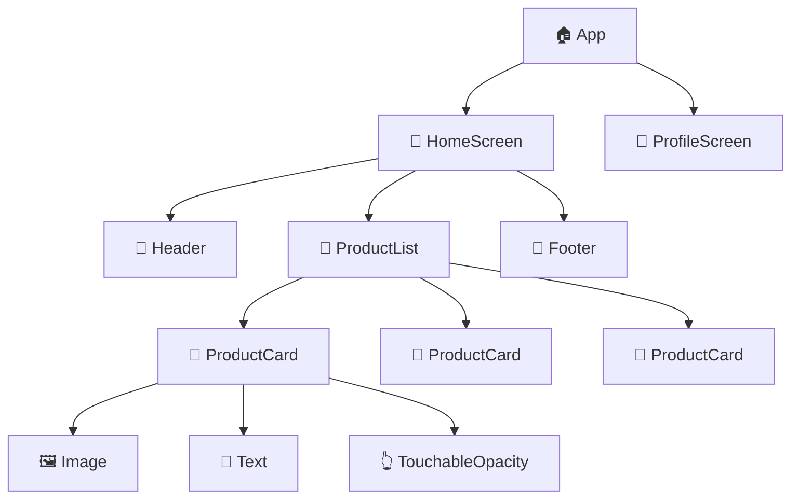

---

## 🏗️ ¿Qué es un Componente?

Un componente es una **función de TypeScript que devuelve UI** (lo que el usuario ve).

```tsx
// El componente más simple posible
function Saludo() {
  return <Text>¡Hola mundo!</Text>;
}

// Con props (parámetros personalizables, como ajustes del LEGO)
function Saludo({ nombre }: { nombre: string }) {
  return <Text>¡Hola, {nombre}!</Text>;
}

// Usándolo
<Saludo nombre="Andrés" />   // Muestra: ¡Hola, Andrés!
<Saludo nombre="María" />    // Muestra: ¡Hola, María!
```

---

## 📦 Los Componentes Básicos (Core Components)

React Native convierte estos componentes a elementos **nativos de iOS y Android** automáticamente.

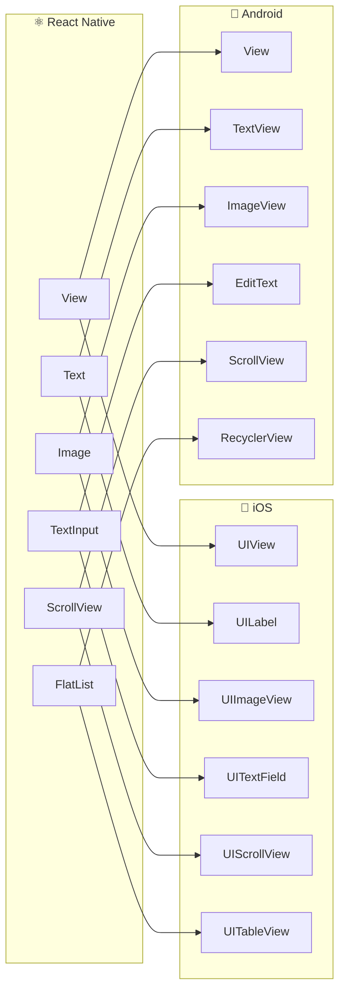

---

### 1. 📐 `View` — "El Contenedor / La Caja"

**Analogía**: Como una caja de cartón. No se ve a sí misma, pero organiza todo lo que hay adentro. Puedes apilar cajas, ponerlas en fila, darles color de fondo, bordes, sombras.

```tsx
import { View, Text, StyleSheet } from 'react-native';

function TarjetaProducto() {
  return (
    // Caja exterior (la tarjeta completa)
    <View style={styles.tarjeta}>
      
      {/* Caja para el texto */}
      <View style={styles.textos}>
        <Text style={styles.nombre}>Zapatos Nike</Text>
        <Text style={styles.precio}>$150.000</Text>
      </View>

      {/* Caja para los botones */}
      <View style={styles.acciones}>
        <Text>Agregar al carrito</Text>
      </View>

    </View>
  );
}

const styles = StyleSheet.create({
  tarjeta: {
    backgroundColor: '#fff',
    borderRadius: 12,
    padding: 16,
    marginBottom: 8,
    // Sombra en iOS
    shadowColor: '#000',
    shadowOffset: { width: 0, height: 2 },
    shadowOpacity: 0.1,
    shadowRadius: 4,
    // Sombra en Android
    elevation: 3,
  },
  textos: {
    flexDirection: 'row',       // Elementos en fila
    justifyContent: 'space-between', // Separados al máximo
    alignItems: 'center',
  },
  nombre: { fontSize: 16, fontWeight: 'bold' },
  precio: { fontSize: 16, color: '#e53935' },
  acciones: { marginTop: 12 },
});
```

---

### 2. 📝 `Text` — "La Etiqueta"

**Analogía**: Como una etiqueta adhesiva. Solo muestra texto, nada más. Puedes cambiar tamaño, color, fuente, alineación.

```tsx
import { Text } from 'react-native';

function EjemplosTexto() {
  return (
    <View>
      {/* Texto básico */}
      <Text>Hola mundo</Text>

      {/* Texto con estilo */}
      <Text style={{ fontSize: 24, fontWeight: 'bold', color: '#333' }}>
        Título grande
      </Text>

      {/* Texto que se corta con ... */}
      <Text numberOfLines={2} ellipsizeMode="tail">
        Este es un texto muy largo que se cortará después de dos líneas y mostrará
        puntos suspensivos al final para indicar que hay más contenido...
      </Text>

      {/* Texto con partes en negrita dentro (Text anidado) */}
      <Text>
        Tu pedido <Text style={{ fontWeight: 'bold' }}>#1234</Text> está listo
      </Text>
    </View>
  );
}
```

> ⚠️ **Regla importante**: En React Native, TODO el texto debe estar dentro de `<Text>`. No puedes poner texto suelto en un `<View>` como en HTML.

---

### 3. 🖼️ `Image` — "El Marco de Foto"

```tsx
import { Image } from 'react-native';

function Imagenes() {
  return (
    <View>
      {/* Imagen desde internet */}
      <Image
        source={{ uri: 'https://ejemplo.com/zapato.jpg' }}
        style={{ width: 200, height: 200, borderRadius: 8 }}
        resizeMode="cover"   // 'cover' | 'contain' | 'stretch' | 'center'
      />

      {/* Imagen local (bundleada con la app) */}
      <Image
        source={require('./assets/logo.png')}
        style={{ width: 100, height: 40 }}
        resizeMode="contain"
      />

      {/* Con placeholder mientras carga */}
      <Image
        source={{ uri: 'https://ejemplo.com/foto.jpg' }}
        style={{ width: 150, height: 150 }}
        defaultSource={require('./assets/placeholder.png')}
      />
    </View>
  );
}
```

**`resizeMode` visual:**

| Valor | Comportamiento |
|-------|---------------|
| `cover` | Llena el espacio, puede recortar bordes |
| `contain` | Se ajusta completa, puede dejar espacio vacío |
| `stretch` | Se estira para llenar exactamente (puede deformar) |
| `center` | Tamaño original, centrada |

---

### 4. ✏️ `TextInput` — "El Campo de Formulario"

**Analogía**: Como un cuadro de texto en papel. El usuario escribe ahí y tú guardas lo que escribió.

```tsx
import { TextInput, useState } from 'react-native';

function FormularioLogin() {
  const [email, setEmail] = useState('');
  const [password, setPassword] = useState('');

  return (
    <View>
      <TextInput
        value={email}
        onChangeText={setEmail}            // Se llama cada vez que el usuario escribe
        placeholder="correo@ejemplo.com"
        placeholderTextColor="#999"
        keyboardType="email-address"       // Teclado con @ y .
        autoCapitalize="none"              // No capitalizar automáticamente
        autoCorrect={false}
        style={styles.input}
      />

      <TextInput
        value={password}
        onChangeText={setPassword}
        placeholder="Contraseña"
        secureTextEntry={true}             // Ocultar caracteres (••••)
        returnKeyType="done"              // Botón del teclado: "Listo"
        onSubmitEditing={() => login()}    // Al presionar Enter/Done
        style={styles.input}
      />
    </View>
  );
}
```

**`keyboardType` más usados:**

| Valor | Cuándo usarlo |
|-------|--------------|
| `default` | Texto normal |
| `email-address` | Emails (muestra @ en teclado) |
| `numeric` | Solo números |
| `phone-pad` | Teléfonos |
| `decimal-pad` | Precios, decimales |

---

### 5. 👆 `TouchableOpacity` — "El Botón"

**Analogía**: Como un botón físico que se opaca cuando lo presionas (feedback visual).

```tsx
import { TouchableOpacity, Text } from 'react-native';

function Botones() {
  return (
    <View>
      {/* Botón básico */}
      <TouchableOpacity
        onPress={() => console.log('¡Presionado!')}
        activeOpacity={0.7}   // Qué tan opaco se vuelve al presionar (0-1)
        style={styles.boton}
      >
        <Text style={styles.textoBoton}>Comprar ahora</Text>
      </TouchableOpacity>

      {/* Botón deshabilitado */}
      <TouchableOpacity
        onPress={handleBuy}
        disabled={!itemsInCart}   // No responde si no hay items
        style={[styles.boton, !itemsInCart && styles.botonDeshabilitado]}
      >
        <Text>Finalizar compra</Text>
      </TouchableOpacity>

      {/* Cualquier cosa puede ser presionable */}
      <TouchableOpacity onPress={() => navigation.navigate('ProductDetail')}>
        <Image source={{ uri: product.imageUrl }} style={styles.imagen} />
      </TouchableOpacity>
    </View>
  );
}
```

> **¿`TouchableOpacity` vs `Pressable`?** En RN 0.77 se prefiere `Pressable` por ser más flexible, pero `TouchableOpacity` sigue siendo muy usado y válido.

---

### 6. 🆕 `Pressable` — "El Botón Moderno" (RN 0.63+)

```tsx
import { Pressable } from 'react-native';

<Pressable
  onPress={() => handlePress()}
  onLongPress={() => handleLongPress()}  // Presión prolongada
  style={({ pressed }) => [            // Estilo dinámico según estado
    styles.boton,
    pressed && styles.botonPresionado,  // Cambia mientras se presiona
  ]}
>
  {({ pressed }) => (
    <Text style={{ color: pressed ? '#666' : '#000' }}>
      {pressed ? 'Soltame...' : 'Presióname'}
    </Text>
  )}
</Pressable>
```

---

### 7. 📜 `ScrollView` vs `FlatList` — "El Papel de Rollo vs el Índice"

**Analogía ScrollView**: Como un papel de rollo. Todo el contenido está cargado en memoria, solo haces scroll.

**Analogía FlatList**: Como el índice de un libro. Solo carga las páginas que estás viendo en pantalla. Si el libro tiene 1000 páginas, no las lee todas a la vez.

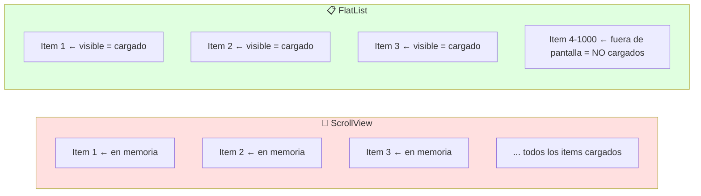

```tsx
// ✅ ScrollView: para pocas pantallas o contenido estático
<ScrollView
  showsVerticalScrollIndicator={false}
  contentContainerStyle={{ padding: 16 }}
>
  <Header />
  <BannerPromo />
  <CategoriasList />
  <ProductosDestacados />  {/* Todo se renderiza de una vez */}
</ScrollView>

// ✅ FlatList: para listas largas (usuarios, productos, mensajes)
<FlatList
  data={productos}                              // Array de datos
  keyExtractor={(item) => item.id.toString()}   // ID único por item
  renderItem={({ item }) => (                  // Cómo renderizar cada item
    <ProductCard producto={item} />
  )}
  // Opciones de performance
  initialNumToRender={10}       // Cuántos renderizar al inicio
  maxToRenderPerBatch={5}        // Cuántos renderizar por batch
  windowSize={5}                 // Ventana de rendering
  // Pull to refresh
  refreshing={isLoading}
  onRefresh={fetchProductos}
  // Infinite scroll
  onEndReachedThreshold={0.3}   // Al 30% del final, carga más
  onEndReached={loadMoreItems}
  // Footer de carga
  ListFooterComponent={isLoadingMore ? <ActivityIndicator /> : null}
  // Estado vacío
  ListEmptyComponent={<Text>No hay productos</Text>}
/>
```

**Regla de uso:**

| Situación | Usa |
|-----------|-----|
| Pantalla con secciones fijas (home, perfil) | `ScrollView` |
| Lista de productos, usuarios, mensajes | `FlatList` |
| Lista de 2 columnas (grid) | `FlatList` con `numColumns={2}` |
| Lista horizontal (carrusel) | `FlatList` con `horizontal={true}` |
| Más de 20-30 items dinámicos | Siempre `FlatList` |

---

### 8. 🔄 `ActivityIndicator` — "El Spinner de Carga"

```tsx
import { ActivityIndicator } from 'react-native';

function EstadoCarga({ cargando }: { cargando: boolean }) {
  if (!cargando) return null;
  
  return (
    <View style={styles.overlay}>
      <ActivityIndicator
        size="large"      // 'small' | 'large'
        color="#6200ee"
      />
      <Text>Cargando...</Text>
    </View>
  );
}
```

---

## 🎨 StyleSheet — "El Sastre de tu App"

**Analogía**: Como contratar un sastre. No usas ropa genérica (CSS web), el sastre hace ropa a medida para la plataforma (iOS/Android).

```tsx
import { StyleSheet } from 'react-native';

// ✅ Recomendado: StyleSheet.create (validado y optimizado)
const styles = StyleSheet.create({
  contenedor: {
    flex: 1,
    backgroundColor: '#f5f5f5',
    padding: 16,
  },
  titulo: {
    fontSize: 24,
    fontWeight: 'bold',
    color: '#333',
    marginBottom: 8,
  },
});

// ❌ No recomendado: objetos inline (se recrea en cada render)
<View style={{ flex: 1, padding: 16 }}>  {/* objeto nuevo cada vez */}

// ✅ Combinar estilos con array
<View style={[styles.base, esActivo && styles.activo, { margin: 8 }]}>
```

### Flexbox en React Native

React Native usa **Flexbox** para el layout, pero con diferencias vs web:

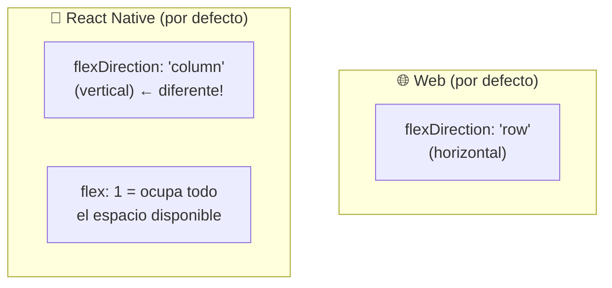

```tsx
// Los 3 conceptos más importantes de Flexbox en RN

// 1. flex: 1 → "ocupa todo el espacio disponible"
<View style={{ flex: 1 }}>  {/* Llena la pantalla */}

// 2. flexDirection → dirección de los hijos
<View style={{ flexDirection: 'row' }}>  {/* En fila */}
  <Text>A</Text>
  <Text>B</Text>
  <Text>C</Text>
</View>

// 3. justifyContent + alignItems → alinear hijos
<View style={{
  flex: 1,
  justifyContent: 'center',  // Centrar en el eje principal
  alignItems: 'center',      // Centrar en el eje secundario
}}>
  <Text>Centrado en la pantalla</Text>
</View>
```

---

## 🧩 Componente Completo: Ejemplo Real

```tsx
// ProductCard.tsx — componente reutilizable con TypeScript
import React from 'react';
import { View, Text, Image, TouchableOpacity, StyleSheet } from 'react-native';

// Definir el tipo de las props
interface ProductCardProps {
  id: string;
  name: string;
  price: number;
  imageUrl: string;
  onAddToCart: (id: string) => void;
}

export function ProductCard({ id, name, price, imageUrl, onAddToCart }: ProductCardProps) {
  return (
    <View style={styles.card}>
      <Image
        source={{ uri: imageUrl }}
        style={styles.image}
        resizeMode="cover"
      />
      <View style={styles.info}>
        <Text style={styles.name} numberOfLines={2}>
          {name}
        </Text>
        <Text style={styles.price}>
          ${price.toLocaleString('es-CO')}
        </Text>
      </View>
      <TouchableOpacity
        style={styles.button}
        onPress={() => onAddToCart(id)}
        activeOpacity={0.8}
      >
        <Text style={styles.buttonText}>Agregar al carrito</Text>
      </TouchableOpacity>
    </View>
  );
}

const styles = StyleSheet.create({
  card: {
    backgroundColor: '#fff',
    borderRadius: 12,
    marginBottom: 12,
    overflow: 'hidden',
    elevation: 2,
    shadowColor: '#000',
    shadowOffset: { width: 0, height: 1 },
    shadowOpacity: 0.1,
    shadowRadius: 2,
  },
  image: {
    width: '100%',
    height: 160,
  },
  info: {
    padding: 12,
  },
  name: {
    fontSize: 15,
    fontWeight: '600',
    color: '#1a1a1a',
    marginBottom: 4,
  },
  price: {
    fontSize: 17,
    fontWeight: 'bold',
    color: '#e53935',
  },
  button: {
    backgroundColor: '#6200ee',
    margin: 12,
    marginTop: 0,
    padding: 12,
    borderRadius: 8,
    alignItems: 'center',
  },
  buttonText: {
    color: '#fff',
    fontWeight: '600',
    fontSize: 14,
  },
});
```

---

## � React Web vs React Native — Las Diferencias Clave

**Analogía**: Misma receta de cocina, cocinas diferentes. React es la receta (la lógica, los componentes, los hooks). La cocina web usa ingredientes HTML. La cocina nativa usa ingredientes iOS/Android.

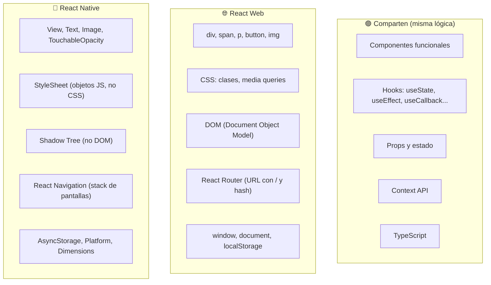

### Tabla comparativa directa

| Concepto | 🌐 React Web | 📱 React Native |
|----------|------------|----------------|
| **Contenedor** | `<div>` | `<View>` |
| **Texto** | `<p>`, `<span>`, `<h1>` | `<Text>` (todo texto va aquí) |
| **Imagen** | `` | `<Image source={{ uri: '...' }}>` |
| **Botón** | `<button onClick={}>` | `<TouchableOpacity onPress={}>` |
| **Input** | `<input type="text">` | `<TextInput onChangeText={}>` |
| **Lista** | `<ul><li>` o `.map()` | `<FlatList data={} renderItem={}>` |
| **Estilos** | CSS / clases | `StyleSheet.create({})` |
| **Unidades** | px, rem, %, vw/vh | Números (dp, sin unidad) |
| **Flexbox default** | `row` (horizontal) | `column` (vertical) ← diferente |
| **Navegación** | URL del browser | Stack de pantallas (React Navigation) |
| **Scroll** | Automático en body | Explícito: `<ScrollView>` |
| **Click/Tap** | `onClick` | `onPress` |
| **Hover** | `:hover` en CSS | No existe (pantalla táctil) |
| **Fuente por defecto** | Hereda del sistema | San Francisco (iOS) / Roboto (Android) |

### Código side-by-side

```tsx
// 🌐 React Web
function TarjetaWeb() {
  return (
    <div className="card">
      
      <p>{product.name}</p>
      <button onClick={() => addToCart(product.id)}>
        Agregar
      </button>
    </div>
  );
}

// 📱 React Native (misma idea, diferentes "ingredientes")
function TarjetaNative() {
  return (
    <View style={styles.card}>
      <Image source={{ uri: product.image }} style={styles.image} />
      <Text>{product.name}</Text>
      <TouchableOpacity onPress={() => addToCart(product.id)}>
        <Text>Agregar</Text>
      </TouchableOpacity>
    </View>
  );
}
```

### Lo que NO existe en React Native

```tsx
// ❌ Estas cosas de web NO existen en RN:

window.localStorage    // → usar @react-native-async-storage/async-storage
document.querySelector // → no hay DOM
window.location.href   // → usar React Navigation
fetch (con cookies)    // → fetch existe, pero sin cookies de browser
CSS externos (.css)    // → todo en StyleSheet.create
```

---

## 🏗️ La Nueva Arquitectura — JSI, Fabric y TurboModules

### El problema de la arquitectura antigua

**Analogía**: Imagina que para pedirle algo al cocinero (código nativo) tienes que mandarle un **fax escrito a mano** (Bridge). El fax:
- Solo se manda en lotes (no es instantáneo)
- El papel puede acumularse si mandas muchos
- El cocinero tiene que leer, interpretar y responder con otro fax
- Mientras tanto, tú (JavaScript) te quedas esperando

Así funcionaba React Native antes de la Nueva Arquitectura.

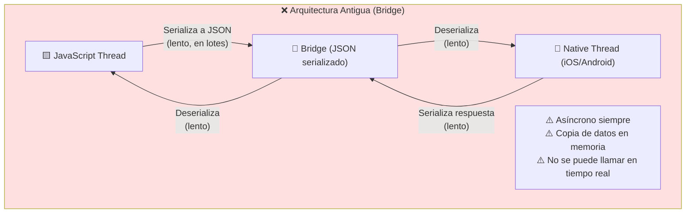

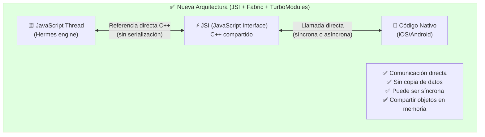

---

### ⚡ JSI (JavaScript Interface) — "El Traductor Instantáneo"

**Analogía**: Antes tenías un traductor que tomaba nota de lo que decías, se iba a buscar al cocinero, le dejaba la nota, esperaba la respuesta, y te la traía. Con JSI, el traductor **está presente físicamente** en la conversación: tú hablas, él traduce en tiempo real, sin idas y venidas.

**¿Qué es técnicamente?**
- Una capa en **C++** que permite a JavaScript **referenciar objetos nativos directamente**
- En vez de serializar/deserializar JSON, JS tiene un **puntero directo** al objeto nativo
- Permite llamadas **síncronas** (en el mismo frame) cuando se necesita

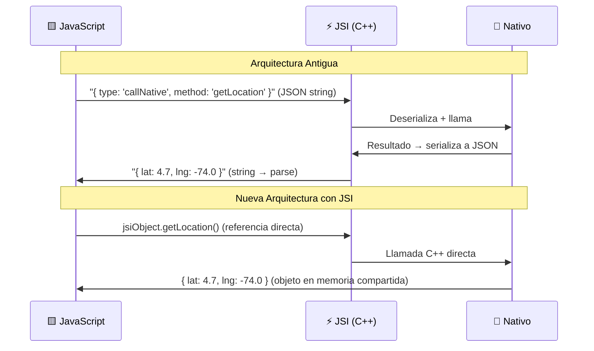

---

### 🎨 Fabric — "El Nuevo Motor de Dibujo"

**Analogía**: El motor de renderizado antiguo era como una impresora que primero calculaba todo el layout en un cuarto, luego mandaba las instrucciones en papel al cuarto donde se dibujaba en pantalla. Fabric conecta los dos cuartos: el cálculo y el dibujo pueden pasar al mismo tiempo.

**¿Qué es técnicamente?**
- El nuevo **motor de renderizado** de React Native
- Reemplaza al UIManager antiguo
- Calcula el layout en C++ (antes era en Java/ObjC)
- Soporta **renderizado síncrono**: puede responder a gestos en el mismo frame
- Permite **renderizado concurrente** (React 18 features: Suspense, Transitions)

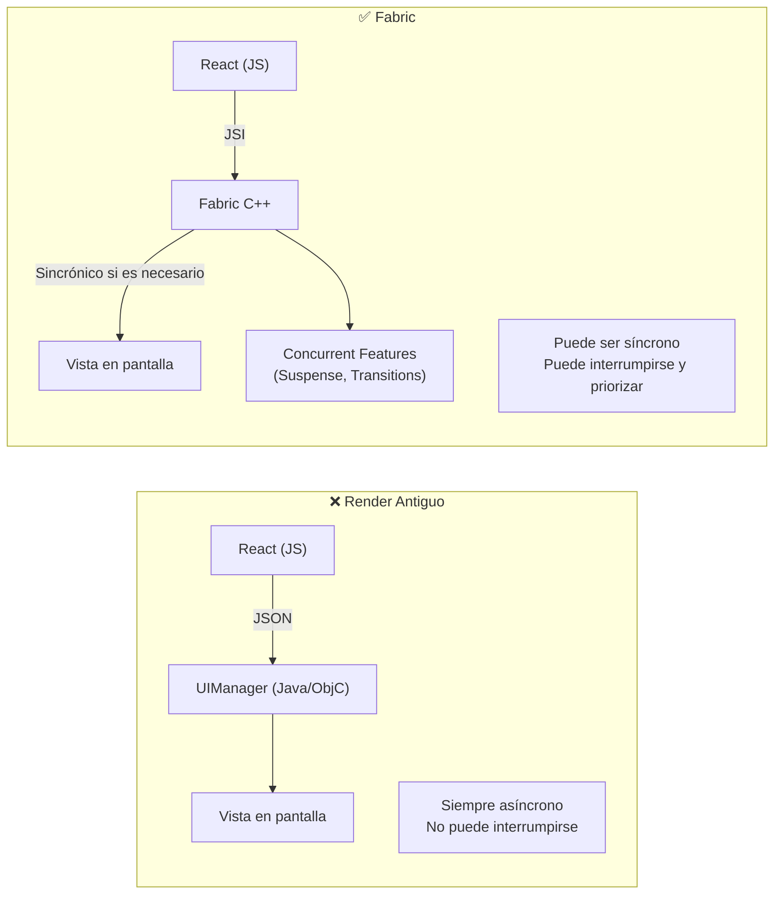

**Beneficio visible para el usuario**: los gestos (scroll, swipe, animaciones) son más suaves porque la UI puede responder en el mismo frame, sin esperar al siguiente ciclo del Bridge.

---

### 🚀 TurboModules — "Los Módulos bajo Demanda"

**Analogía**: En la arquitectura antigua, cuando tu app arrancaba, **todos los módulos nativos** se cargaban en memoria aunque no los usaras (como si al abrir un restaurante tuvieras que contratar a TODOS los empleados posibles aunque solo necesites al cajero y al cocinero).

Con TurboModules, los módulos se cargan **solo cuando los necesitas** (lazy loading de código nativo).

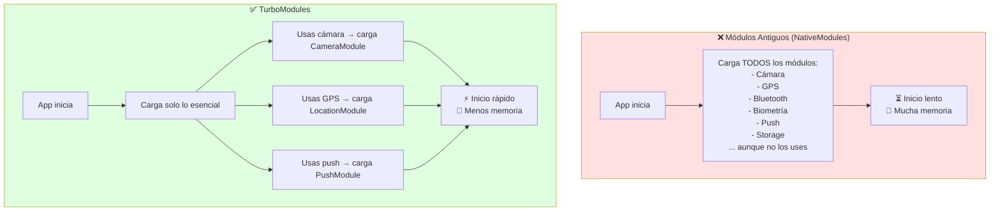

**Además**, TurboModules usa JSI para la comunicación, por lo que son más rápidos que los NativeModules antiguos:

```typescript
// ❌ NativeModule antiguo (a través del Bridge)
import { NativeModules } from 'react-native';
const { CameraModule } = NativeModules;
// La llamada pasa por el Bridge (asíncrona, serializada)
CameraModule.takePhoto(options, callback);

// ✅ TurboModule nuevo (a través de JSI)
import { NativeCamera } from 'react-native'; // cargado lazy por JSI
// Llamada directa sin Bridge
const photo = await NativeCamera.takePhoto(options);
```

---

### El Cuadro Completo de la Nueva Arquitectura

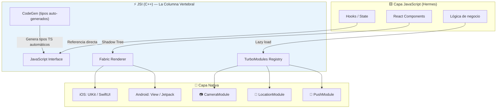

### ¿Qué cambia para ti como desarrollador?

| Aspecto | Antes | Con Nueva Arquitectura |
|---------|-------|----------------------|
| **Performance general** | Limitada por el Bridge | 20-40% más rápido en operaciones nativas |
| **Animaciones** | Pueden lagear (Bridge delay) | 60fps consistentes |
| **Startup time** | Lento (carga todos los módulos) | Más rápido (TurboModules lazy) |
| **React 18 features** | No soportados | ✅ Suspense, Transitions, useDeferredValue |
| **Crear módulos nativos** | Complejo (NativeModules) | Más simple con CodeGen |
| **Debugging** | Difícil rastrear el Bridge | Mejor con herramientas directas |

> **En RN 0.77**: La Nueva Arquitectura es **activa por defecto**. No necesitas hacer nada especial, ya la estás usando.

---

## �🆕 Novedades en React Native 0.77

| Novedad | ¿Qué es? |
|---------|---------|
| **New Architecture estable** | Motor de renderizado Fabric + JSI por defecto. La comunicación JS ↔ nativo es síncrona y más rápida |
| **StyleSheet mejoras** | Soporte a `gap`, `columnGap`, `rowGap` (como en web) |
| **Mejor soporte CSS** | `display: contents`, `mix-blend-mode`, `isolation` |
| **Android 15 compatible** | Edge-to-edge display por defecto |

```tsx
// gap ya funciona nativamente en RN 0.77 🎉
<View style={{ flexDirection: 'row', gap: 12 }}>
  <Card />
  <Card />
  <Card />
  {/* Espacio de 12px entre cada card, sin marginRight en cada una */}
</View>
```

---

## 📌 Resumen en una frase

> Los **componentes** son los bloques de LEGO de React Native: combinas `View`, `Text`, `Image`, `FlatList` y `TouchableOpacity` para construir cualquier pantalla, reutilizando piezas y pasando datos con **props**.

---

## 🔗 Navegación

👉 [02-Ciclo-de-Vida-y-Hooks-Para-Dummies.md](./02-Ciclo-de-Vida-y-Hooks-Para-Dummies.md)
