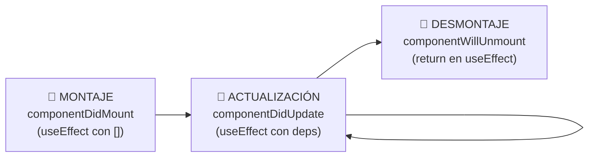
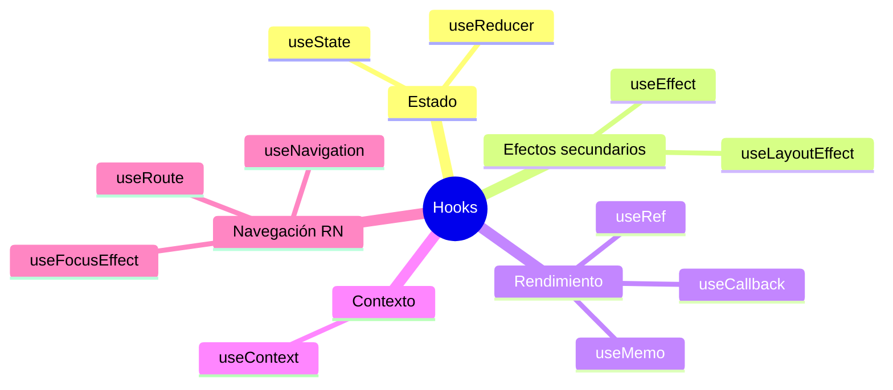
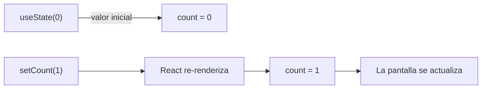
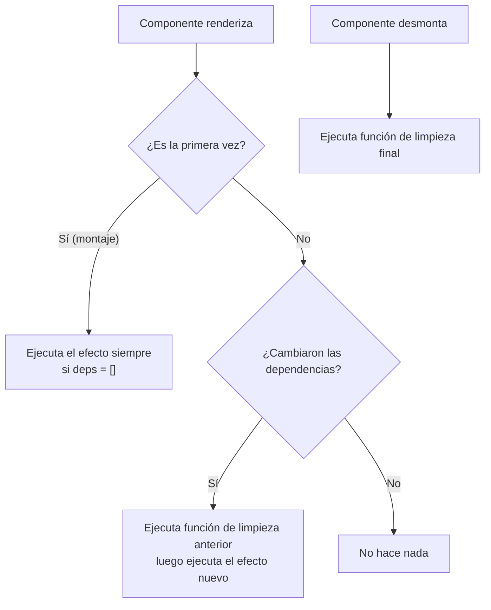
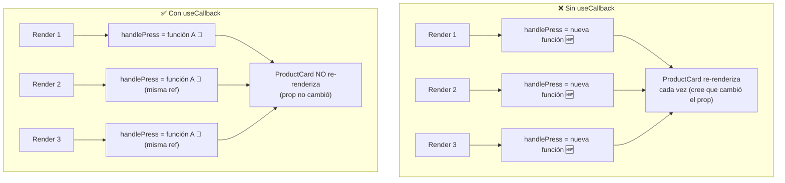
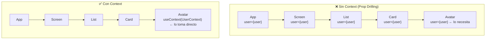

# ⚙️ Ciclo de Vida y Hooks Para Dummies

> **Objetivo**: Entender cuándo y por qué un componente "nace", "vive" y "muere", y cómo los Hooks te permiten controlar ese ciclo con ejemplos del mundo real.

---

## 🌍 Analogía: El Ciclo de Vida de una Planta

Un componente de React Native es como una planta:

| Fase | Planta | Componente |
|------|--------|-----------|
| **Montaje** | La semilla germina y brota 🌱 | El componente aparece en pantalla |
| **Actualización** | La planta crece, le salen hojas 🌿 | Los datos (state/props) cambian, se re-renderiza |
| **Desmontaje** | La planta se seca y se retira 🍂 | El componente desaparece de la pantalla |



---

## 📜 Clases vs Hooks — La Evolución

Antes de los Hooks (React < 16.8), los componentes con estado se escribían como **clases**. Eran verbosos y difíciles de reutilizar lógica.

```tsx
// ❌ Componente de Clase (antiguo, aún funciona pero evitar)
class ContadorClase extends React.Component {
  state = { count: 0 };

  componentDidMount() {
    // Se ejecuta al montar
    console.log('Componente montado');
  }

  componentDidUpdate(prevProps, prevState) {
    // Se ejecuta al actualizar
    if (prevState.count !== this.state.count) {
      console.log('Count cambió a:', this.state.count);
    }
  }

  componentWillUnmount() {
    // Se ejecuta al desmontar
    console.log('Componente desmontado');
  }

  render() {
    return (
      <TouchableOpacity onPress={() => this.setState({ count: this.state.count + 1 })}>
        <Text>{this.state.count}</Text>
      </TouchableOpacity>
    );
  }
}

// ✅ Componente Funcional con Hooks (moderno, usar siempre)
function ContadorHook() {
  const [count, setCount] = useState(0);

  useEffect(() => {
    console.log('Montado o count cambió:', count);
    return () => console.log('Limpieza / desmontado');
  }, [count]);

  return (
    <TouchableOpacity onPress={() => setCount(c => c + 1)}>
      <Text>{count}</Text>
    </TouchableOpacity>
  );
}
```

---

## 🪝 Los Hooks Más Importantes



---

## 1. 🗃️ `useState` — "La Memoria del Componente"

**Analogía**: Una pizarra dentro del componente. Cada vez que borras y escribes algo nuevo en la pizarra (setState), el componente se redibuja.



```tsx
import { useState } from 'react';

function Contador() {
  // [valorActual, funcionParaCambiarElValor] = useState(valorInicial)
  const [count, setCount] = useState(0);
  const [nombre, setNombre] = useState('');
  const [activo, setActivo] = useState(false);
  const [usuario, setUsuario] = useState<User | null>(null); // con TypeScript

  return (
    <View>
      <Text>Contador: {count}</Text>

      {/* Forma 1: valor directo */}
      <TouchableOpacity onPress={() => setCount(5)}>
        <Text>Poner en 5</Text>
      </TouchableOpacity>

      {/* Forma 2: función (usa el valor anterior) ← recomendada cuando dependes del valor previo */}
      <TouchableOpacity onPress={() => setCount(prev => prev + 1)}>
        <Text>Incrementar</Text>
      </TouchableOpacity>

      {/* Actualizar objeto: siempre spread el estado anterior */}
      <TouchableOpacity onPress={() => setUsuario(prev => ({
        ...prev!,
        nombre: 'Andrés',
      }))}>
        <Text>Cambiar nombre</Text>
      </TouchableOpacity>
    </View>
  );
}
```

> ⚠️ **Regla de oro**: Nunca mutes el estado directamente. Siempre crea un nuevo valor.
> ```tsx
> // ❌ MAL: mutar directamente
> usuario.nombre = 'Andrés';
> setUsuario(usuario); // React no detecta el cambio
>
> // ✅ BIEN: crear nuevo objeto
> setUsuario({ ...usuario, nombre: 'Andrés' });
> ```

---

## 2. ⚡ `useEffect` — "El Vigilante de Cambios"

**Analogía**: Un vigilante que observa ciertas cosas. Tú le dices: *"Cuando llegues al trabajo (montaje) y cada vez que cambie el turno (dependencias), haz esta tarea. Y cuando te vayas (desmontaje), apaga las luces."*



### Los 3 patrones de `useEffect`

```tsx
import { useEffect, useState } from 'react';

// ─── PATRÓN 1: Sin dependencias → corre en CADA render ────────────────────────
// ⚠️ Raramente necesario
useEffect(() => {
  console.log('Corre en cada render');
});

// ─── PATRÓN 2: Array vacío [] → solo al MONTAR (y limpiar al desmontar) ────────
// 🟢 Ideal para: suscripciones, fetch inicial, setup
useEffect(() => {
  console.log('Solo al montar (componentDidMount)');

  // La función de retorno es la "limpieza" (componentWillUnmount)
  return () => {
    console.log('Solo al desmontar');
  };
}, []); // ← array vacío

// ─── PATRÓN 3: Con dependencias → corre cuando cambia alguna dep ────────────────
// 🟢 Ideal para: reaccionar a cambios de estado o props
useEffect(() => {
  console.log('userId cambió a:', userId);
  fetchUserData(userId);

  return () => {
    cancelFetch(); // Limpiar si el userId cambia antes de que termine el fetch
  };
}, [userId]); // ← corre cada vez que userId cambia
```

### Ejemplo real: Fetch de datos con useEffect

```tsx
function PantallaProductos({ categoriaId }: { categoriaId: string }) {
  const [productos, setProductos] = useState<Product[]>([]);
  const [loading, setLoading] = useState(true);
  const [error, setError] = useState<string | null>(null);

  useEffect(() => {
    // Variable para controlar si el componente sigue montado
    let cancelado = false;

    async function cargarProductos() {
      try {
        setLoading(true);
        setError(null);

        const data = await api.getProducts(categoriaId);

        // Solo actualiza el estado si el componente sigue montado
        if (!cancelado) {
          setProductos(data);
        }
      } catch (err) {
        if (!cancelado) {
          setError('Error cargando productos');
        }
      } finally {
        if (!cancelado) {
          setLoading(false);
        }
      }
    }

    cargarProductos();

    // Limpieza: si categoriaId cambia antes de que termine, cancela
    return () => {
      cancelado = true;
    };
  }, [categoriaId]); // Re-ejecuta cuando cambia la categoría

  if (loading) return <ActivityIndicator />;
  if (error)   return <Text>{error}</Text>;

  return (
    <FlatList
      data={productos}
      renderItem={({ item }) => <ProductCard producto={item} />}
      keyExtractor={(item) => item.id}
    />
  );
}
```

---

## 3. 🚀 `useCallback` — "La Función que no se Recrea"

**Analogía**: Cada vez que el componente se re-renderiza, todas sus funciones se recrean (como imprimir el mismo papel una y otra vez). `useCallback` es como tener la función **plastificada**: no se recrea a menos que lo que depende de ella cambie.



```tsx
import { useCallback, useState } from 'react';

function ListaProductos() {
  const [carrito, setCarrito] = useState<string[]>([]);

  // ❌ Sin useCallback: se recrea en cada render
  // const handleAddToCart = (id: string) => {
  //   setCarrito(prev => [...prev, id]);
  // };

  // ✅ Con useCallback: solo se recrea si setCarrito cambia (nunca)
  const handleAddToCart = useCallback((id: string) => {
    setCarrito(prev => [...prev, id]);
  }, []); // setCarrito es estable, no necesita estar en las deps

  return (
    <FlatList
      data={productos}
      renderItem={({ item }) => (
        // Como handleAddToCart no cambia, ProductCard no se re-renderiza innecesariamente
        <ProductCard
          producto={item}
          onAddToCart={handleAddToCart}
        />
      )}
    />
  );
}
```

> **¿Cuándo usar `useCallback`?**
> - Cuando pasas una función como prop a un componente **memoizado** (`React.memo`)
> - Cuando la función es dependencia de otro `useEffect`
> - **No lo uses en todos lados**: tiene costo de memoria. Solo donde hay problema real de performance.

---

## 4. 🧮 `useMemo` — "El Cálculo que se Recuerda"

**Analogía**: Un calculador perezoso. La primera vez hace el cálculo. Las siguientes veces, si los números de entrada no cambiaron, te da el resultado guardado en lugar de calcular de nuevo.

```tsx
import { useMemo } from 'react';

function ResumenCarrito({ items }: { items: CartItem[] }) {
  // ❌ Sin useMemo: se recalcula en CADA render aunque items no cambie
  // const total = items.reduce((sum, item) => sum + item.price * item.qty, 0);

  // ✅ Con useMemo: solo recalcula cuando `items` cambia
  const total = useMemo(() => {
    console.log('Calculando total...'); // Solo aparece cuando items cambia
    return items.reduce((sum, item) => sum + item.price * item.qty, 0);
  }, [items]);

  // Otro ejemplo: filtrar una lista grande
  const productosFiltrados = useMemo(() => {
    return productos.filter(p =>
      p.nombre.toLowerCase().includes(busqueda.toLowerCase())
    );
  }, [productos, busqueda]); // Recalcula solo si cambian productos o busqueda

  return (
    <View>
      <Text>Total: ${total.toLocaleString()}</Text>
      <Text>{productosFiltrados.length} resultados</Text>
    </View>
  );
}
```

---

## 5. 📌 `useRef` — "El Post-it que no Redibuja"

**Analogía**: `useState` es una pizarra que al borrar y escribir redibuja todo. `useRef` es un post-it pegado en la pared: puedes cambiar lo que dice sin que nadie se entere ni se redibuje nada.

Tiene dos usos principales:

### Uso 1: Referencia a un elemento nativo (como `document.getElementById` en web)

```tsx
import { useRef } from 'react';

function FormularioConFocus() {
  const inputRef = useRef<TextInput>(null);
  const cameraRef = useRef<Camera>(null);

  function enfocarInput() {
    inputRef.current?.focus(); // Mueve el cursor al input
  }

  return (
    <View>
      <TextInput ref={inputRef} placeholder="Escribe aquí" />
      <TouchableOpacity onPress={enfocarInput}>
        <Text>Enfocar input</Text>
      </TouchableOpacity>
    </View>
  );
}
```

### Uso 2: Guardar valores sin disparar re-render

```tsx
function Timer() {
  const [segundos, setSegundos] = useState(0);

  // Guardar el ID del intervalo sin re-renderizar al cambiarlo
  const intervalRef = useRef<ReturnType<typeof setInterval> | null>(null);

  function iniciar() {
    intervalRef.current = setInterval(() => {
      setSegundos(s => s + 1);
    }, 1000);
  }

  function detener() {
    if (intervalRef.current) {
      clearInterval(intervalRef.current);
      intervalRef.current = null;
    }
  }

  useEffect(() => {
    return () => detener(); // Limpiar al desmontar
  }, []);

  return (
    <View>
      <Text>{segundos} segundos</Text>
      <TouchableOpacity onPress={iniciar}><Text>Iniciar</Text></TouchableOpacity>
      <TouchableOpacity onPress={detener}><Text>Detener</Text></TouchableOpacity>
    </View>
  );
}
```

---

## 6. 🌍 `useContext` — "El Walkie-Talkie Global"

**Analogía**: Sin Context, para pasar datos del abuelo al nieto tienes que pasarlos por el padre (prop drilling, como pasar un mensaje de mano en mano). Con Context, es como un walkie-talkie: el abuelo transmite y cualquier nieto que tenga el mismo walkie-talkie lo recibe directamente.



```tsx
import { createContext, useContext, useState } from 'react';

// 1. Crear el contexto con su tipo
interface UserContextType {
  user: User | null;
  logout: () => void;
}
const UserContext = createContext<UserContextType | null>(null);

// 2. Hook personalizado para usarlo fácilmente
function useUser() {
  const ctx = useContext(UserContext);
  if (!ctx) throw new Error('useUser debe usarse dentro de UserProvider');
  return ctx;
}

// 3. Provider: envuelve la parte del árbol que necesita los datos
function UserProvider({ children }: { children: React.ReactNode }) {
  const [user, setUser] = useState<User | null>(null);

  function logout() {
    setUser(null);
  }

  return (
    <UserContext.Provider value={{ user, logout }}>
      {children}
    </UserContext.Provider>
  );
}

// 4. Consumir en cualquier componente hijo, sin prop drilling
function AvatarUsuario() {
  const { user, logout } = useUser(); // Directo, sin pasar por padres

  return (
    <TouchableOpacity onPress={logout}>
      <Image source={{ uri: user?.avatarUrl }} style={styles.avatar} />
      <Text>{user?.nombre}</Text>
    </TouchableOpacity>
  );
}

// 5. En la app raíz
function App() {
  return (
    <UserProvider>
      <NavigationContainer>
        {/* Todos los componentes aquí pueden usar useUser() */}
      </NavigationContainer>
    </UserProvider>
  );
}
```

---

## 7. 🔁 `useReducer` — "El Gestor de Estado Complejo"

**Analogía**: `useState` es como un interruptor (on/off o un valor simple). `useReducer` es como el panel de control de una nave espacial: tienes un panel central que recibe instrucciones (`dispatch`) y sabe exactamente qué palanca mover según la instrucción (`action`).

```tsx
import { useReducer } from 'react';

// El "panel de control" — define todas las acciones posibles
type Action =
  | { type: 'ADD_ITEM'; payload: CartItem }
  | { type: 'REMOVE_ITEM'; payload: string }
  | { type: 'CLEAR_CART' }
  | { type: 'SET_LOADING'; payload: boolean };

interface CartState {
  items: CartItem[];
  loading: boolean;
}

function cartReducer(state: CartState, action: Action): CartState {
  switch (action.type) {
    case 'ADD_ITEM':
      return { ...state, items: [...state.items, action.payload] };
    case 'REMOVE_ITEM':
      return { ...state, items: state.items.filter(i => i.id !== action.payload) };
    case 'CLEAR_CART':
      return { ...state, items: [] };
    case 'SET_LOADING':
      return { ...state, loading: action.payload };
    default:
      return state;
  }
}

function CarritoScreen() {
  const [state, dispatch] = useReducer(cartReducer, { items: [], loading: false });

  return (
    <View>
      <TouchableOpacity onPress={() => dispatch({ type: 'CLEAR_CART' })}>
        <Text>Vaciar carrito</Text>
      </TouchableOpacity>
      <TouchableOpacity onPress={() => dispatch({ type: 'REMOVE_ITEM', payload: 'prod_123' })}>
        <Text>Eliminar producto</Text>
      </TouchableOpacity>
      <Text>{state.items.length} items</Text>
    </View>
  );
}
```

> **`useState` vs `useReducer`**:
> - Estado simple (un número, un string, un boolean) → `useState`
> - Estado complejo con múltiples sub-valores o acciones → `useReducer`

---

## 8. 🎯 Hooks Especiales de React Navigation

Estos hooks solo existen en React Native con React Navigation instalado.

### `useFocusEffect` — "Hacer algo cada vez que entras a la pantalla"

**Analogía**: `useEffect([])` corre una vez al montar. Pero si navegas a otra pantalla y vuelves, NO corre de nuevo. `useFocusEffect` es como el portero del club: te revisa CADA VEZ que entras, no solo la primera.

```tsx
import { useFocusEffect } from '@react-navigation/native';
import { useCallback } from 'react';

function PantallaPedidos() {
  const [pedidos, setPedidos] = useState([]);

  // Se ejecuta CADA VEZ que el usuario navega a esta pantalla
  useFocusEffect(
    useCallback(() => {
      console.log('Pantalla enfocada → refrescar datos');
      fetchPedidos().then(setPedidos);

      return () => {
        console.log('Pantalla perdió foco');
      };
    }, [])
  );

  return <FlatList data={pedidos} renderItem={...} />;
}
```

### `useIsFocused` — "¿Estoy en pantalla ahora mismo?"

```tsx
import { useIsFocused } from '@react-navigation/native';

function PantallaCamara() {
  const isFocused = useIsFocused();

  return (
    // La cámara solo está activa cuando la pantalla está visible
    <Camera isActive={isFocused} />
  );
}
```

---

## 🏗️ Custom Hooks — "Tu Propio Toolbox"

Los Custom Hooks son la forma de **reutilizar lógica** entre componentes. Si te encuentras copiando el mismo `useState` + `useEffect` en varias pantallas, es momento de crear un Custom Hook.

**Analogía**: En vez de que cada empleado aprenda a hacer café desde cero, contratas a un barista especializado (`useCoffee`) que cualquiera puede llamar.

```tsx
// ✅ Custom Hook: useProductos
// Encapsula: fetch, loading, error, refresh — lógica reutilizable
function useProductos(categoriaId: string) {
  const [productos, setProductos] = useState<Product[]>([]);
  const [loading, setLoading] = useState(true);
  const [error, setError] = useState<string | null>(null);

  const fetchProductos = useCallback(async () => {
    try {
      setLoading(true);
      setError(null);
      const data = await api.getProducts(categoriaId);
      setProductos(data);
    } catch {
      setError('Error cargando productos');
    } finally {
      setLoading(false);
    }
  }, [categoriaId]);

  useEffect(() => {
    fetchProductos();
  }, [fetchProductos]);

  return { productos, loading, error, refresh: fetchProductos };
}

// Usarlo en cualquier pantalla — sin repetir lógica
function PantallaZapatos() {
  const { productos, loading, error, refresh } = useProductos('zapatos');
  // ...
}

function PantallaCamisas() {
  const { productos, loading, error, refresh } = useProductos('camisas');
  // ...
}
```

---

## 📊 Cuadro de Referencia Rápida

| Hook | ¿Para qué? | Cuándo usarlo |
|------|-----------|--------------|
| `useState` | Guardar y cambiar datos | Siempre que necesites estado local |
| `useEffect` | Efectos secundarios | Fetch, suscripciones, timers |
| `useCallback` | Memoizar funciones | Props de componentes memoizados |
| `useMemo` | Memoizar cálculos | Operaciones costosas |
| `useRef` | Refs a elementos / valores sin re-render | Focus, intervalos, valores previos |
| `useContext` | Estado global sin prop drilling | Auth, tema, idioma |
| `useReducer` | Estado complejo con múltiples acciones | Carritos, formularios complejos |
| `useFocusEffect` | Ejecutar al enfocar pantalla | Refresh al volver a una pantalla |
| `useIsFocused` | Saber si la pantalla está activa | Cámara, animaciones |
| Custom Hook | Reutilizar lógica | Lógica repetida entre pantallas |

---

## 📌 Resumen en una frase

> Los **Hooks** son las herramientas que le dan "superpoderes" a los componentes funcionales: `useState` para recordar datos, `useEffect` para reaccionar a cambios, `useCallback`/`useMemo` para optimizar rendimiento, y `useContext` para compartir datos globalmente sin pasar props por toda la jerarquía.

---

## 🔗 Navegación

👈 [01-Componentes-RN-Para-Dummies.md](./01-Componentes-RN-Para-Dummies.md)  
👉 [03-TypeScript-en-RN-Para-Dummies.md](./03-TypeScript-en-RN-Para-Dummies.md)
