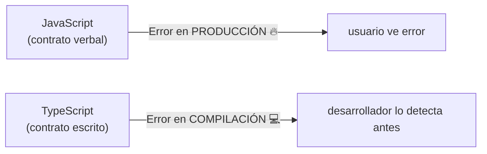
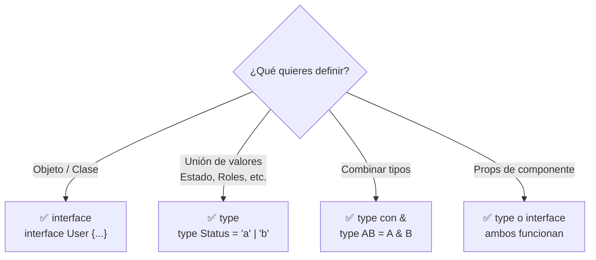

# 🛡️ TypeScript en React Native Para Dummies

> **Objetivo**: Entender TypeScript desde cero en el contexto de React Native — tipando props, estado, hooks, navegación y respuestas de API — con analogías del mundo real y ejemplos prácticos.

---

## 🌍 Analogía: El Contrato de Trabajo

JavaScript es como contratar a alguien con un contrato verbal: "Haces esto, yo te pago, a ver qué pasa". Puede funcionar, pero si hay un malentendido, lo descubres cuando ya es tarde (en producción 🔥).

**TypeScript es el contrato escrito y firmado**. Antes de que la app corra, el compilador lee el contrato y dice: "Oye, aquí falta la firma del nombre" o "Este campo dice que es número pero me estás pasando un texto". Los errores aparecen mientras escribes, no cuando el usuario los encuentra.



---

## 🧱 Conceptos Base de TypeScript

### Tipos Primitivos

```typescript
// Los básicos que ya conoces
const nombre: string = 'Andrés';
const edad: number = 30;
const activo: boolean = true;

// Null y undefined — diferencia importante
let usuario: string | null = null;     // puede ser string o null
let sesion: string | undefined;        // puede ser string o no estar definida

// Arrays
const ids: number[] = [1, 2, 3];
const nombres: string[] = ['Ana', 'Juan'];
const mixto: Array<string | number> = ['hola', 42];

// Any — evítalo, es rendirse ante TypeScript
const trampa: any = 'esto puede ser cualquier cosa'; // ⚠️ No usar
```

### `type` vs `interface` — ¿Cuál usar?

**Analogía**: `interface` es como el plano de un edificio — define la estructura y se puede ampliar. `type` es como una fotografía del plano — más rígido pero más versátil para combinaciones.

```typescript
// ─── INTERFACE ──────────────────────────────────────────
// Para objetos y clases. Extensible con "extends"
interface Usuario {
  id: string;
  nombre: string;
  email: string;
}

// Extender es fácil
interface UsuarioAdmin extends Usuario {
  permisos: string[];
}

// ─── TYPE ────────────────────────────────────────────────
// Para todo lo demás: uniones, intersecciones, aliases
type ID = string | number;
type EstadoPedido = 'pendiente' | 'enviado' | 'entregado' | 'cancelado';
type PuntoGeografico = { lat: number; lng: number };

// Intersección (combinar tipos)
type UsuarioConUbicacion = Usuario & PuntoGeografico;

// ─── ¿CUÁNDO USAR CUÁL? ──────────────────────────────────
// interface → objetos de datos (User, Product, Order)
// type      → uniones, alias, combinaciones, props de componentes
```



---

## 📦 Tipando Props de Componentes

Esta es la parte más importante en React Native. Props mal tipadas = errores difíciles de encontrar.

```typescript
import { View, Text, Image, TouchableOpacity, StyleSheet } from 'react-native';

// ─── TIPOS BASE ──────────────────────────────────────────
interface Producto {
  id: string;
  nombre: string;
  precio: number;
  imagen: string;
  categoria: 'ropa' | 'zapatos' | 'accesorios'; // Tipo literal — solo estos valores
  stock: number;
  descuento?: number; // ? = opcional, puede no venir
}

// ─── PROPS DEL COMPONENTE ────────────────────────────────
interface ProductoCardProps {
  producto: Producto;
  onPress: (id: string) => void;          // Función que recibe id y no retorna nada
  onAddToCart: (producto: Producto) => void;
  mostrarStock?: boolean;                  // Prop opcional con valor por defecto
  testID?: string;                         // Para pruebas E2E
}

// ─── COMPONENTE TIPADO ───────────────────────────────────
function ProductoCard({
  producto,
  onPress,
  onAddToCart,
  mostrarStock = true,   // Valor por defecto para props opcionales
  testID,
}: ProductoCardProps) {
  const precioFinal = producto.descuento
    ? producto.precio * (1 - producto.descuento / 100)
    : producto.precio;

  return (
    <TouchableOpacity
      testID={testID}
      onPress={() => onPress(producto.id)}
      style={styles.card}
    >
      <Image source={{ uri: producto.imagen }} style={styles.imagen} />
      <Text style={styles.nombre}>{producto.nombre}</Text>
      <Text style={styles.precio}>${precioFinal.toFixed(2)}</Text>

      {mostrarStock && (
        <Text style={producto.stock < 5 ? styles.stockBajo : styles.stock}>
          {producto.stock} disponibles
        </Text>
      )}

      <TouchableOpacity
        onPress={() => onAddToCart(producto)}
        disabled={producto.stock === 0}
      >
        <Text>{producto.stock === 0 ? 'Sin stock' : 'Agregar al carrito'}</Text>
      </TouchableOpacity>
    </TouchableOpacity>
  );
}

const styles = StyleSheet.create({
  card: { padding: 16, borderRadius: 8, backgroundColor: '#fff' },
  imagen: { width: '100%', height: 200 },
  nombre: { fontSize: 16, fontWeight: 'bold' },
  precio: { fontSize: 14, color: '#666' },
  stock: { color: 'green' },
  stockBajo: { color: 'orange' },
});
```

---

## 🪝 Tipando Hooks

### `useState` con tipos

```typescript
import { useState } from 'react';

// Inferido automáticamente — TypeScript es listo
const [count, setCount] = useState(0);          // number
const [texto, setTexto] = useState('');          // string
const [activo, setActivo] = useState(false);     // boolean

// Cuando el tipo inicial es null o undefined, debes declararlo explícitamente
interface Usuario {
  id: string;
  nombre: string;
  email: string;
}

const [usuario, setUsuario] = useState<Usuario | null>(null);
// ✅ Ahora TypeScript sabe que puede ser Usuario o null

// Arrays
const [productos, setProductos] = useState<Producto[]>([]);
const [ids, setIds] = useState<string[]>([]);
```

### `useRef` con tipos

```typescript
import { useRef } from 'react';
import { TextInput, ScrollView } from 'react-native';

// Referencia a elemento nativo — empieza en null
const inputRef = useRef<TextInput>(null);
const scrollRef = useRef<ScrollView>(null);

// Valor mutable sin re-render — empieza con valor
const contadorRef = useRef<number>(0);
const timerId = useRef<ReturnType<typeof setTimeout> | null>(null);

// Uso
inputRef.current?.focus();                    // ?. por si es null
contadorRef.current += 1;                     // Directo, no hay null
```

### `useReducer` con tipos

```typescript
// Tipos para las acciones — usa Discriminated Unions
type Action =
  | { type: 'INCREMENT' }
  | { type: 'DECREMENT' }
  | { type: 'SET'; payload: number }      // payload solo en SET
  | { type: 'RESET' };

interface State {
  count: number;
  history: number[];
}

function reducer(state: State, action: Action): State {
  switch (action.type) {
    case 'INCREMENT':
      return { ...state, count: state.count + 1, history: [...state.history, state.count + 1] };
    case 'DECREMENT':
      return { ...state, count: state.count - 1 };
    case 'SET':
      return { ...state, count: action.payload }; // ✅ TypeScript sabe que payload existe aquí
    case 'RESET':
      return { count: 0, history: [] };
  }
}
```

---

## 🌐 Tipando Respuestas de API

Una de las partes más importantes y olvidadas: saber exactamente qué forma tienen los datos que llegan del servidor.

```typescript
// ─── TIPOS DE LA API ─────────────────────────────────────
interface ApiResponse<T> {
  data: T;
  success: boolean;
  message?: string;
  total?: number;
  page?: number;
}

interface Pedido {
  id: string;
  userId: string;
  items: PedidoItem[];
  total: number;
  estado: 'pendiente' | 'procesando' | 'enviado' | 'entregado';
  createdAt: string;  // ISO 8601 date string
  updatedAt: string;
}

interface PedidoItem {
  productoId: string;
  nombre: string;
  precio: number;
  cantidad: number;
}

// ─── SERVICIO DE API TIPADO ───────────────────────────────
const api = {
  // T es el tipo de data que esperamos
  async get<T>(url: string): Promise<ApiResponse<T>> {
    const response = await fetch(url, {
      headers: { Authorization: `Bearer ${getToken()}` },
    });

    if (!response.ok) {
      throw new Error(`HTTP ${response.status}: ${response.statusText}`);
    }

    return response.json() as Promise<ApiResponse<T>>;
  },

  async post<TBody, TResponse>(url: string, body: TBody): Promise<ApiResponse<TResponse>> {
    const response = await fetch(url, {
      method: 'POST',
      headers: {
        'Content-Type': 'application/json',
        Authorization: `Bearer ${getToken()}`,
      },
      body: JSON.stringify(body),
    });

    return response.json() as Promise<ApiResponse<TResponse>>;
  },
};

// ─── USO: TypeScript sabe exactamente qué recibes ─────────
async function fetchPedidos(userId: string) {
  const response = await api.get<Pedido[]>(`/users/${userId}/orders`);
  //                              ^^^^^^^^
  //  TypeScript sabe: response.data es Pedido[]

  const pedidos: Pedido[] = response.data;
  return pedidos;
}

async function crearPedido(items: PedidoItem[]) {
  interface CreateOrderBody {
    items: PedidoItem[];
    direccionEnvio: string;
  }

  const response = await api.post<CreateOrderBody, Pedido>(
    '/orders',
    { items, direccionEnvio: 'Calle 123' }
  );

  return response.data; // TypeScript sabe que es Pedido
}
```

---

## 🗺️ Tipando la Navegación (React Navigation + TypeScript)

Este es el patrón más importante para proyectos serios. Define los parámetros de cada pantalla de una vez.

```typescript
// ─── navigation/types.ts — Define los params de TODAS las pantallas ───────────
import { NativeStackNavigationProp } from '@react-navigation/native-stack';
import { RouteProp } from '@react-navigation/native';
import { BottomTabNavigationProp } from '@react-navigation/bottom-tabs';

// Stack principal de la app
export type RootStackParamList = {
  Home: undefined;                        // Sin parámetros
  ProductoDetalle: { productoId: string }; // Con parámetro obligatorio
  Checkout: {
    items: CartItem[];
    codigoDescuento?: string;              // Parámetro opcional
  };
  Perfil: { userId: string; tab?: 'pedidos' | 'favoritos' };
  Auth: undefined;
};

// Tabs inferiores
export type MainTabParamList = {
  Inicio: undefined;
  Buscar: { query?: string };
  Carrito: undefined;
  Cuenta: undefined;
};

// ─── Tipos derivados — helpers para cada pantalla ──────────────────────────────
// Para useNavigation()
export type RootStackNavigationProp = NativeStackNavigationProp<RootStackParamList>;

// Para useRoute() en una pantalla específica
export type ProductoDetalleRouteProp = RouteProp<RootStackParamList, 'ProductoDetalle'>;

// Forma más cómoda: tipos completos por pantalla
export type ProductoDetalleScreenProps = {
  navigation: NativeStackNavigationProp<RootStackParamList, 'ProductoDetalle'>;
  route: RouteProp<RootStackParamList, 'ProductoDetalle'>;
};
```

```typescript
// ─── Uso en pantallas ─────────────────────────────────────
import { useNavigation, useRoute } from '@react-navigation/native';
import { RootStackNavigationProp, ProductoDetalleRouteProp } from '../navigation/types';

// Forma 1: Hooks tipados
function PantallaLista() {
  const navigation = useNavigation<RootStackNavigationProp>();

  function irADetalle(id: string) {
    navigation.navigate('ProductoDetalle', { productoId: id });
    //         ↑ Autocompletado + error si el nombre no existe
    //                             ↑ Error si falta productoId o es del tipo incorrecto
  }

  function irACheckout(items: CartItem[]) {
    navigation.navigate('Checkout', { items });
    // ✅ Funciona
    // navigation.navigate('Checkout', {}); ← ❌ Error: falta items
  }

  return <View />;
}

// Forma 2: Props de pantalla (más explícita, recomendada para pantallas)
function PantallaDetalle({ navigation, route }: ProductoDetalleScreenProps) {
  const { productoId } = route.params;
  //      ↑ TypeScript sabe que es string, no necesitas aserción

  function volver() {
    navigation.goBack();
  }

  return <Text>Producto: {productoId}</Text>;
}
```

---

## 🧰 Utilidades de TypeScript Muy Útiles en RN

### Partial, Required, Pick, Omit

```typescript
interface Producto {
  id: string;
  nombre: string;
  precio: number;
  descripcion: string;
  imagen: string;
  stock: number;
}

// Partial — Todos los campos opcionales (útil para formularios de edición)
type ProductoParcial = Partial<Producto>;
// { id?: string; nombre?: string; precio?: number; ... }

// Required — Todos los campos obligatorios
type ProductoCompleto = Required<Producto>;

// Pick — Solo algunos campos
type ProductoCard = Pick<Producto, 'id' | 'nombre' | 'precio' | 'imagen'>;
// { id: string; nombre: string; precio: number; imagen: string }

// Omit — Todos menos algunos
type ProductoNuevo = Omit<Producto, 'id'>; // Para crear (sin id aún)
// { nombre: string; precio: number; descripcion: string; imagen: string; stock: number }

// ReadOnly — Previene mutaciones accidentales
type ProductoInmutable = Readonly<Producto>;
// No puedes hacer: producto.precio = 10; ← ❌ Error de TypeScript
```

### Record y tipos dinámicos

```typescript
// Record<Keys, Type> — Objeto con claves y valores tipados
type TraduccionesApp = Record<string, string>;
const textos: TraduccionesApp = {
  'pantalla.inicio.titulo': 'Inicio',
  'pantalla.perfil.titulo': 'Mi Cuenta',
};

// Más específico: claves conocidas
type EstadisticasPorDia = Record<'lunes' | 'martes' | 'miercoles', number>;
const ventas: EstadisticasPorDia = {
  lunes: 150,
  martes: 200,
  miercoles: 175,
};
```

### Enum vs Union Types

```typescript
// ❌ Enum — funciona pero TypeScript moderno prefiere Union Types
enum EstadoPedidoEnum {
  PENDIENTE = 'pendiente',
  ENVIADO = 'enviado',
  ENTREGADO = 'entregado',
}

// ✅ Union Type — más ligero, más idiomático en TS moderno
type EstadoPedido = 'pendiente' | 'enviado' | 'entregado' | 'cancelado';

// Con información adicional para cada estado
const INFO_ESTADO: Record<EstadoPedido, { label: string; color: string }> = {
  pendiente:  { label: 'Pendiente',  color: '#FFA500' },
  enviado:    { label: 'En camino',  color: '#007BFF' },
  entregado:  { label: 'Entregado', color: '#28A745' },
  cancelado:  { label: 'Cancelado', color: '#DC3545' },
};
```

---

## 🎯 Genéricos — El "Talla Única" de TypeScript

**Analogía**: Un molde de galletas (`<T>`) que puede usarse con masa de chocolate, vainilla o canela. La forma (lógica) es la misma, el material (tipo) cambia.

```typescript
// ─── Hook genérico para fetch ─────────────────────────────
function useFetch<T>(url: string) {
  const [data, setData] = useState<T | null>(null);
  const [loading, setLoading] = useState(true);
  const [error, setError] = useState<string | null>(null);

  useEffect(() => {
    fetch(url)
      .then(r => r.json())
      .then((result: T) => setData(result))
      .catch(() => setError('Error de red'))
      .finally(() => setLoading(false));
  }, [url]);

  return { data, loading, error };
}

// Uso — TypeScript sabe exactamente qué tipo de data recibes
const { data: productos } = useFetch<Producto[]>('/api/products');
//           ↑ Tipo: Producto[] | null

const { data: usuario } = useFetch<Usuario>('/api/me');
//           ↑ Tipo: Usuario | null

// ─── Componente genérico para listas ─────────────────────
interface ListaGenericaProps<T> {
  items: T[];
  keyExtractor: (item: T) => string;
  renderItem: (item: T) => React.ReactElement;
  ListEmptyComponent?: React.ReactElement;
}

function ListaGenerica<T>({
  items,
  keyExtractor,
  renderItem,
  ListEmptyComponent,
}: ListaGenericaProps<T>) {
  if (items.length === 0 && ListEmptyComponent) {
    return ListEmptyComponent;
  }

  return (
    <FlatList
      data={items}
      keyExtractor={keyExtractor}
      renderItem={({ item }) => renderItem(item)}
    />
  );
}

// Uso
<ListaGenerica<Producto>
  items={productos}
  keyExtractor={(p) => p.id}
  renderItem={(p) => <ProductoCard producto={p} />}
/>
```

---

## 🛡️ Type Guards — "El Guardia de Seguridad"

Cuando TypeScript no puede saber de qué tipo es un valor en tiempo de compilación, los Type Guards te ayudan a "demostrarle" el tipo en runtime.

```typescript
// ─── Type Guard básico ────────────────────────────────────
interface ErrorAPI {
  message: string;
  code: number;
}

interface SuccessAPI {
  data: Producto[];
  total: number;
}

// Función guardiana: retorna boolean y le dice a TS el tipo
function esError(response: ErrorAPI | SuccessAPI): response is ErrorAPI {
  return 'message' in response && 'code' in response;
}

async function fetchProductos() {
  const response: ErrorAPI | SuccessAPI = await api.getProductos();

  if (esError(response)) {
    // Aquí TypeScript sabe que response es ErrorAPI
    console.error(`Error ${response.code}: ${response.message}`);
    return [];
  }

  // Aquí TypeScript sabe que response es SuccessAPI
  return response.data; // ✅ Sin casteos manuales
}

// ─── Narrowing con typeof / instanceof ───────────────────
function procesarID(id: string | number) {
  if (typeof id === 'string') {
    return id.toUpperCase(); // TypeScript sabe: id es string aquí
  }
  return id.toFixed(2);     // TypeScript sabe: id es number aquí
}
```

---

## ⚠️ Errores Comunes y Cómo Evitarlos

```typescript
// ─── ERROR 1: Usar "as" para escapar del tipado ───────────
const usuario = response as Usuario; // ⚠️ Peligroso, no hay validación real
// ✅ Mejor: type guards o validación real

// ─── ERROR 2: Olvidar el caso null/undefined ──────────────
const usuario = useContext(UserContext);
// usuario puede ser null si no hay Provider
const nombre = usuario.nombre; // ❌ Error: usuario podría ser null

// ✅ Manejo correcto
const nombre = usuario?.nombre ?? 'Invitado';

// ─── ERROR 3: Mutar props ─────────────────────────────────
function Componente({ items }: { items: string[] }) {
  items.push('nuevo'); // ❌ No mutéis las props
  // ✅ Crea una copia
  const nuevoItems = [...items, 'nuevo'];
}

// ─── ERROR 4: Tipar como "any" por pereza ─────────────────
function procesar(data: any) { // ❌
  return data.valor.trim();     // ❌ Sin protección
}

function procesarBien(data: { valor: string }) { // ✅
  return data.valor.trim();
}

// ─── ERROR 5: Non-null assertion abusiva (!) ──────────────
const nombre = usuario!.nombre; // ❌ Si usuario es null, crash en runtime
// ✅ Comprueba antes
if (usuario) {
  const nombre = usuario.nombre;
}
```

---

## 🗂️ Organización de Tipos en un Proyecto Real

```
src/
├── types/                     ← Tipos compartidos globales
│   ├── index.ts               ← Re-exporta todo
│   ├── api.types.ts           ← Tipos de la API (ApiResponse, PaginatedResponse...)
│   ├── navigation.types.ts    ← RootStackParamList, MainTabParamList...
│   └── models.types.ts        ← Entidades: User, Product, Order...
│
├── components/
│   └── ProductCard/
│       ├── ProductCard.tsx
│       └── ProductCard.types.ts   ← Props del componente
│
└── services/
    └── api.service.ts             ← Funciones con genéricos tipados
```

```typescript
// types/models.types.ts
export interface User { id: string; nombre: string; email: string; }
export interface Producto { id: string; nombre: string; precio: number; }
export type EstadoPedido = 'pendiente' | 'enviado' | 'entregado';

// types/api.types.ts
export interface ApiResponse<T> {
  data: T;
  success: boolean;
  message?: string;
}

// types/index.ts
export * from './models.types';
export * from './api.types';
export * from './navigation.types';

// Uso en cualquier archivo
import type { User, ApiResponse, EstadoPedido } from '@/types';
//            ↑ import type = solo para tipos, sin bundlear en runtime
```

---

## 📊 Cuadro de Referencia Rápida

| Concepto | Código | Cuándo usarlo |
|----------|--------|--------------|
| `interface` | `interface User { id: string }` | Objetos, clases, extensión |
| `type` | `type Status = 'a' \| 'b'` | Uniones, alias, combinaciones |
| `Partial<T>` | `Partial<User>` | Formularios de edición |
| `Pick<T, K>` | `Pick<User, 'id' \| 'name'>` | Subconjunto de campos |
| `Omit<T, K>` | `Omit<User, 'id'>` | Para crear (sin id) |
| `Record<K, V>` | `Record<string, number>` | Mapas clave-valor |
| `T \| null` | `User \| null` | Estado inicial vacío |
| `T[]` | `User[]` | Arrays |
| `<T>` | `function foo<T>(x: T)` | Funciones/hooks genéricos |
| `item is T` | `response is ErrorAPI` | Type guards |
| `import type` | `import type { User }` | Solo tipos, sin runtime |

---

## 📌 Resumen en una frase

> **TypeScript en RN** es tu contrato de seguridad: tipas props con `interface`/`type`, usas genéricos `<T>` para lógica reutilizable, declaras todos los params de navegación en `RootStackParamList` y nunca usas `any` — así el compilador detecta los errores antes de que lleguen a producción.

---

## 🔗 Navegación

👈 [02-Ciclo-de-Vida-y-Hooks-Para-Dummies.md](./02-Ciclo-de-Vida-y-Hooks-Para-Dummies.md)  
👉 [04-React-Navigation-Para-Dummies.md](./04-React-Navigation-Para-Dummies.md)
