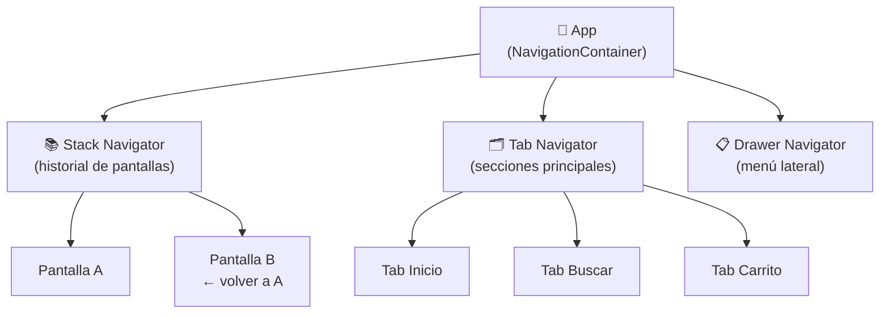
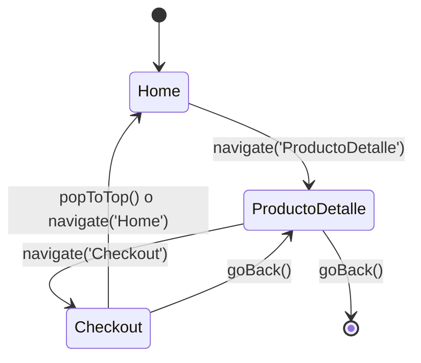
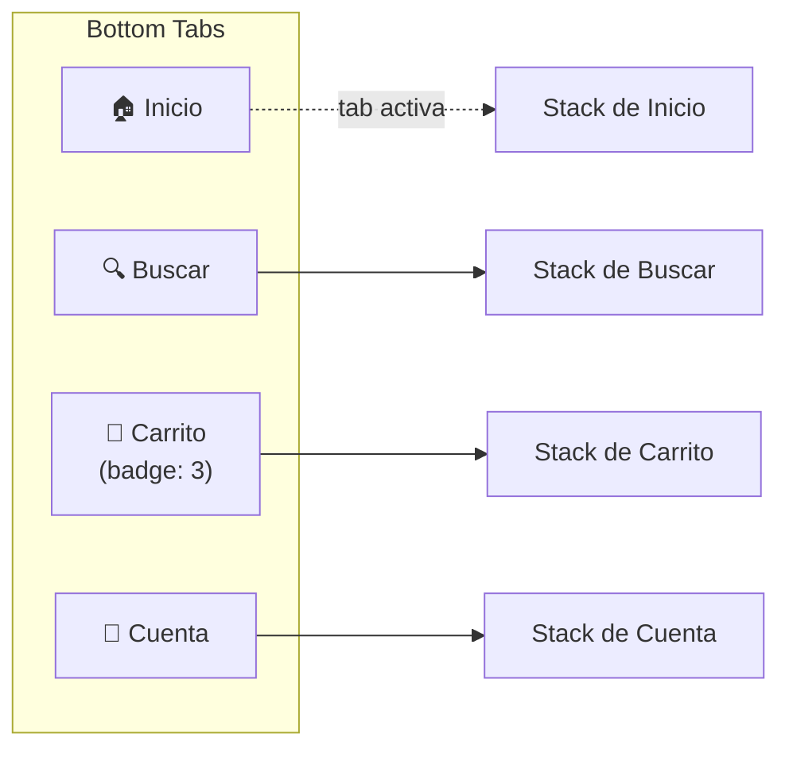
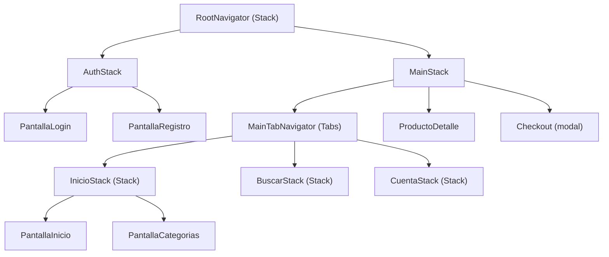
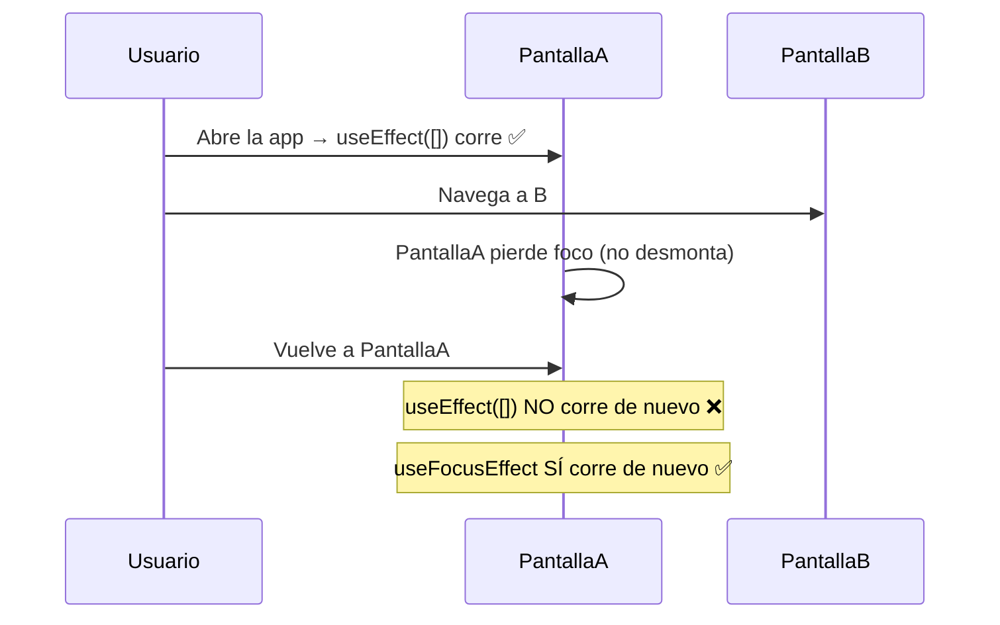
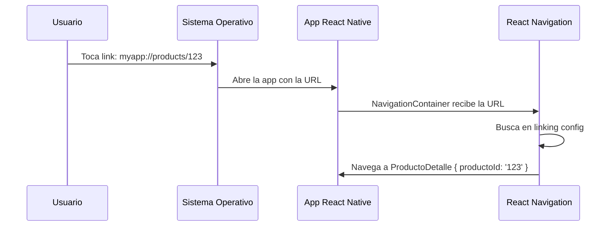
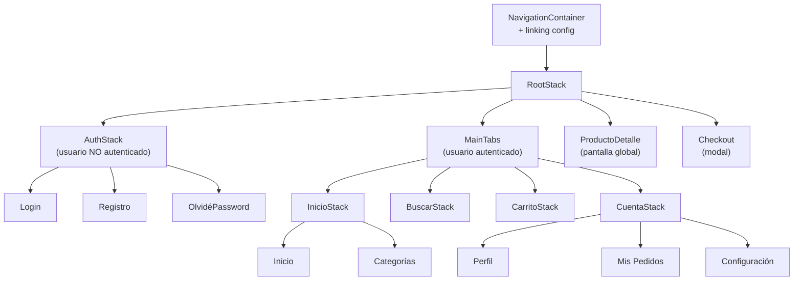

# 🗺️ React Navigation Para Dummies

> **Objetivo**: Entender cómo moverse entre pantallas en React Native — Stack, Tabs, Drawer, pasar parámetros, navegar con TypeScript y conectar con Deep Linking — con analogías del mundo real y código real.

---

## 🌍 Analogía: El Sistema de Puertas de un Centro Comercial

Navegar entre pantallas es como moverse por un centro comercial:

| Concepto | Centro Comercial | React Navigation |
|----------|-----------------|-----------------|
| **Stack Navigator** | Escaleras mecánicas: vas subiendo pisos y puedes bajar al anterior | Pantallas apiladas, el botón atrás vuelve a la anterior |
| **Tab Navigator** | Planta baja con tiendas a los lados: cambias de tienda sin subir/bajar | Tabs inferiores para navegar entre secciones |
| **Drawer Navigator** | El directorio lateral del mall que aparece con un desliz | Menú lateral que se abre deslizando |
| **Params** | Llevas una nota con el número de pedido al entrar a la tienda | Datos que pasas de una pantalla a otra |
| **Deep Link** | Un QR en el exterior que te lleva directo al piso 3, tienda 42 | URL que abre una pantalla específica directamente |



---

## 📦 Instalación

```bash
npm install @react-navigation/native
npm install @react-navigation/native-stack    # Stack Navigator
npm install @react-navigation/bottom-tabs     # Tab Navigator
npm install @react-navigation/drawer          # Drawer Navigator
npm install react-native-screens react-native-safe-area-context

# Para Drawer, también:
npm install react-native-gesture-handler react-native-reanimated
```

```tsx
// main.tsx o App.tsx — El NavigationContainer envuelve TODO
import { NavigationContainer } from '@react-navigation/native';
import { SafeAreaProvider } from 'react-native-safe-area-context';

export default function App() {
  return (
    <SafeAreaProvider>
      <NavigationContainer>
        {/* Aquí van los navegadores */}
      </NavigationContainer>
    </SafeAreaProvider>
  );
}
```

---

## 1. 📚 Stack Navigator — "Las Escaleras Mecánicas"

Cada vez que navegas a una nueva pantalla, se **apila** encima de la anterior. El botón atrás (Android) o la flecha (iOS) la quita de la pila.



### Configuración básica

```tsx
// navigation/AppNavigator.tsx
import { createNativeStackNavigator } from '@react-navigation/native-stack';
import { HomeScreen } from '../screens/HomeScreen';
import { ProductoDetalleScreen } from '../screens/ProductoDetalleScreen';
import { CheckoutScreen } from '../screens/CheckoutScreen';
import type { RootStackParamList } from './types';

const Stack = createNativeStackNavigator<RootStackParamList>();

export function AppNavigator() {
  return (
    <Stack.Navigator
      initialRouteName="Home"
      screenOptions={{
        // Opciones globales para todas las pantallas
        headerStyle: { backgroundColor: '#1A1A2E' },
        headerTintColor: '#FFFFFF',
        headerTitleStyle: { fontWeight: 'bold' },
        animation: 'slide_from_right', // animación entre pantallas
      }}
    >
      <Stack.Screen
        name="Home"
        component={HomeScreen}
        options={{ title: 'Inicio', headerShown: false }} // sin header
      />
      <Stack.Screen
        name="ProductoDetalle"
        component={ProductoDetalleScreen}
        options={({ route }) => ({
          title: route.params.nombre ?? 'Detalle', // título dinámico
        })}
      />
      <Stack.Screen
        name="Checkout"
        component={CheckoutScreen}
        options={{
          title: 'Finalizar compra',
          presentation: 'modal', // Aparece como modal en iOS
        }}
      />
    </Stack.Navigator>
  );
}
```

### Navegar entre pantallas

```tsx
import { useNavigation } from '@react-navigation/native';
import type { RootStackNavigationProp } from '../navigation/types';

function HomeScreen() {
  const navigation = useNavigation<RootStackNavigationProp>();

  return (
    <View>
      {/* Ir a otra pantalla (la apila) */}
      <TouchableOpacity onPress={() => navigation.navigate('ProductoDetalle', {
        productoId: 'prod_123',
        nombre: 'Zapatillas Air Max',
      })}>
        <Text>Ver producto</Text>
      </TouchableOpacity>

      {/* Reemplazar la pantalla actual (no apila, no hay "atrás") */}
      <TouchableOpacity onPress={() => navigation.replace('Auth')}>
        <Text>Ir al login (sin poder volver)</Text>
      </TouchableOpacity>

      {/* Vaciar toda la pila y ir a una pantalla */}
      <TouchableOpacity onPress={() => navigation.reset({
        index: 0,
        routes: [{ name: 'Home' }],
      })}>
        <Text>Ir al inicio (limpiar historial)</Text>
      </TouchableOpacity>
    </View>
  );
}
```

### Leer parámetros en la pantalla destino

```tsx
import { useRoute } from '@react-navigation/native';
import type { ProductoDetalleRouteProp } from '../navigation/types';

function ProductoDetalleScreen() {
  const route = useRoute<ProductoDetalleRouteProp>();
  const { productoId, nombre } = route.params;
  //      ↑ TypeScript sabe exactamente qué params hay

  return <Text>Producto: {nombre} (ID: {productoId})</Text>;
}

// ─── Forma alternativa: recibir navigation y route como props ─────────────────
import type { ProductoDetalleScreenProps } from '../navigation/types';

function ProductoDetalleScreen({ navigation, route }: ProductoDetalleScreenProps) {
  const { productoId } = route.params;

  // Cambiar el título del header dinámicamente
  useEffect(() => {
    navigation.setOptions({ title: `Producto ${productoId}` });
  }, [productoId, navigation]);

  return <Text>ID: {productoId}</Text>;
}
```

---

## 2. 🗂️ Tab Navigator — "Las Tiendas de la Planta Baja"

Las tabs permiten cambiar entre secciones principales sin perder el estado de cada una.



```tsx
// navigation/MainTabNavigator.tsx
import { createBottomTabNavigator } from '@react-navigation/bottom-tabs';
import { Ionicons } from '@expo/vector-icons'; // o react-native-vector-icons
import type { MainTabParamList } from './types';

const Tab = createBottomTabNavigator<MainTabParamList>();

export function MainTabNavigator() {
  const { carrito } = useCarrito(); // para el badge

  return (
    <Tab.Navigator
      screenOptions={({ route }) => ({
        headerShown: false,
        tabBarActiveTintColor: '#6C63FF',
        tabBarInactiveTintColor: '#999',
        tabBarStyle: { paddingBottom: 4, height: 60 },

        // Icono dinámico según la tab
        tabBarIcon: ({ focused, color, size }) => {
          const icons: Record<keyof MainTabParamList, [string, string]> = {
            Inicio:   ['home',   'home-outline'],
            Buscar:   ['search', 'search-outline'],
            Carrito:  ['cart',   'cart-outline'],
            Cuenta:   ['person', 'person-outline'],
          };
          const [iconFocused, iconBlur] = icons[route.name];
          return (
            <Ionicons
              name={(focused ? iconFocused : iconBlur) as any}
              size={size}
              color={color}
            />
          );
        },
      })}
    >
      <Tab.Screen name="Inicio"  component={InicioStack} />
      <Tab.Screen name="Buscar"  component={BuscarStack} />
      <Tab.Screen
        name="Carrito"
        component={CarritoStack}
        options={{
          tabBarBadge: carrito.items.length > 0 ? carrito.items.length : undefined,
        }}
      />
      <Tab.Screen name="Cuenta" component={CuentaStack} />
    </Tab.Navigator>
  );
}
```

---

## 3. 📋 Drawer Navigator — "El Directorio Lateral"

Se abre deslizando desde el borde izquierdo (o con un botón de hamburguesa ☰).

```tsx
// navigation/DrawerNavigator.tsx
import { createDrawerNavigator } from '@react-navigation/drawer';

const Drawer = createDrawerNavigator();

export function DrawerNavigator() {
  return (
    <Drawer.Navigator
      screenOptions={{
        drawerStyle: { backgroundColor: '#1A1A2E', width: 280 },
        drawerActiveTintColor: '#6C63FF',
        drawerInactiveTintColor: '#CCC',
      }}
      drawerContent={(props) => <CustomDrawerContent {...props} />}
    >
      <Drawer.Screen name="Inicio" component={InicioScreen} />
      <Drawer.Screen name="Mis Pedidos" component={PedidosScreen} />
      <Drawer.Screen name="Configuración" component={ConfigScreen} />
    </Drawer.Navigator>
  );
}

// Componente custom del drawer con avatar y logout
function CustomDrawerContent(props: DrawerContentComponentProps) {
  const { user, logout } = useUser();
  const navigation = useNavigation();

  return (
    <DrawerContentScrollView {...props}>
      {/* Header con avatar */}
      <View style={styles.drawerHeader}>
        <Image source={{ uri: user?.avatarUrl }} style={styles.avatar} />
        <Text style={styles.userName}>{user?.nombre}</Text>
        <Text style={styles.userEmail}>{user?.email}</Text>
      </View>

      {/* Items de navegación por defecto */}
      <DrawerItemList {...props} />

      {/* Item de logout al final */}
      <DrawerItem
        label="Cerrar sesión"
        icon={({ color, size }) => (
          <Ionicons name="log-out-outline" color={color} size={size} />
        )}
        onPress={logout}
      />
    </DrawerContentScrollView>
  );
}
```

---

## 4. 🏗️ Navegadores Anidados — "La Estructura Real de una App"

En una app real, combinas varios navegadores. Lo más común: **Tabs dentro de un Stack**.



```tsx
// navigation/RootNavigator.tsx
import { createNativeStackNavigator } from '@react-navigation/native-stack';

const RootStack = createNativeStackNavigator<RootStackParamList>();

export function RootNavigator() {
  const { user, isLoading } = useAuth();

  if (isLoading) return <SplashScreen />;

  return (
    <RootStack.Navigator screenOptions={{ headerShown: false }}>
      {user ? (
        // Usuario autenticado → app principal
        <>
          <RootStack.Screen name="Main" component={MainTabNavigator} />
          <RootStack.Screen
            name="ProductoDetalle"
            component={ProductoDetalleScreen}
            options={{ headerShown: true, title: 'Detalle' }}
          />
          <RootStack.Screen
            name="Checkout"
            component={CheckoutScreen}
            options={{ presentation: 'modal', headerShown: true }}
          />
        </>
      ) : (
        // No autenticado → flujo de login
        <>
          <RootStack.Screen name="Login"    component={LoginScreen} />
          <RootStack.Screen name="Register" component={RegisterScreen} />
        </>
      )}
    </RootStack.Navigator>
  );
}
```

### Navegar desde un Tab hacia un Stack padre

```tsx
// Problema: estás dentro de "InicioStack" (tab Inicio)
// y quieres ir a "Checkout" que está en el Stack padre (RootStack)

import { useNavigation } from '@react-navigation/native';
import type { RootStackNavigationProp } from '../navigation/types';

function ProductoCard({ producto }: { producto: Producto }) {
  // Usa el tipo del navegador RAÍZ, no del tab
  const navigation = useNavigation<RootStackNavigationProp>();

  return (
    <TouchableOpacity onPress={() => navigation.navigate('Checkout', {
      items: [{ productoId: producto.id, cantidad: 1 }],
    })}>
      <Text>Comprar ahora</Text>
    </TouchableOpacity>
  );
}
```

---

## 5. 🔑 Tipos Completos de Navegación (TypeScript)

```typescript
// navigation/types.ts — El archivo central de tipado
import type {
  NativeStackNavigationProp,
  NativeStackScreenProps,
} from '@react-navigation/native-stack';
import type {
  BottomTabNavigationProp,
  BottomTabScreenProps,
} from '@react-navigation/bottom-tabs';
import type { RouteProp } from '@react-navigation/native';

// ─── Listas de parámetros por navegador ──────────────────
export type RootStackParamList = {
  Main:            undefined;
  Login:           undefined;
  Register:        { invitedBy?: string };
  ProductoDetalle: { productoId: string; nombre?: string };
  Checkout:        { items: CartItem[]; codigoDescuento?: string };
  Perfil:          { userId: string };
};

export type MainTabParamList = {
  Inicio:   undefined;
  Buscar:   { query?: string };
  Carrito:  undefined;
  Cuenta:   undefined;
};

// ─── Props completas por pantalla (incluyen navigation + route) ──────────────
export type ProductoDetalleScreenProps = NativeStackScreenProps<
  RootStackParamList,
  'ProductoDetalle'
>;

export type CheckoutScreenProps = NativeStackScreenProps<
  RootStackParamList,
  'Checkout'
>;

// ─── Solo navigation (para useNavigation) ────────────────
export type RootStackNavigationProp = NativeStackNavigationProp<RootStackParamList>;
export type MainTabNavigationProp   = BottomTabNavigationProp<MainTabParamList>;

// ─── Solo route (para useRoute) ──────────────────────────
export type ProductoDetalleRouteProp = RouteProp<RootStackParamList, 'ProductoDetalle'>;

// ─── Augmentación global (opcional pero cómodo) ──────────
// Permite useNavigation() sin genérico en cualquier pantalla Root
declare global {
  namespace ReactNavigation {
    interface RootParamList extends RootStackParamList {}
  }
}
```

---

## 6. 🔄 `useFocusEffect` vs `useEffect` en Navegación

Una de las diferencias más importantes al trabajar con React Navigation.



```tsx
import { useEffect } from 'react';
import { useFocusEffect } from '@react-navigation/native';
import { useCallback } from 'react';

function PantallaPedidos() {
  const [pedidos, setPedidos] = useState<Pedido[]>([]);

  // ❌ Problema: solo carga al montar, no refresca al volver
  useEffect(() => {
    fetchPedidos().then(setPedidos);
  }, []);

  // ✅ Solución: carga cada vez que la pantalla está en foco
  useFocusEffect(
    useCallback(() => {
      let activo = true;

      async function cargar() {
        const data = await fetchPedidos();
        if (activo) setPedidos(data);
      }
      cargar();

      return () => { activo = false; }; // Limpieza al perder foco
    }, [])
  );

  return <FlatList data={pedidos} renderItem={...} />;
}
```

---

## 7. 🏠 Header Personalizado

```tsx
// Dentro de Stack.Screen options o navigation.setOptions()
<Stack.Screen
  name="ProductoDetalle"
  component={ProductoDetalleScreen}
  options={({ navigation, route }) => ({
    // Título con estilo
    headerTitle: () => (
      <Text style={{ color: 'white', fontSize: 18, fontWeight: 'bold' }}>
        {route.params.nombre}
      </Text>
    ),

    // Botón izquierdo custom
    headerLeft: () => (
      <TouchableOpacity onPress={() => navigation.goBack()} style={{ marginLeft: 8 }}>
        <Ionicons name="arrow-back" size={24} color="white" />
      </TouchableOpacity>
    ),

    // Botón derecho
    headerRight: () => (
      <TouchableOpacity onPress={() => navigation.navigate('Carrito')} style={{ marginRight: 8 }}>
        <Ionicons name="cart-outline" size={24} color="white" />
      </TouchableOpacity>
    ),

    headerStyle: { backgroundColor: '#1A1A2E' },
    headerShadowVisible: false,
  })}
/>
```

---

## 8. 🔗 Deep Linking — "El QR que te lleva directo"

**Analogía**: En vez de entrar al centro comercial por la puerta principal y buscar la tienda, escaneas un QR en la calle que te teletransporta directo a la tienda 42, piso 3.



```tsx
// navigation/linking.ts
import { LinkingOptions } from '@react-navigation/native';
import type { RootStackParamList } from './types';

export const linking: LinkingOptions<RootStackParamList> = {
  prefixes: [
    'myapp://',                          // Custom scheme (iOS + Android)
    'https://miapp.com',                 // Universal Links (iOS) / App Links (Android)
  ],

  config: {
    screens: {
      Main: {
        screens: {
          // URL: myapp://products → tab Inicio
          Inicio: 'home',

          // URL: myapp://search?query=zapatos → tab Buscar con params
          Buscar: {
            path: 'search',
            parse: { query: (q: string) => q },
          },
        },
      },

      // URL: myapp://products/prod_123 → ProductoDetalle
      ProductoDetalle: {
        path: 'products/:productoId',
      },

      // URL: myapp://checkout → Checkout (sin params)
      Checkout: 'checkout',
    },
  },
};

// App.tsx — conectar el linking
export default function App() {
  return (
    <NavigationContainer linking={linking} fallback={<SplashScreen />}>
      <RootNavigator />
    </NavigationContainer>
  );
}
```

```bash
# Probar deep links en desarrollo
# Android
adb shell am start -a android.intent.action.VIEW -d "myapp://products/prod_123"

# iOS Simulator
xcrun simctl openurl booted "myapp://products/prod_123"
```

---

## 9. 🧭 Referencia Rápida de Métodos de Navegación

```tsx
const navigation = useNavigation<RootStackNavigationProp>();

// ─── NAVEGAR ─────────────────────────────────────────────
navigation.navigate('ProductoDetalle', { productoId: '123' });
// Si la pantalla ya está en el stack, la reutiliza (no apila otra)

navigation.push('ProductoDetalle', { productoId: '456' });
// SIEMPRE apila una nueva instancia, aunque ya exista

// ─── VOLVER ──────────────────────────────────────────────
navigation.goBack();
// Vuelve a la pantalla anterior en el stack

navigation.popTo('Home');
// Salta directo a Home en el stack (quita las del medio)

navigation.popToTop();
// Vuelve a la primera pantalla del stack (limpia todo encima)

// ─── RESET (útil post-login / post-logout) ───────────────
navigation.reset({
  index: 0,
  routes: [{ name: 'Main' }],
});
// Limpia todo el historial y empieza en Main

// ─── OPCIONES DE HEADER ──────────────────────────────────
navigation.setOptions({
  title: 'Nuevo título',
  headerRight: () => <MiBoton />,
});
// Cambia opciones en tiempo real

// ─── TABS ────────────────────────────────────────────────
navigation.navigate('Carrito');
// Cambia a la tab Carrito (sin params)

navigation.jumpTo('Buscar', { query: 'zapatos' });
// Cambia a tab y pasa params (solo en Tab Navigator)
```

---

## 10. 🗺️ Arquitectura Completa: App Real



```tsx
// navigation/index.tsx — Todo junto
export function Navigation() {
  return (
    <NavigationContainer linking={linking}>
      <RootNavigator />
    </NavigationContainer>
  );
}

// App.tsx
export default function App() {
  return (
    <SafeAreaProvider>
      <UserProvider>
        <CarritoProvider>
          <Navigation />
        </CarritoProvider>
      </UserProvider>
    </SafeAreaProvider>
  );
}
```

---

## 📊 Cuadro de Referencia Rápida

| Navegador | Paquete | Cuándo usarlo |
|-----------|---------|--------------|
| `NativeStack` | `@react-navigation/native-stack` | Flujo principal (login → home → detalle) |
| `BottomTabs` | `@react-navigation/bottom-tabs` | Secciones principales de la app |
| `Drawer` | `@react-navigation/drawer` | Apps con muchas secciones secundarias |
| **Anidado** | Combinar los anteriores | Estructura real de producción |

| Método | ¿Qué hace? |
|--------|-----------|
| `navigate(name, params)` | Ir a pantalla (sin duplicar si ya existe) |
| `push(name, params)` | Ir a pantalla (siempre apila nueva) |
| `goBack()` | Volver a la anterior |
| `popTo(name)` | Saltar a una pantalla del stack |
| `popToTop()` | Ir a la primera del stack |
| `replace(name)` | Cambiar la pantalla actual (sin historial) |
| `reset({ routes })` | Limpiar todo el historial |
| `setOptions({})` | Cambiar header en tiempo real |
| `jumpTo(tab)` | Cambiar tab activa (solo en tabs) |

| Hook | ¿Para qué? |
|------|-----------|
| `useNavigation()` | Acceder a navigation (cualquier componente) |
| `useRoute()` | Leer params de la pantalla actual |
| `useFocusEffect(cb)` | Ejecutar código al enfocar la pantalla |
| `useIsFocused()` | Saber si la pantalla está activa (boolean) |
| `useNavigationState(sel)` | Leer el estado completo del navegador |

---

## 📌 Resumen en una frase

> **React Navigation** es el sistema de puertas de tu app: el **Stack** apila pantallas como escaleras mecánicas, los **Tabs** te mueven entre secciones como tiendas en la planta baja, el **Drawer** es el directorio lateral — y con TypeScript tipando `RootStackParamList`, el compilador te avisa si pasas parámetros incorrectos o navegas a una pantalla que no existe.

---

## 🔗 Navegación

👈 [03-TypeScript-en-RN-Para-Dummies.md](./03-TypeScript-en-RN-Para-Dummies.md)  
🏠 [Volver al índice de docs](../../docs/)
